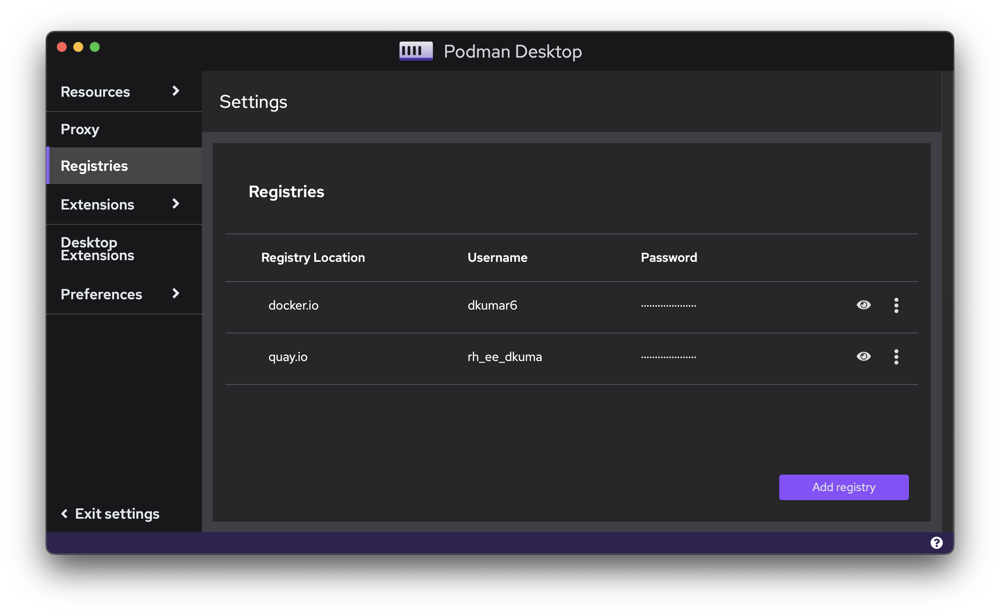

This release note covers Podman Desktop 0.10 release changes.

- **Containers Configuration**: Container creation wizzard allowing to define environment variables, networking and more configuration options.
- **Kubernetes Improvements**: Play Kubernetes YAML, custom Kubeconfig path support, reload of kube context.
- **Registries Configuration**: Revamped registries configuration UI.
- **Podman Version**: Podman 4.3.1 now included in Windows and Mac installers.
- **UX/UI Improvements**: Improved lists, better contrast, and more.

Podman Desktop 0.10 is now available. [Click here to download it](/downloads)!

<!--truncate-->

---

## Release Details

### New configuration wizzard to create containers ([#773](https://github.com/containers/podman-desktop/pull/773))

Until now, we could only specify port binding when building images to start containers. The create container wizzard now includes several options enabling configuring volumes, environment variables, restart policy and settings on networking and security. It is also possible to reuse an existing (and already configured) a network when creating containers.

### Kubernetes Capabilities Improvements

**Custom Kubeconfig file path ([#780](https://github.com/containers/podman-desktop/pull/780))**

Kubeconfig path location is now configurable from **<Icon icon="fa-solid fa-cog" size="lg" /> Settings > Preferences > Kubernetes: Kubeconfig** and can be set to a custom path. By default, Podman Desktop use the path `$HOME/.kube/config` for the Kubeconfig file.

**Play Kubernetes YAML from the Pods list ([#739](https://github.com/containers/podman-desktop/pull/739))**

Podman Desktop enables to play existing Kubernetes YAML files. This is now available from `Play Kubernetes YAML` button added to the Pods list, in addition to the Containers list.

**Kube context automatically reloaded when updated ([#813](https://github.com/containers/podman-desktop/pull/813))**

Any change to the kube context will now be detected by Podman Desktop in its running state. The system tray, allowing to select which Kubernetes environment to work with, will now reload the kube context without restarting Podman Desktop.

### Revamped Container Registries UI ([#446](https://github.com/containers/podman-desktop/issues/446))

The registries configuration UI has been revamped. Instead of using tiles for displaying the registries, now it uses a list where each registry can be added or edited directly in the list. The kebab menu provides options to edit or remove a registry from the list.

### Update to Podman 4.3.1 ([#913](https://github.com/containers/podman-desktop/issues/913))

Podman Desktop 0.10 is now embedding [Podman 4.3.1](https://github.com/containers/podman/releases/tag/v4.3.1) in Windows and macOS installers.

### UI/UX Improvements

**Improved lists UX ([#877](https://github.com/containers/podman-desktop/pull/877))**

To reduce the width used in the lists when displaying all the icons, main actions icons are now always displayed (before it was on hover) and the secondary actions are displayed in a kebab menu. For example Start/Stop and delete are primary actions while open the browser, inspect, generate kube yaml, etc. are secondary options.

**Delay appearance of text in navbar ([#767](https://github.com/containers/podman-desktop/pull/767))**

When minimizing or expanding the navbar, the text was overlapping for a few second the page. Now it's displayed with a fading animation.

**Selected state: better text color contrast ([#802](https://github.com/containers/podman-desktop/pull/802))**

In the `Images` page, on hover for both the image and the name column, the text contrast has been increased for better visibility: violet indicates that you have selected it.

**On Linux and Windows, the menu bar is now hidden by default ([#668](https://github.com/containers/podman-desktop/pull/668))**

With this change, the menu bar looks more integrated to the Operating System. The menu can appear if you hit the `Alt` key. Thanks to [Dylan M. Taylor](https://github.com/dylanmtaylor) for contributing to fix this.

**Exit when clicking on the close icon of the dashboard on Linux ([#671](https://github.com/containers/podman-desktop/pull/671))**

For most users on Linux, there is no tray icon support. In this situation, when closed, Podman Desktop continues to run in background. [Dylan M. Taylor](https://github.com/dylanmtaylor) added a property to exit the app by default when clicking on the close icon. For people having tray icon support or with the desire of a different behavior, it is possible to disable it from the Settings.

---

## Other Notable Enhancements

- Rename `Started` into `Age` in Containers list.([#878](https://github.com/containers/podman-desktop/pull/878))
- Added domain validation when adding a registry. ([#838](https://github.com/containers/podman-desktop/pull/838))
- Provided a consistent behavior with Podman CLI, `podman-machine-default` is now the default name when creating a Podman machine from Podman Desktop. ([#775](https://github.com/containers/podman-desktop/pull/775))

---

## Notable bug fixes

- Fixed error handling when pulling images of Desktop Extensions. ([#782](https://github.com/containers/podman-desktop/pull/782))
- Fixed use of the full height of the screen when displaying log in the details of a container. ([#946](https://github.com/containers/podman-desktop/discussions/946))
- Fixed First start of Podman Desktop on flatpak was not seeing the podman engine ([#860](https://github.com/containers/podman-desktop/pull/860))

## Community Thank You

🎉 We’d like to say a big thank you to everyone who helped to make Podman Desktop 0.10 even better:

- [Dylan M. Taylor](https://github.com/dylanmtaylor) in [#671](https://github.com/containers/podman-desktop/pull/671)
- [Fionn Kelleher](https://github.com/osslate) in [#713](https://github.com/containers/podman-desktop/pull/713)
- [Rostislav Svoboda](https://github.com/rsvoboda) in [#737](https://github.com/containers/podman-desktop/pull/737)
- [Denis Shemanaev](https://github.com/shemanaev) in [#783](https://github.com/containers/podman-desktop/pull/783)
- [Fabrice Flore-Thébault](https://github.com/themr0c) in [#856](https://github.com/containers/podman-desktop/pull/856)
- [Kevin](https://github.com/KevinAtSesam) in [#864](https://github.com/containers/podman-desktop/pull/864)
- [@sfrunza13](https://github.com/sfrunza13) in [#872](https://github.com/containers/podman-desktop/pull/872)
- [Anjan Nath](https://github.com/anjannath) in [#918](https://github.com/containers/podman-desktop/pull/918)

## Final Notes

The complete list of issues fixed in this release is available [here](https://github.com/containers/podman-desktop/issues?q=is%3Aclosed+milestone%3A0.10.0).

Get the latest release from the [Downloads](/downloads) section of the website and boost your development journey with Podman Desktop. Additionally, visit the [GitHub repository](https://github.com/containers/podman-desktop) and see how you can help us make Podman Desktop better.
