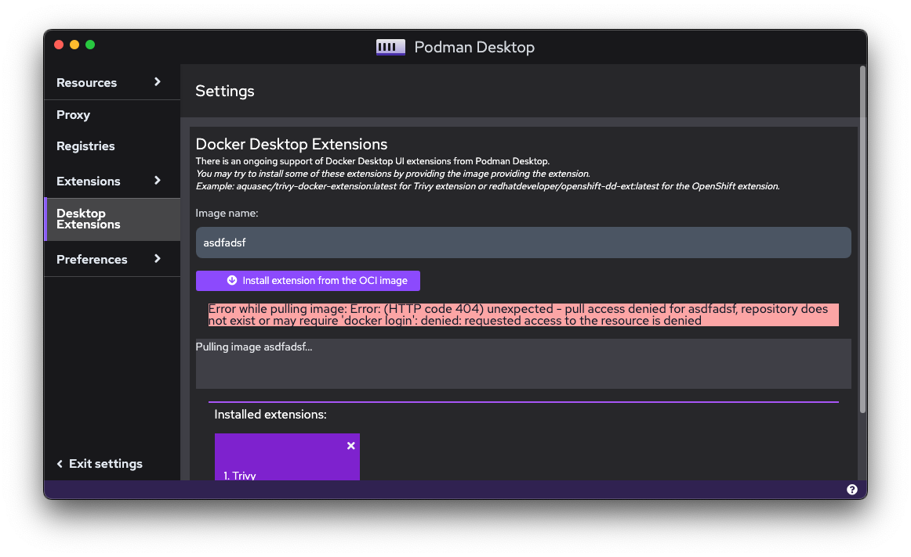
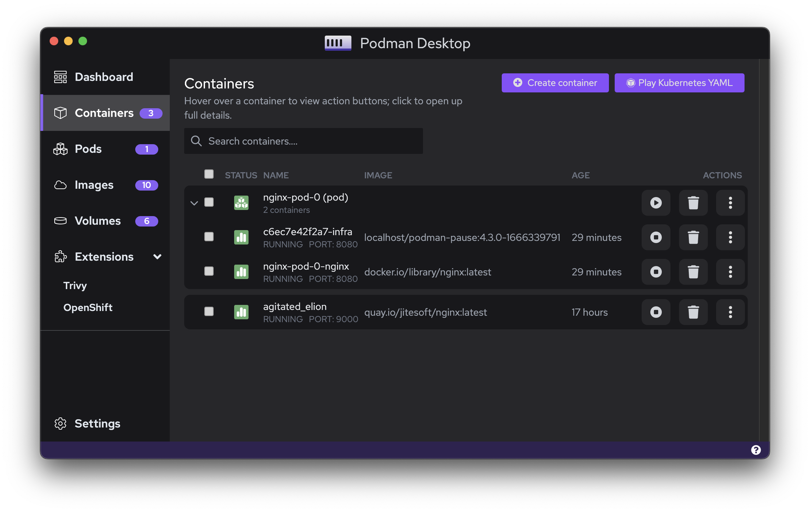
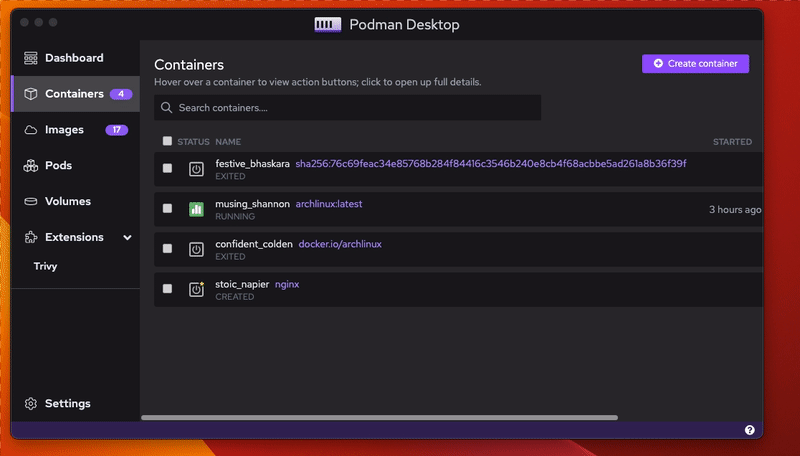

With an improved Kubernetes workflow and a revamped User Interface, let's talk about all that is new with the latest release of Podman Desktop v0.10.0!

<!--truncate-->

## Major enhancements and fixes

**1. Update to Podman 4.3.1 ([#913](https://github.com/containers/podman-desktop/issues/913))**
Following the release of [Podman 4.3.1](https://github.com/containers/podman/releases/tag/v4.3.1), we've updated the Windows and macOS installers that we're embedding.

**2. More options to configure containers ([#773](https://github.com/containers/podman-desktop/pull/773))**

Until now, we could only specify port binding when building images to start containers. With the latest release, it includes several options such as configuring volumes, environment variables, some more advanced options including restart policy and options regarding networking and security. You can also reuse a network when creating containers.

**3. Automate the creation of the Podman Socket when installing from Flatpack ([#860](https://github.com/containers/podman-desktop/pull/860))**

The issue at hand was one of the most reported bug on Flatpak/Linux. Flatpak is not making visible files if the mounted folder is not existing before starting the application. So while the socket file was created, it was not seen by Podman Desktop until a restart. 

Now, with the help of [Fabrice Flore-Thébault](https://github.com/themr0c), the directory of the socket is created if it is non-existent when starting Podman Desktop.

**4. Fixed error handling when pulling images for Desktop Extensions ([#782](https://github.com/containers/podman-desktop/pull/782))**

If Podman Desktop faces an error while pulling images for Desktop Extensions, the process is terminated and the error is communicated to the user.

## Improved Kubernetes Workflow

Podman Desktop facilitates the application development process right from containerization to Kubernetes deployment. With a focus on improving the Kubernetes workflow, we’ve introduced a set of new features.

**1. Custom Kubeconfig file path ([#780](https://github.com/containers/podman-desktop/pull/780))** 

Starting v0.10.0, users can provide their kubeconfig path location instead of letting Podman Desktop use the default path i.e. `$HOME/.kube/config`. This can be done by going to `Settings > Preferences > Kubernetes: Kubeconfig`

**2. Play Kubernetes YAML from the Containers list ([#739](https://github.com/containers/podman-desktop/pull/739))**

Development workflows can require developers to leverage existing Kubernetes YAML files. Podman Desktop now supports playing Pods or Containers from an existing Kubernetes YAML File. 

This can be done in the ‘Containers’ screen of the application by clicking the `Play Kubernetes YAML` button and playing the existing YAML file.

**3. Kube context automatically reloaded when updated ([#813](https://github.com/containers/podman-desktop/pull/813))**

Any change to the kube context will now be detected by Podman Desktop in its running state. One can now reload kube context without restarting Podman Desktop.

## UI Improvements

**1. Kebab menu ([#877](https://github.com/containers/podman-desktop/pull/877))**

With the latest release, you will see significant changes with respect to the options and how they are displayed for images and containers. Previously, there was an array of buttons over each container or image component which has now been replaced with a ‘kebab’ menu. This is more user-friendly and keeps all options organized within a single component. By clicking the three dot button, you can open the menu and choose the option depending on your workflow.

**2. Containers ([#878](https://github.com/containers/podman-desktop/pull/878))**

The list of containers now also displays the age of the container as well as the image used to start the container in separate columns alongside the container name.

**3. Design Improvements ([#771](https://github.com/containers/podman-desktop/pull/771), [#774](https://github.com/containers/podman-desktop/pull/774), [#904](https://github.com/containers/podman-desktop/pull/904))**

When minimizing or expanding the navbar, the text was overlapping for a few second the page. Now it's displayed with a fading animation. 

In some sections of the application, the components were not utilizing the full width or height of the window to display content. This is now fixed as well.

**4. Registries ([#747](https://github.com/containers/podman-desktop/pull/747))**

You can manage multiple OCI registries on Podman Desktop allowing you to pull images from different sources. We have now updated the UI of the page where we add and update multiple registries in `Settings`. Instead of using tiles for displaying the registries, now it uses a list where you can edit the data in the list. You also have a kebab menu on items to edit password or remove the entries.

**5. Text color ([#802](https://github.com/containers/podman-desktop/pull/802))**

To increase the visual utility, we have increased the text contrast in the `Images` page. On hover for both the image and the name column, change in the colour of the image name to violet indicates that you have selected it.

## Minor bug fixes

**1. Improving consistency of default machine nomenclature ([#775](https://github.com/containers/podman-desktop/pull/775))**

In order to maintain the consistency with Podman machines initialized from CLI, the default name for Podman machine initialized from the `Resources` page of Podman Desktop is now `podman-machine-default`.

**2. Validate domains for registries ([#838](https://github.com/containers/podman-desktop/pull/838))**

The process to validate registry domains when they are added to Podman Desktop has been improved with the validator library.

**3. On Linux and Windows, the menu bar is now hidden by default ([#668](https://github.com/containers/podman-desktop/pull/668))**
With this change, the menu bar looks more integrated to the Operating System. FYI, the menu can appear if you hit the `Alt` key. Thanks to [Dylan M. Taylor](https://github.com/dylanmtaylor) for contributing to fix this.

**4. Exit when clicking on the close icon of the dashboard on Linux ([#671](https://github.com/containers/podman-desktop/pull/671))**
Most of the time, people don't have tray icon support on Linux (as it's not there by default on Gnome), so Podman Desktop runs into the background but there is no way to close it again easily without the icon. [Dylan M. Taylor](https://github.com/dylanmtaylor) added a property to exit the app by default. For people having tray icon support, you can disable it.

## Closing Notes

Thanks to the first time contributors to Podman Desktop that helped with the release 🎉

- [Dylan M. Taylor](https://github.com/dylanmtaylor) in [#671](https://github.com/containers/podman-desktop/pull/671)
- [Fionn Kelleher](https://github.com/osslate) in [#713](https://github.com/containers/podman-desktop/pull/713)
- [Rostislav Svoboda](https://github.com/rsvoboda) in [#737](https://github.com/containers/podman-desktop/pull/737)
- [Denis Shemanaev](https://github.com/shemanaev) in [#783](https://github.com/containers/podman-desktop/pull/783)
- [Fabrice Flore-Thébault](https://github.com/themr0c) in [#856](https://github.com/containers/podman-desktop/pull/856)
- [Kevin](https://github.com/KevinAtSesam) in [#864](https://github.com/containers/podman-desktop/pull/864)
- [@sfrunza13](https://github.com/sfrunza13) in [#872](https://github.com/containers/podman-desktop/pull/872)
- [Anjan Nath](https://github.com/anjannath) in [#918](https://github.com/containers/podman-desktop/pull/918)

Click [here](](https://github.com/containers/podman-desktop/issues?q=is%3Aclosed+milestone%3A0.10.0)) to view the complete list of bug fixes / enhancements.

Get the latest release from the [Downloads](/downloads) section of the website and boost your development journey with Podman Desktop. Additionally, visit the [GitHub repository](https://github.com/containers/podman-desktop) and see how you can help us make Podman Desktop better. 
