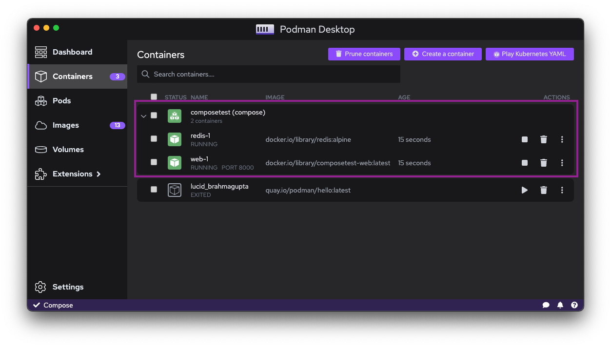
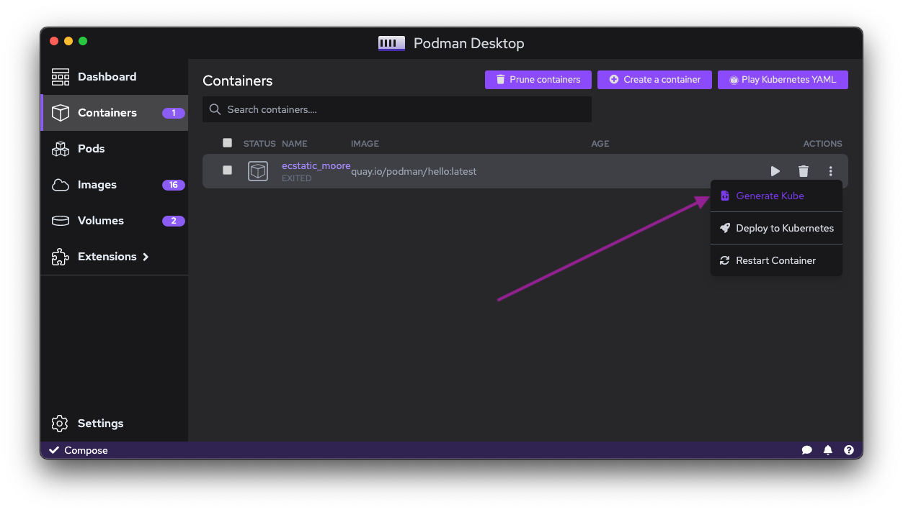
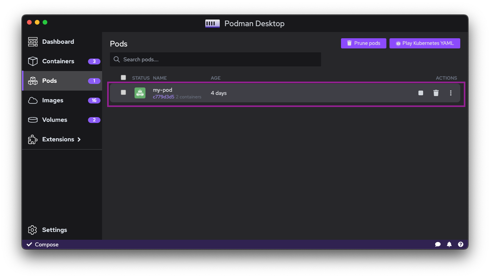

The 5 things to know being a Docker user by using Podman Desktop:

- **Use a single UI**: Podman Desktop works with several container engines, including Docker.
- The **compatibility mode**: How to ensure tools are working with Podman instead of Docker.
- **Compose** support: How to work with Compose files and Podman.
- **Kubernetes** support: How to use Kubernetes with Podman.
- **Security**: Use `rootless` mode or containers without root privileges.

<!--truncate-->
_________________

## Use Podman Desktop to interact with containers running in Docker

Docker Desktop provides a UI to interact with containers and images. But the UI depends on Docker API and it is not possible to use the UI with Docker and Podman at the same time.

Podman Desktop is a multi-engine UI tool. The UI is compatible with the API of Docker and Podman. It means all containers and images from all the engines at the same time are visible in the UI.

When migrating from Docker to Podman, you can use Podman Desktop to interact with containers running in Docker. Explore all commands and features of Podman Desktop and see all the resources from Docker.

## Docker compatibility mode

Using Podman with Podman Desktop or with the Podman CLI is straightforward. But some tools expect to find `docker` CLI or `docker.sock` socket. In this case, you have to use the compatibility mode of Podman.

### Socket file compatibility

The socket compatibility mode is a feature of Podman that allows to bind the Podman socket under the Docker socket path.

On Windows the socket compatibility mode is always enabled by default. On macOS, by using the `.pkg installer` it is active by default. But when installing with `brew`, it will not be there because it requires some admin permissions. 

That is not an issue because you can enable it by [invoking a CLI tool](https://podman-desktop.io/docs/migrating-from-docker/using-podman-mac-helper) that will setup the compatibility mode.

For example if you use [`TestContainers`](https://www.testcontainers.org/) in your Java project, you can use the compatibility mode to ensure that the tool will use Podman instead of Docker.

### CLI compatibility

If you have scripts relying on `docker` CLI, you can use the compatibility mode to ensure that the tool is working with Podman instead of Docker.

If you have the `docker` CLI installed on your computer, you can use the socket file compatibility of docker to ensure that the tool is working with Podman engine instead of Docker.

If you do not have the `docker` CLI installed on your computer, you can [Create a script](https://podman-desktop.io/docs/migrating-from-docker/emulating-docker-cli-with-podman) called `docker` that will call the `podman` CLI

**_NOTE:_** creating a shell prompt alias, for example `alias docker=podman`, will not work inside scripts that you call.

## Compose

As a user of Docker, you might use `docker compose` (or `docker-compose`) to run some of your applications.

For now Podman does not include a `Compose` support directly in the CLI with a command `podman compose`.

`Compose` can work with the Podman socket.

Based on the compatibility mode (see [section about Docker compatibility mode](#docker-compatibility-mode)):

- Enabled: you can use the `compose` binary to run your applications.
- Disabled: you need to [export the environment variable DOCKER_HOST](https://podman-desktop.io/docs/migrating-from-docker/using-the-docker_host-environment-variable) before running compose.

You can now use the `compose` binary to run your applications and it will use Podman engine.

Podman Desktop has a `compose` extension that can fetch `compose` binary if not already available on the filesystem.

Podman Desktop UI displays the containers created by `Compose` are in the same group.

## Kubernetes

It is possible to start a Kubernetes cluster with Docker.

Podman supports directly a subset of Kubernetes resources that you can use with `.yaml` files.

For example if you only want to create a `Pod` resource, you can use the `Play Kubernetes YAML` button from the `Containers` list screen with your `.yaml` file. No need to install or start a Kubernetes cluster.

It is possible to do the counter-part. Export the definition of a container or pod to a Kubernetes resource. You can use the `Generate kube` button from the kebab menu of a given container or pod.

Podman handles pods and in the Podman Desktop UI, you can see all the pods inside a Pod section. All containers inside the pod are in the same group.

An experimental `kind` extension is bringing the creation of full-blown Kubernetes cluster with Podman.

## Rootless mode

One of the difference of Docker and Podman is the way they handle containers. Docker requires root privileges to run containers by default. Podman can run containers without root privileges by default.

It means that for example, starting a container with a port < 1024 will not work. You need to use a port > 1024.

If you still need to create containers with a port < 1024, you can change the Podman machine configuration of the Podman Machine if you are on Windows or macOS.

The command is `podman machine --rootful` to enable the execution with root privileges or `podman machine --rootful=false` to switch back to rootless mode.
