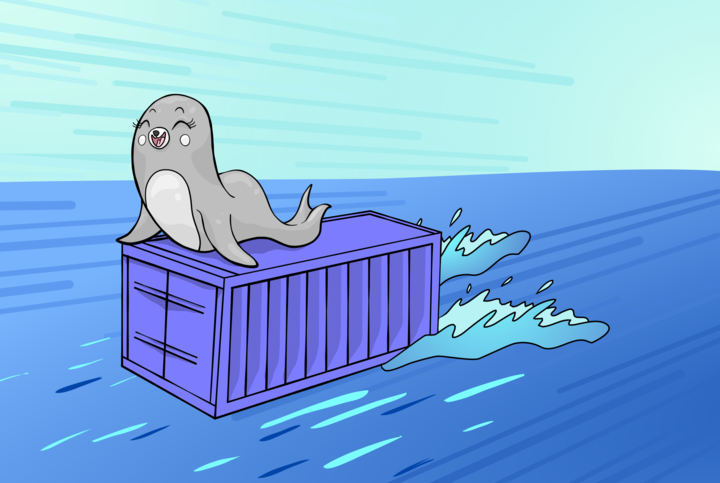
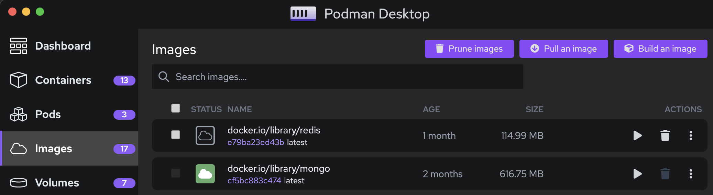

import ReactPlayer from 'react-player'

This release note covers Podman Desktop 0.13 release changes.

<!--Main Features-->

- **Podman Version**: Podman 4.4.4 now included in Windows and Mac installers.
- **Compose**: Support for installing Docker Compose.
- **Extensions**: Improved extension support for Podman Desktop with additional capabilities.
- **UX and UI Improvements**: Welcome page, task manager, resources, and update alerts.

Podman Desktop 0.13 is now available. [Click here to download it](/downloads)!

<!--truncate-->

---

## Release details

### Update to Podman v4.4.4

Podman Desktop 0.13 embeds [Podman 4.4.4](https://github.com/containers/podman/releases/tag/v4.4.4) in
Windows and macOS installers [#1456](https://github.com/containers/podman-desktop/pull/1456).

### Compose support

You can install Docker Compose from the Podman Desktop UI [#1578](https://github.com/containers/podman-desktop/pull/1578). This will allow you use Compose workflows using Podman.

### Extensions

To make it easier to extend Podman Desktop we have:

- Published the [Podman Desktop Extension API](https://www.npmjs.com/package/@podman-desktop/api) to npmjs [#1727](https://github.com/containers/podman-desktop/pull/1727)
- Documented [how to create, publish, and install your own extensions](https://podman-desktop.io/docs/extensions)
- Expanded the API for `QuickPickInput` [#1839](https://github.com/containers/podman-desktop/pull/1839)

### UI and UX improvements

#### Welcome page [#1726](https://github.com/containers/podman-desktop/pull/1726)

The first time every user starts Podman Desktop, they will see a welcome page:

Note that the Welcome page will only appear the first time you run Podman Desktop 0.13.0, and none of your settings or assets in Podman Desktop will be affected by it.
Over time, this page will be expanded to help with initial setup and configuration.

#### New Task Manager [#1724](https://github.com/containers/podman-desktop/pull/1724)

A new Task Manager has been added to the status bar to see the progress (or return to) long running tasks. To start with, building images [#1725](https://github.com/containers/podman-desktop/pull/1725) and Podman machine [#1742](https://github.com/containers/podman-desktop/pull/1742) are using the task manager.

#### Updated Resources Settings [#1582](https://github.com/containers/podman-desktop/pull/1582)

The **<Icon icon="fa-solid fa-cog" size="lg" /> Settings > Resources** page has been updated with a new design, making it easier to see and control your providers from a single place.

The other settings pages have been updated for consistency with this new design.

#### Update Alerts [#1827](https://github.com/containers/podman-desktop/pull/1827)

A new alert button will appear in the status bar when future updates are available.

<ReactPlayer playing playsinline controls url='https://user-images.githubusercontent.com/436777/227596136-c6123d5c-d9ae-4fb3-a569-0cfaaeebf09c.mp4' width='100%' height='100%' />

#### Prune buttons [#1481](https://github.com/containers/podman-desktop/pull/1481), [#1482](https://github.com/containers/podman-desktop/pull/1482), [#1484](https://github.com/containers/podman-desktop/pull/1484)

We've added buttons to prune unused volumes [#1481](https://github.com/containers/podman-desktop/pull/1481), images [#1482](https://github.com/containers/podman-desktop/pull/1482) and pods [#1484](https://github.com/containers/podman-desktop/pull/1484).

---

## Other notable enhancements

- Kubernetes pods are now shown in the Pods view [#1312](https://github.com/containers/podman-desktop/pull/1312)
- Easy button to fix Docker compatibility mode on macOS [#1697](https://github.com/containers/podman-desktop/pull/1697)
- Display extension icons [#1058](https://github.com/containers/podman-desktop/pull/1058)
- API to cancel long running tasks [#1777](https://github.com/containers/podman-desktop/pull/1777)

---

## Documentation

The documentation has new content:

- [How to create, publish, and install your own Podman Desktop extensions](https://podman-desktop.io/docs/extensions)
- [Using Compose](https://podman-desktop.io/docs/compose/podman-compose)
- [Restarting Kind](https://podman-desktop.io/docs/kind)

---

## Notable bug fixes

- Periodically check and refresh Podman connection on Windows and Mac [#1662](https://github.com/containers/podman-desktop/pull/1662)
- Fix inconsistent Log view behaviour [#1710](https://github.com/containers/podman-desktop/pull/1710)
- Don't create route for regular Kubernetes clusters [#1707](https://github.com/containers/podman-desktop/pull/1707)
- Fix copy button on empty screen [#1804](https://github.com/containers/podman-desktop/pull/1804)
- Register extension tray items correctly [#1778](https://github.com/containers/podman-desktop/pull/1778) and handle updates [#1800](https://github.com/containers/podman-desktop/pull/1800)

---

## Community thank you

🎉 We’d like to say a big thank you to everyone who helped to make Podman Desktop 0.13 even better:

- [`Tony Soloveyv`](https://github.com/Tony-Sol) in [#1605 - Fix directories inconsistency in `~/.local/share/`](https://github.com/containers/podman-desktop/pull/1605)
- [`Oleg`](https://github.com/RobotSail) in [#1567 - Check for Flatpak when calling command from exec](https://github.com/containers/podman-desktop/pull/1567)
- [`Christoph Blecker`](https://github.com/cblecker) in [#1556 - Fix: Hide dock icon on macOS if starting minimized](https://github.com/containers/podman-desktop/pull/1556)
- [`Paul Wright`](https://github.com/pwright) in [#1604 - Docs: correct syntax of kind doc](https://github.com/containers/podman-desktop/pull/1604)
- [`Denis Golovin`](https://github.com/dgolovin) in [#1790 - Feat: add EventEmitter class to extension API](https://github.com/containers/podman-desktop/pull/1790)
- [`Christophe Fergeau`](https://github.com/cfergeau) in [#1642 - Fix: Pod list "an pod" typing error](https://github.com/containers/podman-desktop/pull/1642)

## Final notes

The complete list of issues fixed in this release is available [here](https://github.com/containers/podman-desktop/issues?q=is%3Aclosed+milestone%3A0.13.0).

Get the latest release from the [Downloads](/downloads) section of the website and boost your development journey with Podman Desktop. Additionally, visit the [GitHub repository](https://github.com/containers/podman-desktop) and see how you can help us make Podman Desktop better.
