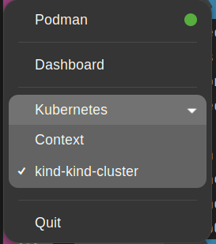
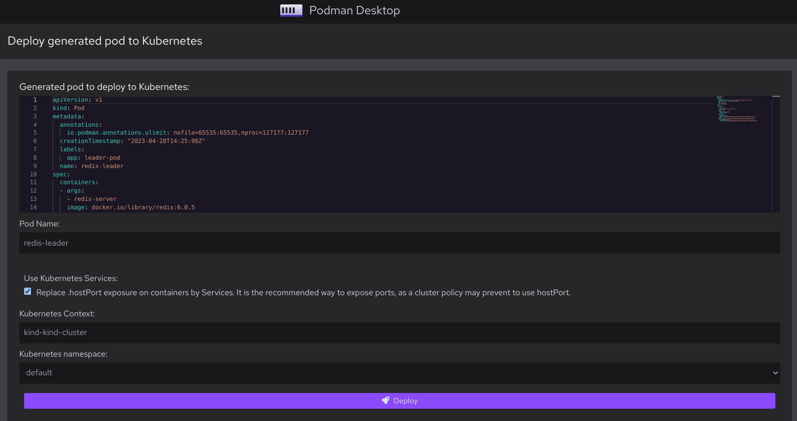
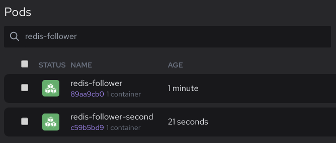

# Setting up and running a Kubernetes cluster locally with Podman Desktop

In this blog post you will learn to use Podman Desktop to run the [Kubernetes documentation example: Deploying PHP Guestbook application with Redis](https://kubernetes.io/docs/tutorials/stateless-application/guestbook/).

On the agenda:

1. Installing Podman Desktop.
1. Installing and initializing your container engine: Podman.
1. Installing and starting your local Kubernetes provider: Kind.
1. Starting the Redis leader.
1. Starting and scaling the Redis followers.
1. Starting and exposing the Guestbook frontend.

<!--truncate-->

## Installing Podman Desktop

You need Podman Desktop.

1. Go to [Podman Desktop installation documentation](/docs/installation).
1. Click on your platform name: [Windows](/docs/installation/windows-install), [macOS](/docs/installation/macos-install), or [Linux](/docs/installation/linux-install).
1. Follow the instructions. Stick to the default installation method.
1. Start **Podman Desktop**.

At this point, you have a graphical user interface to:

- Install Podman and Kind.
- Control and work with your container engines and Kubernetes clusters.
- Run your application on your container engine and migrate it to Kubernetes.

## Installing and initializing your container engine: Podman

Podman Desktop can control various container engines, such as:

- Docker
- Lima
- Podman

Consider installing the Podman container engine for:

- Added security
- No daemon
- Open source

Containers are a Linux technology.

- On Linux, you can install Podman natively.
  See: [Installing Podman on Linux](https://podman.io/docs/installation#installing-on-linux).
- On macOS and Windows, Podman requires to run in a Linux virtual machine: the Podman machine.
  Use Podman Desktop to install Podman and initialize your Podman machine:

#### Procedure

1. Open Podman Desktop **Dashboard**
1. The **Dashboard** displays _Podman Desktop was not able to find an installation of Podman_.
1. Click on **Install**.
1. Podman Desktop checks the prerequisites to install Podman Engine. When necessary, follow the instructions to install prerequisites.
1. Podman displays the dialog: _Podman is not installed on this system, would you like to install Podman?_. Click on **Yes** to install Podman.
1. Click on **Initialize and start**.

#### Verification

- The **Dashboard** displays _Podman is running_.

  

At this point, you can start working with containers.

## Installing and starting your local Kubernetes provider: Kind

You want to deploy your application to a local Kubernetes cluster.

Podman Desktop can help you run Kind-powered local Kubernetes clusters on a container engine, such as Podman.

Podman Desktop helps you [installing the `kind` CLI](/docs/kind/installing):

1. In the status bar, click on **Kind**, and follow the prompts.
1. When the `kind` CLI is available, the status bar does not display **Kind**.
1. On Windows, [configure Podman in rootful mode](/docs/kind/configuring-podman-for-kind-on-windows)

   ```shell-session
   $ podman system connection default podman-machine-default-root
   ```

1. Go to **<Icon icon="fa-solid fa-cog" size="lg" /> Settings > Resources**
1. In the ** Podman** tile, click on the **<Icon icon="fa-solid fa-repeat" size="lg" />** icon to restart the Podman container engine.
1. In the ** Kind** tile, click on the **Create new** button.
   1. **Name**: enter `kind-cluster`.
   1. **Provider Type**: select `podman`.
   1. **HTTP Port**: select `9090`.
   1. **HTTPS Port**: select `9443`.
   1. **Setup an ingress controller**: `Enabled`
   1. Click the **Create** button.
      
1. After successful creation, click on the **Go back to resources** button

#### Verification

1. In **<Icon icon="fa-solid fa-cog" size="lg" /> Settings > Resources** your Kind cluster is running/

   

1. In the **Podman Desktop** tray, open the **Kubernetes** menu: you can set the context to your Kind cluster: `kind-kind-cluster`.

   

   At this point, you can start working with containers, and your local Kubernetes cluster.

#### Additional resources

- [Creating a local Kind-powered Kubernetes cluster](/docs/kind/creating-a-kind-cluster)

## Starting the Redis leader

The Guestbook application uses Redis to store its data.

With Podman Desktop, you can prepare the Redis leader image and container on your local container engine, and deploy the results to a Kubernetes pod and service.
This is functionally equal to the `redis-leader` deployment that the Kubernetes example propose.

#### Procedure

1. Open **<Icon icon="fa-solid fa-cloud" size="lg" /> Images > <Icon icon="fa-solid fa-arrow-circle-down" size="lg" /> Pull an image**.
   1. **Image to Pull**: enter `docker.io/redis:6.0.5`
   1. Click **Pull image** to pull the image to your container engine local image registry.
   1. Click **Done** to get back to the images list.
1. **<Icon icon="fa-solid fa-cloud" size="lg" /> Search images**: enter `redis:6.0.5` to find the image.
1. Click **<Icon icon="fa-solid fa-play" size="lg" />** to open the **Create a container from image** dialog.
   1. **Container name**: enter `leader`,
   1. **Local port for `6379/tcp`**: `6379`.
   1. Click **<Icon icon="fa-solid fa-play" size="lg" /> Start Container** to start the container in your container engine.
1. **<Icon icon="fa-solid fa-cloud" size="lg" /> Search containers**: enter `leader` to find the running container.
1. Click **<Icon icon="fa-solid fa-stop" size="lg" />** to stop the container, and leave the `6379` port available for the Redis follower container.

1. Click **<Icon icon="fa-solid fa-ellipsis-v" size="lg" /> > <Icon icon="fa-solid fa-rocket" size="lg" /> Deploy to Kubernetes** to open the **Deploy generated pod to Kubernetes** screen.

   1. **Pod Name**: enter `redis-leader`.
   1. **Use Kubernetes Services**: select **Replace `hostPort` exposure on containers by Services. It is the recommended way to expose ports, as a cluster policy might prevent to use `hostPort`.**
   1. **Expose service locally using Kubernetes Ingress**: deselect **Create a Kubernetes ingress to get access to the ports that this pod exposes, at the default ingress controller location. Example: on a default Kind cluster created with Podman Desktop: `http://localhost:9090`. Requirements: your cluster has an ingress controller`**.
   1. **Kubernetes namespaces**: select `default`.
   1. Click **<Icon icon="fa-solid fa-rocket" size="lg" /> Deploy**.
      
   1. Wait for the pod to reach the state: **Phase: Running**.
   1. Click **Done**.

#### Verification

- The **<Icon icon="fa-solid fa-cubes" size="lg" /> Pods** screen lists the running `redis-leader` pod.

  

## Starting the Redis followers

Although the Redis leader is a single Pod, you can make it highly available and meet traffic demands by adding a few Redis followers, or replicas.

**With Podman Desktop, you can prepare the Redis follower image and container on your local container engine, and deploy the results to Kubernetes pods and services.**
This is functionally equal to the `redis-follower` deployment that the Kubernetes example propose.

#### Procedure

1. Open **<Icon icon="fa-solid fa-cloud" size="lg" /> Images > <Icon icon="fa-solid fa-arrow-circle-down" size="lg" /> Pull an image**.
   1. **Image to Pull**: enter `gcr.io/google_samples/gb-redis-follower:v2`
   1. Click **Pull image** to pull the image to your container engine local image registry.
   1. Click **Done** to get back to the images list.
1. **<Icon icon="fa-solid fa-cloud" size="lg" /> Search images**: enter `gb-redis-follower:v2` to find the image.
1. Click **<Icon icon="fa-solid fa-play" size="lg" />** to open the **Create a container from image** dialog.
   1. **Container name**: enter `follower`,
   1. **Local port for `6379/tcp`**: `6379`.
   1. Click **<Icon icon="fa-solid fa-play" size="lg" /> Start Container** to start the container in your container engine.
1. **<Icon icon="fa-solid fa-cloud" size="lg" /> Search containers**: enter `follower` to find the running container.
1. Click **<Icon icon="fa-solid fa-stop" size="lg" />** to stop the container: you do not need it to run in the container engine.
1. Click **<Icon icon="fa-solid fa-ellipsis-v" size="lg" /> > <Icon icon="fa-solid fa-rocket" size="lg" /> Deploy to Kubernetes** to open the **Deploy generated pod to Kubernetes** screen.
   1. **Pod Name**: enter `redis-follower`.
   1. **Use Kubernetes Services**: select **Replace `hostPort` exposure on containers by Services. It is the recommended way to expose ports, as a cluster policy might prevent to use `hostPort`.**
   1. **Expose service locally using Kubernetes Ingress**: deselect **Create a Kubernetes ingress to get access to the ports that this pod exposes, at the default ingress controller location. Example: on a default Kind cluster created with Podman Desktop: `http://localhost:9090`. Requirements: your cluster has an ingress controller`**.
   1. **Kubernetes namespaces**: select `default`.
   1. Click **<Icon icon="fa-solid fa-rocket" size="lg" /> Deploy**.
      
   1. Wait for the pod to reach the state: **Phase: Running**.
   1. Click **Done**.
1. To add replicas, repeat the last step with another **Pod Name** value.

#### Verification

- The **<Icon icon="fa-solid fa-cubes" size="lg" /> Pods** screen lists the running `redis-follower` pods.

  

## Starting the default frontend

Now that you have the Redis storage of your Guestbook up and running, start the Guestbook web servers.
Like the Redis followers, deploy the frontend using Kubernetes pods and services.

The Guestbook app uses a PHP frontend.
It is configured to communicate with either the Redis follower or leader Services, depending on whether the request is a read or a write.
The frontend exposes a JSON interface, and serves a jQuery-Ajax-based UX.

With Podman Desktop, you can prepare the Guestbook frontend image and container on your local container engine, and deploy the results to Kubernetes pods and services.
This is functionally equal to the `frontend` deployment that the Kubernetes example propose.

#### Procedure

1. Open **<Icon icon="fa-solid fa-cloud" size="lg" /> Images > <Icon icon="fa-solid fa-arrow-circle-down" size="lg" /> Pull an image**.
   1. **Image to Pull**: enter `gcr.io/google_samples/gb-frontend:v5`
   1. Click **Pull image** to pull the image to your container engine local image registry.
   1. Wait for the pull to complete.
   1. Click **Done** to get back to the images list.
1. **<Icon icon="fa-solid fa-cloud" size="lg" /> Search images**: enter `gb-frontend:v5` to find the image.
1. Click **<Icon icon="fa-solid fa-play" size="lg" />** to open the **Create a container from image** dialog.
   1. **Container name**: enter `frontend`,
   1. **Local port for `80/tcp`**: `9000`.
   1. Click **<Icon icon="fa-solid fa-play" size="lg" /> Start Container** to start the container in your container engine.
1. **<Icon icon="fa-solid fa-cloud" size="lg" /> Search containers**: enter `frontend` to find the running container.
1. Click **<Icon icon="fa-solid fa-stop" size="lg" />** to stop the container: you do not need it to run in the container engine.
1. Click **<Icon icon="fa-solid fa-ellipsis-v" size="lg" /> > <Icon icon="fa-solid fa-rocket" size="lg" /> Deploy to Kubernetes** to open the **Deploy generated pod to Kubernetes** screen.
   1. **Pod Name**: enter `frontend`.
   1. **Use Kubernetes Services**: select **Replace `hostPort` exposure on containers by Services. It is the recommended way to expose ports, as a cluster policy might prevent to use `hostPort`.**
   1. **Expose service locally using Kubernetes Ingress**: select **Create a Kubernetes ingress to get access to the ports that this pod exposes, at the default ingress controller location. Example: on a default Kind cluster created with Podman Desktop: `http://localhost:9090`. Requirements: your cluster has an ingress controller`**.
   1. **Kubernetes namespaces**: select `default`.
   1. Click **<Icon icon="fa-solid fa-rocket" size="lg" /> Deploy**.
      
   1. Wait for the pod to reach the state: **Phase: Running**.
   1. Click **Done**.

#### Verification

1. The **<Icon icon="fa-solid fa-cubes" size="lg" /> Pods** screen lists the running `frontend` pod.

   

1. Go to `http://localhost:9090`: the Guestbook application is running.
