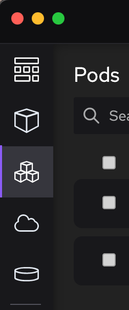

import ReactPlayer from 'react-player'

Podman Desktop 0.15 - Cleanliness is next to Podliness!

It has only been two weeks since our last release, but we really wanted to complete a few scenarios,
fix a few bugs, and show off several design updates and UI improvements that we have been working on.

<!--Main Features-->

- **Podman Version**: Podman 4.5 now included in Windows and Mac installers.
- **Kind Ingress**: Creating an ingress to expose services outside the Kind cluster.
- **Podliness**: Ability to choose external ports when podifying containers.
- **Cleanliness**: New navigation bar, dialog, and palette update.
- **UX and UI Improvements**: Markdown support for extensions.

Podman Desktop 0.15 is now available. [Click here to download it](/downloads)!

<!--truncate-->

---

## Release Details

### Update to Podman v4.5.O

Podman Desktop 0.15 embeds [Podman 4.5.0](https://github.com/containers/podman/releases/tag/v4.5.0) in
Windows and macOS installers [#2115](https://github.com/containers/podman-desktop/issues/2115).

### Kind Ingress

Wait a minute, didn't we enable this last release? Well yes, last time we did add support for installing
the Contour ingress controller on Kind [#1675](https://github.com/containers/podman-desktop/issues/1675),
but you still couldn't access your containers without the corresponding ingress.

This release adds a simple checkbox you can use when deploying to Kind to create an ingress and
make your service accessible [#1322](https://github.com/containers/podman-desktop/issues/1322).

<ReactPlayer playing playsinline controls url="https://user-images.githubusercontent.com/6422176/232894496-cbaea036-a14c-46c6-bfa3-bacca629a161.mov" width='100%' height='100%' />

### Podliness: Ability to Choose External Ports when Podifying Containers

When you create a pod from of a set of containers (Podifying!), you probably don't want to expose every
single port from every container to the world. With an updated panel you can now see which ports each container
exposes, pick which should remain visible outside the pod, and which are for internal use
[#2232](https://github.com/containers/podman-desktop/pull/2232).

### Cleanliness: New Navigation Bar, Dialogs, and Palette

It was time to catch up on some design ideas and do some UI cleanup!

#### New Navgation Bar

The navigation bar is now always fixed on the left size, without labels. This opens up more space
for the content on each page, and is easier to jump in and out of **<Icon icon="fa-solid fa-cog" size="lg" /> Settings**.
[#2167](https://github.com/containers/podman-desktop/issues/2167)

#### Updated Dialogs

We wanted messages and dialog boxes to feel a bit more integrated, so we have a new message box
[#1808](https://github.com/containers/podman-desktop/pull/1808) and use it for all dialogs opened by
extensions, pruning containers/pods/images/volumes [#2138](https://github.com/containers/podman-desktop/pull/2138),
and updating Podman Desktop itself [#2249](https://github.com/containers/podman-desktop/pull/2249).

#### Colors

We spent some time tweaking colors and closing on our final palette
[#2199](https://github.com/containers/podman-desktop/pull/2199), updating the colors in the terminal & detail page
[#2222](https://github.com/containers/podman-desktop/pull/2222), tweaking the navigation and main page colors
[#2223](https://github.com/containers/podman-desktop/pull/2223),
and improving the look of forms [#2156](https://github.com/containers/podman-desktop/issues/2156).

We're not done yet, but hopefully you will notice a more polished, consistent, good-looking application!

### Other UI and UX Improvements

#### Markdown Support for Extensions

We added a new component to display markdown [#2219](https://github.com/containers/podman-desktop/pull/2219) and
enabled it in preferences [#2253](https://github.com/containers/podman-desktop/pull/2253), and
provider properties/creation pages [#2152](https://github.com/containers/podman-desktop/issues/2152).
We can now embed links and other formatting in preferences, and extensions can use them in many places, for example:

---

## Other Notable Enhancements

- We know which **Settings** page is used the most often, so now it's the default: **<Icon icon="fa-solid fa-cog" size="lg" /> Settings > Resources** [#2105](https://github.com/containers/podman-desktop/issues/2105).

- Extensions can now use the Tasks API to let long running tasks continue in the background [#2019](https://github.com/containers/podman-desktop/issues/2019) and the existing withProgress API also uses the task manager now
  [#2187](https://github.com/containers/podman-desktop/pull/2187).

- Images are now sorted by age [#2311](https://github.com/containers/podman-desktop/pull/2311).

- When you start/stop a container or pod, the button is now animated instead of having an separate spinner
  [#2101](https://github.com/containers/podman-desktop/issues/2101).

- The **<Icon icon="fa-solid fa-cog" size="lg" /> Settings > Preferences** page now has a search bar [#2128](https://github.com/containers/podman-desktop/pull/2128).

- The Help page has been updated [#431](https://github.com/containers/podman-desktop/issues/431).

---

## Notable Bug Fixes

- There was no way to see log or outcome if you leave the Kind cluster creation page [#2079](https://github.com/containers/podman-desktop/issues/2079).
- Kind image load doesn't show a notification [#2225](https://github.com/containers/podman-desktop/issues/2225).
- Fix odd selection in **<Icon icon="fa-solid fa-cog" size="lg" /> Settings > Extensions** [#2130](https://github.com/containers/podman-desktop/issues/2130).
- Menus are now cleaned up properly when extensions are stopped [#2188](https://github.com/containers/podman-desktop/pull/2188).
- Kind clusters are now cleaned up when Podman machine is stopped [#2306](https://github.com/containers/podman-desktop/pull/2306).

---

## Final notes

The complete list of issues fixed in this release is available [here](https://github.com/containers/podman-desktop/issues?q=is%3Aclosed+milestone%3A0.15.0).

Get the latest release from the [Downloads](/downloads) section of the website and boost your development journey with Podman Desktop. Additionally, visit the [GitHub repository](https://github.com/containers/podman-desktop) and see how you can help us make Podman Desktop better.
