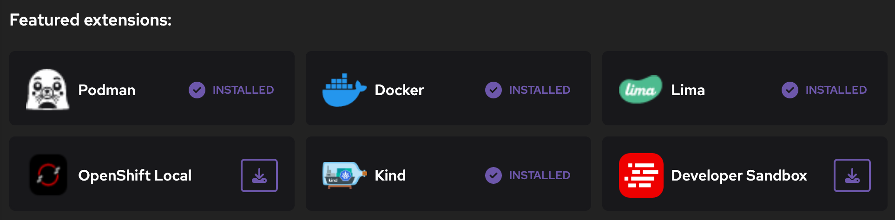
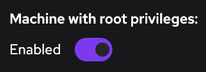
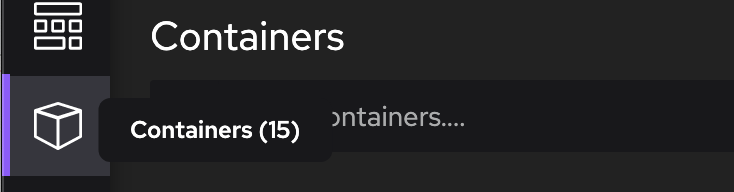

import ReactPlayer from 'react-player'

Podman Desktop 1.0 Release! 🎉

We still have many things planned, but with a little polish and a few more bug fixes we
felt we've reached a level of maturity and it is now time to declare our 1.0 release.

Thank you to everyone who has been with us on this journey so far! Please keep the 
feedback coming!

<!--Main Features-->

- **Featured Extensions**: Easily find and install new extensions.
- **Podman Machine as Root**: Ability to run a Podman machine as root.
- **UX and UI Improvements**: Opening external websites, editing numbers, and tooltips.

Podman Desktop 1.0 is now available. [Click here to download it](/downloads)!

<!--truncate-->

---

## Release Details

### Featured Extensions

A critical part of our vision for Podman Deskop is the ability to install extensions to
support additional container engines, Kubernetes providers, or other tools. However, it
has not been easy to discover new extensions.

With 1.0 we show a list of featured extensions in the **Welcome**
[#2354](https://github.com/containers/podman-desktop/pull/2354), the **Dashboard** and in
**<icon icon="fa-solid fa-cog" size="lg" /> Settings > Extensions**
[#2355](https://github.com/containers/podman-desktop/pull/2355). Check out the new
extensions for **Red Hat OpenShift Local** and the **Developer Sandbox for Red Hat OpenShift**!

Have another idea for extending Podman Desktop? We would love to hear from you or see
what you can create with the [Extension documentation](../docs/extensions).

### Podman Machine as Root

When creating a Podman machine you can now decide to run as root [#2427](https://github.com/containers/podman-desktop/pull/2427).

### Other UI and UX Improvements

#### Prompt to Open External Website

In the previous release links to external websites were blocked due to the security risk.
In 1.0 you can click to see the URL and have the option of opening or copying it
[#2414](https://github.com/containers/podman-desktop/pull/2414).

#### Editable Numeric Preferences

Tired of clicking +, +, +? Us too. Numeric preferences are now editable so
you can directly enter the value you want
[#2368](https://github.com/containers/podman-desktop/pull/2368).

#### Navigation tooltips

We like our new naviagtion bar, but the tooltips were slow to appear. This made it harder for new
users to discover the pages and for power users to see the container/pod/image counts. The
tooltips are now a little nicer and appear immediately
[#2286](https://github.com/containers/podman-desktop/pull/2286).

---

## Other Notable Enhancements

- If you use a non-default Podman machine you are now prompted to make it the default, so
that command line tools will use the same machine [#2205](https://github.com/containers/podman-desktop/pull/2205).

- Extensions can now be installed without requiring a running local container engine
[#2273](https://github.com/containers/podman-desktop/pull/2273).

- When extensions fail to load there is a new state (failed!) and an error message
to help you fix or report the problem [#2424](https://github.com/containers/podman-desktop/pull/2424).

- The showInputBox API has support for Markdown [#2418](https://github.com/containers/podman-desktop/pull/2418).

---

## Notable Bug Fixes

- Fixed shared status when using multiple Podman 4.5 machines [#2441](https://github.com/containers/podman-desktop/pull/2441).
- Fixed hang on exit when telemetry is unreachable [#2431](https://github.com/containers/podman-desktop/pull/2431).
- Reduced initial Podman REST API calls to improve performance [#2419](https://github.com/containers/podman-desktop/pull/2419).
- **Play Kubernetes YAML** now honors the namespace [#2509](https://github.com/containers/podman-desktop/pull/2509).
- **Container** list was not remembering expand/collapsed status [#2491](https://github.com/containers/podman-desktop/pull/2491).
- Clear previous error when installing Docker extension [#2469](https://github.com/containers/podman-desktop/pull/2469).
- Ensure correct path with running Kind CLI [#2455](https://github.com/containers/podman-desktop/pull/2455).
- Use IPv4 over IPv6 by default [#2398](https://github.com/containers/podman-desktop/pull/2398).
- When changing the Kubernetes pod name, change the app name to match [#2389](https://github.com/containers/podman-desktop/pull/2389).
- Fixed incorrect pod status in **Containers** view [#2387](https://github.com/containers/podman-desktop/pull/2387).
- **Dashboard** wasn't correctly refreshing Podman status [#2359](https://github.com/containers/podman-desktop/pull/2359).

---

## Community Thank You

🎉 We’d like to say a big thank you to everyone who helped to make Podman Desktop even better:

- [Taha Attari](https://github.com/TahaAttari) in [#2470 - Update docker command in importing-saved-containers.md](https://github.com/containers/podman-desktop/pull/2470)
- [Jason Greene](https://github.com/n1hility) in [#2431 - Fix hang on exit when telemetry endpoint is unreachable](https://github.com/containers/podman-desktop/pull/2431)

---

## Final notes

The complete list of issues fixed in this release is available [here](https://github.com/containers/podman-desktop/issues?q=is%3Aclosed+milestone%3A0.15.0).

Get the latest release from the [Downloads](/downloads) section of the website and boost your development journey with Podman Desktop. Additionally, visit the [GitHub repository](https://github.com/containers/podman-desktop) and see how you can help us make Podman Desktop better.
