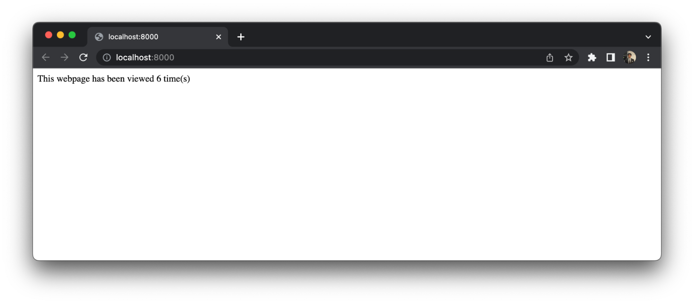
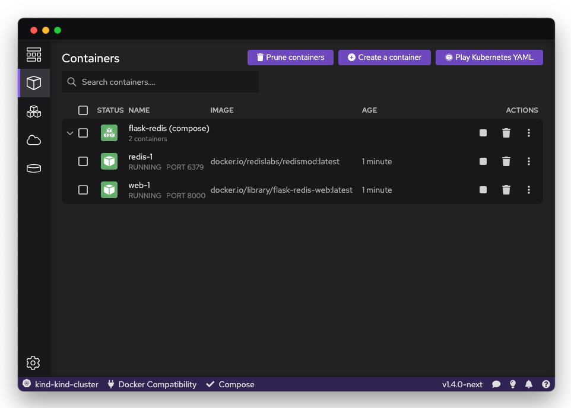

import Tabs from '@theme/Tabs';
import TabItem from '@theme/TabItem';

## Introduction

The [Compose spec](https://compose-spec.io) is a container specification that allows you to define a multi-container application in a simple YAML file.

If you have not used a [Compose file](https://github.com/compose-spec/compose-spec/blob/master/spec.md#compose-file) or the [Compose specification](https://compose-spec.io/), visit [this guide](https://github.com/compose-spec/compose-spec/blob/master/spec.md) for more information.

### Implementations

Podman Desktop supports these two Compose engines:

- [Compose](https://github.com/docker/compose): The Go reference implementation of the Compose specification.
- [Podman Compose](https://github.com/containers/podman-compose): The Python implementation of the Compose specification with native Podman integration.

This example uses the reference Compose engine.

#### Setting up Podman Desktop, Podman, and Compose

1. [Install Podman Desktop and Podman](/docs/installation).
1. Install the Compose engine: in the Podman Desktop status bar, click on **<icon icon="fa-solid fa-download" size="lg" />Compose**, and follow the prompts.
1. To use the Compose engine from your terminal, [set the DOCKER_HOST variable](/docs/migrating-from-docker/using-the-docker_host-environment-variable).

## Getting started

Use the [Flask Redis project](https://github.com/docker/awesome-compose/tree/master/flask-redis) from the [awesome-compose repository](https://github.com/docker/awesome-compose) as an example project.

1. Git clone the project and `cd` into the directory:

   ```shell-session
   $ git clone https://github.com/docker/awesome-compose
   $ cd awesome-compose/redis-flask
   ```

2. Run the `compose.yaml` file:

   ```shell-session
   $ docker-compose -f compose.yaml up -d
   ```

3. Manage Compose with Podman Desktop

   To confirm if the containers are running, open Podman Desktop and click on the ‘Containers’ option on the left side of the application. You will have the containers bundled together under a Pod named `flask-redis (compose)` in this case. Here, the compose within the bracket indicates it has been generated from a Compose YAML file.

   

4. You can further configure or work with these containers within the Podman Desktop application now that they are visible. Here, clicking on the ‘Open Browser’ button allows us to confirm if the application is running expectedly.

   

5. You can do much more such as checking logs, opening the terminal or inspecting the files for more details.

   
