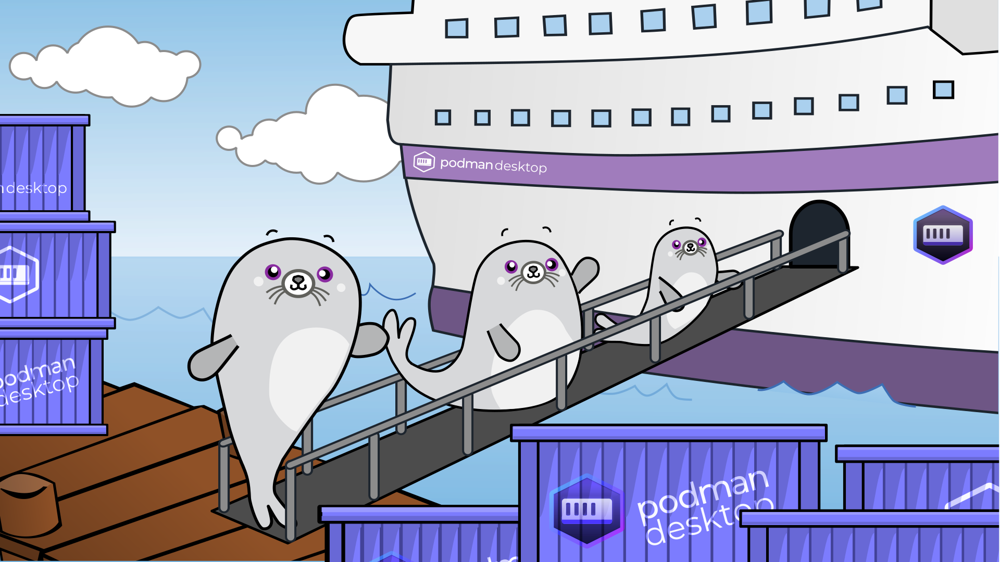

import ReactPlayer from 'react-player'

Podman Desktop 1.5 Release! 🎉

With this release of Podman Desktop, we're introducing **a new onboarding feature** that we hope will earn your 🦭 seal of approval! But wait... there's so much more!

- **Onboarding**: Guided setup and configuration of **Podman** and **Compose**
- **Podman 4.7.2**: [Podman 4.7.2](https://github.com/containers/podman/releases) is now included in Windows and Mac installers
- **Command Palette**: Gain easy access to various commands via a new keyboard-driven command palette
- **Expanded "Summary" tab for Kubernetes pods**: Go deep with extended details on Kubernetes pods in the pod "Summary" tab
- **Environment file support**: Chart out environment variables for new containers to access on creation
- **Enhancements to the Settings area**: Get your bearings with improved Docker compatibility mode controls
- **Improved user experience for state changes**: No more dead reckoning on container state with improved visual indication of status
- **Extension API improvements**: A boatload of improvements to the extension API enabling more goodness from 🦭 Podman Desktop's extensions

Podman Desktop 1.5 is now available. [Click here to download it](/downloads)!

---

## Release Details

### Onboarding

We are introducing a new feature providing guided flows for the initial setup of specific 🦭 Podman Desktop extensions. Release 1.5 features two new onboarding flows: Podman and Compose.

To start the Podman onboarding flow, you can start from the dashboard notification by clicking the "Set up" button:

Visit **<Icon icon="fa-solid fa-cog" size="lg"/>Settings > Resources** screen and click the Compose "Setup ..." button in order to start Compose onboarding:

### Command Palette

A new, search-driven command palette is now available to enable quick access to various commands available across 🦭 Podman Desktop. You can try this new tool out by hitting the F1 key. [#4081](https://github.com/containers/podman-desktop/pull/4081) &amp;&amp; [#3979](https://github.com/containers/podman-desktop/pull/3979)

<ReactPlayer playing playsinline controls url="https://user-images.githubusercontent.com/436777/270362431-5aaa6a1b-6df5-4b66-a811-cdd148d02ad6.mp4" width='100%' height='100%' />

### Expanded "Summary" tab for Kubernetes pods

Kubernetes pods now offer a more comprehensive set of information under the "Summary" tab, including networking, volumes, environment variables, and other key metadata.

<ReactPlayer playing playsinline controls url="https://user-images.githubusercontent.com/6422176/272972815-bed96f3a-6b13-45d3-a13b-74eacb27a4cd.mov" width='100%' height='100%' />

### Environment file support

When creating a container from the Images list, there's now an option to provide an environment file to set env variables for the new container. [#4026](https://github.com/containers/podman-desktop/pull/4026) &amp;&amp; [#4025](https://github.com/containers/podman-desktop/pull/4025)

### Enhancements to the Settings area

The user experience for enabling or disabling Docker compatibility is improved, with a new entry in the **<Icon icon="fa-solid fa-cog" size="lg" />Settings > Preferences** screen that includes contextual guidance. [#4093](https://github.com/containers/podman-desktop/pull/4093)

<ReactPlayer playing playsinline controls url="https://user-images.githubusercontent.com/6422176/270497318-902b2566-62ad-4ee6-87af-6a9a2705de99.mov" width='100%' height='100%' />

### Improved user experience for state changes

The user experience around state changes for containers, pods, and other objects in the UI is improved, with clear status messages and improved animated visual indicator of state changes. [#4056](https://github.com/containers/podman-desktop/pull/4056)

<ReactPlayer playing playsinline controls url="https://user-images.githubusercontent.com/19958075/270027524-f5176cf9-462f-4024-920a-b4a906c7d30d.mov" width='100%' height='100%' />

<ReactPlayer playing playsinline controls url="https://user-images.githubusercontent.com/19958075/270027533-70e152ec-5bbf-45ad-9f1d-563752464655.mov" width='100%' height='100%' />

### Extension API improvements

The 🦭 Podman Desktop extension API received many improvements, including:

- In addition to pushing and listing image from an extension, it's now possible to pull images from a 🦭 Podman Desktop extension [#4155](https://github.com/containers/podman-desktop/pull/4155)

- The 🦭 Podman Desktop extension API has been enhanced with both the ability to list images &amp; networks and the ability to create containers &amp; networks. [#4172](https://github.com/containers/podman-desktop/pull/4172)

- 🦭 Podman Desktop extensions now have a consistent way to run administrative tasks. [#4049](https://github.com/containers/podman-desktop/pull/4049)

- Extensions now have the ability to register a custom Kubernetes config generator. [#3970](https://github.com/containers/podman-desktop/pull/3970)

- The ability of extensions to add commands to UI menus has been extended; previously for action menus it was only available in the Image list screen. It is now possible for extensions to add commands to the action menus of items listed on the Containers list screen as well. [#3947](https://github.com/containers/podman-desktop/pull/3947) &amp; [#3963](https://github.com/containers/podman-desktop/pull/3963)

- Extensions have gained the ability to contribute menu items in the UI based on specific conditions. [#3959](https://github.com/containers/podman-desktop/pull/3959)

- Enhanced logic for displaying or hiding properties listed under the **<Icon icon="fa-solid fa-cog" size="lg" />Settings > Preferences** screens is now available. [#4159](https://github.com/containers/podman-desktop/pull/4159)

<ReactPlayer playing playsinline controls url="https://user-images.githubusercontent.com/6422176/271650937-3991565c-12a4-4e6c-a315-9343bfa25f65.mov" width='100%' height='100%' />

---

## Other Notable Enhancements

- The progress of loading an image into Kind is now visible as a task in the task manager. [#4061](https://github.com/containers/podman-desktop/pull/4061)

- It's now possible to start a new Podman machine right after creation, or you can create it and wait to start it later. It's up to you! [#4046](https://github.com/containers/podman-desktop/pull/4046)

- The Podman machine and Kubernetes provider creation forms have an updated look & feel consisted with other forms in the user interface, along with minor bug fixes. [#4317](https://github.com/containers/podman-desktop/pull/4317)

- The empty screen message shown when a search filter results in no matches now provides a message specific to filter matching, including the specific filter terms and an explicit button for clearing the filter. Previously, the screen displayed a generic message about how to create new objects of the type displayed on the screen, which led to some confusion about the status of the system. [#3988](https://github.com/containers/podman-desktop/pull/3988)

<ReactPlayer playing playsinline controls url="https://user-images.githubusercontent.com/19958075/269291090-13e724f7-252f-4915-bb04-00665001d21d.mov" width='100%' height='100%' />

- New support for adding spin animations to icons is now available. [#4188](https://github.com/containers/podman-desktop/pull/4188)

- There is a new indeterminate progress bar type available for the task manager; this is meant for providing limited status for actions whose APIs do not provide detailed status information. [#4016](https://github.com/containers/podman-desktop/pull/4016)

- For authenticating as admin to perform administrative tasks, 🦭 Podman Desktop now provides touchID support for macOS. [#4050](https://github.com/containers/podman-desktop/pull/4050)

<ReactPlayer playing playsinline controls url="https://user-images.githubusercontent.com/436777/269859758-47581e2b-8469-4e9c-822c-f4fddf46684d.mp4" width='100%' height='100%' />

- Support for connecting to interactive terminals for containers via tty was added. [#3900](https://github.com/containers/podman-desktop/pull/3900)

- It's now more clear which container/pod providers will autostart when 🦭 Podman Desktop starts. Previously autostart had both a global and a per-provider setting. It has been simplified by removing the global setting. [#3840](https://github.com/containers/podman-desktop/pull/3840)

- The "Working with containers" section of the documentation has been reworked and improved. [#3951](https://github.com/containers/podman-desktop/pull/3951)

---

## Notable Bug Fixes

- The disable registry command was not blocking subsequent pulls from disabled registries. This has been corrected. [#4183](https://github.com/containers/podman-desktop/pull/4183)

- Some users behind network proxies were unable to complete workflow involving the download of online resources. The mechanism for fetching these resources has been fixed to be proxy compatible to address this issue. [#3994](https://github.com/containers/podman-desktop/pull/3994)

- The status of pods running in Kubernetes that are undergoing the deletion process is now accurately reflected in the 🦭 Podman Desktop UI. [#3877](https://github.com/containers/podman-desktop/pull/3877)

- The image details page always listed the image as being "not used" even when it was. This has been corrected. [#3985](https://github.com/containers/podman-desktop/pull/3985)

- Previously, deleting a specific image tag would cause all tags with the same Image ID to be deleted. This has been fixed so only the selected image tag will be deleted. [#3837](https://github.com/containers/podman-desktop/pull/3837)

- Could not view the pod details for some remote Kubernetes cluster pods due to an encoding error. [#4371](https://github.com/containers/podman-desktop/pull/4371)

- Error logs were being tracked separately from the actions they applied to. This has been addressed for kind cluster creation failure [#4427](https://github.com/containers/podman-desktop/pull/4427) and Compose installation failure [#4407](https://github.com/containers/podman-desktop/pull/4407).

- For Linux users, 🦭 Podman Desktop previously did not appear under the "Development" menu when installed via Flatpak; it appeared under "Utilities." 🦭 Podman Desktop now appears under the "Development" menu. [#3911](https://github.com/containers/podman-desktop/pull/3911)

- Podman Machine names are no longer prefixed with the "Podman Machine" string. [#3878](https://github.com/containers/podman-desktop/pull/3878)

- The initial action state of pods and containers was being displayed as "STARTING" regardless of actual state; this has been corrected. [#3889](https://github.com/containers/podman-desktop/pull/3889)

- Resizing the application window no longer makes the last lines of a container's terminal invisible. [#3993](https://github.com/containers/podman-desktop/pull/3993)

- An issue with incorrect terminal behavior in response to long lines in the terminal attached to a container has been resolved. [#3955](https://github.com/containers/podman-desktop/pull/3955)

- A spacing issue on the run image form has been corrected. [#4089](https://github.com/containers/podman-desktop/pull/4089)

- The "podify" icon & button on the Containers list was unusually large in release 1.4. That regression has been corrected in this release. [#4122](https://github.com/containers/podman-desktop/pull/4122)

- An error in the instructions for Windows users on migrating from Docker has been corrected. [#4157](https://github.com/containers/podman-desktop/pull/4157)

---

## Community Thank You

🎉 We’d like to say a big thank you to everyone who helped to make 🦭 Podman Desktop even better. In this
release we received pull requests from the following people:

- [afbjorklund](https://github.com/afbjorklund) in [#4373 - docs: fix broken links and add lima onboarding](https://github.com/containers/podman-desktop/pull/4373), [#4372 - docs: clear up lima column on containers page](https://github.com/containers/podman-desktop/pull/4372), [#4091 - fix: avoid errors with unexpected JSON input](https://github.com/containers/podman-desktop/pull/4091), [#4098 - docs: Lima onboarding details](https://github.com/containers/podman-desktop/pull/4098), and [#3854 - fix: check if machine init rootful flag supported](https://github.com/containers/podman-desktop/pull/3854)

- [axel7083](https://github.com/axel7083) in [#4061 - feat: adding task progress for kind](https://github.com/containers/podman-desktop/pull/4061), [#3970 - feat: extension can register custom kube generator](https://github.com/containers/podman-desktop/pull/3970), [#3959 - feat: add when property to extensions menus](https://github.com/containers/podman-desktop/pull/3959), [#4016 - feat: indeterminate progress bar](https://github.com/containers/podman-desktop/pull/4016), [#3963 - fix: ContainerList propagating containers in ComposeActions and PodActions](https://github.com/containers/podman-desktop/pull/3963), and [#3947 - feat: extend menus capabilities](https://github.com/containers/podman-desktop/pull/3947)

- [ayushrakesh](https://github.com/ayushrakesh) in [#4415 - Update README.md](https://github.com/containers/podman-desktop/pull/4415#)

- [eltociear](https://github.com/eltociear) in [#4194 - Update README.md](https://github.com/containers/podman-desktop/pull/4194)

- [foxydeveloper](https://github.com/foxydevloper) in [#4157 - docs: Correct windows instructions for migrating from docker](https://github.com/containers/podman-desktop/pull/4157)

- [harsh-solanki21](https://github.com/harsh-solanki21) in [#4162 - fix: Removed fullstop from summary](https://github.com/containers/podman-desktop/pull/4162)

- [rahul0x00](https://github.com/rahul0x00) in [#4240 - fix typos in README.md](https://github.com/containers/podman-desktop/pull/4240)

- [shelar1423](https://github.com/shelar1423) in [#4221 - chore: document property setting in EXTENSIONS.md](https://github.com/containers/podman-desktop/pull/4221)

---

## Final notes

### Known Issues

We have a discussion board topic where we have posted known issues with this release. If you run into problems, please check this list before filing a bug - if we already have an issue open for it, it saves you the time and trouble of filing, and there may be a workaround posted in the issue.

#### [Known Issues: Podman Desktop 1.5.2](https://github.com/containers/podman-desktop/discussions/4635)

### Fixed Issues

The complete list of issues fixed in this release is available [here](https://github.com/containers/podman-desktop/issues?q=is%3Aclosed+milestone%3A1.5.0).

### Where to Download

Get the latest release from the [Downloads](/downloads) section of the website and boost your development journey with Podman Desktop. Additionally, visit the [GitHub repository](https://github.com/containers/podman-desktop) and see how you can help us make Podman Desktop better.
