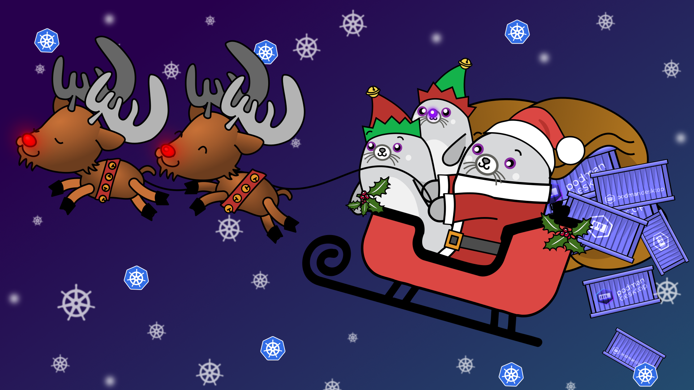
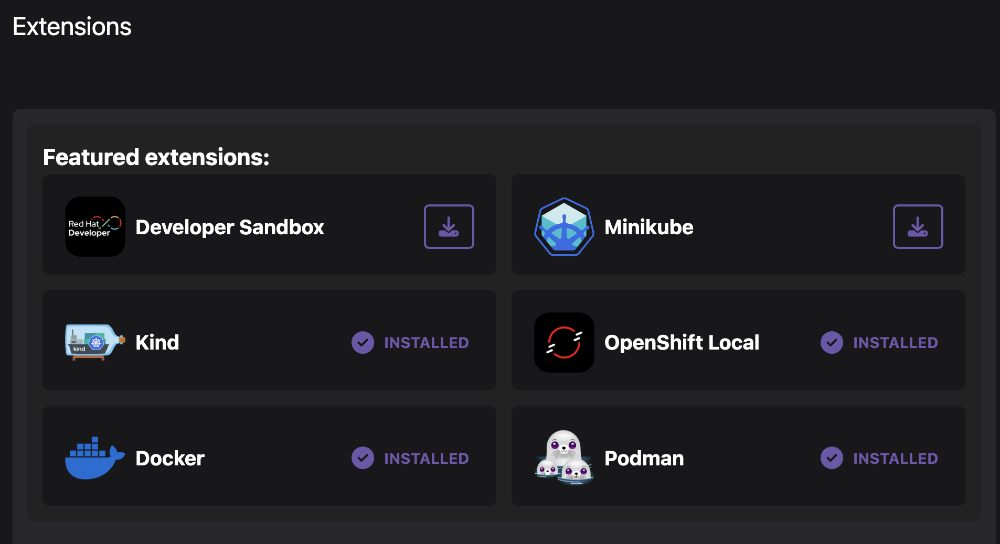
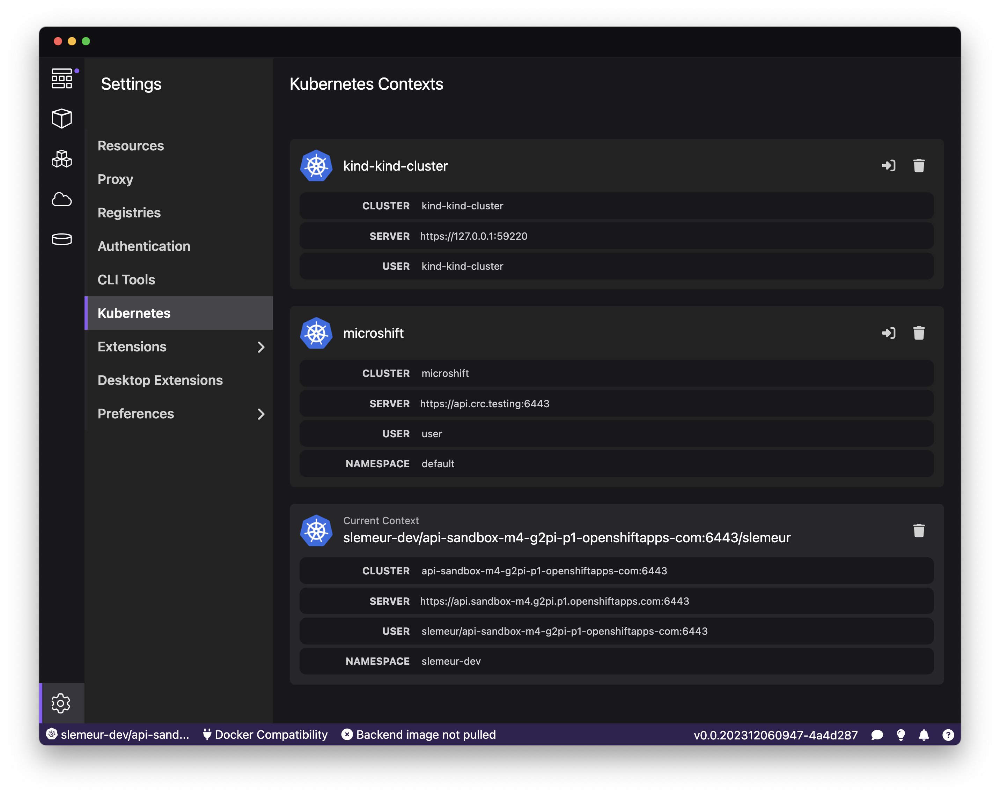

import ReactPlayer from 'react-player'

Podman Desktop 1.6 Release! 🎉

This release introduces:

- **Minikube Featured Extension**: Minikube extension to create local Kubernetes clusters in containers.
- **Podman 4.8.2**: [Podman 4.8.2](https://github.com/containers/podman/releases) is now included in Windows and Mac installers.
- **Setting Page for Command-Line Tools**: Manage and update your CLI tools.
- **Kubernetes Contexts Manager**: Browse all your kubernetes contexts, set default and remove unused ones.
- **Editable Podman Machine for MacOS**: Easy resize and reconfiguration of the Podman runtime environment.
- **Filters for Containers and Pods Lists**: Focus on the containers and Pods you are working with.
- **Sorting on Volumes and Images List**: Sort volumes or images with your prefered criterias.
- **Environment Colums on Containers and Pods lists**: Easy catch of the environment on which a container or a pod is running on.
- **Extension API Improvements**: Another set of improvements to the extension API enabling more goodness for 🦭 Podman Desktop's extensions.

Podman Desktop 1.6 is now available. [Click here to download it](/downloads)!

---

## Release Details

### Minikube featured extension

For developers who need to run Kubernetes locally and reproduce an environment close to production for development and experimentation purposes, Podman Desktop allows users to easily set up that environment on a local machine. There are two extensions providing the capability to configure a open source Kubernetes cluster locally, you can either choose between [Kind](https://kind.sigs.k8s.io/) or [Minikube](https://minikube.sigs.k8s.io/docs/).

The Minikube extension allows you to install Minikube on your workstation and also to setup a Kubernetes cluster locally running in a container! Yes, you read that correctly - in a container similar to how Kind works. The advantage is that it's lighter and faster to start. With Minikube, one of the advantage, is that you can build your images locally with Podman and get them automatically available in your local Kubernetes cluster - which will speed up your turnarounds when you want to test your application. If you want to learn more this, read the [following blog post](https://podman-desktop.io/blog/sharing-podman-images-with-kubernetes-cluster).

### Command-Line Tools Configuration: Compose and Kubectl

Configuring and managing your setup is getting easier with the addition of a new section in the Settings to manage command-line tools. In Podman Desktop, extensions can list command-line tools that are helpful to their users or required to make use of the installed extensions.

There are two command-line tools within Podman Desktop that allows you to view whether they are installed or require an update:

- Compose binary for running 'podman compose' commands.
- kubectl for interacting with Kubernetes clusters.

From the settings you can see the command-line tools that are installed, and you can see the version - and when a new version is available, you'll get a small notification to allow you easily update to that version.

### Kubernetes Contexts Manager

We are introducing a new screen available from the Settings which allows you to easily manage your Kubernetes contexts. Podman Desktop was already providing the handy context switcher available from the status bar, but when you get to work with multiple Kubernetes environments, it's not uncommon to end with a big and long list of Kubernetes contexts.

The new Kubernetes Contexts screen allows you to easily see all your registered Kubernetes contexts. You can use the screen to clean up your registered contexts, or set the current (default) context.

### Editable Podman Machine

A Podman machine is a virtual environment specifically designed to run Podman containers on Mac and Windows. It allows users to manage and operate containerized applications in an isolated and controlled setting. When creating a Podman machine, you configure its settings: memory, CPU(s) and disk size.

We've received the feedback regarding the ability to reconfigure your Podman machine on the go. This is now possible for macOS users, and particularly useful when you start with an environment and need to scale it up based on new needs and containers you would like to run in your Podman environment.

You'll notice we improved the sliders to configure the Podman machine's options - and also introduced a way to enter numeric values directly.

### Tabs/Filters for Containers and Pods

Being able to quickly identify the containers and the pods you are working with is critical when you are iterating on the development of your application. For this reason, we added filters at the top of the lists of Containers and Pods that allow you to easily view all the containers/pods, only those that are running, or only those that are stopped.

### Sorting for Volumes and Images lists

The lists of Volumes and Images have improved and are now have the ability to be sorted by the criteria of your choice. You can for example filter images by their size - which can be convenient when you want to clean up your environment.

### Environment columns on Containers and Pods lists

Podman Desktop is able to work with multiple providers: it could work with multiple container engines and multiple Kubernetes environments too. In order to make it easier to identify the containers and the pods and differentiate them depending on which environment they are running onto, we are introducing a new environment column in the list of Containers and Pods to display a badge.

#### Better visibility to the containers running in Pods

The list of Pods has been refined to provide easier visibility and access to the containers running within each of them. Each of the containers now have one dot and you can hover each dot to display the info about the container - and if you click on it you'll be able to access the details of the container.

### Extension API improvements

The 🦭 Podman Desktop extension API received many improvements, including:

- Documentation explaining how to create an onboarding workflow for an extension [#4837](https://github.com/containers/podman-desktop/pull/4837)
- Documented how extensions hook into UI [#4633](https://github.com/containers/podman-desktop/pull/4633)
- Documented how to implement api client [#4636](https://github.com/containers/podman-desktop/pull/4636)
- Image checker extension API [#4662](https://github.com/containers/podman-desktop/pull/4662)
- Added api to register cli updater [#5064](https://github.com/containers/podman-desktop/pull/5064)

---

## Other Notable Enhancements

- Show container connection type and endpoint [#5098](https://github.com/containers/podman-desktop/pull/5098)
- Environment column to pods/containers [#4583](https://github.com/containers/podman-desktop/pull/4583)
- Displaying extension icons in the list of extensions [#5101](https://github.com/containers/podman-desktop/pull/5101)
- Introduced UI icon image component [#5117](https://github.com/containers/podman-desktop/pull/5117)
- Added icon to extensionInfo [#5089](https://github.com/containers/podman-desktop/pull/5089)
- Added encoding option on RunOptions [#4942](https://github.com/containers/podman-desktop/pull/4942)
- Introduced property for appearance but for now only dark is supported [#4887](https://github.com/containers/podman-desktop/pull/4887)
- Default table sorting [#4860](https://github.com/containers/podman-desktop/pull/4860)
- Display notification for completed onboarding in task manager [#4811](https://github.com/containers/podman-desktop/pull/4811)
- Added purple dot when new content is available in dashboard [#4782](https://github.com/containers/podman-desktop/pull/4782)
- Argos CI: Introduce Argos CI to track and detect visual regressions on the website
- Added command palette: add enablement property [#4630](https://github.com/containers/podman-desktop/pull/4630)
- Added documentation for telemetry and usage data [#4618](https://github.com/containers/podman-desktop/pull/4619)
- Introduced table component [#4545](https://github.com/containers/podman-desktop/pull/4545)
- Added ability to abort build image [#4538](https://github.com/containers/podman-desktop/pull/4538)
- Added support in command palette for category [#4531](https://github.com/containers/podman-desktop/pull/4531)
- Upgraded flatpak to org.freedesktop.Platform version 23.08 [#3968](https://github.com/containers/podman-desktop/pull/3968)
- Added open exposed url to pod details [#3762](https://github.com/containers/podman-desktop/pull/3762)

---

## Notable Bug Fixes

- Fix reconnect to `/events` if disconnected [#4809](https://github.com/containers/podman-desktop/pull/4809)
- fix: reset loggerhandlerKey after restarting machine [#5168](https://github.com/containers/podman-desktop/pull/5168)
- fix: fix: podman machine created with wrong flags [#5178](https://github.com/containers/podman-desktop/pull/5178)
- fix: avoid to crash if configuration is invalid [#5182](https://github.com/containers/podman-desktop/pull/5182)
- fix: extension installation checks architecture and os [#5191](https://github.com/containers/podman-desktop/pull/5191)
- fix: use URL for proxy specification and add validation [#4825](https://github.com/containers/podman-desktop/pull/4825)
- fix: do not change color and underline of markdown buttons [#5138](https://github.com/containers/podman-desktop/pull/5138)
- fix: do not reconnect when connection is removed [#5131](https://github.com/containers/podman-desktop/pull/5131)
- fix: table headers shouldn't allow text selection [#5118](https://github.com/containers/podman-desktop/pull/5118)
- fix: add style to link [#5108](https://github.com/containers/podman-desktop/pull/5108)
- fix: launch.json references wrong script [#5094](https://github.com/containers/podman-desktop/pull/5094)
- fix: don't link to k8s cluster server [5087](https://github.com/containers/podman-desktop/pull/5087)
- fix: pass the complete imageInfo to the check function [#5069](https://github.com/containers/podman-desktop/pull/5069)
- fix: container tabs should match pods [#5057](https://github.com/containers/podman-desktop/pull/5057)
- fix: revert styling of disabled buttons [#5056](https://github.com/containers/podman-desktop/pull/5056)
- fix: update current context reactively [#5055](https://github.com/containers/podman-desktop/pull/5055)
- fix: make ProviderResultPage do not change input values [#5030](https://github.com/containers/podman-desktop/pull/5030)
- fix: add rowgroup to tables [#5005](https://github.com/containers/podman-desktop/pull/5005)
- fix: add path prop for route object [#4981](https://github.com/containers/podman-desktop/pull/4981)
- fix: remove errant hash mark [#4971](https://github.com/containers/podman-desktop/pull/4971)
- fix: check extension folder contains package.json [#4964](https://github.com/containers/podman-desktop/pull/4964)
- fix: refactor List UI components [#4953](https://github.com/containers/podman-desktop/pull/4953)
- fix: succeeded/completed state for Compose onboarding [#4947](https://github.com/containers/podman-desktop/pull/4947)
- fix: remove flex class from markdown button rendering [#4934](https://github.com/containers/podman-desktop/pull/4934)
- fix: unable to read wsl version when using chinese as syslang on Windows [#4918](https://github.com/containers/podman-desktop/pull/4918)
- fix: retain autostart setting [#4879](https://github.com/containers/podman-desktop/pull/4879)
- fix: use vi.waitUtnil instead of cycles with awaiting promises [#4861](https://github.com/containers/podman-desktop/pull/4861)
- fix: docker host on windows when executing compose command [#4855](https://github.com/containers/podman-desktop/pull/4855)
- fix: merged compose deploy to kube page in UI [#4827](https://github.com/containers/podman-desktop/pull/4827)
- fix: use URL for proxy specification and add validation [#4825](https://github.com/containers/podman-desktop/pull/4825)
- fix: reconnect to /events if disconnected [#4809](https://github.com/containers/podman-desktop/pull/4809)
- fix: remove fixed height after patternfly removal [#4804](https://github.com/containers/podman-desktop/pull/4804)
- fix background colours after patternfly removal [#4803](https://github.com/containers/podman-desktop/pull/4803)
- fix: report metrics for stopped machines [#4787](https://github.com/containers/podman-desktop/pull/4787)
- chore: update to docusaurus v3.0.0 [#4764](https://github.com/containers/podman-desktop/pull/4764)
- chore: drop patternfly [#4762](https://github.com/containers/podman-desktop/pull/4762)
- fix: avoid to send telemetry usage as this method is called every 5s [#4692](https://github.com/containers/podman-desktop/pull/4692)
- fix: location of roots.exe in devmode [#4654](https://github.com/containers/podman-desktop/pull/4654)
- fix: disable create/start container if any port is busy [#4637](https://github.com/containers/podman-desktop/pull/4637)
- fix: fix setup in build image tests [#4625](https://github.com/containers/podman-desktop/pull/4625)
- fix: find a free port [#4616](https://github.com/containers/podman-desktop/pull/4616)
- fix: reduce size of provider cards on the dashboard [#4615](https://github.com/containers/podman-desktop/pull/4615)
- fix: shorter doc nav section titles [#4613](https://github.com/containers/podman-desktop/pull/4613)
- fix: report error if container engine action fails in details page [#4556](https://github.com/containers/podman-desktop/pull/4556)
- fix: remove prev/next bar [#4548](https://github.com/containers/podman-desktop/pull/4548)
- fix: reduce website footer [#4546](https://github.com/containers/podman-desktop/pull/4546)
- fix: handle compose format json that is no longer a JSON array object [#4540](https://github.com/containers/podman-desktop/pull/4540)
- fix: disable push to kind menu item if pushing is in progress [#4530](https://github.com/containers/podman-desktop/pull/4530)
- fix: check for self signed cert message and use insecure param when editing registry password [#4523](https://github.com/containers/podman-desktop/pull/4523)
- fix: add autoscroll to summary pages [#4504](https://github.com/containers/podman-desktop/pull/4504)
- fix: report errors when analyzing extensions [#4380](https://github.com/containers/podman-desktop/pull/4380)
- fix: allow editing of build containerfile [#4471](https://github.com/containers/podman-desktop/pull/4471)
- refactor: updated compose onboarding installation [#4479](https://github.com/containers/podman-desktop/pull/4479)
- refactor: remove compose from the status bar [#4492](https://github.com/containers/podman-desktop/pull/4492)

---

## Documentation

Coming with this new version of 🦭 Podman Desktop, the documentation has been getting the following improvements:

- Reorganize doc navigation by provider [#4558](https://github.com/containers/podman-desktop/pull/4558)
- Added vsc runtime dependency for Windows development [#5091](https://github.com/containers/podman-desktop/pull/5091)
- Show location of lima podman socket [#5090](https://github.com/containers/podman-desktop/pull/5090)
- Fixed typo in URI for releases [#4909](https://github.com/containers/podman-desktop/pull/4909)
- Explain how to create an onboarding workflow for an extension [#4837](https://github.com/containers/podman-desktop/pull/4837)
- Make it possible for lima to provide both [#4789](https://github.com/containers/podman-desktop/pull/4789)
- Blog post about minikube/sharing images [#4735](https://github.com/containers/podman-desktop/pull/4735)
- Remove duplicate text from windows troubleshooting [#4652](https://github.com/containers/podman-desktop/pull/4652)
- Add step to implement api client [#4636](https://github.com/containers/podman-desktop/pull/4636)
- Fixed the main lima command for limactl [#4623](https://github.com/containers/podman-desktop/pull/4623)
- Lima provider cleanup after the improvements in the implementation [#4622](https://github.com/containers/podman-desktop/pull/4622)
- Update documentation regarding auto merge [#4519](https://github.com/containers/podman-desktop/pull/4519)
- Using standard OS tabs for registries docs [#4497](https://github.com/containers/podman-desktop/pull/4497)
- Fixed mahine -> machine [#4495](https://github.com/containers/podman-desktop/pull/4495)
- Added screenshots and fixed formatting to the registries section [#4472](https://github.com/containers/podman-desktop/pull/4472)

---

## Community Thank You

🎉 We’d like to say a big thank you to everyone who helped to make 🦭 Podman Desktop even better. In this
release we received pull requests from the following people:

- [afbjorklund](https://github.com/afbjorklund) in [fix: add website target for running vale](https://github.com/containers/podman-desktop/pull/4547), [docs: the main lima command is limactl](https://github.com/containers/podman-desktop/pull/4623), [docs: lima provider cleanup after the merge](https://github.com/containers/podman-desktop/pull/4622), [docs: make it possible for lima to provide both](https://github.com/containers/podman-desktop/pull/4789), [fix: don't link to k8s cluster server](https://github.com/containers/podman-desktop/pull/5087), [feat: show the k8s namespace](https://github.com/containers/podman-desktop/pull/5088), [docs: show location of lima podman socket](https://github.com/containers/podman-desktop/pull/5090)

- [axel7083](https://github.com/axel7083) in [refactoring: item formats from renderer/preferences in separate files](https://github.com/containers/podman-desktop/pull/3728), [feat: adding optional abort controller to dockerode api](https://github.com/containers/podman-desktop/pull/4364)

- [ReadingShades](https://github.com/ReadingShades) in [docs: Added the environment variable set commands of the common windows terminal emulators](https://github.com/containers/podman-desktop/pull/4245)

- [jannikbertram](https://github.com/jannikbertram) in [chore: add close button to troubleshooting and help page](https://github.com/containers/podman-desktop/pull/4457)

- [singodiyashubham87](https://github.com/singodiyashubham87) in [fix: header line height issue on website](https://github.com/containers/podman-desktop/pull/4494)

- [edvardsanta](https://github.com/edvardsanta) in [feat: remove redundant naming in buttons](https://github.com/containers/podman-desktop/pull/4518)

- [Mayureshd-18](https://github.com/Mayureshd-18) in [fix typos](https://github.com/containers/podman-desktop/pull/4551)

- [jgelens](https://github.com/jgelens) in [Fix rootless command](https://github.com/containers/podman-desktop/pull/4609)

- [itecompro](https://github.com/itecompro) in [docs: remove duplicate text from windows troubleshooting](https://github.com/containers/podman-desktop/pull/4652)

- [EricSmekens](https://github.com/EricSmekens) in [docs: Fixed typo in URI for releases](https://github.com/containers/podman-desktop/pull/4909)

- [ecrookshanks-rh](https://github.com/ecrookshanks-rh) in [fix: added text beside icon for create pods](https://github.com/containers/podman-desktop/pull/5095)

---

## Final notes

### Fixed Issues

The complete list of issues fixed in this release is available [here](https://github.com/containers/podman-desktop/issues?q=is%3Aclosed+milestone%3A1.6.0).

### Where to Download

Get the latest release from the [Downloads](/downloads) section of the website and boost your development journey with Podman Desktop. Additionally, visit the [GitHub repository](https://github.com/containers/podman-desktop) and see how you can help us make Podman Desktop better.
