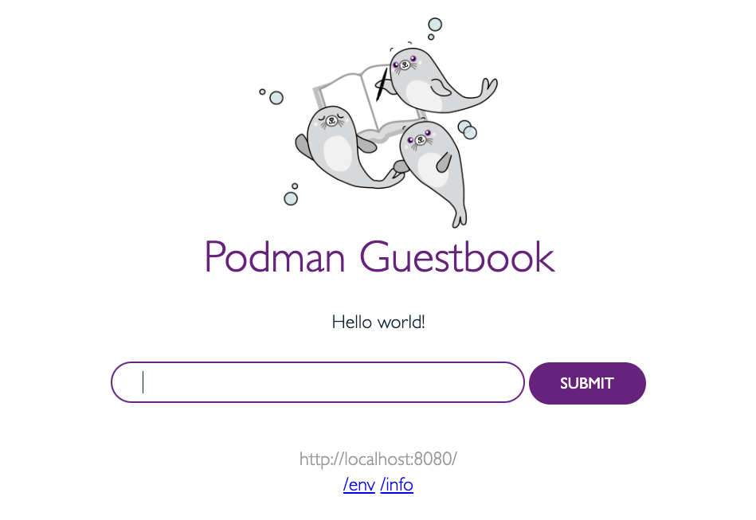

In this blog post we will learn how take a multi-container Compose application and use it within Podman Desktop.

## Objectives

- Start the Compose YAML through `podman compose up`.
- View the guestbook web application.
- Confirm the web application is being synchronized and running correctly with the database.
- Use Podman Desktop to view, inspect and access the terminal of the Redis cluster.

## What is Compose

[Compose is a specification](https://www.compose-spec.io/) for defining and running multi-container Docker applications. With pose, you use a YAML file to configure your application’s services, networks, and volumes. This allows you to capture in a single file the entire configuration necessary to run a set of interconnected containers as an application. For example, if you have an application that requires a web server, a database, and a caching service, you can define these components and their relationships in your Compose file.

To use the Compose YAML, you can use a specification implementation such as [`podman compose`](https://docs.podman.io/en/latest/markdown/podman-compose.1.html) and [`docker compose`](https://github.com/docker/compose).

## Before we begin

If you do not have Compose installed, let's go through the onboarding process to install the Compose implementation binary:

1. Get to Resources under **<Icon icon="fa-solid fa-cog" size="lg" /> Settings > Resources**.
2. Click **Setup** under Compose (it will appear if it has not been installed yet).
3. Go through the onboarding process.


Confirm that you are able to run `podman compose`:

```sh
podman compose
Run compose workloads via an external provider such as docker-compose or podman-compose

Description:
  This command is a thin wrapper around an external compose provider such as docker-compose or podman-compose.  This means that podman compose is executing another tool that implements the compose functionality but sets up the environment in a way to let the compose provider communicate transparently with the local Podman socket.  The specified options as well the command and argument are passed directly to the compose provider.
...
```

## Download and run the example application

Our example application is located at [github.com/redhat-developer/podman-desktop-demo](https://github.com/redhat-developer/podman-desktop-demo).

We will use `git clone` so we can build the Go binary web application:

```sh
git clone https://github.com/redhat-developer/podman-desktop-demo
cd podman-desktop-demo/guestbook-compose
```

Run `podman compose up -d` to start the application:

```sh
podman compose up -d
>>>> Executing external compose provider "/usr/local/bin/docker-compose". Please refer to the documentation for details. <<<<

[+] Running 3/3
 ✔ Container redis-replica  Started                                                                        0.0s
 ✔ Container web            Started                                                                        0.0s
 ✔ Container redis-leader   Started                                                                        0.0s
```

## Viewing the guestbook application

Within Podman Desktop, you can now see that all three containers are up and operational.

Click the "Open Browser" button to view the web application:


Within the Guestbook web application, you can:

- "Sign" the guestbook, which will write to the Redis leader and synchronize to the replicas.
- "Read" from the guestbook, which will read from the pool of Redis replicas. This allows for readability even if the Redis leader is unavailable.
- `/env`: View the container's environment variables.
- `/info`: View information about the Redis cluster.



## Viewing and modifying the database

Using Podman Desktop, you can also access the container's terminal directly from the GUI and modify the database.

Click "Open Terminal" to access the `redis-leader` terminal:


Modify the database as if you are doing database administration:

1. Run `redis-cli` within the container to access the Redis database.
2. Type `LPUSH guestbook "Hello World!"` and you will see your web application update in real-time.
3. Type `DEL guestbook` and you will see that your database drops the `guestbook` key and clears the database.


Changes will reflect in real-time on the guestbook.

You can further modify the database and see the changes propagate to the Redis replicas.

For example, view the logs of the `redis-replica`, and you will notice that there are periodic database synchronizations as well as reads to the database:


## How does it work?

A quick overview of how the architecture works in this multi-container scenario:

- Within the Guestbook application, it looks for a database with the names `redis-leader` and `redis-replica` on port 6379.
- Because it is a Compose application, the containers are connected on the same network. This means that a neighboring container can be network-accessible simply by its container name.

There is a set of environment variables that the web application can modify in the Compose application:

- `REDIS_LEADER`: The default is `redis-leader`.
- `REDIS_REPLICAS`: The default is `redis-replica`. Can be comma-separated, such as `redis-replica-1,redis-replica-2`.
- `REDIS_PORT`: The default is `6379`.
- `SERVER_PORT`: The default is `8080`.

## Scaling more replicas

Want to scale more replicas? This can be achieved by adding an environment variable to your `compose.yaml` and duplicating your `redis-replica` entry.

Modify your `compose.yaml` as follows:

```yaml
services:
  redis-leader:
    container_name: redis-leader
    image: redis:latest
    ports:
      - '6379'

  redis-replica:
    container_name: redis-replica
    image: redis:latest
    ports:
      - '6379'
    command: redis-server --replicaof redis-leader 6379

  redis-replica-2:
    container_name: redis-replica-2
    image: redis:latest
    ports:
      - '6379'
    command: redis-server --replicaof redis-leader 6379

  web:
    container_name: web
    build: ./web
    environment:
      - REDIS_REPLICAS=redis-replica1,redis-replica2
    ports:
      - '8080:8080'
```

Run `podman compose up -d` again to ensure the new container has been added and the new environment variable has propagated:

```sh
podman compose up -d
>>>> Executing external compose provider "/usr/local/bin/docker-compose". Please refer to the documentation for details. <<<<

[+] Running 4/4
 ✔ Container redis-replica-2  Started                                                                      0.0s
 ✔ Container redis-leader     Running                                                                      0.0s
 ✔ Container web              Started                                                                      0.0s
 ✔ Container redis-replica    Running                                                                      0.0s
```
