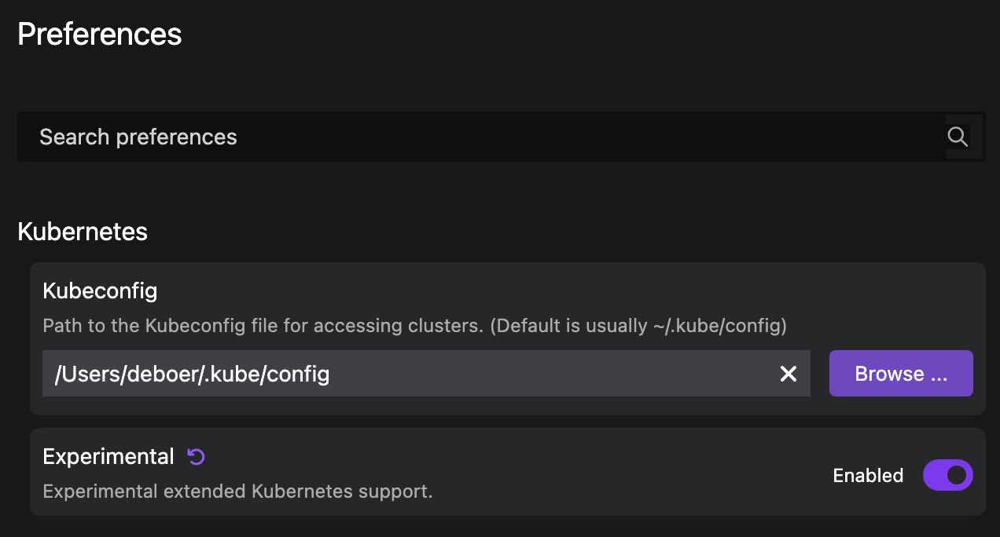
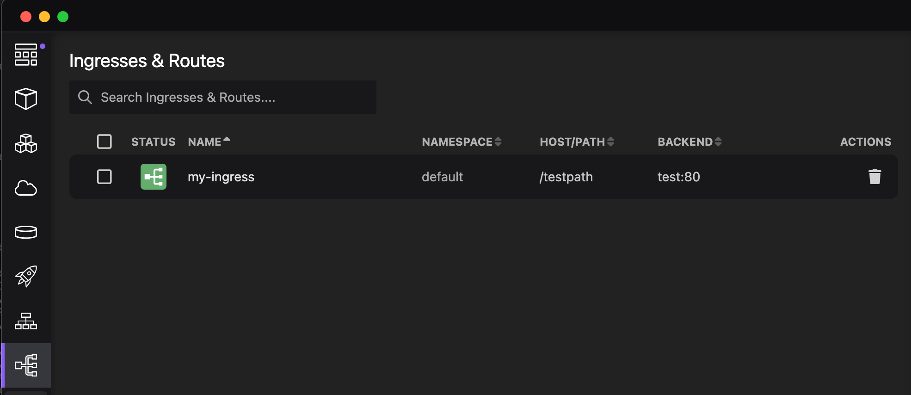
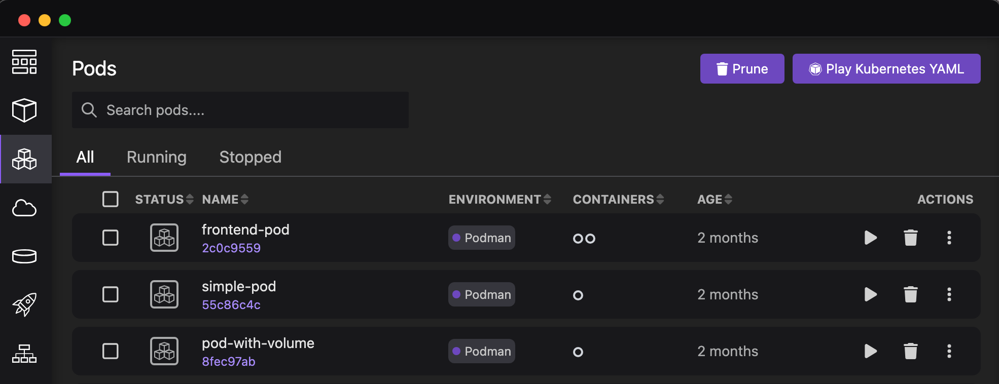
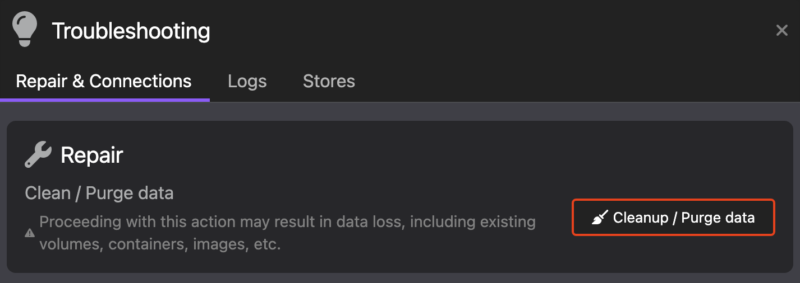

import ReactPlayer from 'react-player'

Podman Desktop 1.7 Release! 🎉

We've got a new release with a ton of seal appeal! This release introduces:

- **Podman 4.9.0**: [Podman 4.9.0](https://github.com/containers/podman/releases) is now included in both Windows and Mac installers.
- **Extension API Improvements**: A big update to the extension API enabling more goodness for 🦭 Podman Desktop's extensions.
- **Experimental Kubernetes UI**: Get a sneak peek at the more advanced UI for working with Kubernetes clusters.
- **Enhanced Builds, Pods List, and Troubleshooting Pages**: Build for different platforms, an upgraded pods view, and more.

Podman Desktop 1.7 is now available. [Click here to download it](/downloads)!

---

## Release Details

### Podman 4.9

🦭 Podman 4.9 includes key fixes for stability and reliability issues reported by our users.
If you've been floundering we highly recommend updating!

If you are on a Mac M3, we are aware of a critical issue in Podman and expect to update very
soon to pick up this fix:
[#21353 - Update to new QEMU](https://github.com/containers/podman/issues/21353) (based on
[#1990 - QEMU issue on M3](https://gitlab.com/qemu-project/qemu/-/issues/1990)). If you are
hitting this problem there is a workaround [here](/docs/troubleshooting/troubleshooting-podman-on-macos#on-apple-silicon-the-podman-machine-does-not-start) and [there](https://github.com/containers/podman/issues/21088#issuecomment-1871502921).

### Extension API Improvements

We have spent a lot of time this release adding new extension API to give upcoming extensions
more capability and even better integration into 🦭 Podman Desktop. We have added support
for full page webviews, image badges, icons, a navigation API, and API access to more function
from the container engine:

- Webview in the UI [#5594](https://github.com/containers/podman-desktop/pull/5594)
- Add webview API for extensions [#5592](https://github.com/containers/podman-desktop/pull/5592)
- Allow extensions to list webviews [#5628](https://github.com/containers/podman-desktop/pull/5628)
- Create container without starting it [#5643](https://github.com/containers/podman-desktop/pull/5643)
- Expose create/start Pod and replicatePodmanContainer [#5648](https://github.com/containers/podman-desktop/pull/5648)
- Expose create/list/delete volumes for extensions [#5598](https://github.com/containers/podman-desktop/pull/5598)
- Add getImageInspect to API [#5596](https://github.com/containers/podman-desktop/pull/5596)
- New contribution points for icon of image [#5543](https://github.com/containers/podman-desktop/pull/5543)
- Add BuildOption [#5533](https://github.com/containers/podman-desktop/pull/5533)
- Add platform parameter to image build method [#5501](https://github.com/containers/podman-desktop/pull/5501)
- Expose build image method [#5500](https://github.com/containers/podman-desktop/pull/5500)
- Navigation api [#5558](https://github.com/containers/podman-desktop/pull/5558)
- Register badges by extensions for image list/details [#5557](https://github.com/containers/podman-desktop/pull/5557)
- Install extensions from private registries [#5473](https://github.com/containers/podman-desktop/pull/5473)

### Experimental Kubernetes UI

We have been working the last couple months to expand our support for Kubernetes. This support isn't ready
to set sail yet, but if you're working with a Kubernetes cluster we'd love to start getting your feedback
on the direction!

To 'break the seal' and try it out, go to Settings > Preferences > Kubernetes, and enable
the Experimental option:

This will add three new items to the main navigation, allowing you to view
Deployments, Services, and Ingress & Routes:

In this release you can click on deployments and services to view additional details (like the
Summary, Inspect, and YAML tabs), but not yet for ingresses or routes.

We hope things go swimmingly for you, but please open Github issues to let us know what else you'd like to see.

### Enhanced Builds, Pods List, and Troubleshooting Pages

When building an image you can now chose which platform(s) to build the image for:

We've upgraded the Pods view to use the same table component as images and volumes. This
allowing sorting and better column scaling:

Having trouble and want a fresh start? The Troubleshooting page has switched to tabs and there is an
option to purge your existing install:

---

## Other Notable Enhancements

We added over 40 features this release, here are some of the other highlights:

- Pressing esc exits onboarding [#5612](https://github.com/containers/podman-desktop/pull/5612)
- Quick pick case-insensitive filtering [#5582](https://github.com/containers/podman-desktop/pull/5582)
- Add UI badge component [#5522](https://github.com/containers/podman-desktop/pull/5522)
- Extend connection input type in build image [#5499](https://github.com/containers/podman-desktop/pull/5499)
- Nav sections [#5449](https://github.com/containers/podman-desktop/pull/5449)
- Improve Authentication Providers page [#5424](https://github.com/containers/podman-desktop/pull/5424)
- Adding groupContributions logic [#5415](https://github.com/containers/podman-desktop/pull/5415)
- Add option to select how to open devtools in dev mode [#5274](https://github.com/containers/podman-desktop/pull/5274)
- Form progress [#5253](https://github.com/containers/podman-desktop/pull/5253)
- Improved provider cards [#5013](https://github.com/containers/podman-desktop/pull/5013)

---

## Notable Bug Fixes

We squashed over 25 bugs this release, including the following:

- Copy volume mounted when copying container to pod [#5640](https://github.com/containers/podman-desktop/pull/5640)
- Adding missing `Labels` property [#5632](https://github.com/containers/podman-desktop/pull/5632)
- Fix UI not being refreshed if container is only created [#5619](https://github.com/containers/podman-desktop/pull/5619)
- Quick pick filter removes selection [#5613](https://github.com/containers/podman-desktop/pull/5613)
- Add missing types for createContainer API [#5504](https://github.com/containers/podman-desktop/pull/5504)
- Use window.showMessageBox instead of custom modal [#5421](https://github.com/containers/podman-desktop/pull/5421)
- Add cleanupSupport property [#5309](https://github.com/containers/podman-desktop/pull/5309)
- Empty screen reset filter by default [#5307](https://github.com/containers/podman-desktop/pull/5307)
- Do not fetch pre-releases of compose [#5296](https://github.com/containers/podman-desktop/pull/5296)
- providerinfo badge [#5268](https://github.com/containers/podman-desktop/pull/5268)
- Don't refresh image list when age updates [#5267](https://github.com/containers/podman-desktop/pull/5267)
- Rename kubectl extension [#5255](https://github.com/containers/podman-desktop/pull/5255)
- Try to search kubectl on the user path first [#5248](https://github.com/containers/podman-desktop/pull/5248)
- Dispose the wsl2 command when unregistering extension [#5246](https://github.com/containers/podman-desktop/pull/5246)
- Handle event when loading images from archives [#5240](https://github.com/containers/podman-desktop/pull/5240)
- Edit Podman machine support for MacOS only [#5239](https://github.com/containers/podman-desktop/pull/5239)
- Improve default contribution action icon [#5236](https://github.com/containers/podman-desktop/pull/5236)
- Color of primary/secondary buttons should be white [#5232](https://github.com/containers/podman-desktop/pull/5232)
- Disable notification when updating podman (#5228) [#5229](https://github.com/containers/podman-desktop/pull/5229)
- Allow table columns to specify overflow [#5222](https://github.com/containers/podman-desktop/pull/5222)
- ProgressImpl properly middleware tasks to set the proper result status [#4342](https://github.com/containers/podman-desktop/pull/4342)

---

## Documentation

Along with this new version of 🦭 Podman Desktop the documentation has had the following improvements:

- Update compose blog post link [#5547](https://github.com/containers/podman-desktop/pull/5547)
- Message when the app terminates because another instance exists [#5348](https://github.com/containers/podman-desktop/pull/5348)
- Document onboarding id rules [#5211](https://github.com/containers/podman-desktop/pull/5211)
- Multi-platform extension [#5205](https://github.com/containers/podman-desktop/pull/5205)
- Blog post on Compose guestbook application [#5033](https://github.com/containers/podman-desktop/pull/5033)
- Refactored _setting up container registries_ [#4965](https://github.com/containers/podman-desktop/pull/4965)

---

## Community Thank You

🎉 We’d like to say a big thank you to everyone (yes, that means you, Anders!) who helped make 🦭 Podman Desktop even better. In this release we received pull requests from the following people:

- [Anders Björklund](https://github.com/afbjorklund) in [docs: minikube extension is now featured](https://github.com/containers/podman-desktop/pull/5638), [docs: kubernetes pushing image to minikube](https://github.com/containers/podman-desktop/pull/5637), [fix: small typo of click as clik](https://github.com/containers/podman-desktop/pull/5636), [Add more docs for Lima customization, with YAML and GUI](https://github.com/containers/podman-desktop/pull/5457), [docs: allow image push to lima kubernetes cluster](https://github.com/containers/podman-desktop/pull/4488), and [feat: allow image push to lima kubernetes cluster](https://github.com/containers/podman-desktop/pull/4487).

---

## Final notes

### Fixed Issues

The complete list of issues fixed in this release is available [here](https://github.com/containers/podman-desktop/issues?q=is%3Aclosed+milestone%3A1.7.0).

### Where to Download

Get the latest release from the [Downloads](/downloads) section of the website and boost your development journey with Podman Desktop. Additionally, visit the [GitHub repository](https://github.com/containers/podman-desktop) and see how you can help us make Podman Desktop better.
