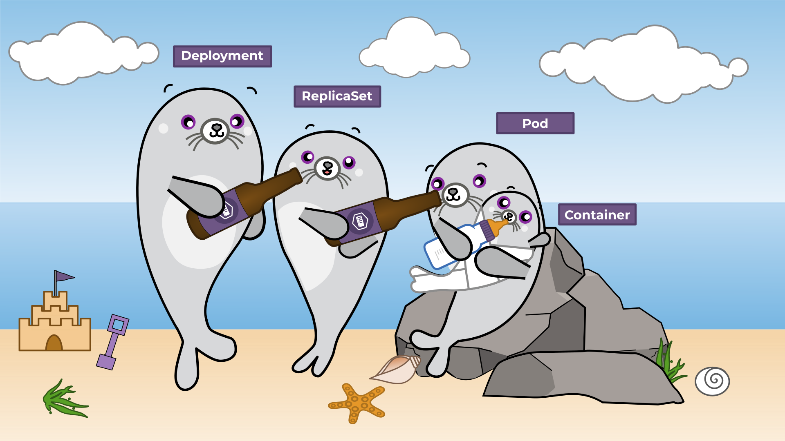
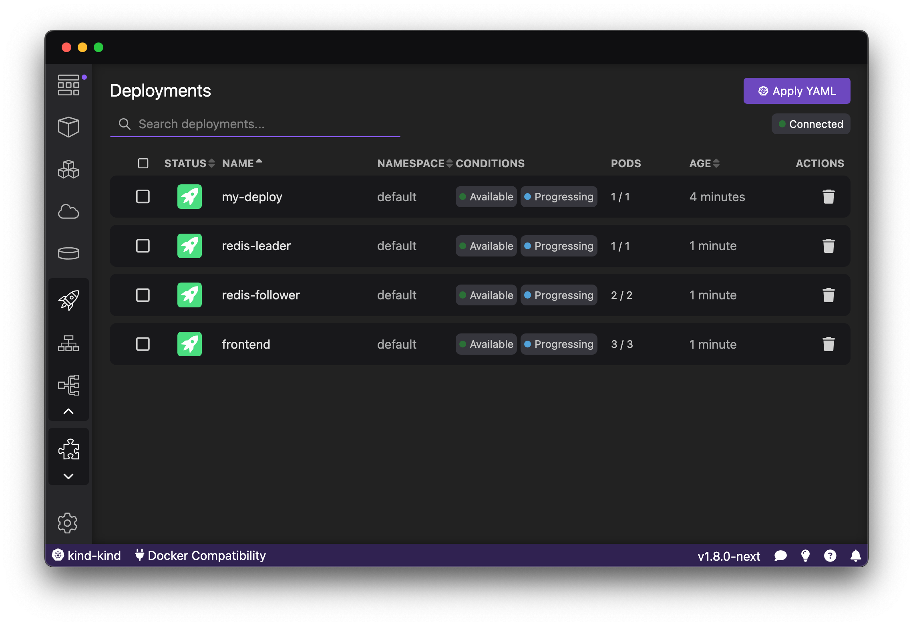
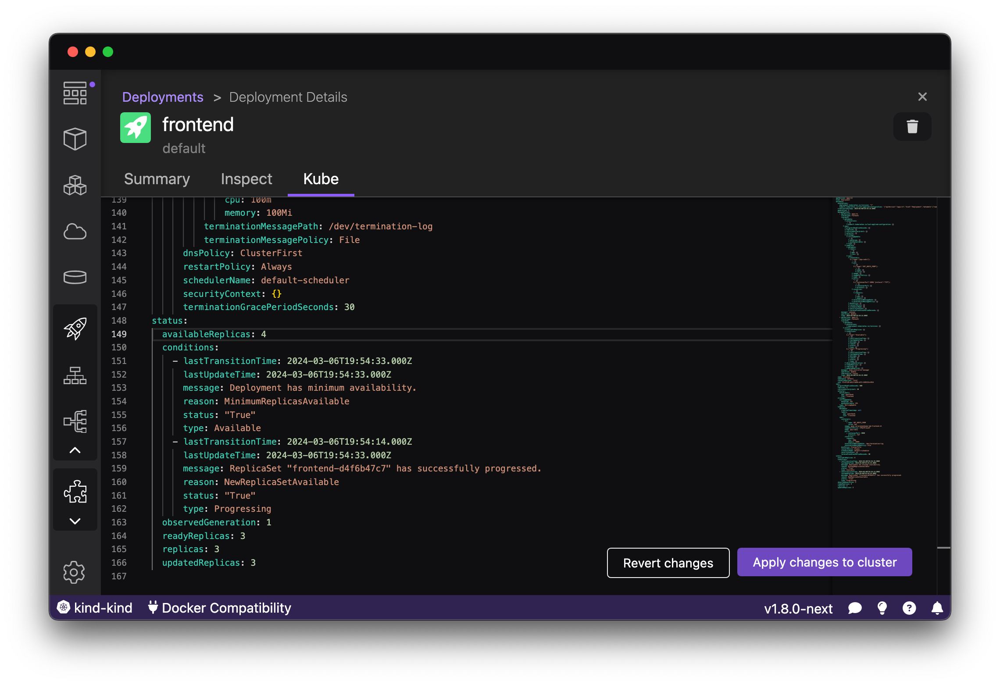
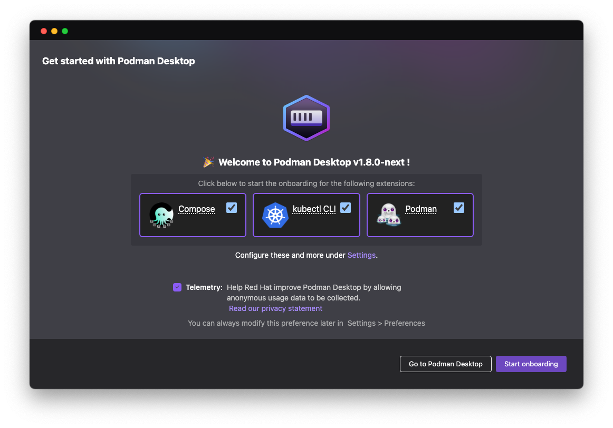

import ReactPlayer from 'react-player'

Podman Desktop 1.8 Release! 🎉

We've got a new release with a ton of seal appeal! This release introduces:

- **Podman 4.9.3**: [Podman 4.9.3](https://github.com/containers/podman/releases/tag/v4.9.3) is now included in both Windows and Mac installers.
- **Kubernetes Explorer**: Advanced UI and new tools for working with Kubernetes clusters.
- **Global Onboarding**: Configure and set up your environment without any hassle, with a set of guided workflows.
- **Learning Center**: Discover new use cases and capabilities for developers.
- **Extension API Improvements**: Another big update to the extension API enabling more goodness for 🦭 Podman Desktop's extensions.
- **Enhanced Builds, Pods List, and Troubleshooting Pages**: Build for different platforms, an upgraded pods view, and more.

Podman Desktop 1.8 is now available. [Click here to download it](/downloads)!

---

## Release Details

### Podman 4.9.3

🦭 Podman 4.9.3 includes key fixes for stability and reliability issues reported by our users - especially
if you are using Apple silicon architecture. If you've been floundering we highly recommend updating!

### Kubernetes Explorer

Progressively introduced in past releases as an experimental feature, we're ready to expand
our capabilities to help developers transition from containers to Kubernetes. In this release we
are introducing a new set of features that enable the developers to work with more Kubernetes
resources, offering more granular and interactive control over your applications.

Now available in 🦭 Podman Desktop is a new Kubernetes Explorer with the ability to work with
Deployments, Services, Ingresses, and Routes, in addition to the existing support for Pods.
For each of those resources, 🦭 Podman Desktop provides real-time information about the status of
resources on the cluster. From the top right of this overview page you can also click Apply YAML
to create or update resources on the cluster similar to 'kubectl apply -f', and see the current
connection status.

Just like with local containers or images, you can click for more
details on Summary, Inspect, and Kube (YAML) pages.

See a problem? You can edit and apply changes direct from the Kube tab.

🦭 Podman Desktop continues to bridge the gap and discrepancies to empower developers working
with containers with efficient workflows to target Kubernetes from their local workstation.
This is all in addition to some of the great features already available:

- Native Kubernetes support with Podman
- Podify - transition containers into Pods
- Setting up local Kubernetes environments with Minikube and Kind extensions
- Deploy to Kubernetes and push local image from Podman to a Kubernetes environments
- Managing Kubernetes contexts
- Connecting to remote Kubernetes clusters

### Global Onboarding

Configuring and setting up a local environment is now easier with the introduction of a new
wizard-based onboarding flow. In this flow developers can pick the different tools that they
need, and 🦭 Podman Desktop will walk them through the configuration and setup of each of these
tools.

The global onboarding flow allows developers to configure Podman, Compose, and kubectl
(needed for working with Kind and Minikube or remote Kubernetes environments). This makes
the transition to 🦭 Podman Desktop becomes simpler, as any needed dependencies are
automatically configured.

### Learning Center

In this release, we've added a Learning Center on the Dashboardm enabling developers to
discover, learn, and expand their knowledge on related topics to containerization. These
guides are handy and easily accessible, and cover topics from learning how to containerize
an existing application to discovering the latest features of 🦭 Podman Desktop and how to
best use them.

### Extension API Improvements

We continued spent a lot of time adding new extension API to give upcoming extensions
more capabilites and even better integration into 🦭 Podman Desktop:

- Split getMatchingPodmanEngine [#6160](https://github.com/containers/podman-desktop/pull/6160)
- Add HealthCheck parameter when creating container [#5981](https://github.com/containers/podman-desktop/pull/5981)
- Expose listPods to extensions [#5864](https://github.com/containers/podman-desktop/pull/5864)
- Labels for createPod [#5862](https://github.com/containers/podman-desktop/pull/5862)
- Allow to create containers within a pod [#5848](https://github.com/containers/podman-desktop/pull/5848)
- OpenPod should redirect to the pod's view [#5846](https://github.com/containers/podman-desktop/pull/5846)
- Enhance createContainer API with missing parameters [#6011](https://github.com/containers/podman-desktop/pull/6011)
- Allow extensions to use openDialog/saveDialog [#6009](https://github.com/containers/podman-desktop/pull/6009)
- Allow customized icons in contributed actions [#5995](https://github.com/containers/podman-desktop/pull/5995)
- Adding missing types [#6213](https://github.com/containers/podman-desktop/pull/6213)
- Allow to navigate to a specific webview from extensions [#5899](https://github.com/containers/podman-desktop/pull/5899)
- Expose stopPod and removePod to extensions [#5898](https://github.com/containers/podman-desktop/pull/5898)
- Use new API for open/save dialog [#6051](https://github.com/containers/podman-desktop/pull/6051), [#6050](https://github.com/containers/podman-desktop/pull/6050), [#6049](https://github.com/containers/podman-desktop/pull/6049)
- Extend Podman Desktop API Build Image parameters [#5882](https://github.com/containers/podman-desktop/pull/5882)
- Allow extension to stats container [#6211](https://github.com/containers/podman-desktop/issues/6211)

---

## Other Notable Enhancements

We've added over 40 features this release, here are some other highlights:

- Improve Podman Desktop update alert [#6068](https://github.com/containers/podman-desktop/pull/6068)
- Add gather & download logs button in troubleshooting [#5119](https://github.com/containers/podman-desktop/pull/5119)
- Enable podman machine for Linux [#5902](https://github.com/containers/podman-desktop/pull/5902)
- Multi-delete animation [#5717](https://github.com/containers/podman-desktop/pull/5717)
- Image deletion animation [#5709](https://github.com/containers/podman-desktop/pull/5709)
- Volume deletion animation [#5707](https://github.com/containers/podman-desktop/pull/5707)
- Open OpenShift routes [#5560](https://github.com/containers/podman-desktop/pull/5560)
- Add open created pod details [#4499](https://github.com/containers/podman-desktop/pull/4499)
- Use https when deploying to kubernetes cluster [#5824](https://github.com/containers/podman-desktop/pull/5824)
- Getting started carousel on dashboard page [#5142](https://github.com/containers/podman-desktop/pull/5142)
- Add confirmation dialog when deleting objects [#5445](https://github.com/containers/podman-desktop/pull/5445)

We've also made some significant progress on implementing light mode:

- Use theme colors for invert content [#6029](https://github.com/containers/podman-desktop/pull/6029)
- Use theme colors for secondary nav [#6028](https://github.com/containers/podman-desktop/pull/6028)
- Apply theme colors for global nav [#6027](https://github.com/containers/podman-desktop/pull/6027)
- Apply theme colors for the titlebar [#6025](https://github.com/containers/podman-desktop/pull/6025)
- Consistent close button [#6060](https://github.com/containers/podman-desktop/pull/6060)
- Use components in quickpick [#6057](https://github.com/containers/podman-desktop/pull/6057)
- Provide css colors to webviews [#5963](https://github.com/containers/podman-desktop/pull/5963)
- Publish colors to the style of the app [#5962](https://github.com/containers/podman-desktop/pull/5962)
- Allow extensions to contribute themes with set of colors [#5961](https://github.com/containers/podman-desktop/pull/5961)
- Store for colors [#5960](https://github.com/containers/podman-desktop/pull/5960)
- Include a color registry [#5958](https://github.com/containers/podman-desktop/pull/5958)
- Add utility method to get the value of the theme [#5947](https://github.com/containers/podman-desktop/pull/5947)
- Send event when operating system change the colors [#5946](https://github.com/containers/podman-desktop/pull/5946)
- Cleanup dark: prefix colors [#5944](https://github.com/containers/podman-desktop/pull/5944)
- Extract color palette to its own file [#5931](https://github.com/containers/podman-desktop/pull/5931)
- Input component [#5904](https://github.com/containers/podman-desktop/pull/5904)
- Input errors, use input component in run image [#5988](https://github.com/containers/podman-desktop/pull/5988)
- Use input when building image [#5986](https://github.com/containers/podman-desktop/pull/5986)
- Use input for proxy settings [#5943](https://github.com/containers/podman-desktop/pull/5943)
- Use input for registries [#5939](https://github.com/containers/podman-desktop/pull/5939)
- Use input when creating pod from containers [#5935](https://github.com/containers/podman-desktop/pull/5935)
- Use input component in extension pages [#5934](https://github.com/containers/podman-desktop/pull/5934)
- Use input in create volume [#5933](https://github.com/containers/podman-desktop/pull/5933)
- Use input when renaming image [#5964](https://github.com/containers/podman-desktop/pull/5964)
- Use checkbox component in deploy to kube [#6030](https://github.com/containers/podman-desktop/pull/6030)

---

## Notable Bug Fixes

We squashed a lot of bugs this release, including the following:

- Copy volume mounted when copying container to pod [#5640](https://github.com/containers/podman-desktop/pull/5640)
- Change order of "Create" button on Volumes and Containers list [#6092](https://github.com/containers/podman-desktop/pull/6092)
- Refresh onboarding item when context value gets updated (#4597) [#6173](https://github.com/containers/podman-desktop/pull/6173)
- Better log on informer connection error [#6158](https://github.com/containers/podman-desktop/pull/6158)
- Website: replace broken links [#6111](https://github.com/containers/podman-desktop/pull/6111)
- Center empty screens [#6077](https://github.com/containers/podman-desktop/pull/6077)
- Do not ask confirmation to open local folder/files [#5743](https://github.com/containers/podman-desktop/pull/5743)
- Force breadcrumbs to be vertically aligned [#5741](https://github.com/containers/podman-desktop/pull/5741)
- Long usernames in auth page [#5737](https://github.com/containers/podman-desktop/pull/5737)
- Message property used to update task name [#5731](https://github.com/containers/podman-desktop/pull/5731)
- Nav item UI fixes [#5886](https://github.com/containers/podman-desktop/pull/5886)
- Display back the icons of registries [#5843](https://github.com/containers/podman-desktop/pull/5843)
- Check route tls to use either http or https [#5825](https://github.com/containers/podman-desktop/pull/5825)
- White tooltips [#5887](https://github.com/containers/podman-desktop/pull/5887)
- Limit registry username column width [#5718](https://github.com/containers/podman-desktop/pull/5718)
- Remove docker compatibility warning & button on Linux [#5903](https://github.com/containers/podman-desktop/pull/5903)
- Image usage by containers [#5663](https://github.com/containers/podman-desktop/pull/5663)
- Current context should be changed/updated when deleting it [#5819](https://github.com/containers/podman-desktop/pull/5819)
- Do not collapse categories on sidebar [#5727](https://github.com/containers/podman-desktop/pull/5727)
- Make localhost a valid domain for env.openExternal calls [#5716](https://github.com/containers/podman-desktop/pull/5716)

---

## Documentation

Along with this new version of 🦭 Podman Desktop the documentation has had the following improvements:

- Container and image related methods of containerEngine api [#5891](https://github.com/containers/podman-desktop/pull/5891)
- Removed installing podman with openshift local [#6070](https://github.com/containers/podman-desktop/pull/6070)
- Document image checker provider API [#5813](https://github.com/containers/podman-desktop/pull/5813)
- Adding withProgress api docs [#5736](https://github.com/containers/podman-desktop/pull/5736)
- Added link to the troubleshooting page [#5734](https://github.com/containers/podman-desktop/pull/5734)
- Troubleshooting installation on macOS M1/M2/M3 [#5708](https://github.com/containers/podman-desktop/pull/5708)
- Volume deletion [#5707](https://github.com/containers/podman-desktop/pull/5707)
- Added _Accessing Podman from another WSL instance_ (config, verify) [#5706](https://github.com/containers/podman-desktop/pull/5706)
- Using typedoc to generate api documentation [#5705](https://github.com/containers/podman-desktop/pull/5705)

---

## Community Thank You

🎉 We’d like to say a big thank you to everyone who helped make 🦭 Podman Desktop even better. In this release we received pull requests from the following people:

- [Anders Björklund](https://github.com/afbjorklund) in [docs: linux no longer disabled](https://github.com/containers/podman-desktop/pull/6238), [fix: don't check default machine on Linux](https://github.com/containers/podman-desktop/pull/6161), [feat: show docker version](https://github.com/containers/podman-desktop/pull/6043), [docs: drop the word virtual from lima](https://github.com/containers/podman-desktop/pull/6003), [docs: document lima socket name prefs](https://github.com/containers/podman-desktop/pull/5984), [docs: split the lima custom config](https://github.com/containers/podman-desktop/pull/5983), [feat: show lima instance name in connection name](https://github.com/containers/podman-desktop/pull/5227), [feat: make it possible for lima to provide both](https://github.com/containers/podman-desktop/pull/4539)
- [Kenichi Kamiya](https://github.com/kachick) in [docs: fix missing podman command in WSL example](https://github.com/containers/podman-desktop/pull/6126)
- [Michael Prankl](https://github.com/eidottermihi) in [docs: fix instructions to edit registries.conf](https://github.com/containers/podman-desktop/pull/6122)
- [Cedric Clyburn](https://github.com/cedricclyburn) in [docs: blog post about devies award](https://github.com/containers/podman-desktop/pull/6078)
- [anon](https://github.com/Moortu) in [chore: Add windows instructions for emulating docker cli](https://github.com/containers/podman-desktop/pull/6066)
- [Thiago Mendes](https://github.com/trmendes) in [docs: Shorter sidebar category names](https://github.com/containers/podman-desktop/pull/5959), [fix: remove incorrect usage of component](https://github.com/containers/podman-desktop/pull/5822), [ci: use macos arm64 runners](https://github.com/containers/podman-desktop/pull/5795), [style: do not hide terminal when there are errors](https://github.com/containers/podman-desktop/pull/5710), [refactor: dialog box moving from 'no' to 'cancel'](https://github.com/containers/podman-desktop/pull/5702), [chore: add copy to clipboard button to resources page](https://github.com/containers/podman-desktop/pull/5687)
- [CARBONNEAUX Mathieu](https://github.com/mcarbonneaux) in [Remove http:// prefix when set proxy variable before exec](https://github.com/containers/podman-desktop/pull/5694)
- [Christophe Fergeau](https://github.com/cfergeau) in [doc: Fix 'podman-mac-help' typo](https://github.com/containers/podman-desktop/pull/5692)

---

## Final notes

### Fixed Issues

The complete list of issues fixed in this release is available [here](https://github.com/containers/podman-desktop/issues?q=is%3Aclosed+milestone%3A1.8.0).

### Where to Download

Get the latest release from the [Downloads](/downloads) section of the website and boost your development journey with Podman Desktop. Additionally, visit the [GitHub repository](https://github.com/containers/podman-desktop) and see how you can help us make Podman Desktop better.
