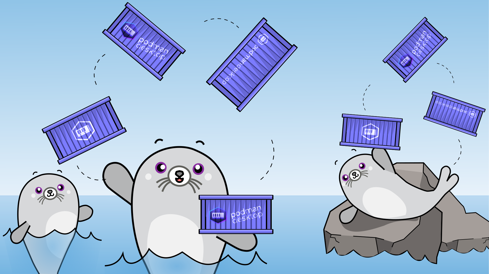
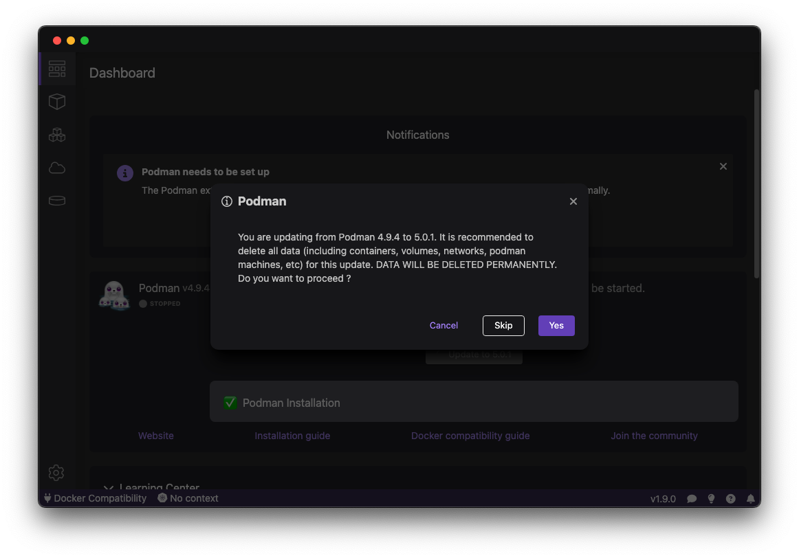
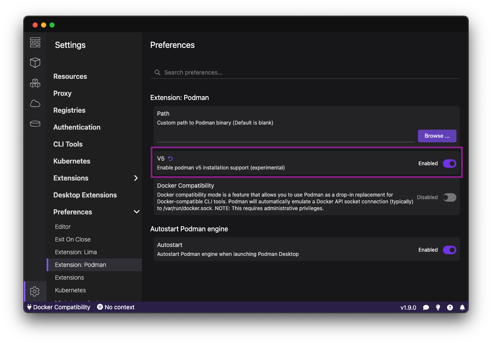
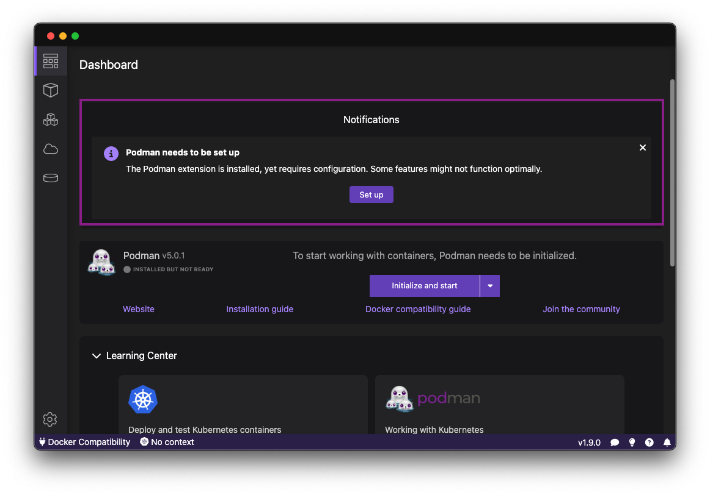
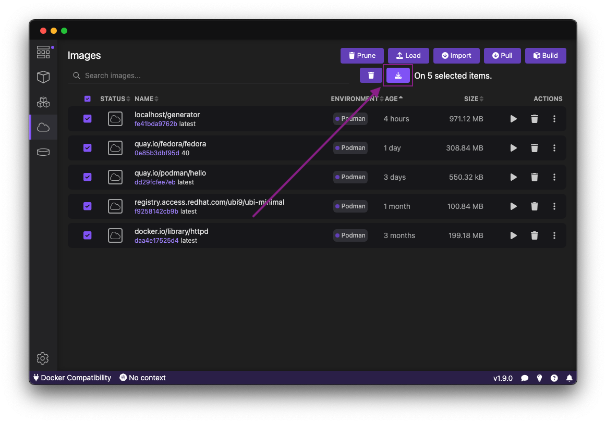
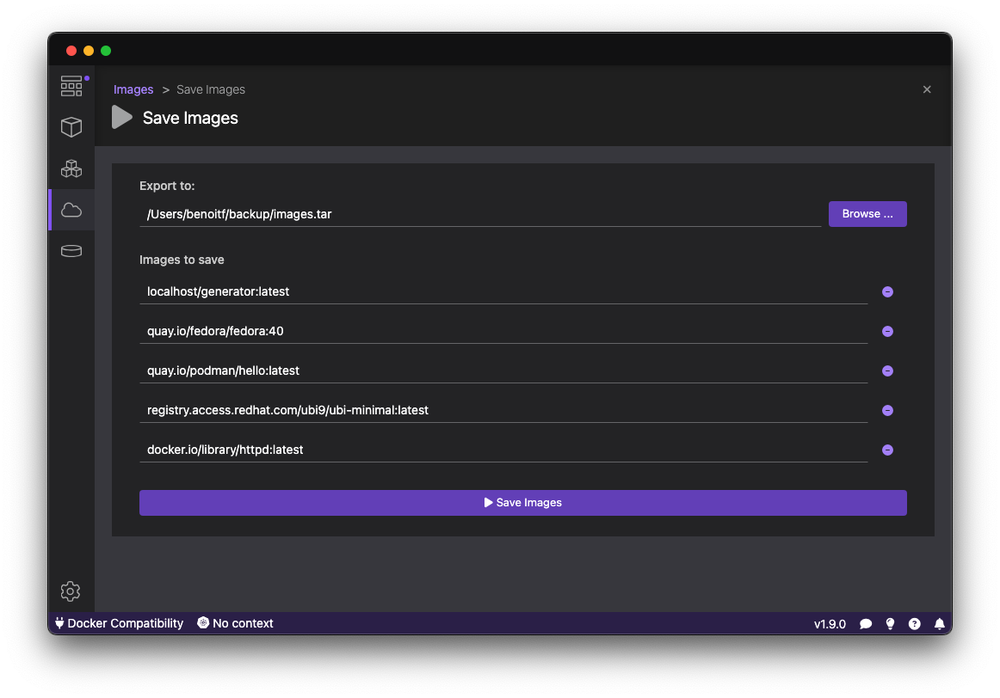
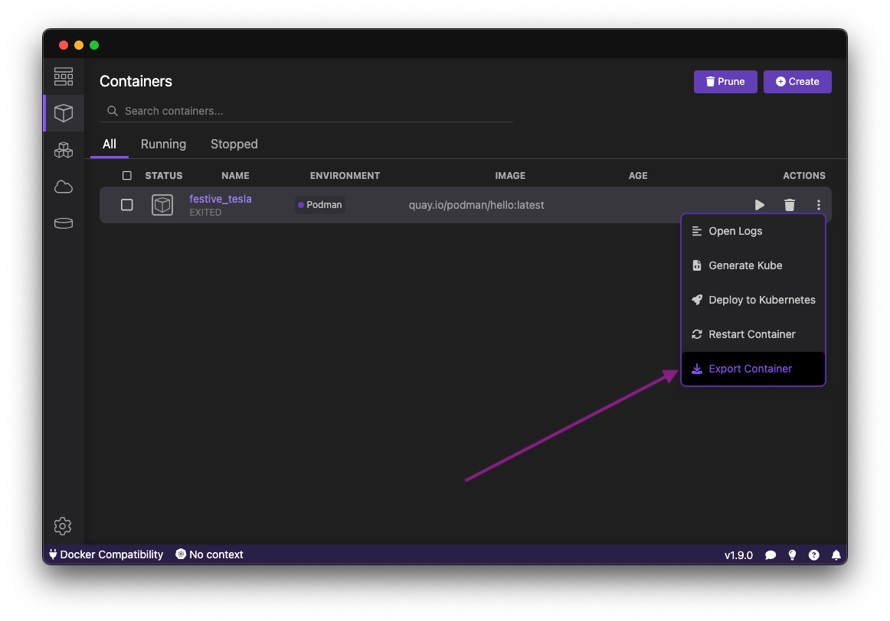
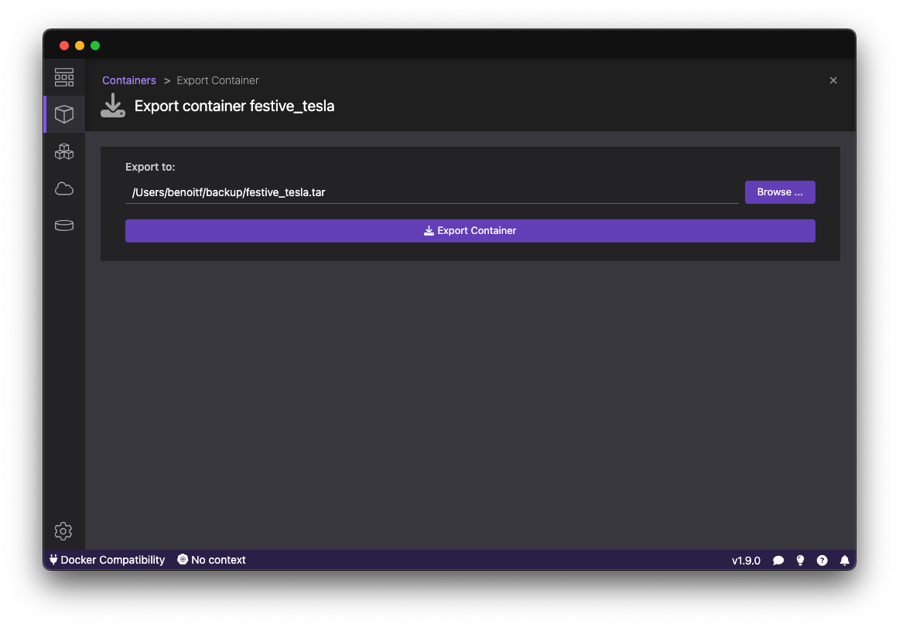
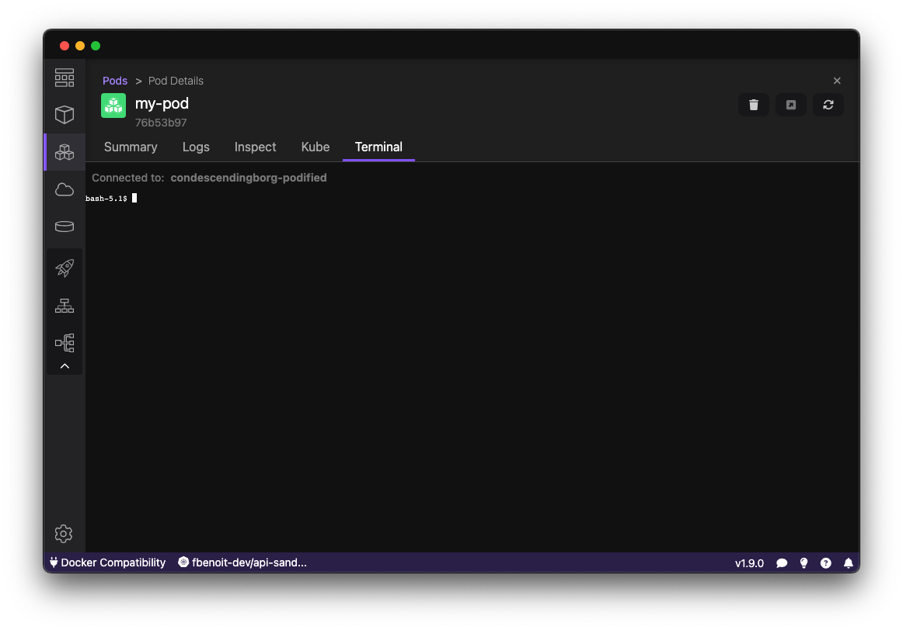

import ReactPlayer from 'react-player'

Podman Desktop 1.9 Release! 🎉

This release introduces: 🦭 a splash of innovation, a wave of excitement, and an ocean of possibilities!

- **Podman 5!** [Podman 5.0.1](https://github.com/containers/podman/releases/tag/v5.0.1) for new users (and as an experimental upgrade for 4.x users).
- **Podman 4.9.4**: [Podman 4.9.4](https://github.com/containers/podman/releases/tag/v4.9.4) is now included in both Windows and macOS installers.
- **Backup/Restore Images**: Save images or containers to tar archives and restore them.
- **Kubernetes Pods Terminal**: Connect to a terminal within Kubernetes pods.
- **Extension API Improvements**: Additional updates to the extension API used by 🦭 Podman Desktop's extensions.

Podman Desktop 1.9 is now available. [Click here to download it](/downloads)!

<!--truncate-->

---

## Release Details

### Podman v5 (5.0.1)

Podman version 5 is out! [see blog post introducing Podman v5](https://blog.podman.io/2024/03/podman-5-0-has-been-released/)

On macOS there are performance enhancements as Apple Hypervisor is used instead of QEMU for the Podman machine. Also expect better performance on the file sharing.

That said, Podman machine version 5 is introducing changes that are not compliant with podman machine version 4.

This is why we're rolling out Podman version 5 by default only to new users to improve the migration from Podman Desktop side.

For Podman version 4 users, Podman version 5 is accessible using an [experimental flag](#enabling-experimental-flag).

Moving to Podman v5 implies to optionally save images and then delete previous machines and create a new one.

#### Important steps before updating

Prioritize data backup by using the save feature in the `Image Lists` section. This feature allows you to back up your images and restore them once you have a new Podman machine.

When prompted to update, confirm to remove all existing data from your machines.

For more details on the save/load feature, refer to [the save/load images section of the release notes](#saveload-images-or-exportimport-containers).

#### Enabling experimental flag

Are you using Podman 4.x but eager to migrate? Enable the Podman `v5` experimental flag in `Settings > Preferences > Extension: Podman`.

This will make the Upgrade option available on the Dashboard.

#### Onboarding notification for Podman version 5

If you have previously installed Podman version 5 and Podman Desktop detects some invalid Podman machines, you'll see a notification on the dashboard to clean up old machines.

### Podman 4.9.4

If you want to stay on Podman v4.x, there is a new update for some bugs including a CVE/security issue.

### Save/Load Images or Export/Import Containers

Podman 5 is not able to read 4.x machines, so before updating you'll need to backup images that you need to keep. You don't need to backup images that are available on remote registries or transient.

#### Save/Load Images

🦭 Use Podman Desktop to save images and load them again.

Load images using the Load button from the image list.

#### Save/Load Containers

🦭 Export filesystem of containers and import them.

Import containers using the Load button from the image list.

**_NOTE:_** Exporting the filesystem of containers only exports the content of the filesystem. Importing will result in a container without any commands, so this might not be what you expect.
Please prioritize the usage of image saving/loading over container export/import.

### Terminal in Kubernetes Pods

In the previous release we introduced several new features in Kubernetes, but one notable addition was missing. With the 1.9 release, we're excited to announce that you can now connect to the terminal of a pod.

- Terminal Connectivity: Users can now establish a direct connection to the terminal of a pod, enhancing the management and troubleshooting capabilities within Kubernetes environments.
- Container Toggle: When a pod contains multiple containers, you can easily toggle between them to access the terminal of the desired container.

How to access to the Terminal:

Navigate to the pod details in Podman Desktop and select the "Terminal" Tab..

If the pod contains multiple containers, utilize the toggle feature to select the container whose terminal you wish to connect to.

Once connected, you can interact with the terminal to perform various tasks such as debugging, log monitoring, or executing commands within the container environment.

### Extension API Improvements

We continued spent a lot of time adding new extension API to give upcoming extensions
more capabilites and even better integration into 🦭 Podman Desktop:

- feat: add navigateToAuthentication method to navigation API [6603](https://github.com/containers/podman-desktop/pull/6603)
- feat: add secrets handling to extensionContext in extension api [6423](https://github.com/containers/podman-desktop/pull/6423)
- feat: add sign in button for auth providers w/ the only auth session request [6446](https://github.com/containers/podman-desktop/pull/6446)
- feat: support for webview reveal [6546](https://github.com/containers/podman-desktop/pull/6546)

Also we published a test framework to test extensions in separate repositories

- feat: publish ui components and test component as part of the release [6580](https://github.com/containers/podman-desktop/pull/6580)

More info on [https://github.com/containers/podman-desktop/blob/main/tests/playwright/README.md](https://github.com/containers/podman-desktop/blob/main/tests/playwright/README.md)

---

## Other Notable Enhancements

We've added over 20 features this release, here are some other highlights:

- feat: terminate wsl machines before removing conf files when fixing update [#6596](https://github.com/containers/podman-desktop/pull/6596)
- feat: update experimental v5 of podman to v5.0.1 [#6589](https://github.com/containers/podman-desktop/pull/6589)
- feat: detect podman v4 machines not compliant with the new format of v5 [#6570](https://github.com/containers/podman-desktop/pull/6570)
- feat: detect podman v4 qemu machines after update and delete them [#6565](https://github.com/containers/podman-desktop/pull/6565)
- feat: update to podman v4.9.4 [#6564](https://github.com/containers/podman-desktop/pull/6564)
- feat: default to podman v5 for new users [#6548](https://github.com/containers/podman-desktop/pull/6548)
- feat: import containers images [#6492](https://github.com/containers/podman-desktop/pull/6492)
- feat: open terminal in the running container [#5975](https://github.com/containers/podman-desktop/pull/5975)
- feat: add experimental flag to install podman v5 [#6476](https://github.com/containers/podman-desktop/pull/6476)
- feat: add export container [#6468](https://github.com/containers/podman-desktop/pull/6468)
- feat: allow to revive a Uri object when passing it frontend - backend [#6462](https://github.com/containers/podman-desktop/pull/6462)
- feat: add generic action to task [#6453](https://github.com/containers/podman-desktop/pull/6453)
- feat: add export container logic [#6452](https://github.com/containers/podman-desktop/pull/6452)
- feat: add bottomLeft and bottomRight options for Tooltip component [#6445](https://github.com/containers/podman-desktop/pull/6445)
- feat: add a safe storage registry [#6422](https://github.com/containers/podman-desktop/pull/6422)
- feat: allow to load images [#6540](https://github.com/containers/podman-desktop/pull/6540)
- feat: ask to wipe all data when migrating from podman v4 to v5 [#6539](https://github.com/containers/podman-desktop/pull/6539)
- feat: add loadImages logic [#6538](https://github.com/containers/podman-desktop/pull/6538)
- feat: prompt user to stop any running podman machine before updating [#6533](https://github.com/containers/podman-desktop/pull/6533)
- feat: allow to save images [#6530](https://github.com/containers/podman-desktop/pull/6530)
- feat: add saveImages logic [#6520](https://github.com/containers/podman-desktop/pull/6520)

---

## Notable Bug Fixes

We squashed a lot of bugs this release, including the following:

- fix: handle external installation of Podman when checking for updates [#6601](https://github.com/containers/podman-desktop/pull/6601)
- fix: invalid if clause for !isLinux [#6597](https://github.com/containers/podman-desktop/pull/6597)
- fix: allow to select files when wanting to import container tar images [#6591](https://github.com/containers/podman-desktop/pull/6591)
- fix: provides the tag names rather than id when saving images [#6588](https://github.com/containers/podman-desktop/pull/6588)
- fix: allow to select files when importing tar files [#6584](https://github.com/containers/podman-desktop/pull/6584)
- fix: inconsistent tab filtering behavior [#6572](https://github.com/containers/podman-desktop/pull/6572)
- fix: check if updates are available after a new podman machine is added/removed [#6558](https://github.com/containers/podman-desktop/pull/6558)
- fix: making CancellationTokenSource a class instead of an interface [#6557](https://github.com/containers/podman-desktop/pull/6557)
- fix: ensure machine list is up-to-date when running onboarding [#6512](https://github.com/containers/podman-desktop/pull/6512)
- fix: onboarding should be available after reloading an extension [#6510](https://github.com/containers/podman-desktop/pull/6510)
- fix: support more fa icons [#6499](https://github.com/containers/podman-desktop/pull/6499)
- fix: update e2e tests to fix CI failures [#6491](https://github.com/containers/podman-desktop/pull/6491)
- fix: update yarn.lock [#6474](https://github.com/containers/podman-desktop/pull/6474)
- fix: use expected component in the tests [#6424](https://github.com/containers/podman-desktop/pull/6424)
- fix: correct layout for openshift routes [#6398](https://github.com/containers/podman-desktop/pull/6398)
- fix: add playsinline to avoid full screen [#6395](https://github.com/containers/podman-desktop/pull/6395)
- fix: try to listen on all ipv4 interfaces AND 0.0.0.0 before to declare a port free [#6354](https://github.com/containers/podman-desktop/pull/6354)

---

## Documentation

Along with this new version of 🦭 Podman Desktop the documentation has had the following improvements:

- docs: single page for _In a restricted environment_ [#5756](https://github.com/containers/podman-desktop/pull/5756)
- docs: updated _Installing Podman Desktop and Podman on Windows_ (compact version) [#5751](https://github.com/containers/podman-desktop/pull/5751)

---

## Community Thank You

🎉 We’d like to say a big thank you to everyone who helped make 🦭 Podman Desktop even better. In this release we received pull requests from the following people:

- [Hlib Haranin](https://github.com/GLEF1X) in [fix: inconsistent tab filtering behavior](https://github.com/containers/podman-desktop/pull/6572), [chore(palette): make command titles capitalization consistent](https://github.com/containers/podman-desktop/pull/6574), [chore(no-engine-screen): add guidance for engine configuration](https://github.com/containers/podman-desktop/pull/6575), [chore(image-list): improve button tooltips](https://github.com/containers/podman-desktop/pull/6586)

---

## Final notes

### Fixed Issues

The complete list of issues fixed in this release is available [here](https://github.com/containers/podman-desktop/issues?q=is%3Aclosed+milestone%3A1.9.0).

### Where to Download

Get the latest release from the [Downloads](/downloads) section of the website and boost your development journey with Podman Desktop. Additionally, visit the [GitHub repository](https://github.com/containers/podman-desktop) and see how you can help us make Podman Desktop better.
