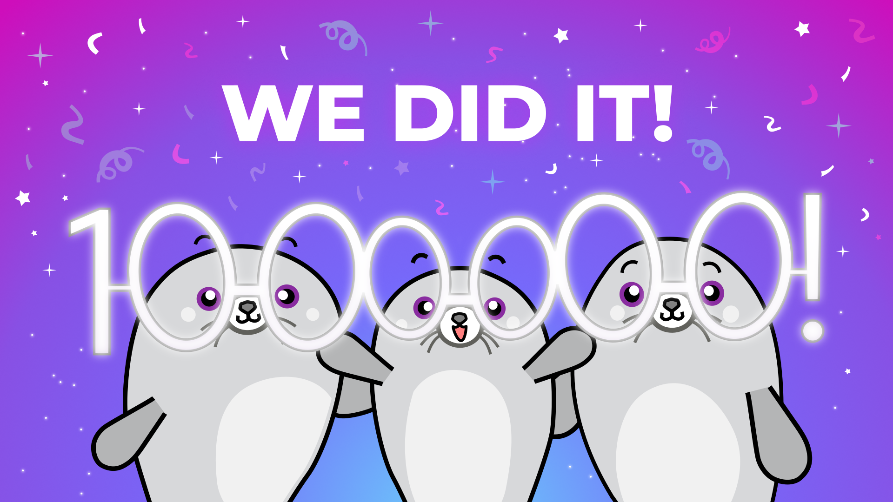
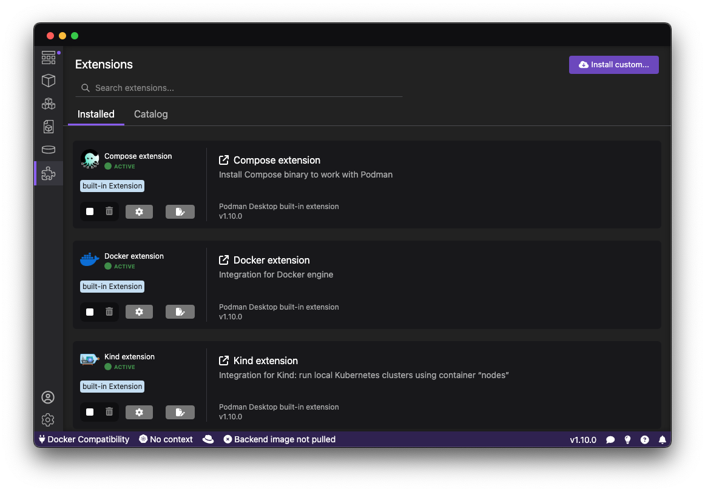

import ReactPlayer from 'react-player'

Podman Desktop 1.10 Release! 🎉

This release introduces:

- **1 Million Downloads!**: Wow, we made it!
- **Extension Catalog**: Redesigned extensions page and catalog to get the most out of Podman Desktop.
- **Podman 5** [Podman 5.0.2](https://github.com/containers/podman/releases/tag/v5.0.2) now recommended for all users.
- **Extension API Improvements**: Additional updates to the extension API used by 🦭 Podman Desktop's extensions.

Podman Desktop 1.10 is now available. [Click here to download it](/downloads)!

<!--truncate-->

---

## Release Details

### 1 Million Downloads! 🎉

We've hit over 1 million downloads of Podman Desktop since we started! A big thank you 🙏 to everyone
who has helped get us to this number - especially those who have opened issues or PRs and contributed
to this success!

Looking forward to the next million! 🚀

### Extension Catalog

To make it easier to access extensions we added an item to the main navigation and completely revamped
the Extensions page. You can now see and control all your Podman Desktop and Docker Desktop extensions
in a single place, and if you want more details just click on an extension to see the readme.

With the growing number of extensions available we've also introduced a catalog to make it easy to find
and install them. Check this page regularly as we hear there are some exciting new extensions sailing in!

### Podman v5 (5.0.2)

Now that we've had some experience and time to test our migration tools, we're glad to make Podman v5 a
recommended upgrade for all users. Podman Desktop will help ensure you don't lose any data during the
migration, and macOS users in particular will enjoy the performance enhancements of
moving to Apple Hypervisor.

In case you missed it, the blog announcement for 🦭 Podman version 5 is [here](https://blog.podman.io/2024/03/podman-5-0-has-been-released/).

### Extension API Improvements

We added support for manifests (multi-arch images) to the extension API to give upcoming extensions
more capabilites and even better integration into 🦭 Podman Desktop:

- feat: add inspectManifest API endpoint [#6812](https://github.com/containers/podman-desktop/pull/6812)
- feat: add createManifest API [#6630](https://github.com/containers/podman-desktop/pull/6630)

---

## Other Notable Enhancements

We've added lots of features this release, here are some other highlights:

- feat: add multi-arch building / manifest creation [#6792](https://github.com/containers/podman-desktop/pull/6792)
- feat: add quick install of extensions providing authentication [#6936](https://github.com/containers/podman-desktop/pull/6936)
- feat: add alias for registry entries [#6839](https://github.com/containers/podman-desktop/pull/6839)
- feat: make recommendation have publishDate property [#6912](https://github.com/containers/podman-desktop/pull/6912)
- feat: suggest extensions if building or pulling from some registries report errors [#6891](https://github.com/containers/podman-desktop/pull/6891)
- feat: switch to using libpodapi for listImages [#6736](https://github.com/containers/podman-desktop/pull/6736)
- feat: add navigateTo resources and edit container connection [#6733](https://github.com/containers/podman-desktop/pull/6733)
- feat: adding dashboard extension banner [#6708](https://github.com/containers/podman-desktop/pull/6708)
- feat: adding internal logic to manage recommended extensions based on featured extensions [#6681](https://github.com/containers/podman-desktop/pull/6681)

---

## Notable Bug Fixes

We squashed a lot of bugs this release, including the following:

- fix: default to rootful mode if unspecified [#6968](https://github.com/containers/podman-desktop/pull/6968)
- fix: boolean values should be true and not 'on' using forms [#6967](https://github.com/containers/podman-desktop/pull/6967)
- fix: handle deletion of all Docker Desktop extensions [#6964](https://github.com/containers/podman-desktop/pull/6964)
- fix: skip existing installed extensions when installing a pack [#6914](https://github.com/containers/podman-desktop/pull/6914)
- fix: hide cpu, memory, size sliders on WSL [#6878](https://github.com/containers/podman-desktop/pull/6878)
- fix: container details image link [#6805](https://github.com/containers/podman-desktop/pull/6805)
- fix: provider card layout [#6797](https://github.com/containers/podman-desktop/pull/6797)
- fix: kubectl-cli update error [#6759](https://github.com/containers/podman-desktop/pull/6759)
- fix: make flatpak metadata compliant with flathub [#6635](https://github.com/containers/podman-desktop/pull/6635)
- fix: airgap mode and default for podman v5 [#6633](https://github.com/containers/podman-desktop/pull/6633)
- fix: hide restart action for kubernetes pods [#6620](https://github.com/containers/podman-desktop/pull/6620)

---

## Documentation

Along with this new version of 🦭 Podman Desktop the documentation has had the following improvement:

- docs: add compose troubleshooting doc related to authentication [#6928](https://github.com/containers/podman-desktop/pull/6928)

---

## Community Thank You

🎉 We’d like to say a big thank you to everyone who helped make 🦭 Podman Desktop even better. In this release we received pull requests from the following people:

- [Norman Dankert](https://github.com/totkeks) in [feat: open dashboard with left click on tray icon on Windows](https://github.com/containers/podman-desktop/pull/6750)
- [Tim Heuer](https://github.com/timheuer) in [docs: changes to writing an extension](https://github.com/containers/podman-desktop/pull/6715)
- [Hlib Haranin](https://github.com/GLEF1X) in [feat(webview-telemetry): make telemetry for webviews more detailed](https://github.com/containers/podman-desktop/pull/6692) and [feat(container-detail): make image name a link that redirects to image detail page](https://github.com/containers/podman-desktop/pull/6628)
- [tmancill](https://github.com/tmancill) in [docs: Update pushing-an-image-to-kind.md - add info re: crictl](https://github.com/containers/podman-desktop/pull/6666)

---

## Final notes

### Fixed Issues

The complete list of issues fixed in this release is available [here](https://github.com/containers/podman-desktop/issues?q=is%3Aclosed+milestone%3A1.10.0).

### Where to Download

Get the latest release from the [Downloads](/downloads) section of the website and boost your development journey with Podman Desktop. Additionally, visit the [GitHub repository](https://github.com/containers/podman-desktop) and see how you can help us make Podman Desktop better.
