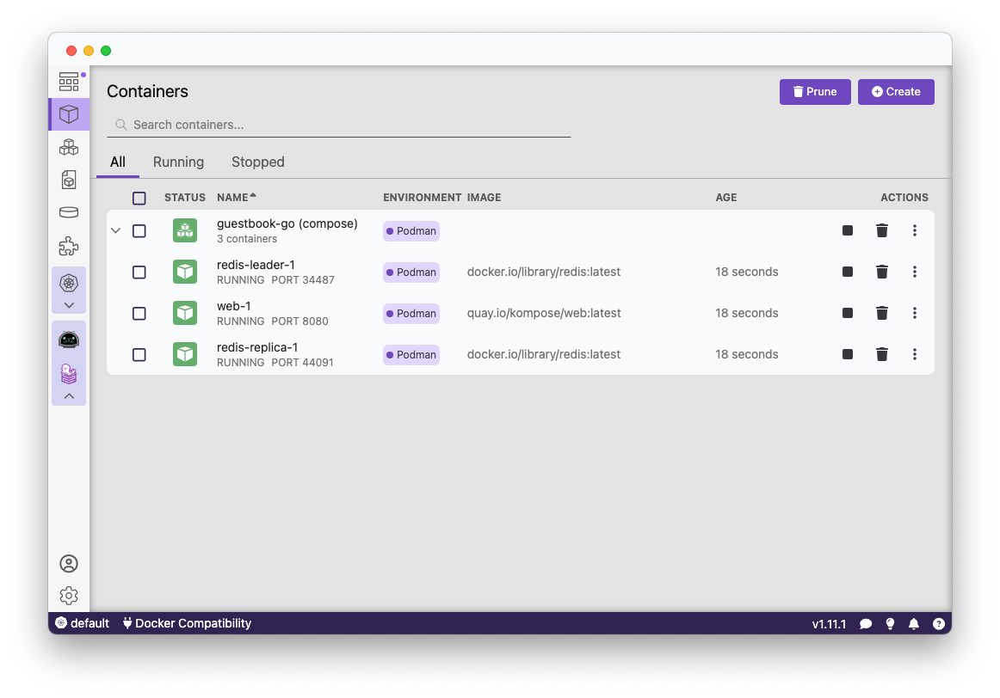
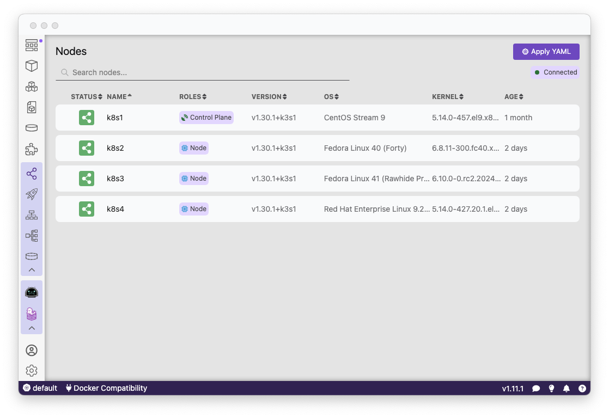
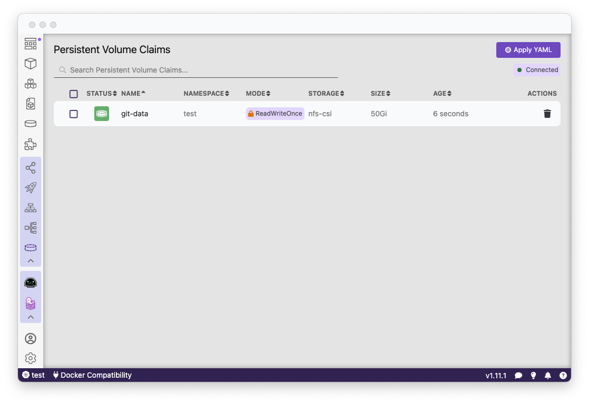

import ReactPlayer from 'react-player'

Podman Desktop 1.11 Release! 🎉

This release introduces:

- **Experimental light mode!**: Our most-requested feature is here! Try out our new experimental light mode in the settings.
- **Rosetta support for Apple Silicon**: Build AMD64 binaries near the same speed as ARM64 binaries.
- **Kubernetes improvements**: Check out our new Node and Volume pages for Kubernetes.
- **Improved UI**: In addition to our light mode, you'll notice updates to our container listing page.
- **Increased manifest support**: Images built as a manifest are now grouped together.

Podman Desktop 1.11 is now available. [Click here to download it](/downloads)!

<!--truncate-->

---

## Release Details

### Experimental Light Mode 💡

We're excited to announce the arrival of our most-requested feature: light mode! You can now enjoy a brighter interface by toggling the light mode option in the **<icon icon="fa-solid fa-cog" size="lg" />Settings > Preferences** section. Thank you for your patience as we continue to implement light mode for better accessibility! Please note, this feature is currently experimental as we continue to optimize the rest of Podman Desktop for this new mode.

### macOS Rosetta Support for Apple Silicon

Podman Desktop 1.11 proudly introduces support for macOS Rosetta, facilitating seamless integration with Apple Silicon. This update, part of Podman 5.1, allows users to enable or disable Rosetta support directly through the Podman Settings. With this enhancement, running AMD64 image builds or containers achieves speeds that are nearly identical to those experienced on ARM64 architectures. For more details on the implementation, visit the [GitHub podman pull request](https://github.com/containers/podman/pull/21670).

### Kubernetes Enhancements

In our latest release, we've enhanced Kubernetes functionality by adding node and volume listings. This update aims to improve your Kubernetes management experience within Podman Desktop.

### User Interface Improvements

Take a moment to appreciate the upgraded user interface of Podman Desktop. You'll find that the container listing section, among others, has received significant enhancements, elevating your overall user experience.

### Enhanced Manifest Support

We've made strides in how we handle manifest images. Multi-arch images are now grouped under the manifest, simplifying the process and enhancing efficiency.

---

## Other Notable Enhancements

We've added lots of features this release, here are some other highlights:

- feat(PreferenceResource): adding light theme support for some preferences page by @axel7083 in [#7107](https://github.com/containers/podman-desktop/pull/7107)
- feat: extensions should stay disabled after restart by @deboer-tim in [#7085](https://github.com/containers/podman-desktop/pull/7085)
- feat: allow to select a folder using the fileComponent by @lstocchi in [#7135](https://github.com/containers/podman-desktop/pull/7135)
- feat: update to podman v5.0.3 by @benoitf in [#7173](https://github.com/containers/podman-desktop/pull/7173)
- feat: migrate MessageBox to modal component by @axel7083 in [#7172](https://github.com/containers/podman-desktop/pull/7172)
- feat: add tip slot to customize tip content by @lstocchi in [#7150](https://github.com/containers/podman-desktop/pull/7150)
- feat(UI): migrate DropdownMenu component by @axel7083 in [#7233](https://github.com/containers/podman-desktop/pull/7233)
- feat: add build arguments to build page by @cdrage in [#7253](https://github.com/containers/podman-desktop/pull/7253)
- feat(SettingsNavItem): adding icon property by @axel7083 in [#7307](https://github.com/containers/podman-desktop/pull/7307)
- feat: create task when updating Podman Desktop by @benoitf in [#7286](https://github.com/containers/podman-desktop/pull/7286)
- feat: add node listing to Kubernetes section by @cdrage in [#7347](https://github.com/containers/podman-desktop/pull/7347)
- feat: container page table component by @deboer-tim in [#7424](https://github.com/containers/podman-desktop/pull/7424)
- feat: handle dir creation during fs watch by @feloy in [#7573](https://github.com/containers/podman-desktop/pull/7573)
- feat: uses TableColumnDuration for container list table by @axel7083 in [#7725](https://github.com/containers/podman-desktop/pull/7725)
- feat: request confirmation to allow sign in requested from extension by @dgolovin in [#7443](https://github.com/containers/podman-desktop/pull/7443)
- feat: add volumes (PVC) to kubernetes by @cdrage in [#7640](https://github.com/containers/podman-desktop/pull/7640)
- feat: add rosetta support by @cdrage in [#7540](https://github.com/containers/podman-desktop/pull/7540)
- feat: adds images under manifest by @cdrage in [#7552](https://github.com/containers/podman-desktop/pull/7552)
- feat: show manifests in image list by @cdrage in [#7227](https://github.com/containers/podman-desktop/pull/7227)
- feat: show node and namespace information for k8s pods by @cdrage in [#7684](https://github.com/containers/podman-desktop/pull/7684)
- feat: allow extensions to expose their own API by @benoitf in [#7384](https://github.com/containers/podman-desktop/pull/7384)
- feat(QuickPickInput): using modal component by @axel7083 in [#7180](https://github.com/containers/podman-desktop/pull/7180)
- feat: update podman 5.0.3 to 5.1.1 by @dgolovin in [#7433](https://github.com/containers/podman-desktop/pull/7433)

---

## Notable Bug Fixes

- fix(UI): resource page link to extension page by @axel7083 in [#6986](https://github.com/containers/podman-desktop/pull/6986)
- fix: update extension link and text on empty screen by @deboer-tim in [#7005](https://github.com/containers/podman-desktop/pull/7005)
- fix: the Image.Id should contain sha256: prefix when listing image Id by @benoitf in [#7009](https://github.com/containers/podman-desktop/pull/7009)
- fix: fix dashboard UI by @lstocchi in [#7006](https://github.com/containers/podman-desktop/pull/7006)
- fix: add suggestion when WSL seems to require a reboot by @lstocchi in [#7007](https://github.com/containers/podman-desktop/pull/7007)
- fix(LoadingIconButton): consider failed state by @axel7083 in [#6997](https://github.com/containers/podman-desktop/pull/6997)
- fix: use podman machine inspect to know if machine is rootful by @benoitf in [#7024](https://github.com/containers/podman-desktop/pull/7024)
- fix: make markdown TOC links clickable by @benoitf in [#7010](https://github.com/containers/podman-desktop/pull/7010)
- fix: increasing default timeout for extension activation by @axel7083 in [#7053](https://github.com/containers/podman-desktop/pull/7053)
- fix: show description link on preflight checks on dashboard by @lstocchi in [#7056](https://github.com/containers/podman-desktop/pull/7056)
- fix: edit button should be visible during started and stopped by @benoitf in [#7063](https://github.com/containers/podman-desktop/pull/7063)
- fix: add tests for PreflightChecks by @lstocchi in [#7069](https://github.com/containers/podman-desktop/pull/7069)
- fix(Button): remove unused `hidden` property by @axel7083 in [#7092](https://github.com/containers/podman-desktop/pull/7092)
- fix: flaky test port availability by @axel7083 in [#7110](https://github.com/containers/podman-desktop/pull/7110)
- fix: reset initialize and start mode after starting provider by @lstocchi in [#7115](https://github.com/containers/podman-desktop/pull/7115)
- fix: stop informer not more valid and handle similar contexts by @lstocchi in [#6934](https://github.com/containers/podman-desktop/pull/6934)
- fix: custom extension install modal buttons by @axel7083 in [#7067](https://github.com/containers/podman-desktop/pull/7067)
- fix(tests): adding label to avoid duplicates by @axel7083 in [#7160](https://github.com/containers/podman-desktop/pull/7160)
- fix: provider card UI on dashboard by @lstocchi in [#7082](https://github.com/containers/podman-desktop/pull/7082)
- fix(extension-loader): cleanup resource on extension error by @axel7083 in [#7228](https://github.com/containers/podman-desktop/pull/7228)
- fix: remove tinro from Tab and ui by @lstocchi in [#7288](https://github.com/containers/podman-desktop/pull/7288)
- fix: remove tinro dependency from SettingsNavItem component by @axel7083 in [#7280](https://github.com/containers/podman-desktop/pull/7280)
- fix: button should have spinner when inProgress is enable by @axel7083 in [#7259](https://github.com/containers/podman-desktop/pull/7259)
- fix: table child selection by @deboer-tim in [#7555](https://github.com/containers/podman-desktop/pull/7555)
- fix: close watcher when FileSystemWatcher is disposed by @feloy in [#7503](https://github.com/containers/podman-desktop/pull/7503)
- fix: table properly support undefined value result from rendermapping by @axel7083 in [#7723](https://github.com/containers/podman-desktop/pull/7723)
- fix(UI): formpage missing content shadow by @axel7083 in [#7733](https://github.com/containers/podman-desktop/pull/7733)

---

## Community Thank You

🎉 We’d like to say a big thank you to everyone who helped make 🦭 Podman Desktop even better. In this release we received pull requests from the following new people:

- [Jitse](https://github.com/jitseklomp) in [chore: ignore /kind in .gitignore](https://github.com/containers/podman-desktop/pull/7631)
- [Adrián Lorenzo](https://github.com/adrianriobo) in [chore: Manage EnableNodeCliInspectArguments Fuse Enablement based on ENV: ELECTRON_ENABLE_INSPECT](https://github.com/containers/podman-desktop/pull/7128)

---

## Final Notes

### Fixed Issues

The complete list of issues fixed in this release is available [here](https://github.com/containers/podman-desktop/issues?q=is%3Aclosed+milestone%3A1.11.0).

### Where to Download

Get the latest release from the [Downloads](/downloads) section of the website and boost your development journey with Podman Desktop. Additionally, visit the [GitHub repository](https://github.com/containers/podman-desktop) and see how you can help us make Podman Desktop better.
