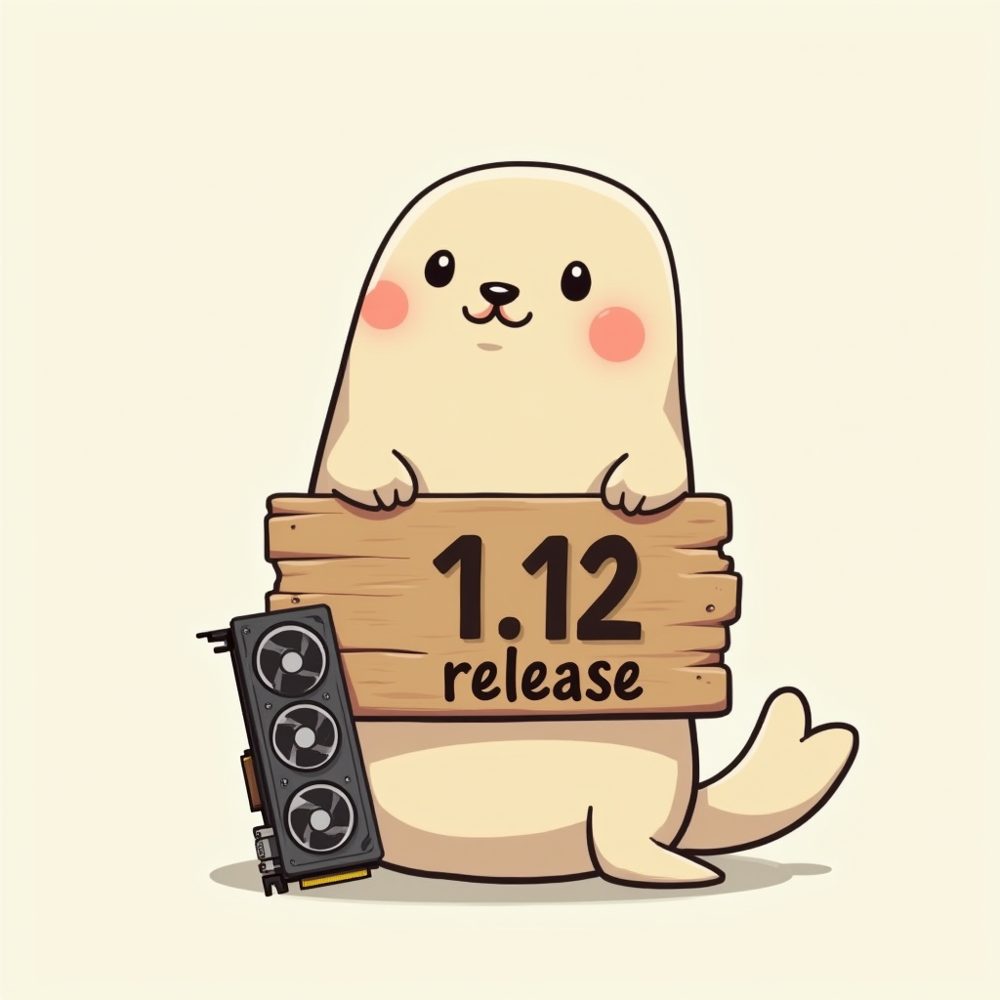
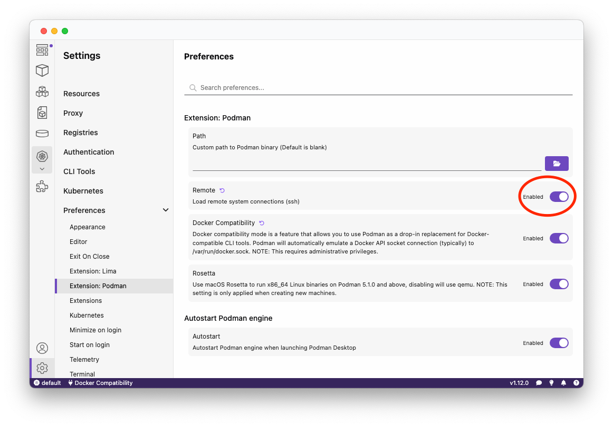
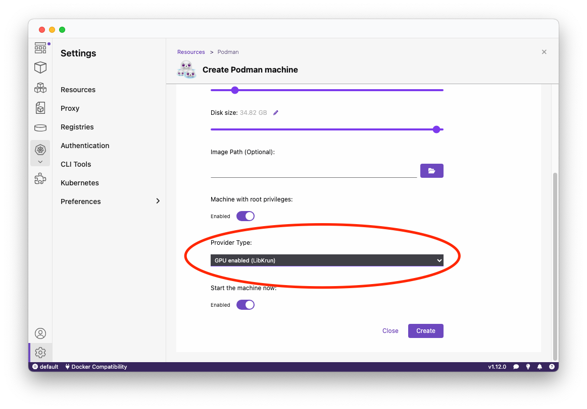
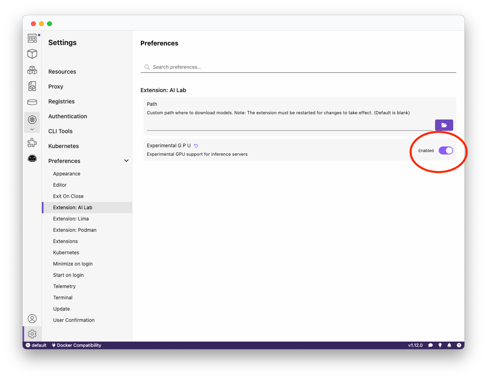
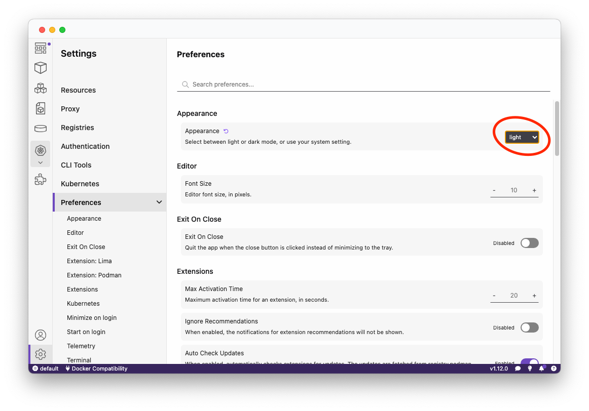
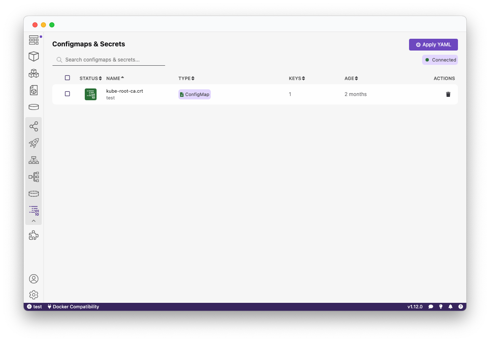

import ReactPlayer from 'react-player'

Podman Desktop 1.12 Release! 🎉



Podman Desktop 1.12 is now available. [Click here to download it](/downloads)!

This release includes:

- **Podman remote**: We now support remote Podman setups! Manage your remote Podman machines all within the UI.
- **macOS GPU support**: Container GPU access on macOS is now available. [`libkrun`](https://github.com/containers/libkrun) is now a selectable provider type to allow GPU passthrough enablement.
- **Windows GPU support**: Want to try out Windows GPU support too? Podman already supports it, but we are now showcasing it in our [AI Lab extension](https://podman-desktop.io/extensions/ai-lab)
- **Podman 5.2.0**: This new version of Podman provides GPU access for macOS, as well as a host of [new features](https://github.com/containers/podman/releases/tag/v5.2.0).
- **Light mode out of experimental**: Our light mode has been well-received, and we have now marked it as non-experimental! Enjoy the new theme.
- **Kubernetes features**: ConfigMaps, Secrets and multi-file Kubernetes YAML applying have now been added to our Kubernetes dashboard.
- **Improved font consistency**: You'll notice a big difference in consistency this release, as we updated all font sizes throughout Podman Desktop.

<!--truncate-->

## Release Details

### Podman remote

We now support remote Podman sessions! Use Podman Desktop to interact with remote instances over SSH. This allows both container and image management.

You can enable this in the **Preferences** section of Podman Desktop:



To set up access to a remote machine, follow the official [Podman remote-client tutorial](https://github.com/containers/podman/blob/main/docs/tutorials/remote_client.md).

### macOS GPU support

GPU support is now available for macOS users!

This seamless setup can be enabled during Podman Machine creation by selecting the provider type:



After enablement, you can test that the GPU has been supported by running a custom container with `--device /dev/dri` passed through:

```sh
$ podman run --rm -it --device /dev/dri --name gpu-info quay.io/slopezpa/fedora-vgpu vulkaninfo | grep "GPU"
```

Which will output information regarding your GPU:

```sh

		GPU id = 0 (Virtio-GPU Venus (Apple M1 Pro))
		GPU id = 1 (llvmpipe (LLVM 17.0.6, 128 bits))
GPU0:
	deviceType        = PHYSICAL_DEVICE_TYPE_INTEGRATED_GPU
	deviceName        = Virtio-GPU Venus (Apple M1 Pro)
GPU1:
```

Stay tuned as we continue to improve and write documentation on GPU support.

The most practical way to try these new features out is by installing [AI Lab (>1.2.3)](https://podman-desktop.io/extensions/ai-lab) and seeing the improved speed.

This can be done by following the below steps:

1. **Update to the latest Podman AI Lab extension (v1.2.3)** from the Extensions Catalog on Podman Desktop.
2. Create a new Podman Machine with `libkrun` enabled (see above instructions).
3. Enable GPU support within Podman AI Lab extension:



4. Start an inference server / playground environment and enjoy the benefits of accelerated GPU support!

### Windows GPU support

Windows GPU support has been integrated into Podman for a while, however our associated extensions have now been utilizing this great feature! Such as in [AI Lab](https://podman-desktop.io/extensions/ai-lab).

To showcase this awesome feature, this can be done by following the below steps:

1. **Update to the latest Podman AI Lab extension** from the Extensions Catalog on Podman Desktop.
2. Create a Podman Machine with WSL enabled.
3. Enable GPU support within the Podman AI Lab Extension:


4. Start an inference server / playground environment and enjoy the benefits of accelerated GPU support!

### Light mode out of experimental

We've made excellent progress in light mode and we have now marked it out of non-experimental! If you have not already tried it yet, this can be enabled within the interface here:



### Kubernetes features

With this release, you can now view ConfigMaps as well as Secrets:



You also have the ability to now select multiple files when applying your Kubernetes YAML.

---

## Community Thank You

🎉 We’d like to say a big thank you to everyone who helped make 🦭 Podman Desktop even better. In this release we received pull requests from the following new people:

- [@myfear](https://github.com/myfear) in [fix(docs): remove all linter errors](https://github.com/containers/podman-desktop/pull/7862)
- [@danivilla9](https://github.com/danivilla9) in [test: added start/stop/delete/prune multiple containers from the container list test cases](https://github.com/containers/podman-desktop/pull/7962)
- [@BinaryWizard904](https://github.com/BinaryWizard904) in [Add arm64 installer to publish-to-winget.yaml](https://github.com/containers/podman-desktop/pull/8173)
- [@s-en-o](https://github.com/s-en-o) in [test: perform stop if not stopped](https://github.com/containers/podman-desktop/pull/8350)

---

## Final Notes

### Fixed Issues

The complete list of issues fixed in this release is available [here](https://github.com/containers/podman-desktop/issues?q=is%3Aclosed+milestone%3A1.12.0).

### Where to Download

Get the latest release from the [Downloads](/downloads) section of the website and boost your development journey with Podman Desktop. Additionally, visit the [GitHub repository](https://github.com/containers/podman-desktop) and see how you can help us make Podman Desktop better.

---

## Detailed Release Changelog

### authentication 🔑

- fix: show sign out request when signing out from active session by @dgolovin in [#8005](https://github.com/containers/podman-desktop/pull/8005)

### ci 🔁

- chore(ci): exclude playwright raw traces from archived artifacts by @odockal in [#7863](https://github.com/containers/podman-desktop/pull/7863)
- chore(ci): include junit file path to be in test artifacts by @odockal in [#7859](https://github.com/containers/podman-desktop/pull/7859)
- chore(test): better handle for podman machine wait by @cbr7 in [#7957](https://github.com/containers/podman-desktop/pull/7957)
- chore(test): fix locator by @cbr7 in [#8022](https://github.com/containers/podman-desktop/pull/8022)
- chore(test): increase robustness for e2e test by @cbr7 in [#8327](https://github.com/containers/podman-desktop/pull/8327)
- chore(test): update locator for dialog by @cbr7 in [#8027](https://github.com/containers/podman-desktop/pull/8027)
- chore(tests): delete traces when not needed by @cbr7 in [#7874](https://github.com/containers/podman-desktop/pull/7874)
- chore(tests): fix welcome page tests by @cbr7 in [#7829](https://github.com/containers/podman-desktop/pull/7829)

### dashboard 📊

- Cancel image layers loading when Files tab is closed by @feloy in [#8301](https://github.com/containers/podman-desktop/pull/8301)
- chore: improved status colors by @deboer-tim in [#8236](https://github.com/containers/podman-desktop/pull/8236)
- chore: update pod columns, provider card by @deboer-tim in [#8089](https://github.com/containers/podman-desktop/pull/8089)
- feat: Add manifest push and delete butons by @cdrage in [#8142](https://github.com/containers/podman-desktop/pull/8142)
- feat: add option to require user confirmation for certain actions by @SoniaSandler in [#7878](https://github.com/containers/podman-desktop/pull/7878)
- feat: search image tags by @feloy in [#8170](https://github.com/containers/podman-desktop/pull/8170)
- fix: add background to lima icon by @afbjorklund in [#8328](https://github.com/containers/podman-desktop/pull/8328)
- fix: click on the dock icon should display dashboard by @benoitf in [#7649](https://github.com/containers/podman-desktop/pull/7649)
- fix: remove afterUpdate in PreferencesRenderingItem by @lstocchi in [#7990](https://github.com/containers/podman-desktop/pull/7990)
- Search images in registry (backend) by @feloy in [#7930](https://github.com/containers/podman-desktop/pull/7930)

### documentation 📖

- docs: add notes about accessing opening devtools of extension by @cdrage in [#8329](https://github.com/containers/podman-desktop/pull/8329)
- fix(docs): homepage screenshot update by @myfear in [#7865](https://github.com/containers/podman-desktop/pull/7865)
- fix(docs): remove all linter errors by @myfear in [#7862](https://github.com/containers/podman-desktop/pull/7862)
- fix(docs): slightly enhancing ai lab documentation by @myfear in [#7902](https://github.com/containers/podman-desktop/pull/7902)
- fix(docs): update introduction by @myfear in [#7861](https://github.com/containers/podman-desktop/pull/7861)

### extension/kind 🍾

- chore: add setup instructions to kind extension readme by @evanshortiss in [#7981](https://github.com/containers/podman-desktop/pull/7981)
- fix: prevent submit event propagation when clicking on number input buttons by @lstocchi in [#7978](https://github.com/containers/podman-desktop/pull/7978)
- feat: making kind extension register cli tool by @axel7083 in [#8038](https://github.com/containers/podman-desktop/pull/8038)

### extension/kube-context ☸

- Use the real path when watching files by @feloy in [#7951](https://github.com/containers/podman-desktop/pull/7951)

### extension/kubectl-cli

- fix: kubectl should not upgrade to older version by @gastoner in [#8347](https://github.com/containers/podman-desktop/pull/8347)

### extension/podman 🦭

- feat: add support for podman remote ssh hosts by @benoitf in [#8265](https://github.com/containers/podman-desktop/pull/8265)
- feat: add manifest api for pushing by @cdrage in [#8108](https://github.com/containers/podman-desktop/pull/8108)
- feat: add removeManifest API by @cdrage in [#8127](https://github.com/containers/podman-desktop/pull/8127)
- feat: allow to use libkrun and applehv machines starting from 5.2.0 by @lstocchi in [#8247](https://github.com/containers/podman-desktop/pull/8247)
- chore: use isManifestList for manifest guessing by @cdrage in [#8302](https://github.com/containers/podman-desktop/pull/8302)
- fix: podman machine switch may lose API connection by @axel7083 in [#7975](https://github.com/containers/podman-desktop/pull/7975)
- fix: update minimum version for libkrun support by @lstocchi in [#8298](https://github.com/containers/podman-desktop/pull/8298)

### extensions 🧩

- add API for Image Files providers by @feloy in [#7802](https://github.com/containers/podman-desktop/pull/7802)
- display image files by @feloy in [#7844](https://github.com/containers/podman-desktop/pull/7844)
- feat: add support for zstd images for extensions by @benoitf in [#7929](https://github.com/containers/podman-desktop/pull/7929)
- feat: allow to handle update of extensions only for specific range of Podman Desktop by @benoitf in [#7867](https://github.com/containers/podman-desktop/pull/7867)
- feat: publish @podman-desktop/webview-api to npmjs by @benoitf in [#7961](https://github.com/containers/podman-desktop/pull/7961)
- fix: extensions cannot be installed on symlinked folders by @jeffmaury in [#7926](https://github.com/containers/podman-desktop/pull/7926)
- make saveImage cancellable by @feloy in [#8232](https://github.com/containers/podman-desktop/pull/8232)

### install 🎁

- Add arm64 installer to publish-to-winget.yaml by @BinaryWizard904 in [#8173](https://github.com/containers/podman-desktop/pull/8173)
- feat: track rosetta support before starting machine by @benoitf in [#7881](https://github.com/containers/podman-desktop/pull/7881)
- fix: remove set up podman notification if podman is set by @lstocchi in [#8171](https://github.com/containers/podman-desktop/pull/8171)

### kubernetes ☸️

- feat: apply multiple kube yamls by @deboer-tim in [#8204](https://github.com/containers/podman-desktop/pull/8204)
- feat: move column underneath name for k8s by @cdrage in [#8055](https://github.com/containers/podman-desktop/pull/8055)
- feat: add config maps and secrets to k8s (renderer code) by @cdrage in [#8042](https://github.com/containers/podman-desktop/pull/8042)
- feat: add configmap / secret functions for k8s integration by @cdrage in [#8019](https://github.com/containers/podman-desktop/pull/8019)
- fix: resize terminal so it is entirely visible by @lstocchi in [#7999](https://github.com/containers/podman-desktop/pull/7999)
- fix: restart informers for not current contexts after changes by @dgolovin in [#7906](https://github.com/containers/podman-desktop/pull/7906)
- chore: consistent layout when >10 kube contexts by @deboer-tim in [#7935](https://github.com/containers/podman-desktop/pull/7935)

### podify

- fix: podify a container with named volumes fails by @jeffmaury in [#8159](https://github.com/containers/podman-desktop/pull/8159)

### podman-upstream 🦭

- fix: fix how to handle env with multiple = and spaces by @benoitf in [#8342](https://github.com/containers/podman-desktop/pull/8342)

### release

- docs: add 1.11 release blog post by @cdrage in [#7807](https://github.com/containers/podman-desktop/pull/7807)
- feat: update podman to 5.2.0 release by @dgolovin in [#8306](https://github.com/containers/podman-desktop/pull/8306)

### settings ⚙️

- chore: move light mode out of experimental by @deboer-tim in [#8290](https://github.com/containers/podman-desktop/pull/8290)
- fix: support multiple scopes on create/edit configurations by @lstocchi in [#7659](https://github.com/containers/podman-desktop/pull/7659)

### telemetry 📈

- chore: reduce unused telemetry events by @deboer-tim in [#8087](https://github.com/containers/podman-desktop/pull/8087)

### tests 🚦

- chore: improve aria/role labelling in tables by @deboer-tim in [#8085](https://github.com/containers/podman-desktop/pull/8085)
- chore(test): add param for timeout setting by @cbr7 in [#8246](https://github.com/containers/podman-desktop/pull/8246)
- chore(test): adding test finished hook call by @cbr7 in [#8126](https://github.com/containers/podman-desktop/pull/8126)
- chore(test): avoid race condition by @cbr7 in [#8271](https://github.com/containers/podman-desktop/pull/8271)
- chore(test): catch exception from race condition by @cbr7 in [#8299](https://github.com/containers/podman-desktop/pull/8299)
- chore(test): create shared component for different POM classes by @cbr7 in [#8018](https://github.com/containers/podman-desktop/pull/8018)
- chore(test): destructuring method params by @cbr7 in [#7945](https://github.com/containers/podman-desktop/pull/7945)
- chore(test): fix locator and update message by @cbr7 in [#7896](https://github.com/containers/podman-desktop/pull/7896)
- chore(test): handle weird linux behaviour by @cbr7 in [#7901](https://github.com/containers/podman-desktop/pull/7901)
- chore(test): increase install timeout by @cbr7 in [#7907](https://github.com/containers/podman-desktop/pull/7907)
- chore(test): perform stop if not stopped by @cbr7 in [#8366](https://github.com/containers/podman-desktop/pull/8366)
- chore(test): try to kill app if close timesout by @cbr7 in [#8261](https://github.com/containers/podman-desktop/pull/8261)
- chore(tests): add openshift checker extension installation test using… by @odockal in [#8030](https://github.com/containers/podman-desktop/pull/8030)
- chore(tests): Added individual Compose onboarding pages by @xbabalov in [#8176](https://github.com/containers/podman-desktop/pull/8176)
- chore(tests): Fix failing Compose tests by @xbabalov in [#8266](https://github.com/containers/podman-desktop/pull/8266)
- Fix podman e2e test by @cbr7 in [#7911](https://github.com/containers/podman-desktop/pull/7911)
- fix: random flaky port test by @jeffmaury in [#8300](https://github.com/containers/podman-desktop/pull/8300)
- fix(tests): add missing argument into extensionPage's openDetailsPage… by @odockal in [#7892](https://github.com/containers/podman-desktop/pull/7892)
- Pods e2e tests by @cbr7 in [#7883](https://github.com/containers/podman-desktop/pull/7883)
- refactor: refactor resource card pages by @amisskii in [#8310](https://github.com/containers/podman-desktop/pull/8310)
- test: added start/stop/delete/prune multiple containers from the container list test cases by @danivilla9 in [#7962](https://github.com/containers/podman-desktop/pull/7962)
- test: delete from volume page and prune volume e2e tests by @danivilla9 in [#8128](https://github.com/containers/podman-desktop/pull/8128)

### ui

- chore: improvements to light mode by @deboer-tim in [#8251](https://github.com/containers/podman-desktop/pull/8251)
- chore: light status icon default text color by @deboer-tim in [#7828](https://github.com/containers/podman-desktop/pull/7828)
- chore: move /images/run to /image/run for creating containers by @cdrage in [#8375](https://github.com/containers/podman-desktop/pull/8375)
- chore: provide default text color by @deboer-tim in [#7963](https://github.com/containers/podman-desktop/pull/7963)
- chore: use color variables for providers by @deboer-tim in [#8235](https://github.com/containers/podman-desktop/pull/8235)
- chore: terminal color cleanup by @deboer-tim in [#8264](https://github.com/containers/podman-desktop/pull/8264)
- feat: add confirmation when bulk-delete if required based on preferences by @SoniaSandler in [#8020](https://github.com/containers/podman-desktop/pull/8020)
- chore: reduce navigation border by @deboer-tim in [#8254](https://github.com/containers/podman-desktop/pull/8254)
- chore: remove empty aria-label by @benoitf in [#7848](https://github.com/containers/podman-desktop/pull/7848)
- chore: account icon by @deboer-tim in [#8278](https://github.com/containers/podman-desktop/pull/8278)
- chore: add page rendering for images/imageId/engineId by @SoniaSandler in [#8249](https://github.com/containers/podman-desktop/pull/8249)
- chore: add sort option to more container list table columns by @SoniaSandler in [#8086](https://github.com/containers/podman-desktop/pull/8086)
- chore: adding navigation paths by @axel7083 in [#8292](https://github.com/containers/podman-desktop/pull/8292)
- chore: consistent horizontal padding in extensions by @deboer-tim in [#8075](https://github.com/containers/podman-desktop/pull/8075)
- chore: extract some code to a function by @benoitf in [#8334](https://github.com/containers/podman-desktop/pull/8334)
- chore: improve no contexts empty screen by @gastoner in [#8209](https://github.com/containers/podman-desktop/pull/8209)
- chore: improve toggle colors by @deboer-tim in [#7955](https://github.com/containers/podman-desktop/pull/7955)
- chore: light dark mode for banners by @cdrage in [#8343](https://github.com/containers/podman-desktop/pull/8343)
- chore: light loading screen by @deboer-tim in [#8175](https://github.com/containers/podman-desktop/pull/8175)
- chore: light mode for dashboard notifications by @deboer-tim in [#8054](https://github.com/containers/podman-desktop/pull/8054)
- chore: light mode for dashboard recommendations banner by @cdrage in [#8056](https://github.com/containers/podman-desktop/pull/8056)
- chore: light mode for docker desktop extensions (and more) by @deboer-tim in [#8289](https://github.com/containers/podman-desktop/pull/8289)
- chore: light mode for donut component by @deboer-tim in [#8136](https://github.com/containers/podman-desktop/pull/8136)
- chore: light mode for feedback form by @SoniaSandler in [#7905](https://github.com/containers/podman-desktop/pull/7905)
- chore: light mode for tasks icon, empty screen by @deboer-tim in [#8123](https://github.com/containers/podman-desktop/pull/8123)
- chore: light mode for troubleshooting by @deboer-tim in [#8195](https://github.com/containers/podman-desktop/pull/8195)
- chore: make text input field of kubernetes filepath in preferences pa… by @SoniaSandler in [#8139](https://github.com/containers/podman-desktop/pull/8139)
- chore: move each entry of the left navbar to individual items by @benoitf in [#8215](https://github.com/containers/podman-desktop/pull/8215)
- chore: reduce vertical bump on modal dialogs by @deboer-tim in [#8092](https://github.com/containers/podman-desktop/pull/8092)
- chore: reusable base page by @deboer-tim in [#8093](https://github.com/containers/podman-desktop/pull/8093)
- chore: statusbar notification dot overflow by @deboer-tim in [#8107](https://github.com/containers/podman-desktop/pull/8107)
- chore: support-multiline-messages-in-message-dialogs by @gastoner in [#8147](https://github.com/containers/podman-desktop/pull/8147)
- chore: update provider rendering create new background by @SoniaSandler in [#8137](https://github.com/containers/podman-desktop/pull/8137)
- chore: update ProviderResultPage to light mode by @SoniaSandler in [#8286](https://github.com/containers/podman-desktop/pull/8286)
- chore: update the UI of the compose details summary page by @SoniaSandler in [#8090](https://github.com/containers/podman-desktop/pull/8090)
- chore: update to svelte5 by @benoitf in [#7854](https://github.com/containers/podman-desktop/pull/7854)
- chore: update volumes summary page UI by @SoniaSandler in [#7826](https://github.com/containers/podman-desktop/pull/7826)
- chore: use dialog component for remaining dialogs by @deboer-tim in [#7997](https://github.com/containers/podman-desktop/pull/7997)
- chore(ContainerActions): uses global navigation by @axel7083 in [#7921](https://github.com/containers/podman-desktop/pull/7921)
- chore(navigation): adding type safety handleNavigation by @axel7083 in [#7933](https://github.com/containers/podman-desktop/pull/7933)
- chore(StatusIcon): adding accepting values for status by @axel7083 in [#7912](https://github.com/containers/podman-desktop/pull/7912)
- chore(test): add addional aria labels by @cbr7 in [#7941](https://github.com/containers/podman-desktop/pull/7941)
- chore(test): add additional aria labels by @cbr7 in [#7960](https://github.com/containers/podman-desktop/pull/7960)
- chore(test): enhance Detail Page Locators, ARIA Labels, and Add Navigation Tests by @amisskii in [#8196](https://github.com/containers/podman-desktop/pull/8196)
- Display info when layers of an image are being loaded by @feloy in [#8210](https://github.com/containers/podman-desktop/pull/8210)
- feat: add tooltip with full path when cli tool is detected by @dgolovin in [#8330](https://github.com/containers/podman-desktop/pull/8330)
- feat: allow to manually refresh the catalog by @benoitf in [#8340](https://github.com/containers/podman-desktop/pull/8340)
- feat: allow to open dropdownmenu on right side of a menu button by @gastoner in [#8308](https://github.com/containers/podman-desktop/pull/8308)
- feat: allow to show/hide navigation items by @benoitf in [#8322](https://github.com/containers/podman-desktop/pull/8322)
- feat: dialog component by @deboer-tim in [#7967](https://github.com/containers/podman-desktop/pull/7967)
- feat: enable light mode for buildImageFromContainerfile page by @lstocchi in [#7773](https://github.com/containers/podman-desktop/pull/7773)
- feat: enable light mode on onboarding by @lstocchi in [#7932](https://github.com/containers/podman-desktop/pull/7932)
- feat: enable light mode play k8s page by @lstocchi in [#7774](https://github.com/containers/podman-desktop/pull/7774)
- feat: light and dark mode for terminals by @cdrage in [#8237](https://github.com/containers/podman-desktop/pull/8237)
- feat: restart kubernetes pod by @vzhukovs in [#5174](https://github.com/containers/podman-desktop/pull/5174)
- Fix layer size by @feloy in [#8161](https://github.com/containers/podman-desktop/pull/8161)
- fix: add light mode to TaskManager by @lstocchi in [#8046](https://github.com/containers/podman-desktop/pull/8046)
- fix: center loading circle where LoadingIconButton is used by @SoniaSandler in [#8285](https://github.com/containers/podman-desktop/pull/8285)
- fix: Delete the removal of sha256: prefix in imageHref by @SoniaSandler in [#7677](https://github.com/containers/podman-desktop/pull/7677)
- fix: fix tooltip error message overflow by @SoniaSandler in [#8200](https://github.com/containers/podman-desktop/pull/8200)
- fix: handle ignoreFocusOut on Modal and dialog visibility by @lstocchi in [#8081](https://github.com/containers/podman-desktop/pull/8081)
- fix: light mode for podman machine details page by @lstocchi in [#7889](https://github.com/containers/podman-desktop/pull/7889)
- fix: preferences not shown on selected section by @lstocchi in [#8208](https://github.com/containers/podman-desktop/pull/8208)
- fix: refine colors used in form pages by @lstocchi in [#7910](https://github.com/containers/podman-desktop/pull/7910)
- fix: rename volume usage button by @myfear in [#7879](https://github.com/containers/podman-desktop/pull/7879)
- fix: revalidate ports when one custom port mapping entry is removed by @lstocchi in [#8015](https://github.com/containers/podman-desktop/pull/8015)
- fix: text overlay on dashboard card by @lstocchi in [#8032](https://github.com/containers/podman-desktop/pull/8032)
- fix: update media queries to prevent install button to overflow card by @lstocchi in [#8002](https://github.com/containers/podman-desktop/pull/8002)
- fix: use markdown prop with Markdown component by @lstocchi in [#8072](https://github.com/containers/podman-desktop/pull/8072)
- fix(compose-extension): pre-existing system-wide installation by @axel7083 in [#7942](https://github.com/containers/podman-desktop/pull/7942)
- bug: fix name display issues with compose files by @cdrage in [#8025](https://github.com/containers/podman-desktop/pull/8025)
- indicate tag image when deleting image by @feloy in [#8320](https://github.com/containers/podman-desktop/pull/8320)
- Light mode for FilesystemLayerView by @feloy in [#8145](https://github.com/containers/podman-desktop/pull/8145)
- refactor(Task): removing gotoTask field by @axel7083 in [#7799](https://github.com/containers/podman-desktop/pull/7799)
- test: add installation component for new e2e test of Kind feature by @amisskii in [#7976](https://github.com/containers/podman-desktop/pull/7976)
- nit: fix capitalization in search bar by @deboer-tim in [#8063](https://github.com/containers/podman-desktop/pull/8063)
- refactor(navigation): move navigation pages to api package by @axel7083 in [#7924](https://github.com/containers/podman-desktop/pull/7924)
- Font sizes and UI consistency by @deboer-tim in [#7995](https://github.com/containers/podman-desktop/pull/7995)

### ui-components

- chore: add missing initializer of global variables by @benoitf in [#7849](https://github.com/containers/podman-desktop/pull/7849)
- chore: adjust search and tab bar width by @deboer-tim in [#7953](https://github.com/containers/podman-desktop/pull/7953)
- chore: migrate StatusIcon to ui library by @axel7083 in [#7900](https://github.com/containers/podman-desktop/pull/7900)
- chore: use fileinput in build image form by @deboer-tim in [#7939](https://github.com/containers/podman-desktop/pull/7939)
- chore: use fileinput in play kube by @deboer-tim in [#7966](https://github.com/containers/podman-desktop/pull/7966)
- chore: use fileinput in run image by @deboer-tim in [#8076](https://github.com/containers/podman-desktop/pull/8076)
- feat: basic light mode for monaco editors by @deboer-tim in [#8262](https://github.com/containers/podman-desktop/pull/8262)

### website 🌐

- chore: bump typedoc, typedoc-plugin-markdown, docusaurus-plugin-typedoc by @axel7083 in [#7882](https://github.com/containers/podman-desktop/pull/7882)
- fix(website): storybook blank page by @axel7083 in [#7994](https://github.com/containers/podman-desktop/pull/7994)
- fix(website): Use consistent arch names on download page for macOS by @cfergeau in [#7838](https://github.com/containers/podman-desktop/pull/7838)
- fix(website): windows build and redirects by @axel7083 in [#7992](https://github.com/containers/podman-desktop/pull/7992)
- hotfix: website build by @axel7083 in [#8105](https://github.com/containers/podman-desktop/pull/8105)
- chore: adding storybook to the @storybook group by @axel7083 in [#8052](https://github.com/containers/podman-desktop/pull/8052)
