# Using Podman Desktop to create a Kubernetes application

The integration of Podman Desktop with Kubernetes helps you to run your application on a Kubernetes cluster, such as Kind or Minikube.

This blog covers the following aspects:
- Build a containerized application from registry images
- Create a pod
- Set up a local Kubernetes cluster
- Deploy the application to Kubernetes
- Verify the running service

## Building a containerized application 

With this blog, you will build a containerized application that uses:
- a back-end Redis server container
- a front-end Python application container

To do so, you can pull the relevant images from the `quay.io` registry.

1. Go to the **Images** component page.
2. Click **Pull**. 
  
3. Start the first container:
    1. Enter the image name to pull from a registry. For example, `quay.io/podman-desktop-demo/podify-demo-backend`. 
    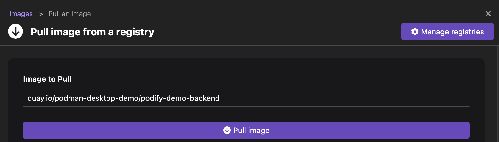
    2. Click **Pull image**. A download complete notification opens.
    3. Click **Done**.
    4. Click the **Run Image** icon corresponding to the new image added.
    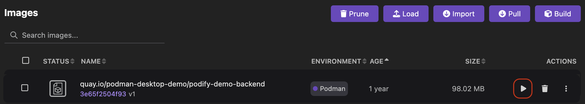
    5. Enter the container name `redis-server`.
    6. Click **Start Container**.
    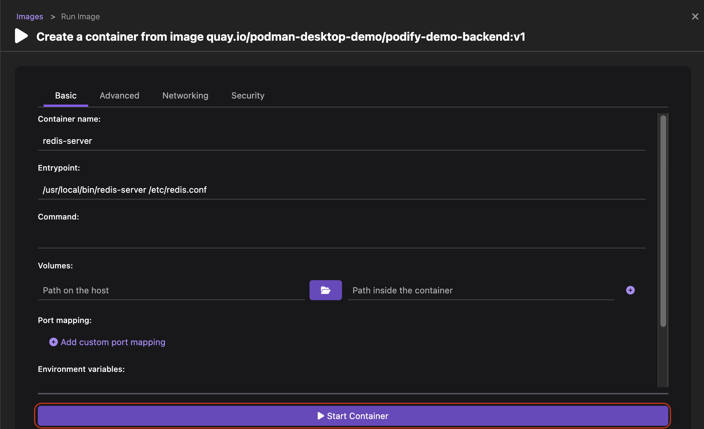  
    7. Click the **Logs** tab to view that the Redis server is running in standalone mode.
    

4. Start the second container:
    1. Enter the image name to pull from a registry. For example, `quay.io/podman-desktop-demo/podify-demo-frontend`. 
    2. Click **Pull image** and then **Done**.
    3. Click the `Run Image` icon corresponding to the new image added.
    4. Enter the container name `python-app`.
    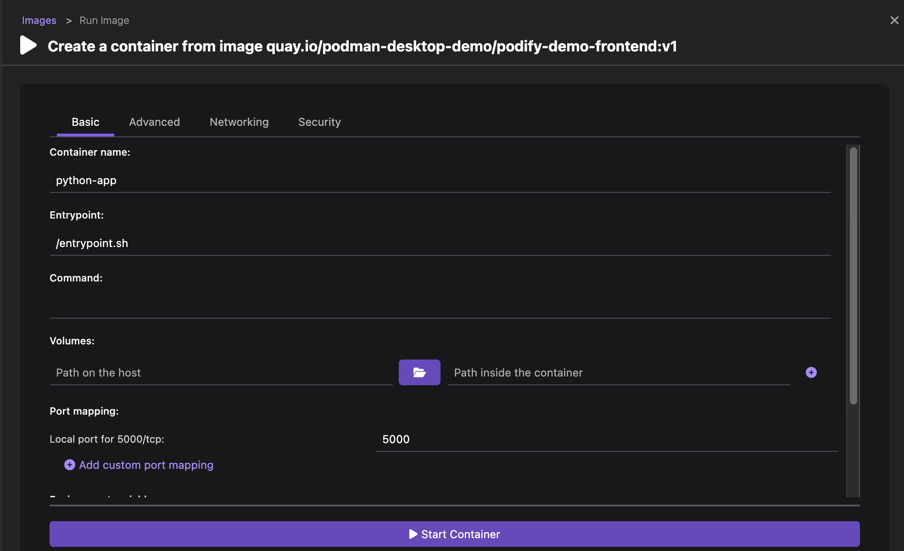
      
        :::note

        If the default port is already in use, you can specify a different port in the `Port mapping` field.

        :::

    5. Select the **Networking** tab and enter hostname as `redis-server` and IP address as `10.88.0.2` to enable communication with the Redis server.
  
        :::note

        You can find the IP address in the **Inspect** tab of the `redis-server` Container Details page. 

        :::

    6. Click **Start Container**. 
    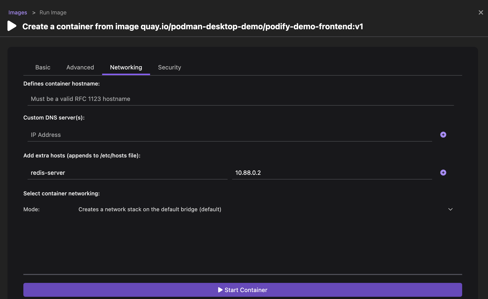
    7. Click the **Logs** tab to view that the application is running on port `5000`.
    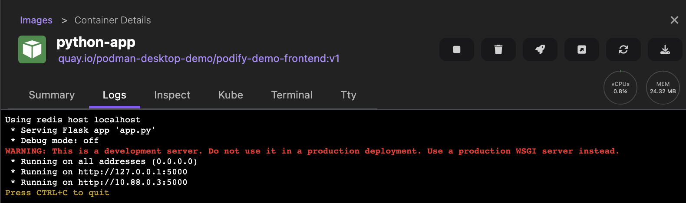
    8. Click the **Open browser** icon on the right side of the page.
    9. View the running front-end application.
    

## Creating a pod
You can use both the containers to create a pod. This way both the front-end and back end container applications can share resources, such as storage and network.

**_Pod creation with existing containers_**

1. Go to the **Containers** page.
2. Select both the front-end and back-end containers.
3. Click the **Create Pod** button.
  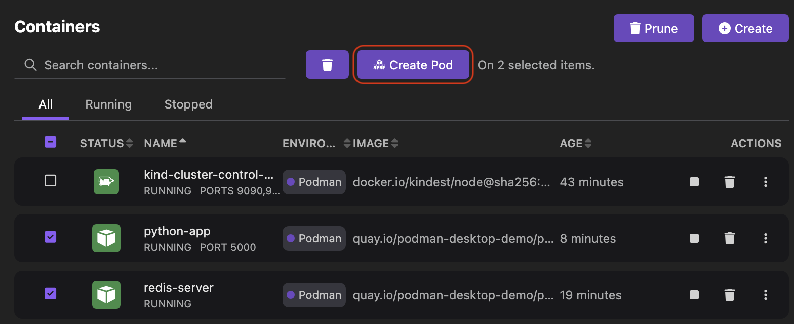
4. Click **Create Pod**.
  
5. View the newly created pod on the Pods page.
6. Click the name of the pod and then click the **Summary** tab to view its summary.
  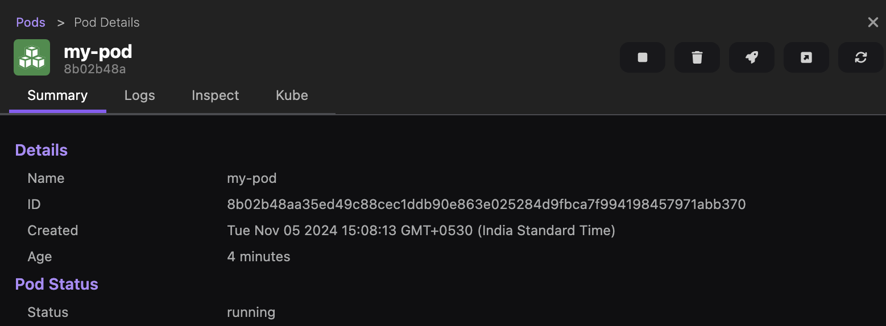

**_Alternative: Pod creation with Kubernetes YAML_**

You can generate a Kubernetes manifest for any existing pod or container and use it to create a local Kubernetes YAML file. Then, you can customize that file and create a pod from it. 

At the time of pod creation, you can select a runtime to indicate whether you want to run the pod on a Podman engine or a Kubernetes cluster. Based on the selection, you get to see the newly created pod running in that environment:
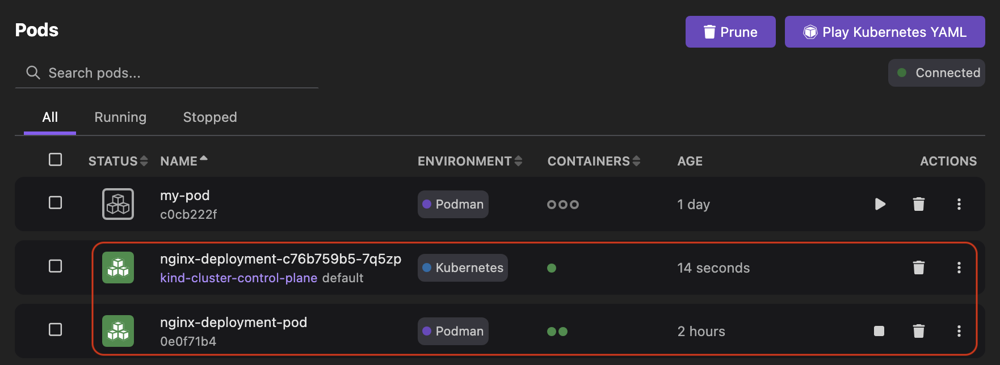

The following procedure creates a pod that runs on a Podman engine.

1. Go to the **Pods** page.
2. Click the overflow menu icon corresponding to the pod.
  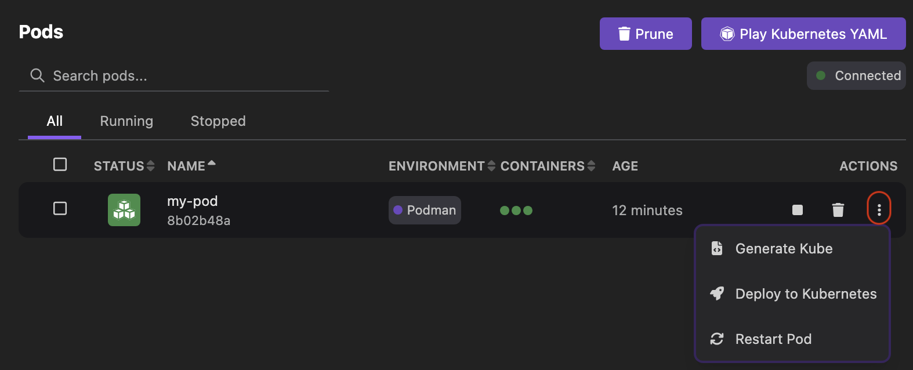
3. Select the **Generate Kube** option from the dropdown list.
4. View the Kubernetes YAML configuration in the **Kube** tab.
  
5. Copy the configuration and paste it into a YAML file on your machine.
6. Edit the YAML configuration and save it.
7. Go to the **Pods** component page.
8. Click **Play Kubernetes YAML**.
  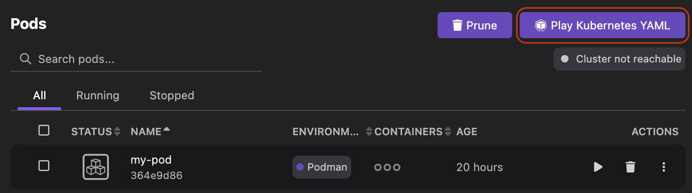
9. Select the YAML file from your machine.
10. Check that the **Runtime** field is set to `Podman container engine`.
11. Click **Play** and then **Done**. 
13. View the newly created pod on the same page.

After creating the pod, set up a local Kubernetes cluster to deploy the pod.

## Setting up a local Kubernetes cluster

You can set up a local Kubernetes cluster. Once the cluster is connected and running, you can deploy your application on it. 

Based on your preference, use the Kind or Minikube extension:
1. [Install the extension](/docs/extensions/install) from the Extensions catalog.
2. Create a Kubernetes cluster. See [Kind cluster creation](/docs/kind/installing-extension) or [Minikube cluster creation](/docs/minikube/installing-extension).

Once a kubernetes cluster is created, you can view a running control plane node and a running Kubernetes service on the Kubernetes component page. The page also shows that the cluster is connected.

## Deploying the application to Kubernetes

You can deploy the application pod to a Kubernetes cluster that has an active connection and access it through a service. Also, any container that is part of a pod is deployable to a Kubernetes cluster.

1. Select your [Kubernetes context](/docs/kubernetes/viewing-and-selecting-current-kubernetes-context).
2. Go to the **Pods** component page.
3. Click the overflow menu icon corresponding to the pod.
  
4. Select the **Deploy to Kubernetes** option from the dropdown list. 
5. Select the checkbox to expose the service locally using the ingress controller.
  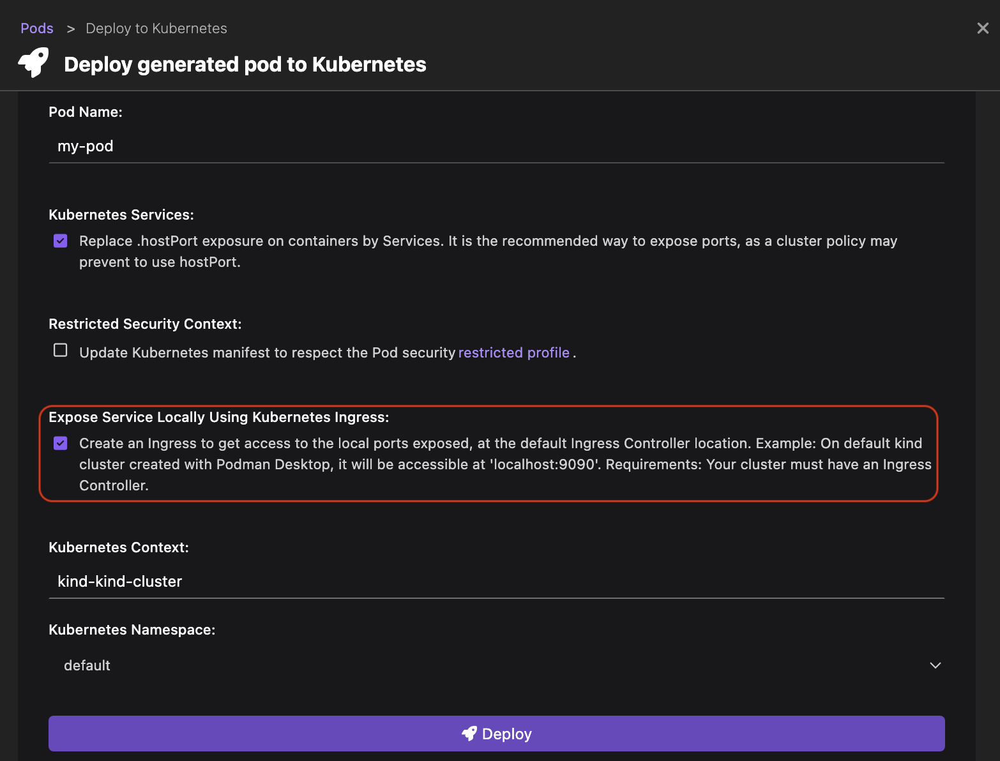

    :::note

    When you configure custom port mapping while running an image, you get the option to select an Ingress host port from the dropdown list. 
    
    Otherwise, you do not see the option. 
    :::

6. Click **Deploy** and then **Done**.

## Verifying the running service

1. Go the **Kubernetes** component page.
2. Perform the following steps:
    1. Click the **Services** option to view the newly created service, `my-pod-5000`.
    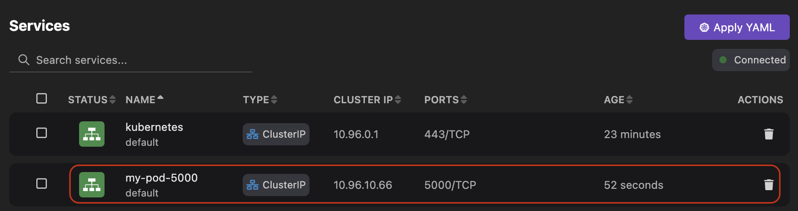
    2. Click the **Ingresses and Routes** option to view the newly created ingress, `my-pod`.
    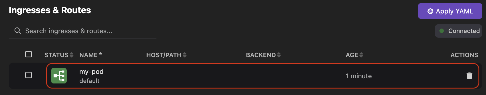

    :::note

    Use the **Apply YAML** button to directly apply a Kubernetes YAML file to create a resource. 

    :::
