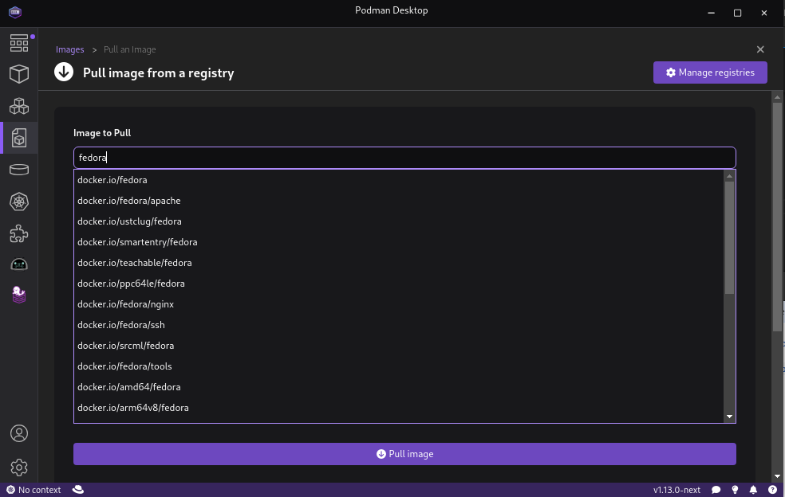
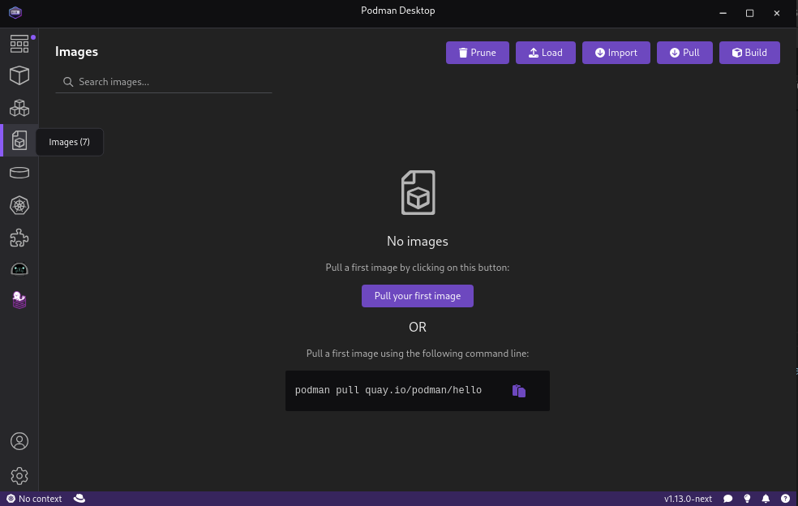
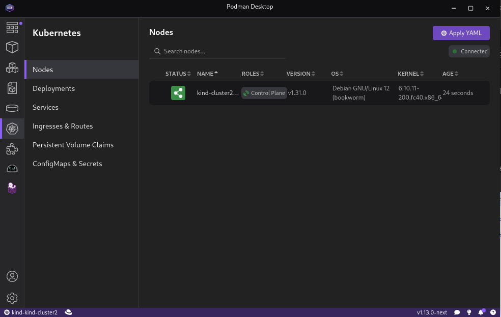
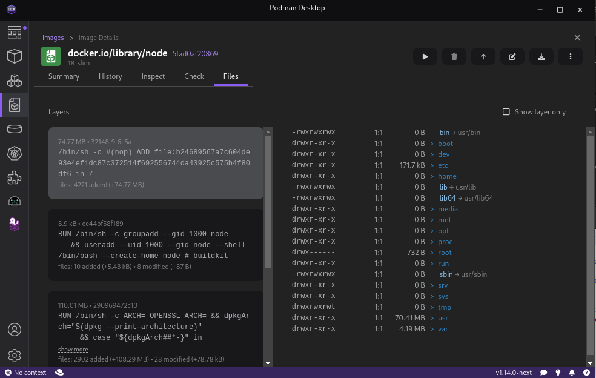
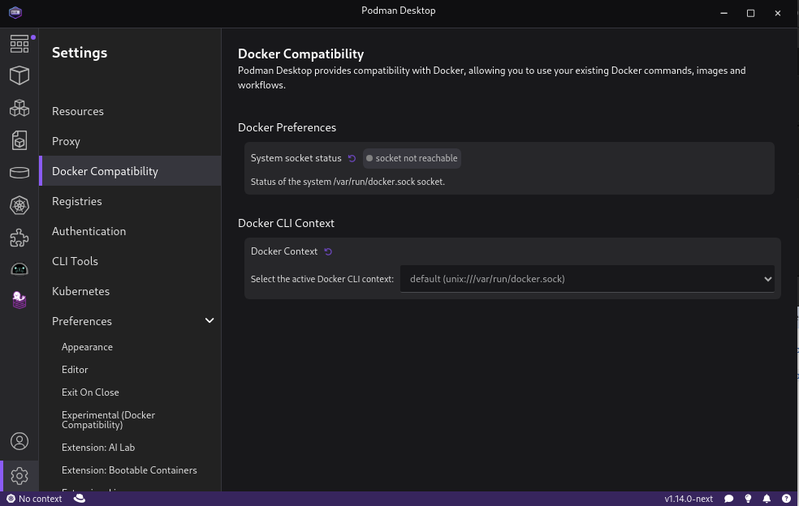

import ReactPlayer from 'react-player'

Podman Desktop 1.13 Release! 🎉

Podman Desktop 1.13 is now available. [Click here to download it](/downloads)!

This release includes:

- **Hyper-V support**: You can now create and manage Hyper-V Podman machines directly from Podman Desktop.
- **Search image feature**: Search for an image from Podman Desktop.
- **Updated empty state pages**: Start your journey in the containers, images, pods, and Kubernetes pages with a click of a button
- **New Kubernetes navigation**: All Kubernetes related pages have been moved to a separate sub menu for easier and less crowded navigation.
- **Image Layer explorer extension**: With this new extension, you can explore the various layers of images.
- **Experimental Docker compatibility mode page**: You can now try out our experimental Docker compatibility mode page.
<!--truncate-->

## Release Details

### Hyper-V support

Podman Desktop is now supporting the creation and modification of Hyper-V based Podman machines on Windows directly from the app.
When creating a Podman machine in Windows, if both Hyper-V and WSL are enabled, you can choose either one of them as the provider from the dropdown menu.

### Search image feature

As you type, a list of likely images is now shown to help you find the right one and reduce typing. If you would like to search for a specific tag, just add : to the name.

### Updated empty state pages

We have updated the empty state pages for images, containers, pods, and Kubernetes. You can now pull your first image, create your first container or pod, all with only one click.

### New Kubernetes navigation

As we grew our Kubernetes section and added new Kubernetes related pages, the navigation was becoming a bit crowded. For a better user experience, this release includes a new Kubernetes submenu with all the relevant pages in it.

### Image layer explorer extension

You can now see each layer of any image you have in Podman Desktop using the `Image Layers Explorer` extension from the extensions catalog. After downloading the extension, choose any image from the available image list, go to the `Files` tab in the `Image Details` page, click on `Fetch Layers`, and start exploring.

### Docker compatibility mode page

Try out our new experimental Docker compatibility page where you can view information about the Docker compatibility mode.
Go to Settings -> Preferences, and enable the option in the `Experimental (Docker Compatibility)` section. You'll then see the Docker compatibility page show up in the Settings menu.

### Additional changes

- You can now control the zoom level of Podman Desktop in the Preferences page
- When reopening Podman Desktop, the window will open in the same position it was closed
- You can now see a summary of the release notes on the top of the Dashboard page

---

## Other Notable Enhancements

- chore: light mode for welcome page by @deboer-tim in [#8401](https://github.com/containers/podman-desktop/pull/8401)
- chore: light icon support by @deboer-tim in [#8359](https://github.com/containers/podman-desktop/pull/8359)
- chore: light mode for deploy pod to kube status by @deboer-tim in [#8395](https://github.com/containers/podman-desktop/pull/8395)
- chore: update the list of guides to include ai lab by @gastoner in [#8422](https://github.com/containers/podman-desktop/pull/8422)
- chore: allow windows titlebar icons change color dynamicaly by @gastoner in [#8677](https://github.com/containers/podman-desktop/pull/8677)
- chore: publish prereleases to another repository by @benoitf in [#8732](https://github.com/containers/podman-desktop/pull/8732)
- chore: generate summary of release notes with JSON format to the website by @SoniaSandler in [#8790](https://github.com/containers/podman-desktop/pull/8790)
- chore: add release notes to dashboard page - renderer by @SoniaSandler in [#9190](https://github.com/containers/podman-desktop/pull/9190)
- feat: allow to upgrade/downgrade cli tool by @lstocchi in [#8513](https://github.com/containers/podman-desktop/pull/8513)
- feat: remember window position and size of Podman Desktop window by @benoitf in [#8511](https://github.com/containers/podman-desktop/pull/8511)
- feat: support cli tool installer by @lstocchi in [#8534](https://github.com/containers/podman-desktop/pull/8534)
- feat: adding open release note to update confirmation dialog by @axel7083 in [#8585](https://github.com/containers/podman-desktop/pull/8585)
- feat(configuration): allow to define the value of step for Input widget by @benoitf in [#8700](https://github.com/containers/podman-desktop/pull/8700)
- feat: allow to set a zoom level by @benoitf in [#8747](https://github.com/containers/podman-desktop/pull/8747)
- feat: add preflights check for HyperV by @jeffmaury in [#8821](https://github.com/containers/podman-desktop/pull/8821)
- feat(renderer): enhance feedback form with github star link by @axel7083 in [#8800](https://github.com/containers/podman-desktop/pull/8800)
- feat: add Preference to ask before fetching image layers by @feloy in [#9146](https://github.com/containers/podman-desktop/pull/9146)
- feat: bring docker compatibility page if flag is enabled by @benoitf in [#9183](https://github.com/containers/podman-desktop/pull/9183)

---

## Notable Bug Fixes

- fix: support light theme for auth provider in 'Logged In' state by @dgolovin in [#8380](https://github.com/containers/podman-desktop/pull/8380)
- fix: update webview urls on change by @deboer-tim in [#8456](https://github.com/containers/podman-desktop/pull/8456)
- fix: storybook svelte 5 by @axel7083 in [#8495](https://github.com/containers/podman-desktop/pull/8495)
- fix: duplicated_indeterminate_progress_bar by @gastoner in [#8238](https://github.com/containers/podman-desktop/pull/8238)
- fix: select first element of quickpick by @feloy in [#8591](https://github.com/containers/podman-desktop/pull/8591)
- fix(Tasks): task lifecycle managed in main by @axel7083 in [#8144](https://github.com/containers/podman-desktop/pull/8144)
- fix: zoom level resets on window change after navigation by @dgolovin in [#8489](https://github.com/containers/podman-desktop/pull/8489)
- fix: rename untagged image by @axel7083 in [#8614](https://github.com/containers/podman-desktop/pull/8614)
- fix: number widget should accept float value for number type by @benoitf in [#8685](https://github.com/containers/podman-desktop/pull/8685)
- fix: Fixed width of widget for inc/dec numbers by @gastoner in [#8741](https://github.com/containers/podman-desktop/pull/8741)
- fix: input boxes are still using dark theme when PD is in light mode by @gastoner in [#8549](https://github.com/containers/podman-desktop/pull/8549)
- fix: update native theme directly on config change by @deboer-tim in [#8485](https://github.com/containers/podman-desktop/pull/8485)
- fix: floating precision when adding numbers by @benoitf in [#8793](https://github.com/containers/podman-desktop/pull/8793)
- fix: track external changes when displaying configuration values by @benoitf in [#8795](https://github.com/containers/podman-desktop/pull/8795)
- fix: configure certificates for secure proxy by @jeffmaury in [#8704](https://github.com/containers/podman-desktop/pull/8704)
- fix: make terminal work after stopping and starting a container by @SoniaSandler in [#8657](https://github.com/containers/podman-desktop/pull/8657)
- fix: use docker.io registry credentials for index.docker.io images by @feloy in [#8892](https://github.com/containers/podman-desktop/pull/8892)
- fix: apply light theme on preflight checks box by @benoitf in [#8991](https://github.com/containers/podman-desktop/pull/8991)
- fix: reflecting light and dark theme by AuditMessageBox by @gastoner in [#9040](https://github.com/containers/podman-desktop/pull/9040)
- fix: update input colors by @deboer-tim in [#9094](https://github.com/containers/podman-desktop/pull/9094)

---

## Community Thank You

🎉 We’d like to say a big thank you to everyone who helped to make 🦭 Podman Desktop even better. In this
release we received pull requests from the following new people:

- [jingyuwa](https://github.com/jingyuwa) in [#8455 - doc: add section for using podman-desktop with Hyper-V](https://github.com/containers/podman-desktop/pull/8455)
- [AshvG](https://github.com/AshvG) in [#9131 - docs: fix two typos on windows-install documentation](https://github.com/containers/podman-desktop/pull/9131)
- [eddumelendez](https://github.com/eddumelendez) in [#9193 - fix: Testcontainers name](https://github.com/containers/podman-desktop/pull/9193)

---

## Final notes

<!-- EDIT BELOW VERSION NUMBERS! -->

The complete list of issues fixed in this release is available [here](https://github.com/containers/podman-desktop/issues?q=is%3Aclosed+milestone%3A1.13.0).

Get the latest release from the [Downloads](/downloads) section of the website and boost your development journey with Podman Desktop. Additionally, visit the [GitHub repository](https://github.com/containers/podman-desktop) and see how you can help us make Podman Desktop better.
