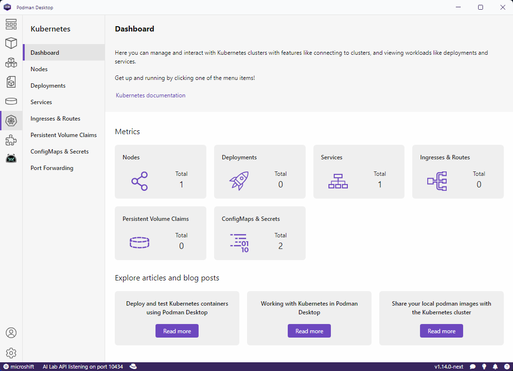

import ReactPlayer from 'react-player'

Podman Desktop 1.14 Release! 🎉

Podman Desktop 1.14 is now available. [Click here to download it](/downloads)!

This release includes: 

- **Kubernetes improvements**: UI changes that will make life with working with Kubernetes clusters easier.
- **Kubernetes dashboard**: A new landing screen for Kubernetes has been added.
- **Port forwarding**: This new feature allows users to configure port forwarding in Kubernetes environment.
<!--truncate-->

## Release Details

### Kubernetes improvements

### Kubernetes dashboard

We have updated the Kubernetes dashboard page to give to provide a quick overview of users' Kubernetes clusters.  

### Port forwarding

Podman Desktop is now supporting port forwarding for pods in Kubernetes environment. Port forwarding can be done from pod detail page and then visible in Port forwarding page. 

---

## Community Thank You

🎉 We’d like to say a big thank you to everyone who helped to make Podman Desktop even better. In this
release we received pull requests from the following people:

- [Indekkusu545](https://github.com/Indekkusu545) in [#9626 - fix: incorrect system proxy format on Windows](https://github.com/containers/podman-desktop/pull/9626)

---

## Final Notes

### Fixed Issues

The complete list of issues fixed in this release is available [here](https://github.com/containers/podman-desktop/issues?q=is%3Aclosed+milestone%3A1.14.0).

### Where to Download

Get the latest release from the [Downloads](/downloads) section of the website and boost your development journey with Podman Desktop. Additionally, visit the [GitHub repository](https://github.com/containers/podman-desktop) and see how you can help us make Podman Desktop better.

---

## Detailed Release Changelog

### ci 🔁
- chore: validate also the title of the PR to be semantic by @benoitf in [#9438](https://github.com/containers/podman-desktop/pull/9438)
- chore: allow merge commits in semantic check by @benoitf in [#9581](https://github.com/containers/podman-desktop/pull/9581)
- fix: publish @podman-extension/api package by @dgolovin in [#9061](https://github.com/containers/podman-desktop/pull/9061)

### dashboard 📊
- feat(dashboard): new guides added to learning center by @slemeur in [#9638](https://github.com/containers/podman-desktop/pull/9638)
- chore: redirect to dashboard when clicking on release notes button in statusbar by @SoniaSandler in [#9623](https://github.com/containers/podman-desktop/pull/9623)
- feat: navigation to the dashboard by @deboer-tim in [#9333](https://github.com/containers/podman-desktop/pull/9333)
- fix: remove Red Hat extension pack from the recommendations by @benoitf in [#9551](https://github.com/containers/podman-desktop/pull/9551)
- chore: change the order of elements on the dashboard page by @gastoner in [#8381](https://github.com/containers/podman-desktop/pull/8381)
- fix: next version check by @SoniaSandler in [#9595](https://github.com/containers/podman-desktop/pull/9595)

### documentation 📖
- docs: add kind video by @cdrage in [#9444](https://github.com/containers/podman-desktop/pull/9444)
- docs: add minikube video by @cdrage in [#9391](https://github.com/containers/podman-desktop/pull/9391)
- docs: add 1.13 release notes by @SoniaSandler in [#9261](https://github.com/containers/podman-desktop/pull/9261)
- chore: update extension catalog screenshot by @deboer-tim in [#9347](https://github.com/containers/podman-desktop/pull/9347)
- chore: update DD extension image by @deboer-tim in [#9346](https://github.com/containers/podman-desktop/pull/9346)

### extension/kind 🍾
- fix: add implementation for kind update by @dgolovin in [#9258](https://github.com/containers/podman-desktop/pull/9258)

### extension/podman 🦭
- fix: cannot create machine with WSL provider without administrator ri… by @jeffmaury in [#9644](https://github.com/containers/podman-desktop/pull/9644)
- chore: fix version of the podman extension by @benoitf in [#9567](https://github.com/containers/podman-desktop/pull/9567)
- chore: fix the release workflow to properly update podman ext version by @benoitf in [#9566](https://github.com/containers/podman-desktop/pull/9566)
- feat: allow to ssh to podman virtual machine - backend changes  by @gastoner in [#9384](https://github.com/containers/podman-desktop/pull/9384)
- feat: allow to ssh to podman virtual machine - podman changes by @gastoner in [#9383](https://github.com/containers/podman-desktop/pull/9383)
- feat: allow to ssh to podman virtual machine - api.d.ts changes by @gastoner in [#9382](https://github.com/containers/podman-desktop/pull/9382)
- feat: provide ability to easily get a shell in a machine - backend changes - additional changes by @gastoner in [#9550](https://github.com/containers/podman-desktop/pull/9550)

### extensions 🧩
- fix: add implementation for compose update by @dgolovin in [#9402](https://github.com/containers/podman-desktop/pull/9402)
- fix: check if newly installed extensions dependencies are already installed by @SoniaSandler in [#9596](https://github.com/containers/podman-desktop/pull/9596)
- chore: prefer method of the extension over system to get OS by @benoitf in [#9612](https://github.com/containers/podman-desktop/pull/9612)
- fix: update embedded image extension by @benoitf in [#9547](https://github.com/containers/podman-desktop/pull/9547)

### install 🎁
- chore: fix broken pnpm lock file by @benoitf in [#9437](https://github.com/containers/podman-desktop/pull/9437)
- chore: update electron-builder to v25.1.8 by @benoitf in [#9421](https://github.com/containers/podman-desktop/pull/9421)
- fix: avoid to have proxy arguments when calling the status bar entry command by @benoitf in [#9394](https://github.com/containers/podman-desktop/pull/9394)
- fix: call onUpdate callback if configuration is updated programmatically by @benoitf in [#9366](https://github.com/containers/podman-desktop/pull/9366)
- chore: fix ui library component packaging by @benoitf in [#9340](https://github.com/containers/podman-desktop/pull/9340)
- chore: switch from prettier to biome for formatting the files by @benoitf in [#9336](https://github.com/containers/podman-desktop/pull/9336)
- chore: apply missing formatting on some files by @benoitf in [#9335](https://github.com/containers/podman-desktop/pull/9335)
- chore: fix svelte 5 deprecation warning by @deboer-tim in [#9331](https://github.com/containers/podman-desktop/pull/9331)
- chore: replace the toml library by @benoitf in [#9317](https://github.com/containers/podman-desktop/pull/9317)
- fix: cache eslint based on content by @jeffmaury in [#9305](https://github.com/containers/podman-desktop/pull/9305)
- fix: search for universal installer on macOS by @benoitf in [#9294](https://github.com/containers/podman-desktop/pull/9294)
- chore: fix publish job for npmjs by @benoitf in [#9292](https://github.com/containers/podman-desktop/pull/9292)
- fix: reset extra assets array in beforePack call to avoid including podman vm image for x64 and arm64 in arm64.zip by @dgolovin in [#9274](https://github.com/containers/podman-desktop/pull/9274)
- feat: enable podman desktop running in electron by @dgolovin in [#8478](https://github.com/containers/podman-desktop/pull/8478)
- fix: rm packages/main/src/assets from extra resources to get include into app.asar by @dgolovin in [#9514](https://github.com/containers/podman-desktop/pull/9514)
- fix: replace node-fetch by native Node.js fetch by @jeffmaury in [#9489](https://github.com/containers/podman-desktop/pull/9489)

### Kubernetes ☸️
- feat: initial Kubernetes dashboard by @deboer-tim in [#9588](https://github.com/containers/podman-desktop/pull/9588)
- feat(ui): adding KubernetesCurrentContextPortForwards store by @axel7083 in [#9642](https://github.com/containers/podman-desktop/pull/9642)
- fix: add Kubernetes port forward IPCs and events by @jeffmaury in [#9505](https://github.com/containers/podman-desktop/pull/9505)
- feat: make Kubernetes informers cancellable by @feloy in [#9411](https://github.com/containers/podman-desktop/pull/9411)
- fix: patch Kubernetes-client-node to be able to handle cluster restart by @feloy in [#9409](https://github.com/containers/podman-desktop/pull/9409)
- fix: do not add again an existing Kubernetes resource by @feloy in [#9380](https://github.com/containers/podman-desktop/pull/9380)
- feat: blank kubeconfig path will be set to default one by @gastoner in [#9587](https://github.com/containers/podman-desktop/pull/9587)
- fix: work on related context, not current context by @feloy in [#9523](https://github.com/containers/podman-desktop/pull/9523)
- feat: refresh the state of a specific context by restarting its informers by @feloy in [#9487](https://github.com/containers/podman-desktop/pull/9487)
- refactor: simplify context states update by @feloy in [#9443](https://github.com/containers/podman-desktop/pull/9443)
- feat: set slower backoff for current context by @feloy in [#9392](https://github.com/containers/podman-desktop/pull/9392)
- fix: start secondary informers when context is reachable by @feloy in [#9388](https://github.com/containers/podman-desktop/pull/9388)
- feat: port forwarding backend part by @vzhukovs in [#7379](https://github.com/containers/podman-desktop/pull/7379)
- feat(k8s-port-forwaring): increasing management of ports mapping by @axel7083 in [#9592](https://github.com/containers/podman-desktop/pull/9592)
- fix: dispose existing port forwards on delete by @jeffmaury in [#9575](https://github.com/containers/podman-desktop/pull/9575)
- refactor: context checking state as derived store by @feloy in [#9504](https://github.com/containers/podman-desktop/pull/9504)

### podman-upstream 🦭
- feat: update podman to v5.2.5 by @benoitf in [#9563](https://github.com/containers/podman-desktop/pull/9563)

### settings ⚙️
- fix: incorrect system proxy format on Windows by @Indekkusu545 in [#9626](https://github.com/containers/podman-desktop/pull/9626)
- chore: introduce a new property scope for docker compatibility by @benoitf in [#9604](https://github.com/containers/podman-desktop/pull/9604)
- chore: properties can be part of a group by @benoitf in [#9602](https://github.com/containers/podman-desktop/pull/9602)

### telemetry 📈
- chore: remove podmanListImages telemetry by @deboer-tim in [#9466](https://github.com/containers/podman-desktop/pull/9466)

### tests 🚦
- chore(test): initial draft for test.step by @cbr7 in [#9613](https://github.com/containers/podman-desktop/pull/9613)
- chore: refactor test to use a mock of the utility by @benoitf in [#9611](https://github.com/containers/podman-desktop/pull/9611)
- chore(test): minor fixes and robustness improvements by @cbr7 in [#9609](https://github.com/containers/podman-desktop/pull/9609)
- chore(test): some e2e test fixes by @cbr7 in [#9573](https://github.com/containers/podman-desktop/pull/9573)
- chore(test): define the correct provider type locator by @amisskii in [#9520](https://github.com/containers/podman-desktop/pull/9520)
- chore(test): use aria-label for locator by @cbr7 in [#9464](https://github.com/containers/podman-desktop/pull/9464)
- chore(test): fix wrong category used for locator by @cbr7 in [#9404](https://github.com/containers/podman-desktop/pull/9404)
- chore(test): add delete all unused images functionality to POM by @cbr7 in [#9368](https://github.com/containers/podman-desktop/pull/9368)
- chore(test): increase Pod deletion timeout in Kubernetes PVC test by @amisskii in [#9364](https://github.com/containers/podman-desktop/pull/9364)
- fix(tests): not all update e2e tests were run by @odockal in [#9362](https://github.com/containers/podman-desktop/pull/9362)
- chore(test): make output folder customizable by @cbr7 in [#9349](https://github.com/containers/podman-desktop/pull/9349)
- test: add scenario for Kubernetes YAML edit feature by @amisskii in [#9323](https://github.com/containers/podman-desktop/pull/9323)
- test: Test for Kubernetes ConfigMaps and Secrets resource pages by @amisskii in [#9244](https://github.com/containers/podman-desktop/pull/9244)
- refactor: mock contexts constants to be able to set different values on tests by @feloy in [#9529](https://github.com/containers/podman-desktop/pull/9529)
- fix: button name in update-install E2E test by @SoniaSandler in [#9509](https://github.com/containers/podman-desktop/pull/9509)
- fix: suppress `HTMLCanvasElement.prototype.getContext not implemented` error by @dgolovin in [#9287](https://github.com/containers/podman-desktop/pull/9287)

### ui
- chore: change no update release notes button in status bar by @SoniaSandler in [#9621](https://github.com/containers/podman-desktop/pull/9621)
- fix: invalid condition for the display of the button by @benoitf in [#9618](https://github.com/containers/podman-desktop/pull/9618)
- feat: display a spinner when connectivity is being checked in Kubernetes pages  by @feloy in [#9535](https://github.com/containers/podman-desktop/pull/9535)
- fix(ui): quick-pick handle overflow by @axel7083 in [#9527](https://github.com/containers/podman-desktop/pull/9527)
- fix: proxy settings page stuck by @jeffmaury in [#9524](https://github.com/containers/podman-desktop/pull/9524)
- chore: use dropdown component in proxy settings by @deboer-tim in [#9511](https://github.com/containers/podman-desktop/pull/9511)
- chore: use dropdown component in Kube terminal by @deboer-tim in [#9510](https://github.com/containers/podman-desktop/pull/9510)
- chore: prevent default button action (submitting form) by @deboer-tim in [#9498](https://github.com/containers/podman-desktop/pull/9498)
- fix: update Updater button names to fit in message box by @SoniaSandler in [#9497](https://github.com/containers/podman-desktop/pull/9497)
- fix: remove extra v from release notes link by @SoniaSandler in [#9495](https://github.com/containers/podman-desktop/pull/9495)
- feat: refresh button in Kubernetes empty pages by @feloy in [#9491](https://github.com/containers/podman-desktop/pull/9491)
- chore: default initial selection in dropdown by @deboer-tim in [#9537](https://github.com/containers/podman-desktop/pull/9537)
- feat: add experimental flag to display toasts when we have notifications by @benoitf in [#9488](https://github.com/containers/podman-desktop/pull/9488)
- chore: add experimental property for toasts by @benoitf in [#9481](https://github.com/containers/podman-desktop/pull/9481)
- chore: update enum item and run image page by @deboer-tim in [#9458](https://github.com/containers/podman-desktop/pull/9458)
- chore: update container engine selects to Dropdown component by @deboer-tim in [#9452](https://github.com/containers/podman-desktop/pull/9452)
- chore: remember last child page visited for Kubernetes and preferences pages by @SoniaSandler in [#9451](https://github.com/containers/podman-desktop/pull/9451)
- chore: remove timer to refresh tasks in frontend side by @benoitf in [#9446](https://github.com/containers/podman-desktop/pull/9446)
- chore: replace colors by using registry colors in ingresses-routes, kube, node, onboarding, and pod by @SoniaSandler in [#9426](https://github.com/containers/podman-desktop/pull/9426)
- chore: replace colors by using registry colors in preferences, item-formats, pvc, and recommendation by @SoniaSandler in [#9425](https://github.com/containers/podman-desktop/pull/9425)
- fix(ui): layers explorer margin issue by @axel7083 in [#9412](https://github.com/containers/podman-desktop/pull/9412)
- fix: release notes banner update button by @SoniaSandler in [#9371](https://github.com/containers/podman-desktop/pull/9371)
- fix(ui): aligned task indicator by @axel7083 in [#9363](https://github.com/containers/podman-desktop/pull/9363)
- chore: reduce width and font size subnavigation by @cdrage in [#9325](https://github.com/containers/podman-desktop/pull/9325)
- fix: Done button in DeployPodToKube by @SoniaSandler in [#9306](https://github.com/containers/podman-desktop/pull/9306)
- fix: correct selection borders for Kube Play by @deboer-tim in [#9277](https://github.com/containers/podman-desktop/pull/9277)
- fix: enable 'Update' for kubectl CLI by @dgolovin in [#9205](https://github.com/containers/podman-desktop/pull/9205)
- feat(UI): task indicator  by @axel7083 in [#9186](https://github.com/containers/podman-desktop/pull/9186)
- feat: dropdown component by @deboer-tim in [#9157](https://github.com/containers/podman-desktop/pull/9157)
- chore: add warning for users about short image names by @SoniaSandler in [#9116](https://github.com/containers/podman-desktop/pull/9116)
- fix: show correct empty screens when filtering catalog by @deboer-tim in [#9108](https://github.com/containers/podman-desktop/pull/9108)
- chore: adding string value for workload kind by @axel7083 in [#9641](https://github.com/containers/podman-desktop/pull/9641)
- chore: move 2 pixel back to the left the cards to align with the mockup by @benoitf in [#9601](https://github.com/containers/podman-desktop/pull/9601)
- feat: makes containers port(s) list multi line by @axel7083 in [#9554](https://github.com/containers/podman-desktop/pull/9554)
- feat: display deployments and nodes conditions in a table by @feloy in [#9548](https://github.com/containers/podman-desktop/pull/9548)

### website 🌐
- docs(website): added a troubleshooting section by @shipsing in [#9459](https://github.com/containers/podman-desktop/pull/9459)
- docs(website): updated the screenshot by @shipsing in [#9316](https://github.com/containers/podman-desktop/pull/9316)
- docs(website): created a discover Podman Desktop page by @shipsing in [#9315](https://github.com/containers/podman-desktop/pull/9315)
- docs(website): added a tutorial for interacting with a database server by @shipsing in [#9238](https://github.com/containers/podman-desktop/pull/9238)

### other
- chore: include 1.13.2 and 1.13.3 in bug template by @benoitf in [#9615](https://github.com/containers/podman-desktop/pull/9615)
- fix: skip output folder during format actions by @jeffmaury in [#9580](https://github.com/containers/podman-desktop/pull/9580)
- chore: move the file to the correct directory by @benoitf in [#9546](https://github.com/containers/podman-desktop/pull/9546)
- revert: define the correct provider type locator (#9520) by @benoitf in [#9530](https://github.com/containers/podman-desktop/pull/9530)
- chore: refactor logs by using an object rather than list of params by @benoitf in [#9494](https://github.com/containers/podman-desktop/pull/9494)
- chore(issue-template): sort versions by @axel7083 in [#9486](https://github.com/containers/podman-desktop/pull/9486)
- chore: comment out some duplicated/unnecessary rules taking time by @benoitf in [#9482](https://github.com/containers/podman-desktop/pull/9482)
