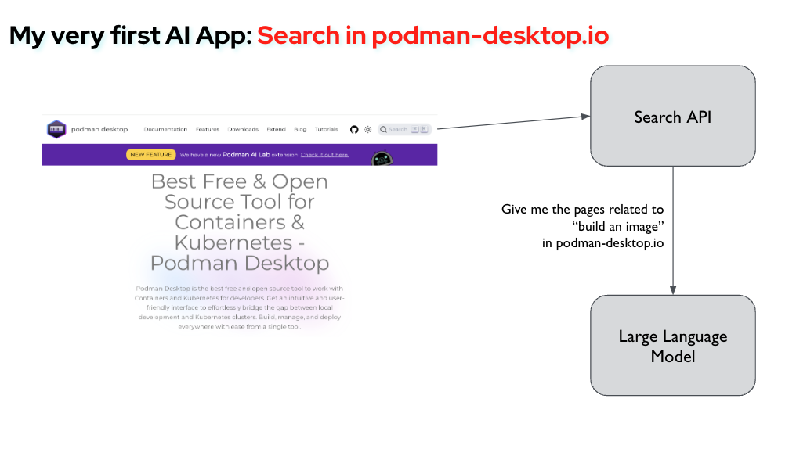
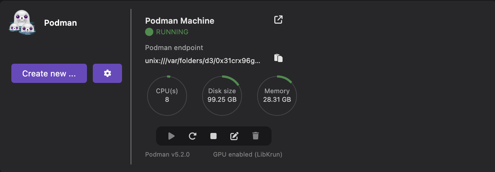
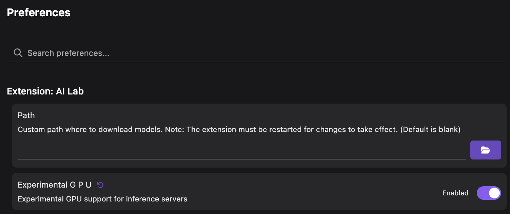
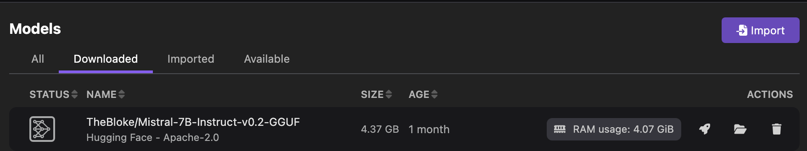
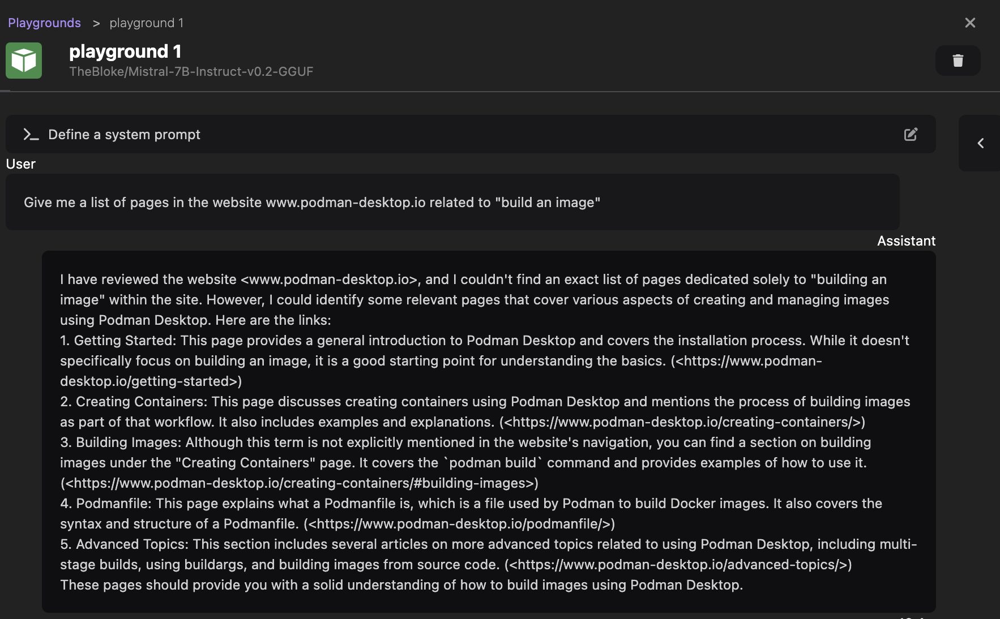
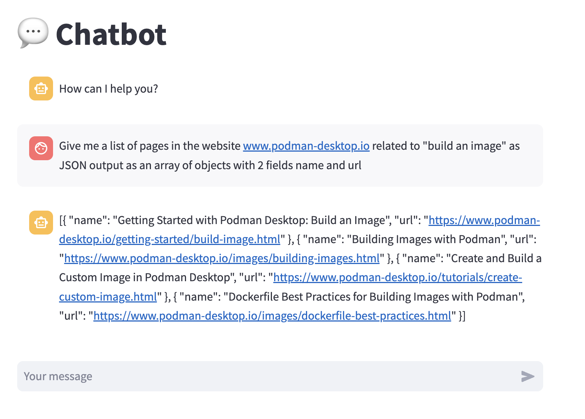
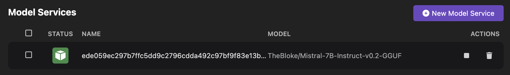
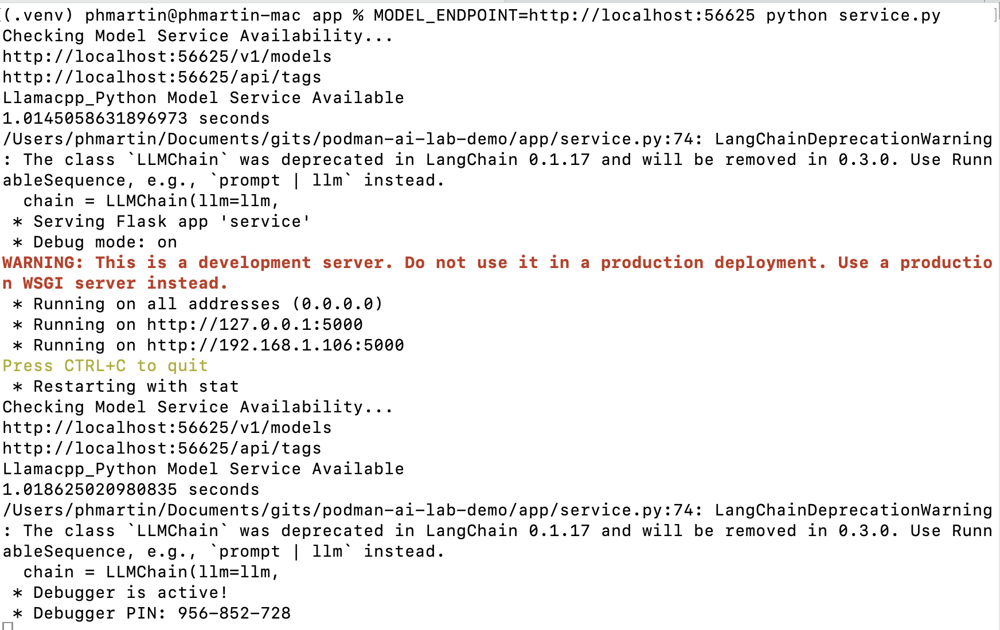
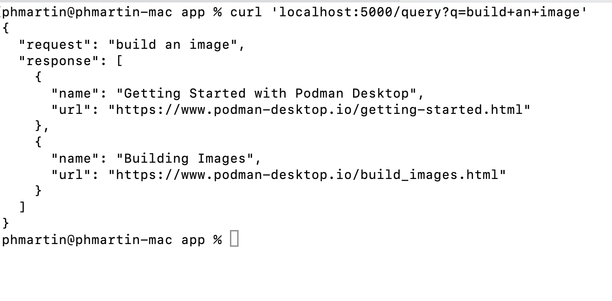

Red Hat provides an extension to Podman Desktop, Podman AI Lab, which lets developers discover examples of applications by using large language models (LLMs), and gives them a framework to create their own AI-based applications and share them with their team.

We will discover, through this article, the different steps to create our first AI application, and to add it to the catalog of recipes of Podman AI Lab.

# Our first AI Application

For our first experiment, we will work on a micro-service for the podman-desktop.io website. The micro-service would receive the search terms from the website, and would ask the model to find the best matching pages, before to return the result to the website.



## Preparing Podman Desktop and Podman AI Lab

If you haven't done it yet, the first step is to [install Podman Desktop and its extension Podman AI Lab](https://podman-desktop.io/docs/ai-lab/installing).

To have a better experience, it is recommended to use the GPU acceleration to serve the model. If you have such a GPU on your machine, you will need to create a Podman machine with the LibKrun provider (on MacOS). More details on [the GPU support for Podman AI Lab](https://developers.redhat.com/articles/2024/09/10/gpu-support-podman-ai-lab). 

At the time of writing, the GPU support is still experimental on Podman AI Lab. You will need to enable the option on the Preferences to enable it.





## Testing a prompt with a model

Podman AI Lab provides a catalog of open source models that can be used locally. You can go to the `Models > Catalog` page to download the model of your choice. For this article, we will use the `Mistral-7B-instruct` model.



Once a model is downloaded, we can test and interact with this model, to try to find the best prompt for our application. For chat models, Podman AI Lab provides a `Playground`, so we can test different prompts and validate that the responses of the model are adequate.

Let's start a new playground (from the `Models > Playgrounds` menu), and send our first prompt:

```
Give me a list of pages in the website www.podman-desktop.io related to "build an image"
```

The model should reply with some list of pages, in a human-readable form (see the screenshot below, for a response we have received).



The problem is that the response is in human readable form, but we don't want the API to return this response as is, we want to have the name and the url of the pages, and send them to the website, so the website can display these pages with its preferred format. 

For this, we can try to ask the model to reply with a structured response, with the following prompt:

```
Give me a list of pages in the website www.podman-desktop.io related to "build an image" as JSON output as an array of objects with 2 fields name and url
```

This time, we have received a response in JSON format, which is more suitable for our needs.


We don't expect the user to ask such a precise question, and we would prefer to send to the model the exact question of the user, without modifying it in real time. For this purpose, chat models provide a system prompt feature. The system prompt can be defined at the beginning of the chat session.

Podman AI Lab supports this feature, let's restart a Playground session with the following system prompt:

```
Give me a list of pages in the website www.podman-desktop.io related to the request as JSON output as an array of objects with 2 fields name and url
```

Then, send the prompt `build an image`, to simulate a realistic search input of a user.

We can see in the screenshot below that the model still returns a response suitable for our use case.


> Please note that this section was not a course on writing the best prompt, I'm sure you will find much more efficient prompts for this purpose. The purpose of this section is to demonstrate how you can iterate with Podman AI Lab to refine the prompts you want to use for your application.

## Testing a recipe

Now that we have a suitable prompt to use for our application, it is time to start our application itself. 

Many developers prefer to have a working example of application to start with, and Podman AI Lab provides such examples with a catalog of recipes, visible in the page `AI Apps > Recipe Catalog`.

Let's select the Chatbot recipe (`More details` link on the Chatbot card), and start it with the Mistral model (by pressing the `Start` button and filling the form).

Once the application is started, we can access the list of running apps in the `AI Apps > Running` page, and we can access the app's UI by clicking on the `Open AI App` link.

We can test again by typing our prompt (not the one with a system prompt, as the recipe does not support providing a system prompt), and see that the response is very similar to the one received from the playground.



Back to the recipe's details page, we can access the sources of the recipe by clicking on the `Open in VSCode` button, the respository's link or the link `Local clone`.

### Structure of a recipe

The entrypoint of a recipe is the file `ai-lab.yaml` present in the repository of the recipe. 

Let's examine the content of this file (the syntax of the file is specified in [this documentation](https://github.com/containers/podman-desktop-extension-ai-lab/blob/main/PACKAGING-GUIDE.md#recipe-configuration-file)) for the chatbot example.


```
version: v1.0
application:
  type: language
  name: ChatBot_Streamlit
  description: Chat with a model service in a web frontend.
  containers:
    - name: llamacpp-server
      contextdir: ../../../model_servers/llamacpp_python
      containerfile: ./base/Containerfile
      model-service: true
      backend:
        - llama-cpp
      arch:
        - arm64
        - amd64
      ports:
        - 8001
      image: quay.io/ai-lab/llamacpp_python:latest
    - name: streamlit-chat-app
      contextdir: app
      containerfile: Containerfile
      arch:
        - arm64
        - amd64
      ports:
        - 8501
      image: quay.io/ai-lab/chatbot:latest
```

The file defines two containers, one for the inference server and one for the application itself.

The first container, for the inference server, is generic and can be reused for any app using a chat model.

The second one is the one we are particularly interested in. It defines how the container's image for the application is built. It points to the Containerfile used to build the image, on which we can find the source code for the app: in the `app/chatbot_ui.py` file.

Looking at the Python source file, we can see that the application uses the `streamlit` framework for the UI part, and the `langchain` framework for discussing with the model.

We can adapt this source code, by replacing the UI part with a framework to make the app a REST service, and keep the `langchain` part.

An interesting part of the source code is that the recipe does not expose to the user the system prompt, but defines one internally (`You are world class technical advisor`):

```
prompt = ChatPromptTemplate.from_messages([
    ("system", "You are world class technical advisor."),
    MessagesPlaceholder(variable_name="history"),
    ("user", "{input}")
])
```

This is exactly what we want to do in our application, we will be able to indicate here the system prompt we have found earlier.

## Creating our own app

Adapting the source code for the purpose of our application is out of the scope of this article, let's see the result in [our app repository](https://github.com/feloy/podman-ai-lab-demo/blob/main/app/service.py).

As discussed in the previous section, we have replaced the `streamlit` part with the `flask` framework to create a REST API with two endpoints: one for the health check on `/` necessary for Podman AI Lab, and another one on `/query`, which will be the endpoint on which the micro-service's user will send requests.

We have also indicated our own system prompt:

```
prompt = ChatPromptTemplate.from_messages([
    ("system", """
        reply in JSON format with an array of objects with 2 fields name and url
        (and with no more text than the JSON output),
        with a list of pages in the website https://www.podman-desktop.io related to my query
    """),
    MessagesPlaceholder(variable_name="history"),
    ("user", "{input}")
])
```

## Testing my own app locally

To iterate during the development of aour app, we can test our app locally in our host system, while using the model served by Podman AI Lab. For this, we need to start a new model service from the page `Models > Services`, by clicking the `New Model Service`, then choosing the appropriate model (`Mistral-7B-instruct` in our case), and specifying a port number (let's say 56625).



Then, we can run our app, by specifying through the `MODEL_ENDPOINT` environment variable how to access the model service.



Finally, we can send a request to this app running locally, and listening in the port 5000, and we can check in the screenshot below that the response is, as expected, a list of pages (name and url) in JSON format:



## Creating a recipe

The last step is to add this application to the Podman AI Lab recipe catalog.

Podman AI Lab provides a way for a user to extend the provided catalog with its own recipes. This can be done by adding a file in a specific directory, as described [in this documentation](https://github.com/containers/podman-desktop-extension-ai-lab/tree/main?tab=readme-ov-file#-providing-a-custom-catalog).

```
{
  "version": "1.0",
  "recipes": [
    {
      "id": "search-podman-desktop-io",
      "description" : "Search on Podman-desktop.io website",
      "name" : "Search Podman-desktop.io",
      "repository": "https://github.com/feloy/podman-ai-lab-demo",
      "ref": "main",
      "icon": "natural-language-processing",
      "categories": [
        "natural-language-processing"
      ],
      "basedir": "",
      "readme": "",
      "recommended": [
        "hf.TheBloke.mistral-7b-instruct-v0.2.Q4_K_M"
      ],
      "backend": "llama-cpp"
    }
  ]
}
```

By adding thie above content to `$HOME/.local/share/containers/podman-desktop/extensions-storage/redhat.ai-lab/user-catalog.json`, you should now be able to see a new recipe `Search Podman-desktop.io` in the recipe catalog of Podman AI Lab, and run it as any other recipe. And, of course, you can share this file with your colleagues to share with them your latest experiment.
