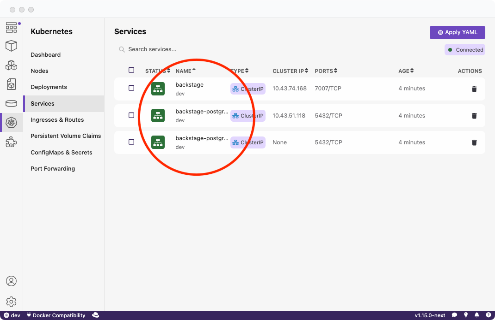
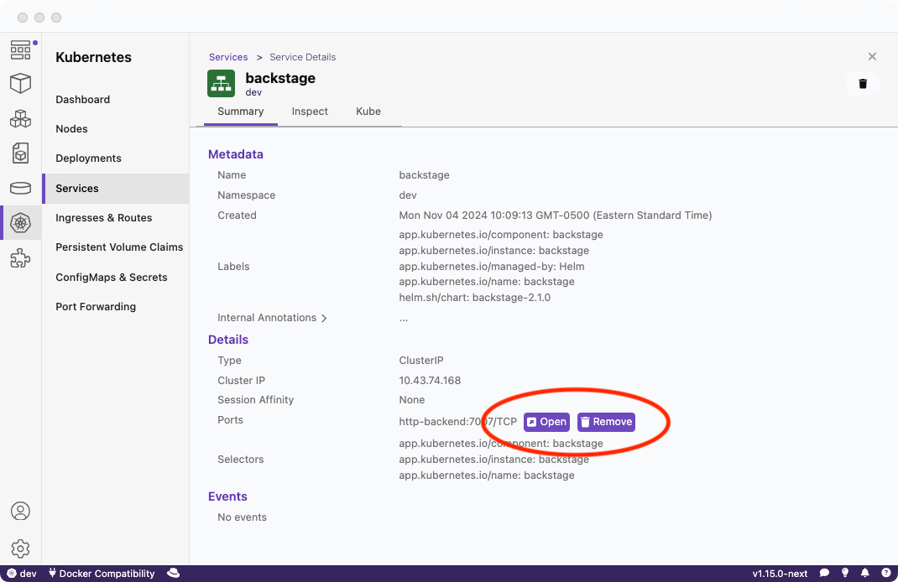
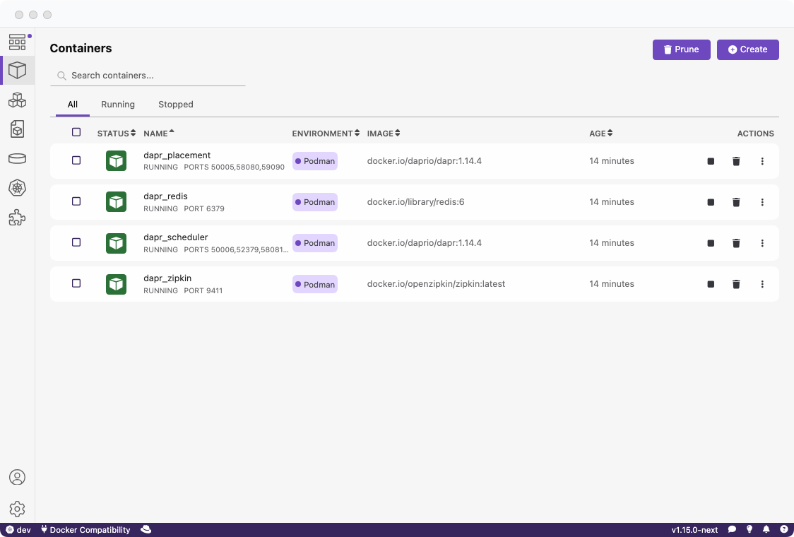
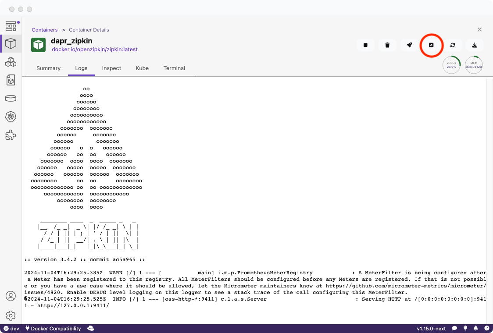

import ReactPlayer from 'react-player'


# Launching CNCF projects from Podman Desktop

Podman Desktop serves as a powerful tool for managing and visualizing cloud-native applications and can interact seamlessly with a range of [CNCF (Cloud Native Computing Foundation)](https://www.cncf.io/) projects. 

It's an accessible platform for developers working with single-container applications, multi-container configurations with Compose files, and complex, distributed applications on Kubernetes clusters. 

## Key features of Podman Desktop for CNCF projects

Podman Desktop brings together three powerful features for managing small to large-scale projects:
* **Container Management**: Supports creating, running, and monitoring containers.
* **Compose Support**: Allows you to deploy applications defined in [Compose files](https://www.compose-spec.io/). This is particularly useful for managing applications that require multiple services, such as web servers, databases, and caches.
* **Kubernetes Integration**: Offers tools to manage multi-node Kubernetes clusters, making it ideal for handling more complex distributed applications that need orchestration across several pods and services. You can setup your own development cluster with Podman Desktop using our [Minikube](/docs/minikube/installing-extension) or [Kind](/docs/kind/installing-extension) extensions.

## Minikube

[Minikube](https://minikube.sigs.k8s.io/docs/) is a local Kubernetes development cluster which allows for an easy way to learn and develop for Kubernetes.

Minikube can be seamlessly integrated with Podman Desktop, enabling Kubernetes development workflows within Podman’s environment. This is made possible by [installing the Minikube extension](https://podman-desktop.io/docs/minikube/installing-extension), which allows creating, managing, and deploying clusters directly from the Podman Desktop.


The following video provides a complete guide from installation to cluster creation:

<ReactPlayer playing playsinline controls url='https://github.com/containers/podman-desktop-media/raw/refs/heads/minikube/video/guide.mp4' width='100%' height='100%' />

## Backstage

[Backstage](https://backstage.io/) is an open-source platform for building developer portals, designed by Spotify. It empowers engineering teams to create customized, centralized hubs for managing and documenting their services, applications, and infrastructure. Backstage’s extensible architecture includes features for cataloging software components, organizing documentation, managing cloud resources, and tracking workflows.

A popular method for deploying Backstage is through a [Helm chart](https://github.com/backstage/charts). Once deployed, you can view Backstage’s services in the Kubernetes Dashboard to monitor components and ensure proper configuration:




You can also access your deployed Backstage instance by using Podman Desktop's port forwarding feature. This feature allows you to securely forward a local port to the Backstage service running on your Kubernetes cluster, making it easy to access the instance from a local browser.



## Dapr

[Dapr](https://docs.dapr.io/) (Distributed Application Runtime) is an open-source, event-driven runtime designed to help developers build resilient, stateless, and stateful applications that can run seamlessly on cloud or edge environments. 

Dapr abstracts the complexities of distributed systems, offering building blocks for service invocation, state management, pub/sub messaging, and resource bindings, which simplify the development of microservices and cloud-native applications.

Dapr can be deployed in a local environment using Podman by following their [self-hosted podman setup](https://docs.dapr.io/operations/hosting/self-hosted/self-hosted-with-podman/).

To initialize Dapr with Podman after installing the Dapr CLI, execute the following command:

```console
$ dapr init --container-runtime podman
```

Once initialized, you can manage and interact with Dapr directly within Podman Desktop:



Additionally, Podman Desktop provides a "Launch Browser" button, allowing quick and convenient access to the Dapr UI for monitoring and management:



## Conclusion

Whether you’re managing Kubernetes clusters, harnessing the power of Backstage for developer portals, or deploying microservices with Dapr, Podman Desktop provides a unified environment to streamline your workflows.

Check out the [list of graduate and incubating projects](https://www.cncf.io/projects/) to discover even more possibilities with Podman Desktop.