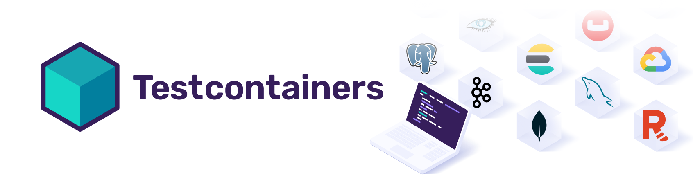

import ReactPlayer from 'react-player'

# What are Testcontainer 

[Testcontainer](https://testcontainers.com/) is an open source library that allows you to test anything that you can create container of modules. Those modules are preconfigured dependencies like Databses, various Cloud technologies, or Message Brookers.

Besides that, Testcontainer support various languages in which you can easily write your tests, like Python, Go, Rust, Ruby, JavaScript, .NET, Java and others. 

## Common use cases with Testcontainer

Thanks to container, you are able to get fresh, clean instance without any complex setup for use cases like:
* Data access layer integration tests
* UI/Acceptance tests
* Application integration tests

