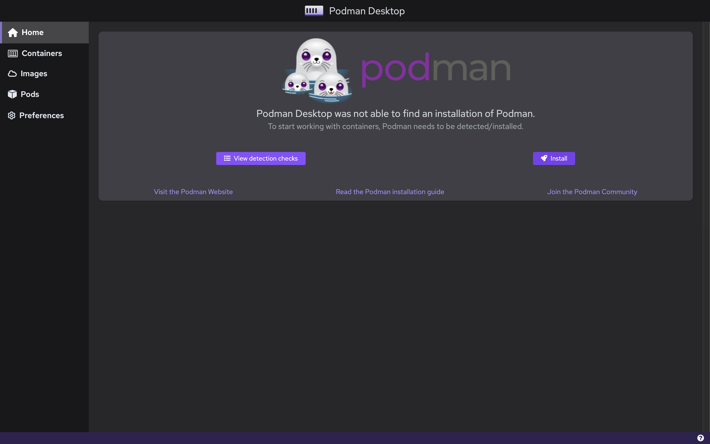

# MacOS

This page contains information regarding installation of Podman Desktop on MacOS. 

You can install Podman Desktop on Mac:

<ol>
<li>1. Using the .dmg file</li> 
<li>2. Using Brew</li>
</ol>
<br/>

:::infoPrerequisite
Podman Desktop requires [Podman Engine](https://docs.podman.io/en/latest/index.html). If you don't have Podman Engine installed, Podman Desktop will prompt you to do so at a later stage.
:::

## Installing Podman Desktop on MacOS using .dmg file

**1. Download the `.dmg` file from the [Downloads](/downloads/macos) section of this website.**

While we recommend getting the "universal" binary file which will work irrespective of the chip architecture your Mac possesses, you also have the option to get the applicable .dmg file depending on your Mac Hardware Architecture (i.e. Intel or Apple M1).

**2. Locate the downloaded file and and double-click on it. (Usually, you will find the downloaded file in the Downloads folder)**

<!-- >  -->
 <br/>

**3. Drag Podman Desktop icon to the Applications folder.**

<!-- >  -->
 <br/>

**4. Start Podman Desktop from the 'Launchpad' or Mac's `Applications` directory.**

<!-- >  -->
 <br/>

**5. Install Podman from Podman Desktop, if not yet installed.** 

When you open Podman Desktop for the first time, click on the "View detection checks" button to scan if all the prerequisites to use Podman Desktop are met. If it says `❌ podman cli was not found in the PATH`, then you need to install the Podman CLI/Engine which can be done within the application. 

<!--  -->
 <br/>

Click on the "Install" button next to the "View detection checks" button, and follow the instructions on screen. 
You will be redirected to the Podman Installer. Follow the instructions on screen and enter your system password when asked.

<!--  -->
 <br/>

After installation is complete, close the installer. Podman Engine has been installed and you are now ready to use Podman Desktop.

## Installing Podman Desktop on MacOS using [brew](https://brew.sh/).

:::infoPrerequisite
- [Homebrew](https://brew.sh/)
:::

### Installation steps

<ol>
<li>1. Open a terminal on your Mac.</li>
<li>2. Run the command mentioned below.</li>  
</ol>

```sh
brew install podman-desktop
```

<br/>

Brew will also install the Podman Engine along with the Podman Desktop application, in case you don't have it installed yet. 

After the command is executed, you can find the Podman Desktop Application within the `Applications` directory of the MacOS.

## Getting Started

Learn more on how to get started with Podman Desktop by clicking [here](/docs/getting-started/getting-started).


