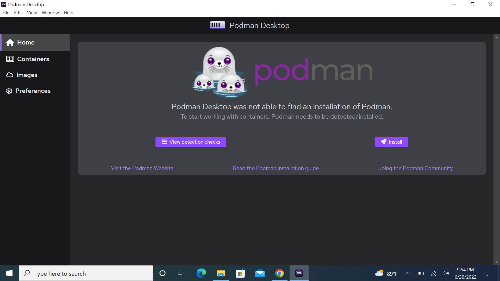
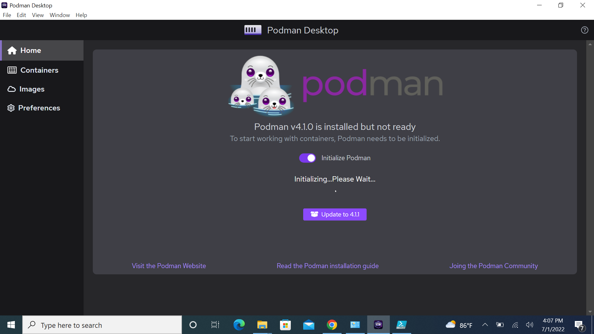
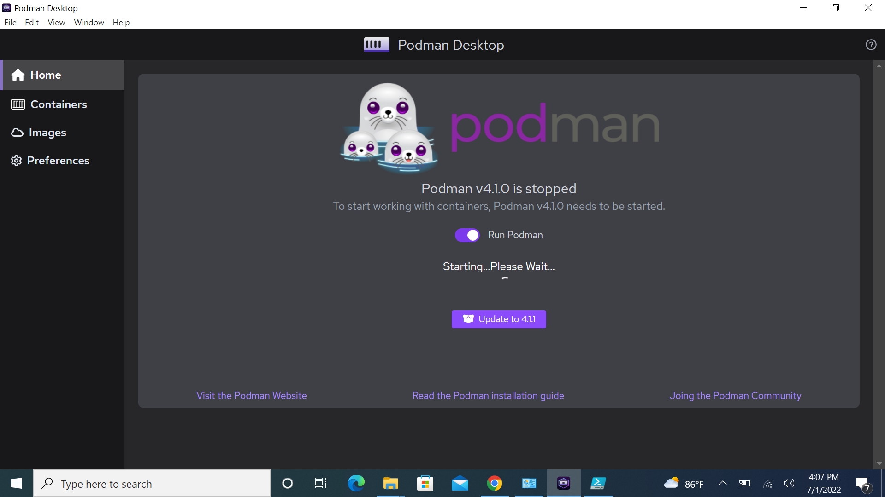
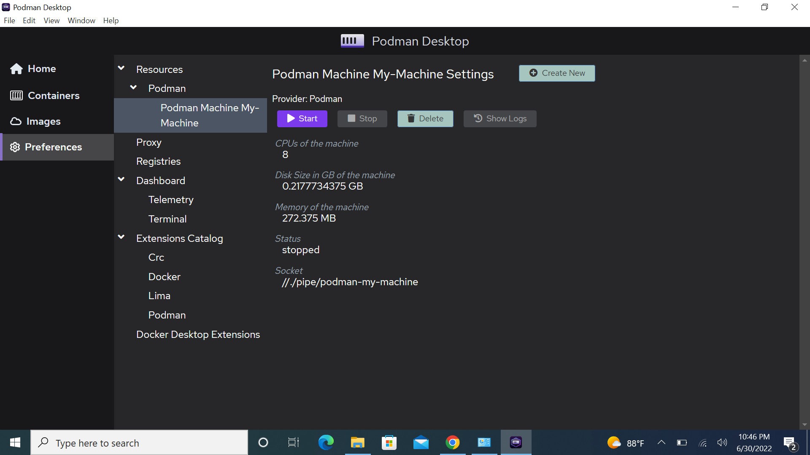

# Windows
## 1. Installing Podman Desktop on Windows

In order to install the latest Podman Desktop application for Windows, visit the [Downloads](/downloads/windows) section of this website to download the .exe file.

Simply download the file from the [Downloads](/downloads/windows) section and open it in your Desktop to install Podman Desktop.

## 2. Installing Podman (if not already present)

If you don't have Podman installed in your Windows computer, Podman Desktop will prompt you to do so as soon as you open the application. With the latest update, Podman Desktop will be able to install and configure Podman once you click on the 'Install' button on the home page.

## 3. Initialize & Start the Podman Machine

### a. Default Configurations

Once Podman is installed, you will see a toggle button at "Home" window that will allow you to initialize a Podman Machine with default configurations. Simply activate the toggle to proceed.

After initializing a Podman Machine, you should see a toggle to Run Podman. This will start the Podman Machine upon activation.

### b. Custom Configurations

In order to initialize a Podman Machine with custom configurations, go to "Preferences" on the menu present in the left-side of the application. Under Resources, you will find Podman. Clicking on it shall load the configuration settings for the machine. Enter the values that deem fit for your purpose and click on the "Create" button.

Once the machine is created, you can click on the Start button in the Machine Settings to start the Machine.

**Well that's just it. You shall now be all set to use Podman Desktop on Windows!**

