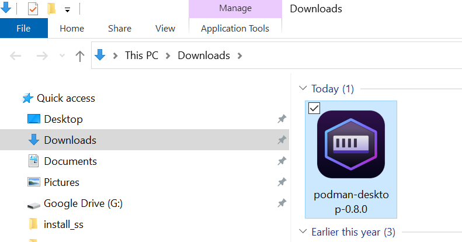
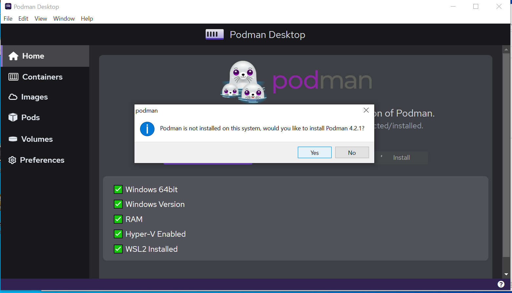
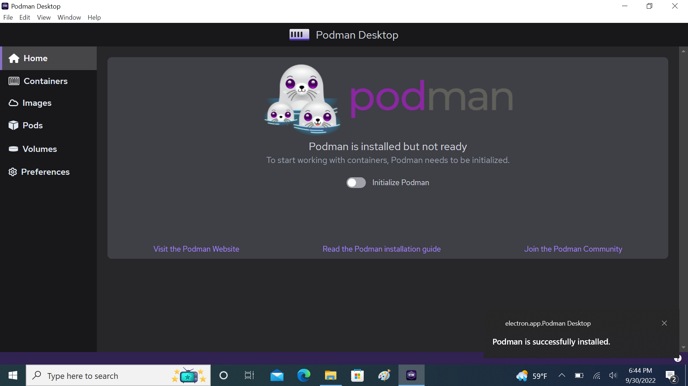

# Windows

This page contains information regarding installation of Podman Desktop on Windows.

:::infoPrerequisite
Podman Desktop on Windows requires the following:
- 1) [Podman Engine](https://docs.podman.io/en/latest/index.html)
- 2) Hyper-V should be enabled
- 3) Windows Subsystem for Linux v2 (WSL2) should be installed
:::

**1. Download the latest `.exe` file from the [Downloads](/downloads/windows) section of this website.**

**2. Locate the downloaded file and and double-click on it to open Podman Desktop. (Usually, you will find the downloaded file in the Downloads folder)**

**3. Install Podman from Podman Desktop, if not yet installed.**

When you open Podman Desktop, your home screen would look like the one in the image below if you don't have Podman (Engine) installed.

**a.To install Podman, click on the `Install` button on the home screen. This will check for all the requirements for installation of Podman Engine.**

**b. If you do not have WSL2 installed, follow the instructions [here](https://learn.microsoft.com/en-us/windows/wsl/install-manual) to install the same.**

**c. Once all the requirements are met, Podman Desktop will ask you to allow installation of Podman (Engine). Click on `Yes` to continue.**

**4. Once installation is completed, you are ready to use Podman Desktop.**

After the installation of Podman Engine, your home screen would like the one in the image below.

If the screen says `Podman is installed but not ready`, it means that installation of Podman Engine has been completed but a Podman Machine has not been initialized. 

You can learn more about working with Podman Desktop in our [Getting Started guide](/docs/getting-started/getting-started).