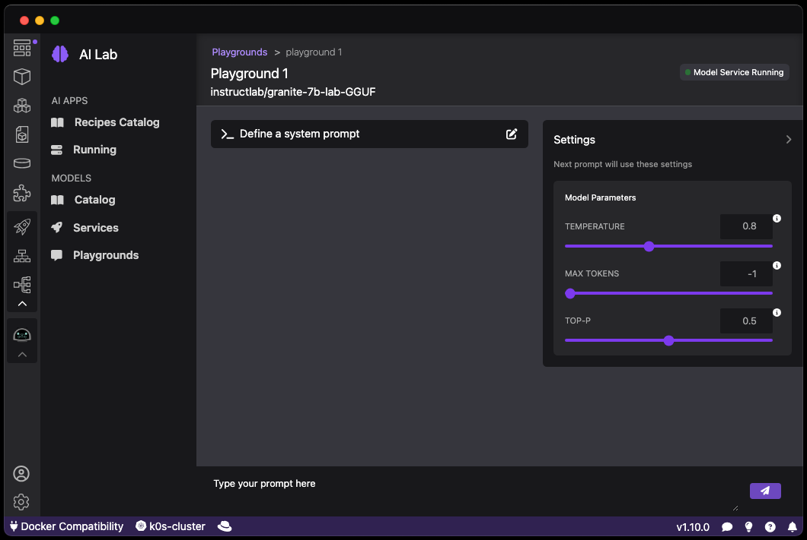

# Starting an inference server for a model

The integrated Playground environments allow for experimenting with available models in a local environment. An intuitive user prompt helps in exploring the capabilities and accuracy of various models and aids in finding the best model for the use case at hand. The Playground interface further allows for parameterizing models to further optimize the settings and attributes of each model.

#### Prerequisites

- [Podman AI Lab installed](/docs/ai-lab/installing).
- [Model downloaded](/docs/ai-lab/download-model).
- [An inference server created for a model](/docs/ai-lab/start-inference-server).

#### Procedure

1. Click the Podman AI Lab icon in the navigation bar
1. In the Podman AI Lab navigation bar, click **Models > Playgrounds** menu item.
1. Click the **New Playground** button on the top right.
1. Select the model you want to start an inference server for in the **Model** list and click the **Create playground** button.
1. The playground for the model is being started and after a while, a chat interface is displayed.
   

#### Verification

1. On the chat interface, you can optionally set the system prompt.
1. Enter text in the prompt field and press the **ENTER** key.
