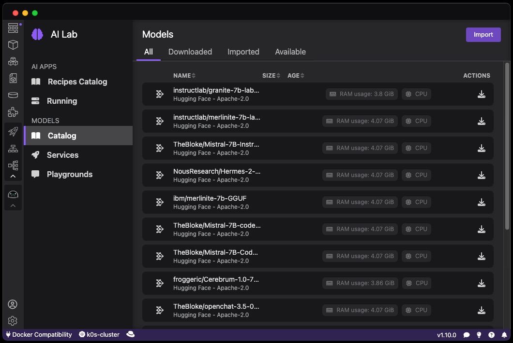
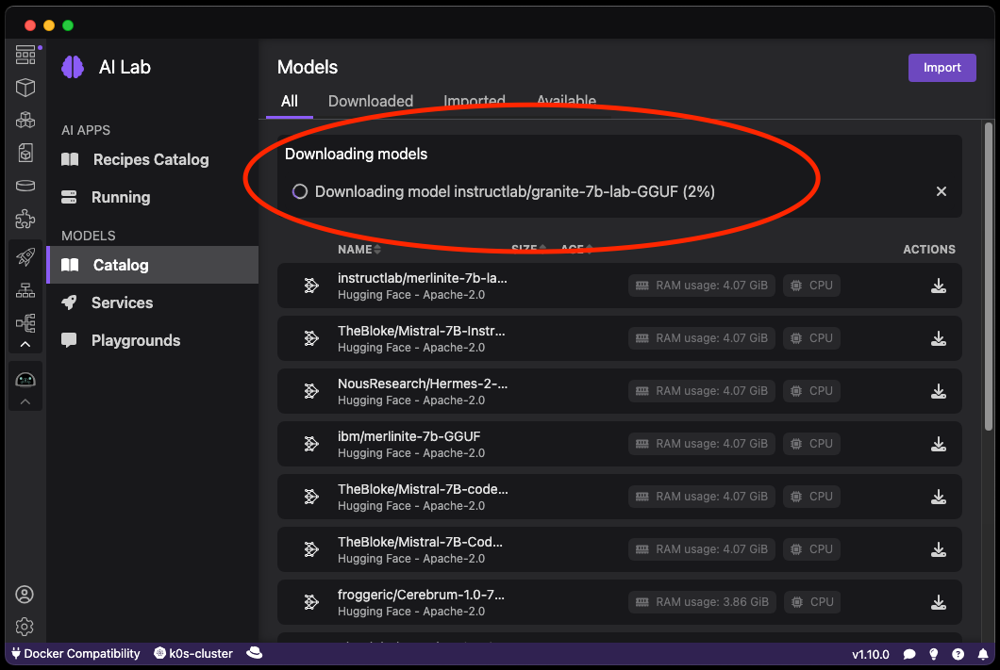

# Downloading a model

Podman AI Lab provides a curated list of open source AI models and LLMs. Once downloaded, the models are available to be used for AI applications, model services and playgrounds.

#### Prerequisites

- [Podman AI Lab installed](/docs/ai-lab/installing).

#### Procedure

1. Click the Podman AI Lab icon in the navigation bar
1. In the Podman AI Lab navigation bar, click **Models > Catalog** menu item.
1. The curated list of models is now displayed.
   
1. Click on the download icon on the right side of the list to start downloading a model.
   

#### Verification

1. Once the model is downloaded, the curated models list is updated and the icon next to the model is green and new actions are available on the left.

