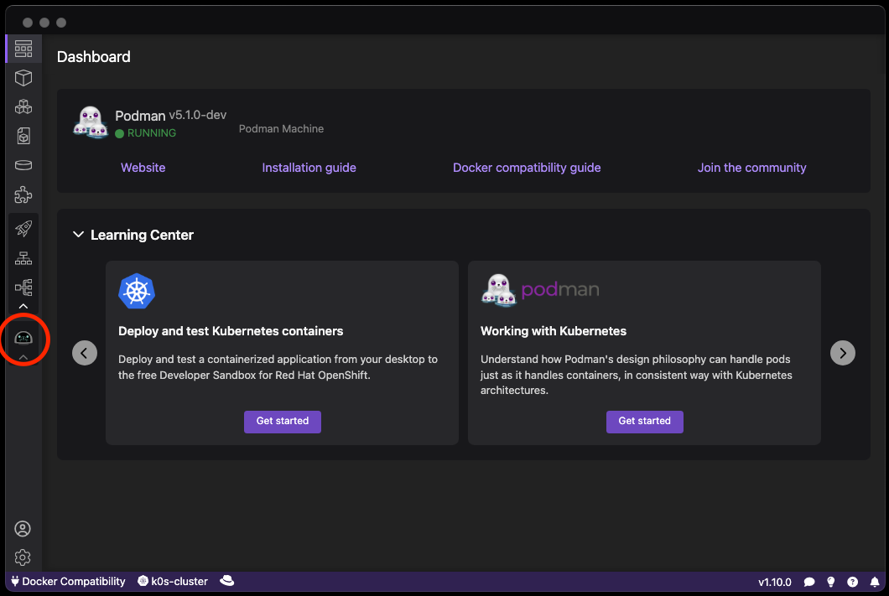

# Installing the Podman AI Lab extension

The AI Lab extension extends the capabilities of Podman Desktop for Large Language Models (LLMs). It has to be installed before you can use it. Installation is just a click if you have Podman Desktop installed already.

#### Procedure

If you have Podman Desktop already installed, <a href="podman-desktop:extension/redhat.ai-lab">**click to launch the installation**</a> of Podman AI Lab in Podman Desktop.

If not, please [install Podman Desktop](/docs/installation) first.

#### Verification

1. The navigation bar should contain the Podman AI Lab icon.
   
