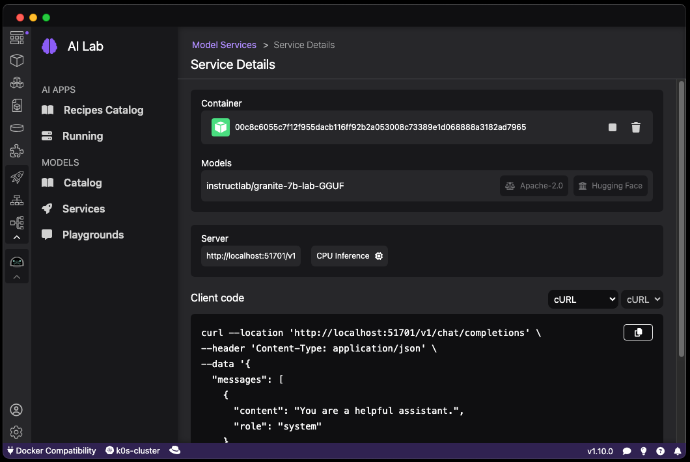

# Starting an inference server for a model

Once a model is downloaded, a model service can be started. A model service is an inference server that is running in a container and exposing the model through the well-known chat API common to many providers.

#### Prerequisites

- [Podman AI Lab installed](/docs/ai-lab/installing).
- [Model downloaded](/docs/ai-lab/download-model).

#### Procedure

1. Click the Podman AI Lab icon in the navigation bar
1. In the Podman AI Lab navigation bar, click **Models > Services** menu item.
1. Click the **New Model Service** button on the top right.
1. Select the model you want to start an inference server for in the **Model** list and click the **Create Service** button.
1. The inference server for the model is being started and after a while, click on the **Open service details** button.

#### Verification

1. Once the inference server is started, the details for the inference server allows you to generate code snippets in various languages to access the model through the inference server.
   
1. You can change the target language, here for Java and Quarkus.
   
