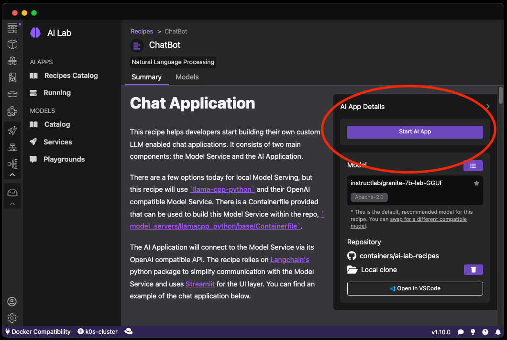

# Starting a recipe (inference server) for a model

Once an AI model is available through a well known endpoint, it's easy to imagine a new world of applications that will connect and use the AI model. Podman AI Lab support AI applications as a set of containers that are connected together.

Podman AI Lab ships with a so-called Recipes Catalog that helps you navigate a number of core AI use cases and problem domains such as Chat Bots, Code Generators and Text Summarizers. Each recipe comes with detailed explanations and sample applications that can be run with various large language models (LLMs). Experimenting with multiple models allows finding the optimal one for your use case.

#### Prerequisites

- [Podman AI Lab installed](/docs/ai-lab/installing).
- [Model downloaded](/docs/ai-lab/download-model).

#### Procedure

1. Click the Podman AI Lab icon in the navigation bar
1. In the Podman AI Lab navigation bar, click **AI Apps > Recipes Catalog** menu item.
1. The list of available recipes is displayed. Click on the **Chatbot** recipe card.
   
1. Click the **Start AI App** button to start the containers for this recipe.

#### Verification

1. Once the AI app is started, the details for the recipe are updated and the recipe is switched to RUNNING mode.
   
1. To test the application, click on the <Icon icon="fa-solid fa-arrow-up-right-from-square" size="lg" /> icon and your browser will be connected to the client application.
