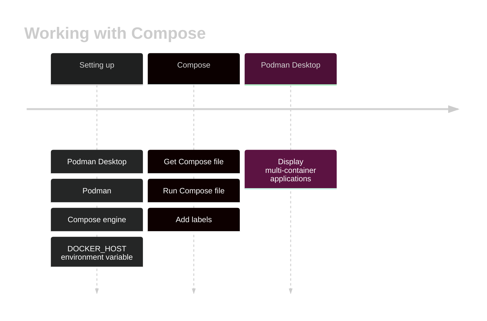

# Working with Compose

Podman Desktop supports the [Compose specification](https://compose-spec.io), and can:

- Set up a Compose engine.
- Manage multi-container applications defined in Compose files.

### Procedure

[](https://mermaid.live/edit#pako:eNp9Udtq20AQ_ZVhwOhFMZF8UbRvJS4ttCUlDhSKoKytiTJ4L2I1cusK_XvXclJ6o_O0e86Zs7NzBtz7mlBh5WazgR2LggES45v3dCSTKEhq2vVNkkIiT2RpQnQ4JDDCOJtVTtiSYUeVqxzEEhZD8MmHA7sGvrI8wa23re_owm9J5Mz0LSj46GurHWyoO4hvL4Jf6kXwD-LZE8g10-N_CTZ3t-9e3395e7d9iKIjB-8sOYGjDqx35rnlxUbBG5Kft0c2f1gquO_df_lXdQ1G78h0F-b3r8V5uGuNPoHtjfDV3jvRcfAAum0N77Wwd7ETU7QUrOY6ZjKcnSqc9l6hisfz5quY1Rh1uhe_Pbk9Kgk9pdi3tRbasG6CtqgetekiSjWLDx8uIU9Zp9hqh2rAb6iusuU8vynLYp1lZVmusqxI8YQqX6zmRZnneXa9LheLVbkcU_zuffTN5hGMlV0vb9ZFsVhOfp8n7jzI-AMypLOM)

<!--

-->

1. [You set up Compose](compose/setting-up-compose).
1. You have a [Compose file](https://github.com/compose-spec/compose-spec/blob/master/spec.md#compose-file).
1. [You run a Compose engine on the Compose file](compose/running-compose).
1. The Compose engine starts the containers and services, and adds a label to each resource:

   - Container label: `com.docker.compose.project`
   - Service label: `com.docker.compose.service`

1. Podman Desktop detects the Compose labels, and displays the container group as a group of containers.

   
