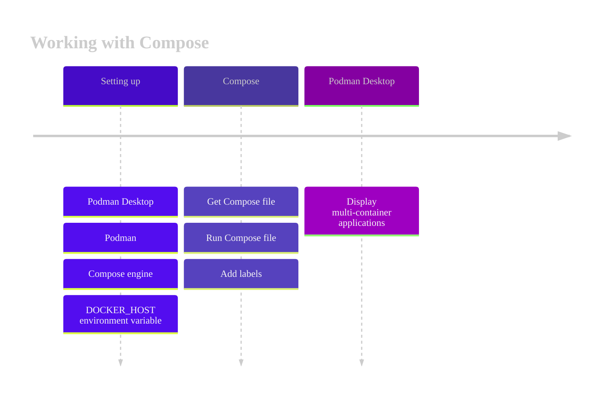

# Working with Compose

Podman Desktop supports the [Compose specification](https://compose-spec.io), and can:

- Set up a Compose engine.
- Manage multi-container applications defined in Compose files.

### Procedure

[](https://mermaid.live/edit#pako:eNp9kluL2zAQhf-KUAl-cUJk52a9tUkv0JYtm6WFxVAUa5wV0cVIcrrZkP9e2c51u1QPtjznm6MxOntcGA6Y4lz3evtcIyS08BS1W4QiadbfYAsyoijisKrXUXxU_BMoaMor5uC2-pNZwVYSXHQ2ClJlhWJ2NzfS2Kbv3Ww1LsrJqfVCPMCzv1BFUVwhDgqj-a1NOSM8vWI8WC9uED5NSFm-ZfPBWA72Qg6HwyusNNp_YkrIXSM6pl3fgRVl1BGH5hUeh14v114okEJDrjvRCy8B_TJ2I_Qa_RH-Cc2NqoyDTl-C941SV4iiH4YrptEC3Mab6nT-eZ2AN4SjJwK9bg__B1jczb9-vP_95W75EKCtsEYr0B5tj5fUtZxsKPoM_vxVCvnKkqL7Wv9Xf885kmwF0nXK7a-FeYSrJNshVUsv-uEaPAuDW8SqSoqCeWF06MQxVmAVEzxks81Qjtts5ZiGbbi6TR4yewgcq71Z7nSBqbc1xLiuOPOwEGxtmcK0ZNKFKnDhjf3ehb3NfIwrpjHd42dM-2Q0SGZZNp0QkmXZmJBpjHeYJul4MM2SJCHDSZam42x0iPGLMcGXDEIxLEJGKZnMZmnr99hqzSCHvyR1ASU)

<!--

-->

1. [You set up Compose](/docs/compose/setting-up-compose).
1. You have a [Compose file](https://github.com/compose-spec/compose-spec/blob/master/spec.md#compose-file).
1. [You run a Compose engine on the Compose file](/docs/compose/running-compose).
1. The Compose engine starts the containers and services, and adds a label to each resource:

   - Container label: `com.docker.compose.project`
   - Service label: `com.docker.compose.service`

1. Podman Desktop detects the Compose labels, and displays the container group as a group of containers.

   
