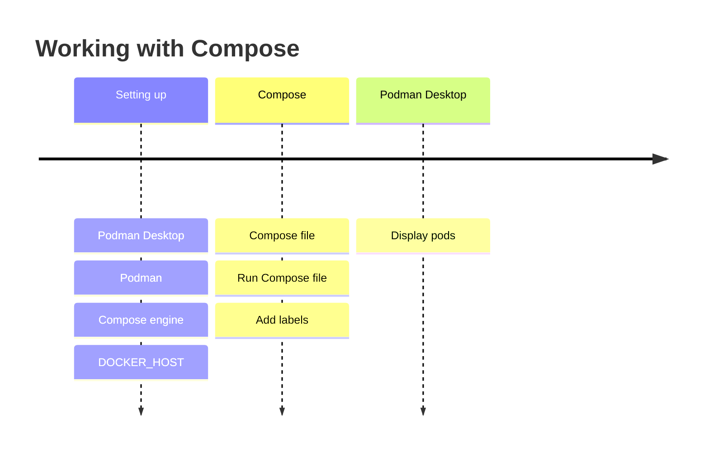

# Working with Compose

Podman Desktop supports the [Compose specification](https://compose-spec.io), and can:

- Set up a Compose engine.
- Manage multi-container applications defined in Compose files.

### Procedure

1. [You set up Compose](compose/setting-up-compose).
1. You have a [Compose file](https://github.com/compose-spec/compose-spec/blob/master/spec.md#compose-file).
1. [You run a Compose engine on the Compose file](compose/running-compose).
1. The Compose engine starts the containers and services, and adds a label to each resource:

   - Container label: `com.docker.compose.project`
   - Service label: `com.docker.compose.service`

1. Podman Desktop detects the Compose labels, and displays the container group as a pod.

   
