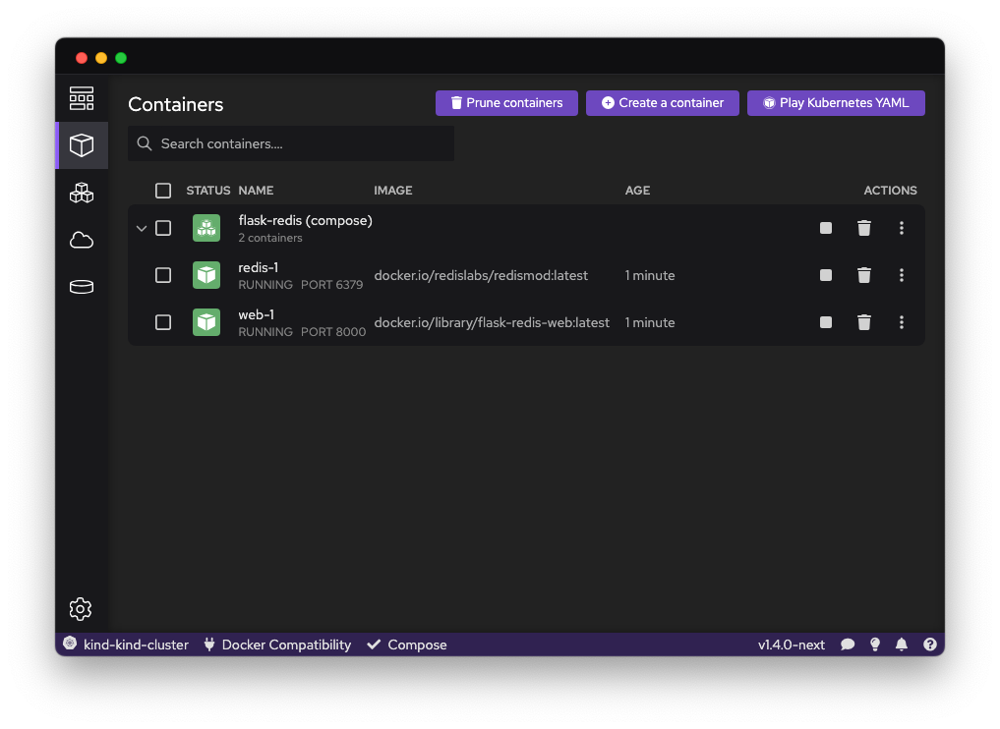

With Podman Desktop, you can manage multi-container applications defined in a Compose file.

#### Prerequisites

- Podman 4.7.0 or greater.
- [You have set up Compose](/docs/compose/setting-up-compose).
- [You have a Compose file](https://github.com/compose-spec/compose-spec/blob/master/spec.md#compose-file), such as `compose.yaml`.

#### Procedure

- Run the command in a terminal:

  ```shell-session
  $ podman compose --file compose.yaml up --detach
  ```

  <details>
  <summary>

  (Alternatively) With an older Podman version, run `docker-compose`:

  </summary>

  1. [Set the DOCKER_HOST variable](/docs/migrating-from-docker/using-the-docker_host-environment-variable).
  1. Run `docker-compose` rather than `podman compose`:

     ```shell-session
     $ docker-compose --file compose.yaml up --detach
     ```

  </details>

  <details>
  <summary>

  (Optionally) Learn about Compose commands:

  </summary>

  ```shell-session
  $ podman compose --help
  ```

  </details>

#### Verification

1. The Compose engine starts the containers and services, and adds a label to each resource:

   - Container label: `com.docker.compose.project`
   - Service label: `com.docker.compose.service`

1. Podman Desktop detects the Compose labels, and displays the container group as a group of containers.

   The Podman Desktop **<Icon icon="fa-solid fa-cube" size="lg" /> Containers** list displays the containers created by Compose grouped in a container group with a `(compose)` suffix, such as `flask-redis (compose)`.


