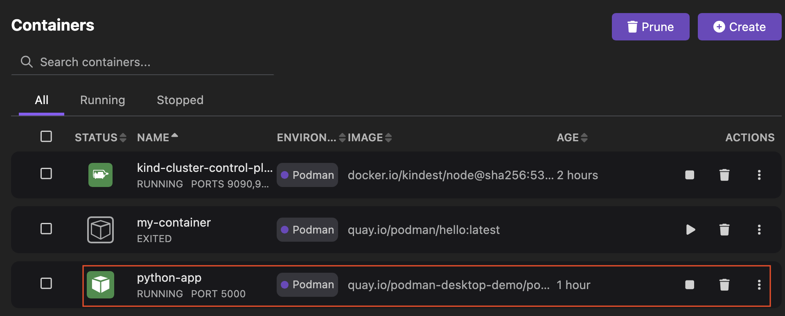
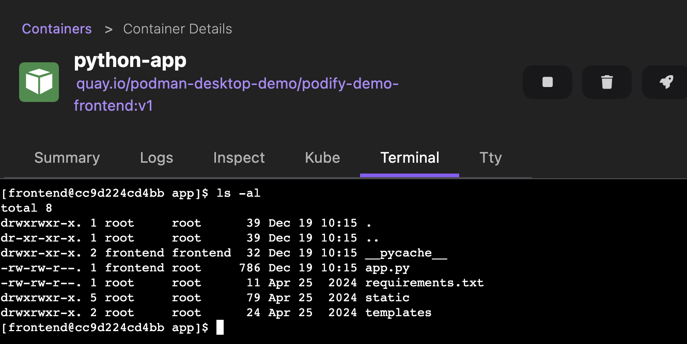

# Accessing the container terminal

You can access the terminal of a container to view its file system, interact with it using commands, or troubleshoot the environment in which it runs.

#### Prerequisites

Make sure you have:

- [A running Podman machine](/docs/podman/creating-a-podman-machine).
- [Started a containerized application](/blog/2024/10/05/kubernetes-blog#building-a-containerized-application).

#### Procedure

1. Go to the **Containers** component page. 
1. Click the name of the container, such as `python-app`. The Container Details page opens.
  
1. Select the **Terminal** tab.
1. Run any commands to interact with the container. For example, run the `ls -al` command to list hidden files.
  
1. Click the **close** icon on the right-hand side of the page.

