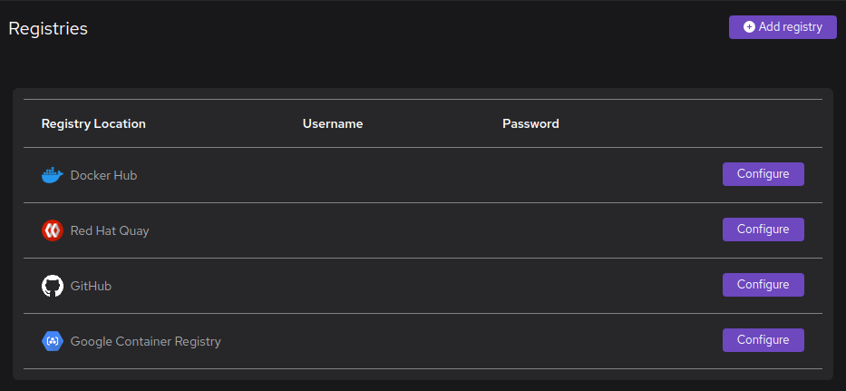

# Working with container registries

Podman Desktop has access to public registries by default.

You might want to configure Podman Desktop to:

- [Authenticate to a preconfigured registry](/docs/containers/registries/authenticating-to-a-preconfigured-registry).
- [Add an Insecure Registry to Podman Desktop](/docs/containers/registries/insecure-registry).

