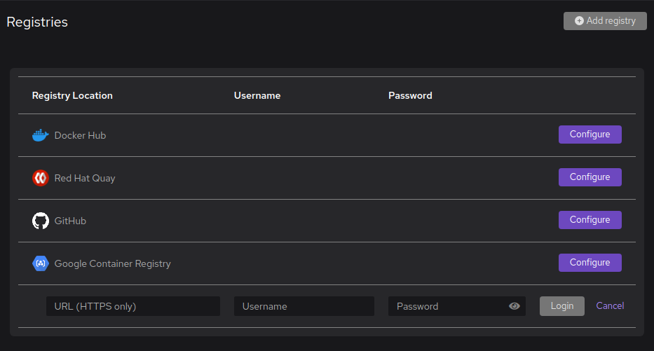

import Tabs from '@theme/Tabs';
import TabItem from '@theme/TabItem';

# Setting up container registries

:::tip[Before you start]

Before you start, you should:

- Get authentication details for your container registry:
  - Registry URL.
  - User name.
  - Password, or OAuth secret.
- Get the fully qualified name of a private image stored in your registry, such as `my-registry.tld/my-repository/my-image`.
- Get the fully qualified image name that your registry requires to push an image, such as `my-registry.tld/my-repository/my-image`.

:::

## Setting up a pre-configured registry

To ease usage of the most popular container registries, Podman Desktop has pre-configured registries, including:

- Docker Hub
- Red Hat Quay
- GitHub
- Google Container Registry

If your container registry is in this list, follow the steps:

1. Go to **<Icon icon="fa-solid fa-cog" size="lg" /> Settings > Registries**.
2. In your registry line, click **Configure**.
3. Enter your registry credentials:

   

   1. **Username**: Enter your user name.
   2. **Password**: Enter your password or OAuth secret.
   3. Click **Login**.

Podman Desktop logs Podman in with the provided credentials.

If you enter the wrong credentials, you see an error message:

1. Enter the correct credentials
2. Click **Login** again.

## Setting up a custom registry

You have a custom container registry, or one that is not available in the pre-configured list: we have got you covered. Follow the steps:

1. Go to **<Icon icon="fa-solid fa-cog" size="lg" /> Settings > Registries**.
1. Click **<Icon icon="fa-solid fa-plus-circle" size="lg" /> Add registry** at the top right corner of the screen.
1. Enter your registry details:

   

   1. **Registry Location**: Enter your repository URL, such as `https://myregistry.tld`.
   2. **Username**: Enter your user name.
   3. **Password**: Enter your password or OAuth secret.
   4. Click **Login**.

Podman Desktop logs Podman in with the provided credentials.

If you enter the wrong credentials, you see an error message:

1. Enter the correct credentials
2. Click **Login** again.

## Setting up a registry with an insecure certificate

If your registry has an insecure certificate, such as a self-signed certificate, you see a warning when setting up the registry.

1. In the **Invalid Certificate** window, click **Yes** to add the registry anyway.

   

1. Tell Podman that it has your authorization to access the insecure registry: edit the `registries.conf` file.

   1. Go to a location where you can edit the `registries.conf` file:

      <Tabs groupId="operating-systems">
      <TabItem value="win" label="Windows">

      - The configuration file is in the Podman machine: open a terminal in the Podman Machine.

        ```shell-session
        $ podman machine ssh --username root [optional-machine-name]
        ```

      </TabItem>
      <TabItem value="mac" label="macOS">

      - The configuration file is in the Podman machine: open a terminal in the Podman Machine.

        ```shell-session
        $ podman machine ssh --username root [optional-machine-name]
        ```

      </TabItem>
      <TabItem value="linux" label="Linux">

      - The configuration file is in your host: open a terminal with superuser privileges.

        ```shell-session
        $ sudo su -
        ```

      </TabItem>
      </Tabs>

   1. Edit the registry optional configuration file.

      ```shell-session
      # vi /etc/containers/registries.conf`
      ```

      For each insecure registry, add a `[[registry]]` section that defines:

      - `location =`: Enter your registry URL.
      - `insecure = true`: Accept the insecure certificate.

      For example, if your have two registries, such as `https://my-registry.tld` and `http://registry.example.com`, add the following lines:

      ```toml
      [[registry]]
      location = "my-registry.tld"
      insecure = true

      [[registry]]
      location = "registry.example.com"
      insecure = true
      ```

1. Restart Podman to apply the changes.

   <Tabs groupId="operating-systems">
   <TabItem value="win" label="Windows">

   1. Go to **<Icon icon="fa-solid fa-cog" size="lg" /> Settings > Resources**.
   1. Restart the Podman machine.

   </TabItem>
   <TabItem value="mac" label="macOS">

   1. Go to **<Icon icon="fa-solid fa-cog" size="lg" /> Settings > Resources**.
   1. Restart the Podman machine.

   </TabItem>
   <TabItem value="linux" label="Linux (rootless)">

   - Stop all Podman processes.

     ```shell-session
     $ pkill podman
     ```

   </TabItem>
   <TabItem value="linux-rootful" label="Linux (rootful)">

   - Restart Podman.

     ```shell-session
     $ sudo systemctl restart podman
     ```

   </TabItem>
   </Tabs>

## Verifying your registry setup

To verify your registry has been properly configured, you can do the following steps:

1. In **<Icon icon="fa-solid fa-cog" size="lg" /> Settings > Registries**, the line with your registry has content in the Username and Password column, and action icons replacing the Configure button.

1. Pull a private image from the registry.

   1. Get the name of a private image stored in your registry, such as `quay.io/my-repository/my-image`, `ghcr.io/my-repository/my-image`, `docker.io/my-repository/my-image`, or `my-registry.tld/my-repository/my-image`.
   1. Go to **Images**.
   1. Click **Pull an image**.
   1. On the **Image to Pull** screen:
      1. **Image to pull**: Enter the image name.
      1. Click Pull image.
   1. Click Done.

1. Push an image to the registry:

   1. Get the fully qualified image name that your registry requires, such as `quay.io/my-repository/my-image`, `ghcr.io/my-repository/my-image`, or `docker.io/my-repository/my-image`.
   1. Go to **Images**.
   1. Click **Build an image**.
   1. On the **Build Image from Containerfile** screen
      1. **Containerfile path**: select the Containerfile or Dockerfile to build.
      2. **Image Name**: enter the fully qualified image name that your registry requires.
      3. Click Build.
      4. Click Done.
   1. On your image line, click **<Icon icon="fa-solid fa-ellipsis-v" size="lg" />**.

      The contextual menu has a **Push Image to _your registry_** entry.

## Changing your credentials

To change your registry credentials, you can do the following steps:

1. Go to **<Icon icon="fa-solid fa-cog" size="lg" /> Settings > Registries**.
1. On your registry line, click **<Icon icon="fa-solid fa-ellipsis-v" size="lg" />**.
1. Click **Edit password**.
1. Enter your credentials in the **Username** and **Password** fields, and click **Login**.

Podman Desktop logs Podman in with the updated credentials.

## Removing a registry

To remove your registry, you can do the following steps:

1. Go to **<Icon icon="fa-solid fa-cog" size="lg" /> Settings > Registries**.
1. On your registry line, click **<Icon icon="fa-solid fa-ellipsis-v" size="lg" />**.
1. Click Remove.

Podman Desktop removes the registry from the settings, and logs Podman out from the registry.

## Finding Podman registry configuration files

Podman has two files to configure registries:

- `auth.json` defines the authentication to registries.

  Podman Desktop stores this file directly on your host, in `$HOME/.config/containers/auth.json`.

  The Podman machine mounts the authentication configuration file to access it.

  When you delete the Podman machine, the registry configuration is not lost: it stays on your host.

- `registries.conf` defines optional features, such as allowing insecure certificates.

  The Podman machine stores the file in `/etc/containers/registries.conf`.

  When you delete the Podman machine, this file is deleted.

## Next steps

Consider completing some other common tasks that depend registries:

- Pulling an image.
- Pushing an image to a registry.
