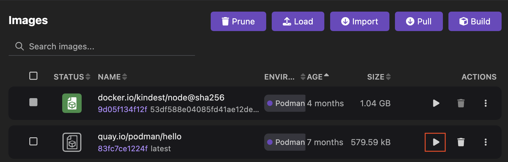
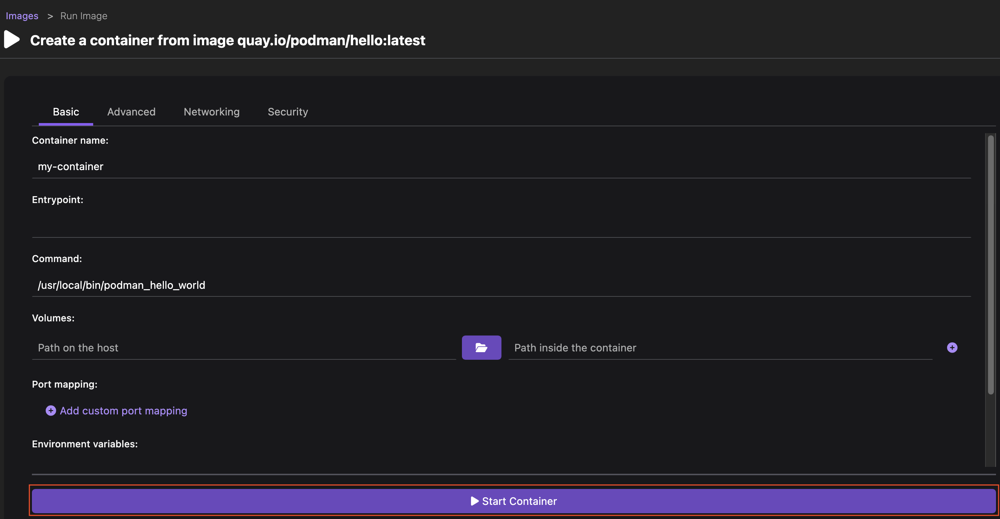
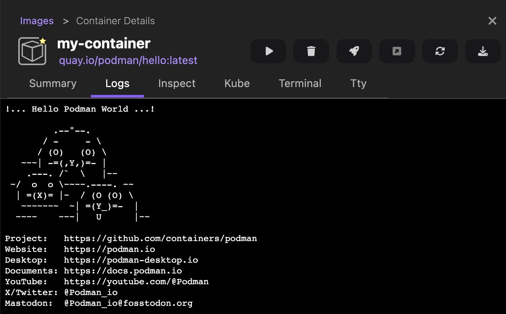

# Starting a container on your container engine

With Podman Desktop, you can start a container from an image on your container engine.
You can interact with the running container by using the terminal in Podman Desktop or by opening your browser to the exposed ports.

#### Prerequisites

- [A running Podman machine](/docs/podman/creating-a-podman-machine).
- The **Images** list has your image, such as `quay.io/podman/hello`. See [Pulling an image](/docs/containers/images/pulling-an-image). 

#### Procedure

1. Go to the **Images** component page.
1. Click the **Run Image** icon corresponding to the image you want to run. For example, `quay.io/podman/hello`. 
   
1. Review or edit the container configuration details.
1. Click **Start Container**. The Container Details page opens.
   
1. Select the **Logs** tab to view the program running.
   
1. Click the **close** icon on the right-hand side of the page.

#### Verification

1. Go to the **Containers** component page.
1. **<Icon icon="fa-solid fa-search" size="lg" />**: Enter your image name, such as `quay.io/podman/hello`, to find your running container.
1. Click your running container name to perform any of the following tasks:
   - [View logs](/docs/containers/viewing-container-logs)
   - Inspect the container
      1. Go to **Inspect**.
      1. Click the content area to activate it.
      1. Press <kbd>Ctrl</kbd> + <kbd>F</kbd> on Windows and Linux, or <kbd>⌘</kbd> + <kbd>F</kbd> on macOS to start searching the content.
   - Generate a Kubernetes YAML manifest when your container engine is Podman:
      1. Go to **Kube**.
      1. Click the content area to activate it.
      1. Press <kbd>Ctrl</kbd> + <kbd>F</kbd> on Windows and Linux, or <kbd>⌘</kbd> + <kbd>F</kbd> on macOS to start searching the content.
      1. Optional: Copy the content to a YAML file.
      1. Optional: Reuse this file to create a pod that you can can run on a Podman engine or a Kubernetes cluster. See [Pod creation with Kubernetes YAML](https://podman-desktop.io/blog/2024/10/05/kubernetes-blog#creating-a-pod).
   - [Access the terminal](/docs/containers/accessing-the-terminal)
   - Access the application by exposing a port:
      1. Click **<Icon icon="fa-solid fa-external-link" size="lg" />**.
      1. View the running application at `localhost:port` in your browser.
   - [Deploy the container to a Kubernetes cluster](/docs/kubernetes/deploying-a-pod-to-kubernetes)

#### Additional resources

- [Building a containerized application](/blog/2024/10/05/kubernetes-blog#building-a-containerized-application)
- [Running a pod using a container or docker file](/tutorial/running-a-pod-using-a-container-docker-file)
- [Managing containers and pods](/tutorial/managing-your-application-resources#managing-containers-and-pods)