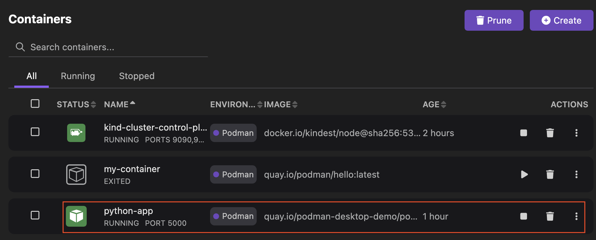

# Viewing the container logs

You can view the logs of a container to identify and resolve any issues with the container or examine the record of triggered events.

#### Prerequisites

Make sure you have:

- [A running Podman machine](/docs/podman/creating-a-podman-machine).
- [Started a containerized application](/blog/2024/10/05/kubernetes-blog#building-a-containerized-application).

#### Procedure

1. Go to the **Containers** component page. 
1. Click the name of the container, such as `python-app`.
    
1. Analyze the logs of the container.
    
1. Click the **close** icon on the right side of the page.

    :::note

    Alternatively, click the **overflow menu** icon and then select the **Open Logs** option to view the container logs.
    
    
    :::

