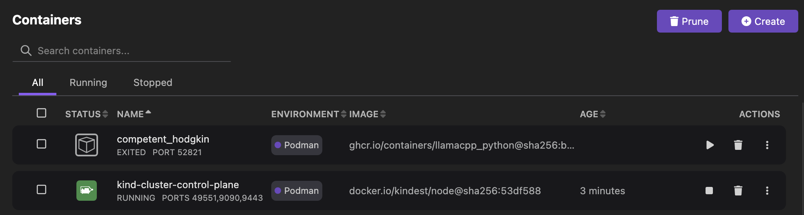
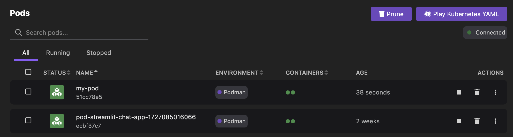
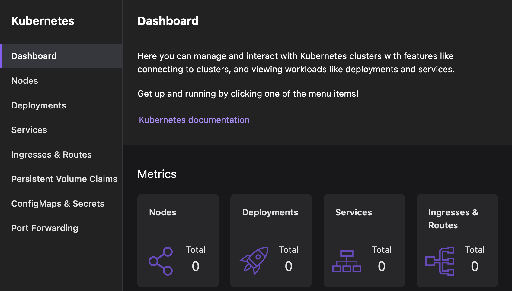
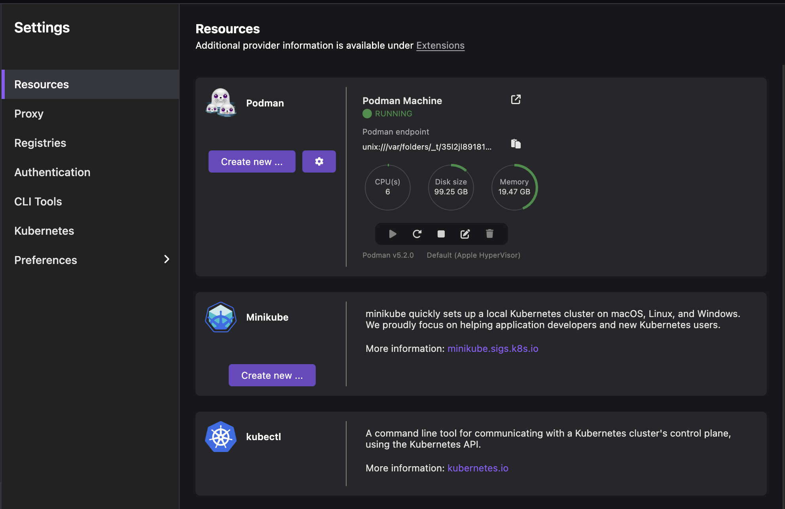

# Discover Podman Desktop

Podman Desktop is a developer tool that you can use to perform basic and advanced tasks. From creating a container or pod to setting up a kubernetes cluster to integrating your local tools using extensions, Podman Desktop offers all these features to ease your daily development tasks. But, what makes Podman Desktop different from other community-driven tools?

The key differentiator is its intuitive UI that allows you to visualize your development environment, such as the number of pods or Kubernetes clusters running or the number of services exposed.

In addition, you can run this tool on three different operating systems; macOS, Windows, and Linux. Podman Desktop runs your workloads on a Podman engine and therefore, provides you Podman-native capabilities to interact with your applications. But, this does not mean you cannot run your Docker applications. You can use the Docker compatibility UI feature for a smooth transition to Podman Desktop.

Let’s quickly explore this tool’s key functionalities.

### Manage containerized environment

Access the **Containers** page in the UI to do the container-related tasks:

- Create a container with a Containerfile or Dockerfile or from an existing image.
- Create a pod from a list of containers.
- [Deploy a container to a Kubernetes cluster](/docs/kubernetes/deploying-a-pod-to-kubernetes).
- Search, start, restart, stop, or delete a container.
- Bulk deletion of selected containers.
- Export a container to your local machine.
- View the summary and [logs](/docs/containers/viewing-container-logs) of a container.
- View the Kubernetes pod definition of the container.
- [Interact with the container using a terminal](/docs/containers/accessing-the-terminal).
- View containers based on their status, whether they are running or stopped.
- Remove all unused containers for efficient memory usage.

For more details, refer to [Working with containers](/docs/containers).

### Podify your containers

Access the **Pods** page in the UI to do the pod-related tasks:

- [Create a pod](/blog/2024/10/05/kubernetes-blog#creating-a-pod) from a Kubernetes YAML file or selected containers.
- Search, start, restart, stop, or delete a pod.
- View the status of containers that are part of the pod, whether they are running, created, exited, or in waiting state.
- View the summary and logs of the pods
- Generate and view configuration for a Kubernetes pod.
- [Deploy a pod to a Kubernetes cluster](/docs/kubernetes/deploying-a-pod-to-kubernetes).
- Interact with the pod containers using a terminal.
- View pods based on their status, whether they are running or stopped.
- Remove all unused pods for efficient memory usage.

### Manage images

Access the **Images** page in the UI to do the image-related tasks:

- Build an image from a Containerfile or Dockerfile.
- Pull an image from a registry.
- Search or delete an image.
- Create a container from the image.
- Push an image to a configured registry.
- Edit the image name and tag.
- View the image history.
- Save an image to your local machine.
- Push an image to a cluster internal registry.
- Import images from your local machine into the container engine.

For more details, refer to [Working with container images](/docs/containers/images).

### Manage Kubernetes-based environment

Access the **Kubernetes** page in the UI to do the Kubernetes-related tasks:

- Create a Kubernetes resource after [applying a Kubernetes YAML configuration](/docs/kubernetes/applying-a-yaml-manifest).
- Search or delete a Kubernetes resource.
- View the summary and Kubernetes configuration of the Kubernetes resource.
- [Edit the configuration](/docs/kubernetes/configuring-editing-kube-object#procedure-updating-an-existing-object) of the Kubernetes resource and apply those changes to your cluster directly from the UI.

For more details, refer to [From containers to Kubernetes](/docs/kubernetes).

### Manage Docker compatibility

Docker compatibility is a way to configure an environment in which you can run your Docker applications, commands, and tools on a Podman engine without reconfiguration. It encompasses two stages. You first [import your saved containers](/docs/migrating-from-docker/importing-saved-containers) into Podman Desktop using CLI and then access the [Docker Compatibility settings](/docs/migrating-from-docker/managing-docker-compatibility) to configure a Docker-compatible environment based on your needs.

### Integrate your tools using extensions

Podman Desktop provides a wide range of extensions that can be used to integrate your local tools with Podman Desktop. After installing the required extension, you can do development tasks like creating a Kubernetes cluster, creating an AI application, or creating a bootable container. List of extensions available:

_Built-in extensions_

- Compose
- Podman
- Docker
- Kind
- Minikube
- Lima
- Kube Context
- Kubectl CLI
- Registries

_Other extensions_

- Bootable containers
- Image Layers Explorer
- Headlamp
- Podman AI Lab
- Red Hat extensions

You can enable or disable an extension, if needed. You can also create your own custom extensions to add icons, UI components, or menus to your application front-end page.

For more details, refer to [Extensions](/docs/extensions).

### Manage settings

Access the **Settings** page in the UI to do these tasks:

- Create resources for your development environment
  - [Creating a Podman machine](/docs/podman/creating-a-podman-machine)
  - [Creating a Kind cluster](/docs/kind/creating-a-kind-cluster)
  - [Creating a Minikube cluster](/docs/minikube/creating-a-minikube-cluster)
- [Configure proxy URLs](/docs/proxy#using-a-proxy)
- [Configure a registry](/docs/containers/registries)
- [Configure a CLI tool](/tutorial/managing-your-application-resources#managing-other-resources)
- [Configure a Kubernetes context](/docs/kubernetes/viewing-and-selecting-current-kubernetes-context#procedure-using-the-podman-desktop-settings)
