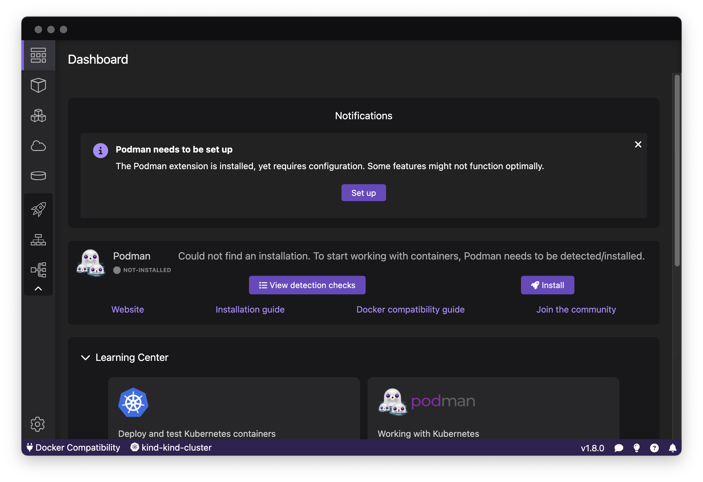
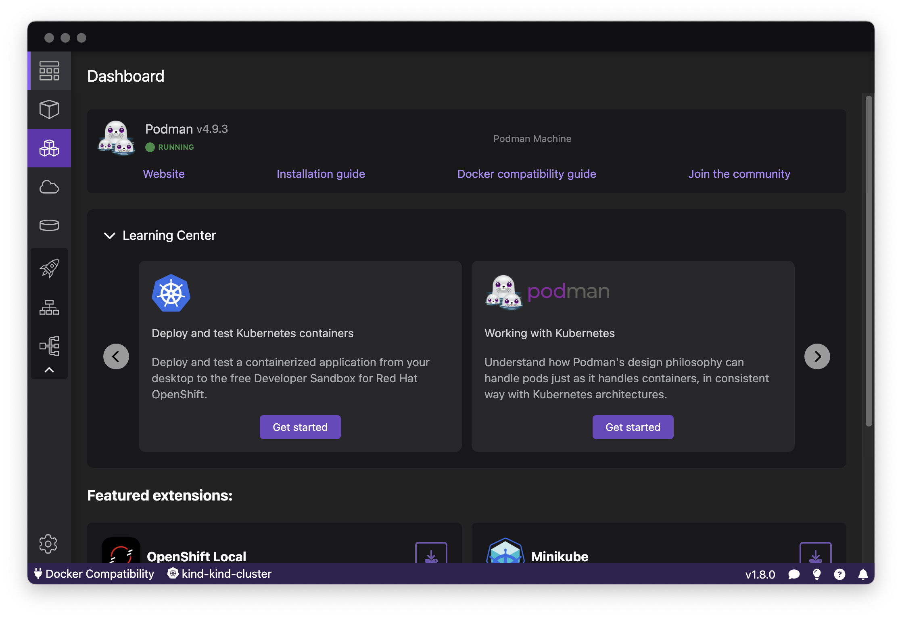

# Discover Podman Desktop in 10 minutes

Podman Desktop is the central place to work with containers as a developer.

The main purpose of Podman Desktop is to use the Docker, Podman and Kubernetes APIs
to communicate with containers engines and Kubernetes clusters to provide you a graphical
and unified interface across all these resources.

It also provides extensions to help you install and configure these resources:
install the Podman engine locally, install Kubernetes clusters locally,
configure access to remote Kubernetes clusters, configure access to images registries,
install various CLIs, and more.

## Architecture

The containers technology is a Linux kernel's technology. On a Linux system, you will be able to run Docker and/or Podman
directly on your system. On other systems like Windows and macOS, you will need to run a Linux instance inside a virtual machine
and run Docker or podman on this Linux instance, then access them from your system.

### Containers on Linux systems

On Linux systems, Docker is running as a daemon and creates a socket so clients (including the docker cli) can access it through its API.
The daemon receives commands from the clients, and executes them to build containers, store images, etc.

Podman, on the other hand, is daemonless. This means that the clients (including the podman cli) access directly
the system resources (containers, filesystem, etc), using a Podman library, to do these operations.

Podman can also run on a Docker-compatibility mode. When doing this, you cannot run Docker and Podman simultaneously anymore.
To run in this mode, a socket is created and a podman service is running, listening on this socket. This way, podman resources
can be accessed in two ways. The first way is by connecting to the Podman socket (for CLIs which have been originally designed to work with Docker only)
the exact same way the Docker socket is accessed. The second way is to use the podman cli (or the podman library), which accesses the resources directly.

Podman desktop accesses the Docker daemon through the socket to work with Docker resources,
and uses the podman cli to work with Podman resources.

### Containers on non-Linux systems

On Windows and macOS systems, a Linux system instance needs to be started inside a virtual machine and, on this Linux system, Podman
needs to be started as a service, so it can be accessed from outside the virtual machine (you local system), through ssh.

On these systems, Podman desktop uses the _remote_ version of the podman cli, which communicates with the serice inside the virtual machine through
a ssh connection.

## Installation

Podman Desktop can be installed on macOS, Windows and Linux systems, with x64 or arm64 architectures. New versions are released regularly and binaries
for these releases can be found in [the GitHub repository of the project](https://github.com/containers/podman-desktop). More detailed [instructions for the installation](https://podman-desktop.io/docs/installation) are available.

The installation procedure consists of installing a binary and its dependent files in your system. Once done, you are ready to start Podman Desktop.

If you have Docker and/or Podman installed and running (including some podman machine running), Podman Desktop should be able to detect them, and you should be able to start working with containers.

If you don't have Podman installed and no Podman machine running, Podman Desktop will guide you through their installation.

<figure>

<figcaption>Podman and Docker already installed on Fedora 39</figcaption>
</figure>

<figure>

<figcaption>Podman not installed on macOS</figcaption>
</figure>

<figure>

<figcaption>Podman machine running on macOS</figcaption>
</figure>

## Onboarding

## Images

## Containers

## Pods

## Compose

## Kubernetes

## Extensions
