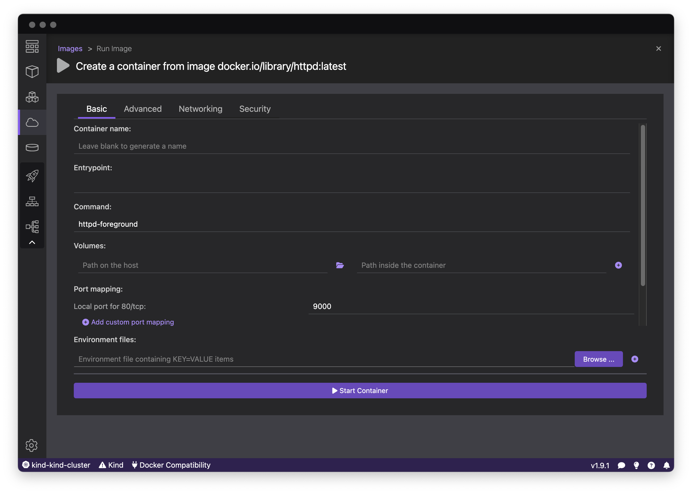
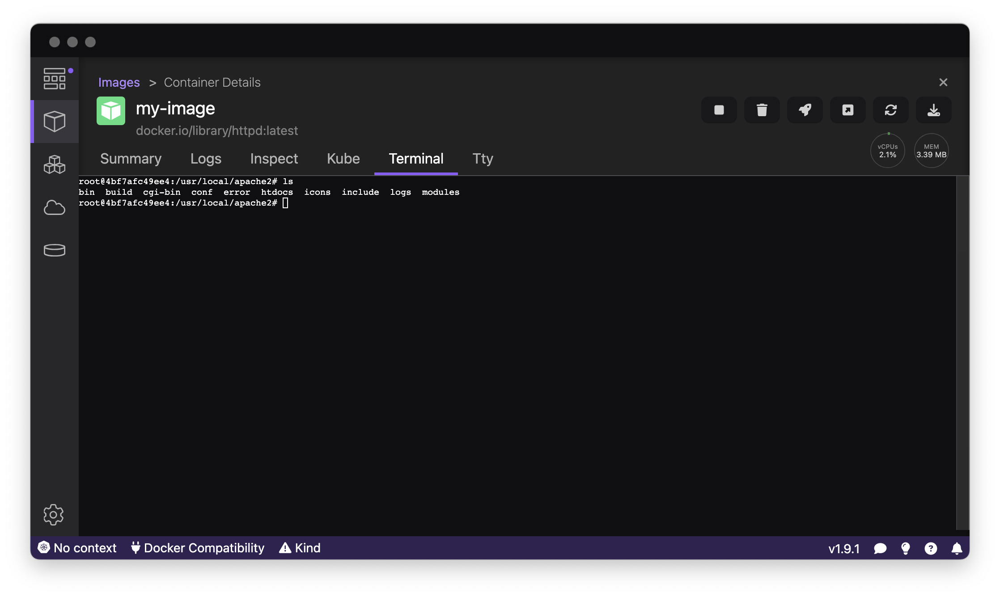
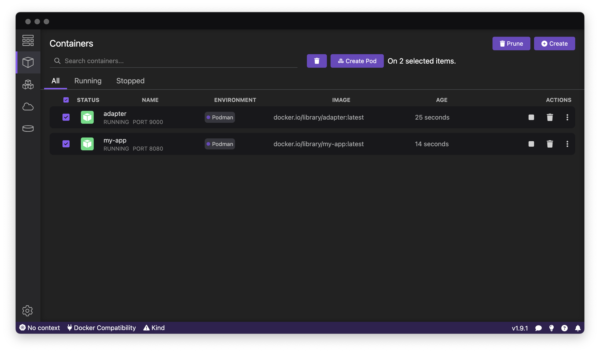
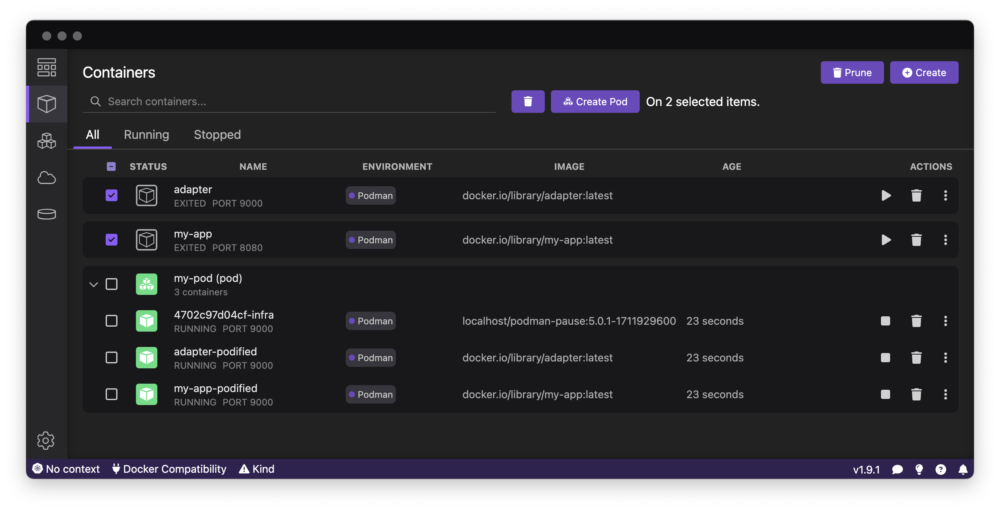
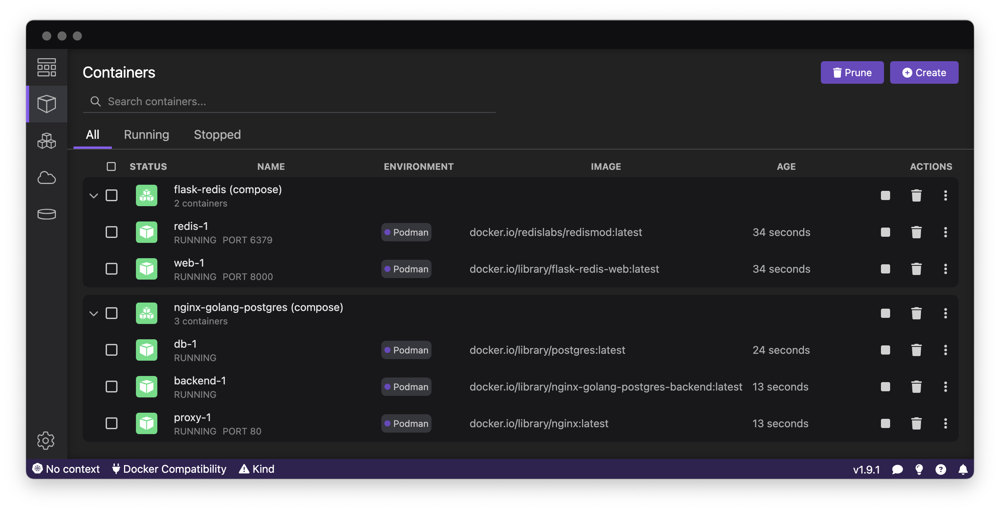
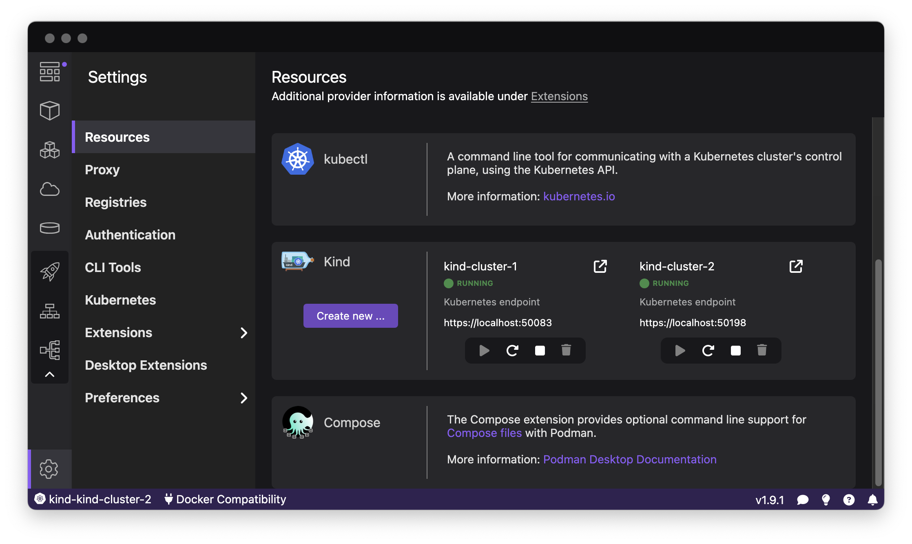
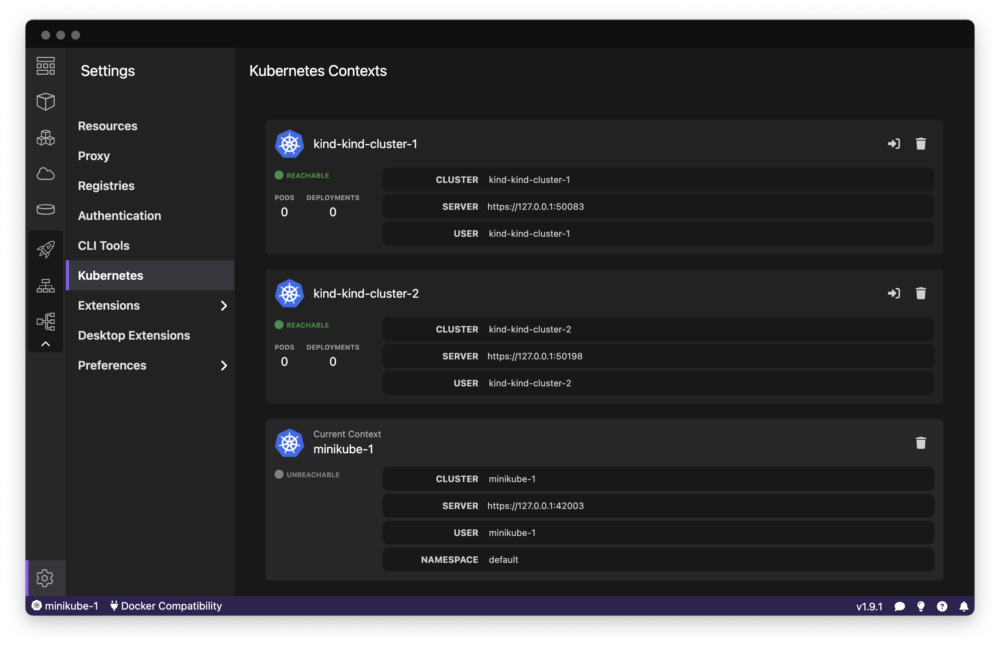
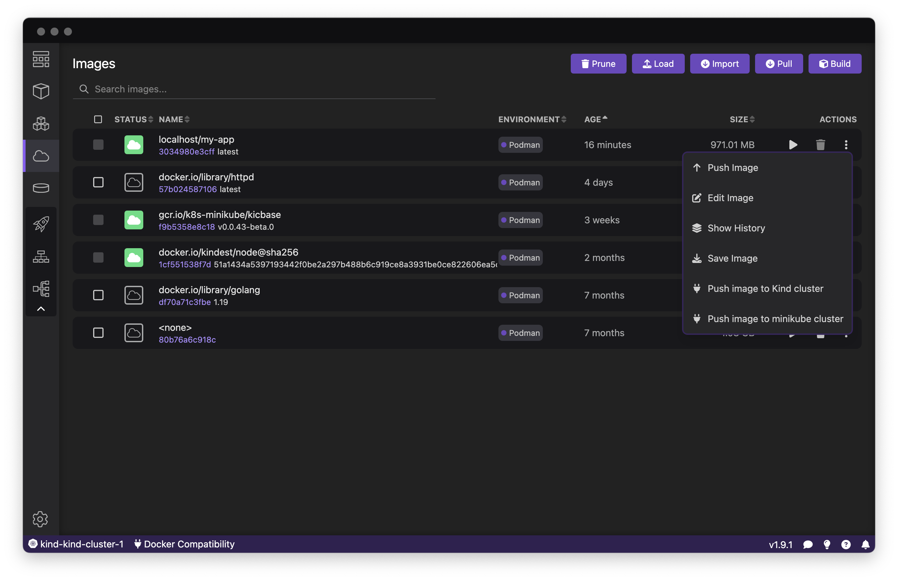
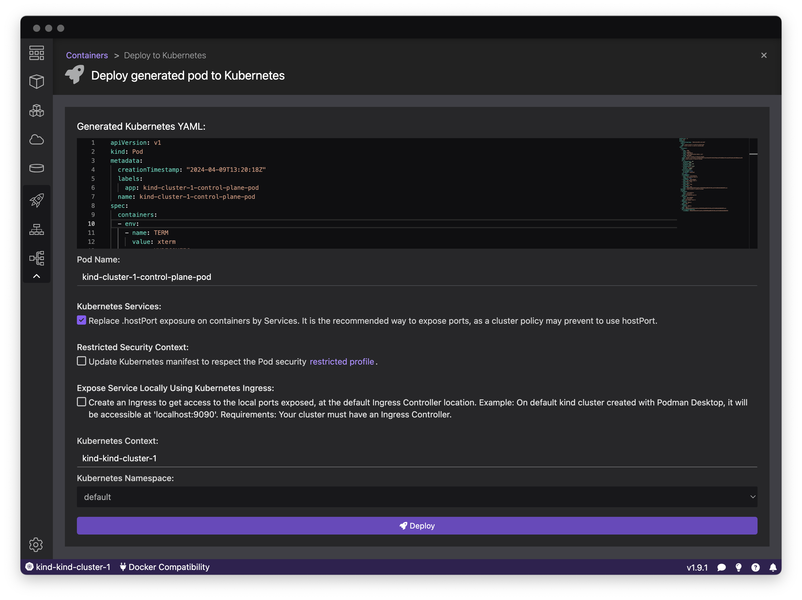

# Discover Podman Desktop in 10 minutes

Podman Desktop is the central place to work with containers as a developer.

The main purpose of Podman Desktop is to use the Docker, Podman and Kubernetes APIs
to communicate with containers engines and Kubernetes clusters to provide you a graphical
and unified interface across all these resources.

It also provides extensions to help you install and configure these resources:
install the Podman engine locally, install Kubernetes clusters locally,
configure access to remote Kubernetes clusters, configure access to images registries,
install various CLIs, and more.

## Architecture

The containers technology is a Linux kernel's technology. On a Linux system, you will be able to run Docker and/or Podman
directly on your system. On other systems like Windows and macOS, you will need to run a Linux instance inside a virtual machine
and run Docker or podman on this Linux instance, then access them from your system.

### Containers on Linux systems

On Linux systems, Docker is running as a daemon and creates a socket so clients (including the docker cli) can access it through its API.
The daemon receives commands from the clients, and executes them to build containers, store images, etc.

Podman, on the other hand, is daemonless. This means that the clients (including the podman cli) access directly
the system resources (containers, filesystem, etc), using a Podman library, to do these operations.

Podman can also run on a Docker-compatibility mode. When doing this, you cannot run Docker and Podman simultaneously anymore.
To run in this mode, a socket is created and a podman service is running, listening on this socket. This way, podman resources
can be accessed in two ways. The first way is by connecting to the Podman socket (for CLIs which have been originally designed to work with Docker only)
the exact same way the Docker socket is accessed. The second way is to use the podman cli (or the podman library), which accesses the resources directly.

Podman desktop accesses the Docker daemon through the socket to work with Docker resources,
and uses the podman cli to work with Podman resources.

### Containers on non-Linux systems

On Windows and macOS systems, a Linux system instance needs to be started inside a virtual machine and, on this Linux system, Podman
needs to be started as a service, so it can be accessed from outside the virtual machine (you local system), through ssh.

On these systems, Podman desktop uses the _remote_ version of the podman cli, which communicates with the serice inside the virtual machine through
a ssh connection.

## Installation

Podman Desktop can be installed on macOS, Windows and Linux systems, with x64 or arm64 architectures. New versions are released regularly and binaries
for these releases can be found in [the GitHub repository of the project](https://github.com/containers/podman-desktop). More detailed [instructions for the installation](https://podman-desktop.io/docs/installation) are available.

The installation procedure consists of installing a binary and its dependent files in your system. Once done, you are ready to start Podman Desktop.

## Onboarding

When started for the first time, Podman Desktop starts an _Onboarding_ session. This session
will guide you through installing resources and tools helpful when working with Podman Desktop.

Podman Desktop checks for the following CLIs to be accessible on your system: `docker-compose`, `kubectl` and `podman`.
If any of these CLIs are not accessible, you are proposed to choose which ones you want to install, and to start the Onboarding.

The onboarding consists of a series of steps for each tool to install. For the `docker-compose` and `kubectl` CLIs,
the binaries are downloaded and placed in a system-wide directory (`/usr/local/bin` on Linux and macOS).

For `podman`, on Linux, a step will help you install podman using the package manager of your system.
On macOS and Windows, the steps will first install the latest available version of podman, then help you create a Podman Machine.

At any time, you will be able to manage these resources installed during initial onboarding. You can check if new versions
are released for the CLIs and download them (`Settings > CLI Tools`), and you can manage Podman Machines (`Settings > Resources > Podman`).

<figure>

<figcaption>Onboarding session</figcaption>
</figure>

<figure>

<figcaption>Onboarding done on macOS/Windows</figcaption>
</figure>

<figure>

<figcaption>Onboarding done on Linux Fedora 39</figcaption>
</figure>

## Images

To run containers, you first need Images stored locally in your container engine. To have such local images, you can either build them
from a `Containerfile`, or pull them, either from a public or a private container registry. You may also want to push images built locally into a distant registry.

All these operations are available from the _Images List page_, visible in the screenshot below.

<figure>

<figcaption>Images List page, accessible from the Images menu</figcaption>
</figure>

### Building an Image

In the screenshot below, you can see how to build an Image, based on Containerfile, and store the resulting image on a Container Engine
(here, Podman container engine is selected - the choice may be not visible if only one container engine is detected by Podman Desktop).
You also have the choice to build a single-platform or a multi-platform Image, by choosing for which platform(s) you want to build the image.

<figure>

<figcaption>Builing an image</figcaption>
</figure>

### Pulling an Image from a registry

You can pull an image from a public registry by giving the URI of the image to pull, and the container engine on which to store it locally.

If the image you want to pull happens to be private and you need to use credentials to access it, you can register these credentials
from the `Settings > Registries` page, or by client the `Manage registries` from the _Pull image_ page. The credentials will be saved for any future use from Podman Desktop.

<figure>

<figcaption>Pulling an image</figcaption>
</figure>

<figure>

<figcaption>Registering Registries Credentials</figcaption>
</figure>

### Pushing an Image to a registry

Once you have an image locally, stored in any container engine, you can push it to a registry. You first need to be sure
that the image name is the URI of the distant repository. If it has not been done during the image build, you can edit
the image and change its Image Name. Then, you can push the image to the registry by using the dedicated command.

Both `Edit Image` and `Push Image` commands are available from the Actions menu of the image, in the _Images List_ page, or
from the _Image Details_ page, accessible by clicking the image name in the Images List.

If the repository is private, you will have to check that the credentials have been registered, as described in the previous section.

<figure>

<figcaption>Puhsing an Image</figcaption>
</figure>

## Containers

Now you have at least one image stored locally in a container engine, it's time to start a container using this image in this same container engine.
For this, you can press the `Run Image` button in the Actions of the desired image in the Images List.

This will open a form with all the possible parameters for creating the container (the same parameters you may pass to the `podman run` command).

Once you press the `Start Container` button, the container creation is initiated and as soon as it is created, you are redirected to the Details page
for the container. You can go back to this details page at any time by clicking the container's name in the _Containers List_ page.

This Details page offers you many information about the container, from dedicated tabs: the logs of the container streamed in real-time,
the detailed information (the output of the `podman inspect` command),
a Kubernetes representation of a Pod embedding this container (we will see later in the Kubernetes section how this can be useful),
and a view of the TTY attached to the container.

It is also possible to access an interactive shell within the container (if the container provides an `sh` or `bash` shell), by accessing the _Terminal_ tab
of the Details page.

A toolbar provides the standard operations on containers: stop, delete, restart, and you can open in one click in your browser the port declared as exposed
by the container, to check that the application running in the container works as expected.

<figure>

<figcaption>Starting a Container</figcaption>
</figure>

<figure>

<figcaption>Details of a Container, and interactive shell session</figcaption>
</figure>

## Pods

Podman, like Kubernetes, can manage pods. If you are not familiar with the Kubernetes concepts, a pod is a group of containers sharing resources.
For example, containers within a pod can communicate on localhost, and can share files on a same volume.

With Podman Desktop, from the Containers List page, you can select one or several containers and click on the `Create Pod` button
to create a new pod with a copy of these containers. Once done, the previous containers have been stopped,
and a pod is created containing copies of the selected containers (plus an `infra` container, which is a technical container needed
to run a pod).

At any time, from the Pods List page, you can stop, delete and restart the pod, and from the Pod Details page of a specific pod,
you can see the logs of the containers streamed in real-time, the detailed information of the pod (the output of the `podman pod inspect` command),
a Kubernetes representation of the Pod.

A toolbar provides the standard operations on pods: stop, delete, restart, and you can open in one click in your browser the port declared as exposed
by the pod, to check that the application running in the pod works as expected.

<figure>

<figcaption>Creating a Pod with two containers</figcaption>
</figure>

<figure>

<figcaption>Pod is running</figcaption>
</figure>

## Compose

If you use `compose` to run multi-container applications, Podman Desktop can help you manage these groups of containers.

In the Containers List page, all containers started by a same instance of `compose` are grouped together, so they can be
managed as an application, by stopping, deleting or restarting the application.

By clicking the name of the group (the name followed by `(compose)` in the first line of the group), you can access the Details page for the application,
where you can see the logs of the containers streamed in real-time, the detailed information of the containers
(the output of the `podman inspect` command on each container), and a Kubernetes representation of a pod containing the containers.

In the screenshot below, you can see that two applications have been started with two instances of `compose` (one `nginx-golang-postgres` and one `flask-redis`).

<figure>

<figcaption>Two apps started with Compose</figcaption>
</figure>

## Kubernetes

Podman Desktop provides extensions to install Kubernetes clusters locally, and to access remote clusters.

### Local Kubernetes clusters

The `kind` extension is installed by default. This extension gives you the possibility to run local Kubernetes
clusters on containers, using the `kind` command.

If you don't already have the `kind` CLI installed on your system, a `⚠ Kind` button appears in the statusbar,
which guides you through its download and installation.

When this is done, you can go to the `Settings > Resources` page. A `Kind` section should be present,
from where you can create new clusters, and manage the clusters you have created.

Once created, the Kind clusters will appear, as containers, in the Containers List page, with a dedicated Kind icon.

The `minikube` extension offers the same experience, using the `minikube` CLI.

<figure>

<figcaption>Two Kubernetes clusters created with kind</figcaption>
</figure>

### Kubeconfig file

Podman Desktop detects your Kubeconfig file (you can configure its location if you want to use a file different
from the default `~/.kube/config` one, in `Settings > Preferences > Kubernetes`).

When such a file is detected, Kubernetes-related icons are added to the menu: Deployments, Services and Ingresses & Routes,
and you can select a context from this kubeconfig file, either from the statusbar selector.

The Kubernetes Contexts page (accessible via `Settings > Kubernetes`) displays the list of contexts defined in the kubeconfig file,
and you can also switch the context from this page.

For each context, it is displayed if the cluster is accessible, and, if so, how many pods and deployments are present in the context.
This should help you make some cleanup from time to time in your kubeconfig file, as these files tend to grow over time.

<figure>

<figcaption>Kubernetes Contexts</figcaption>
</figure>

### Moving from non-orchestrated containers to Kubernetes

Podman Desktop provides tools to help you move your usage of containers to Kubernetes.

#### Pushing local images to cluster's node

The first very helpful tool is to upload images stored in the local container engines to Kubernetes nodes.

It is interesting to know that, when you deploy a Pod into a Kubernetes node, the images of the pod's containers will be either
pulled from the corresponding registries, or, if an image is stored (cached) in the node's container engine, it will be used instead.

In addition to saving bandwidth, this feature is particularly helpful for images built locally: you don't have to push them
to a specific registry (and, if you don't want to rely on a third-party registry, you don't to have to manage your own registry), you just
need to have it stored in the container engine of the node of the Kubernetes cluster.

You will be able to do this from the Images List page, in the Actions menu for an image. In this menu, an entry for each kind of cluster
should be present, to push the image to a cluster of this kind.

<figure>

<figcaption>Pushing a local image to a cluster</figcaption>
</figure>

#### Deploying a local container to a Kubernetes context

Another very helpful tool is to "copy" a container running in a local container engine to a Kubernetes cluster, by creating
a pod running this container in the cluster.

To do this, you can choose a container in the Containers List page, and select the `Deploy to Kubernetes` action. This
will show you the Kubernetes manifest that has been generated and which will be used to create the pod in the cluster,
and will let you select a few options.

After clicking the `Deploy` button, the Kubernetes manifest will be "applied" to the cluster,
and you should be able to see the created pod in the Pods List page.

<figure>

<figcaption>Deploying a container to a Kubernetes cluster</figcaption>
</figure>

#### Managing Kubernetes resources

In the Pods List page, you will see both the pods managed by podman and the pods running in the current Kubernetes context,
the Environment column displaying where each pod is running.

By clicking the name of a Kubernetes pod, you will access the details of the pod, including the logs of the pod's containers
streamed in real-time, a summary of the pod specification and status, and the possibility to access an interactive shell
within the containers of the pod (for containers providing an `sh` or `bash` shell).

In the Deployments, Services and Ingresses & Routes pages, you will see the corresponding resources existing in the
current Kubernetes context.

## Extensions
