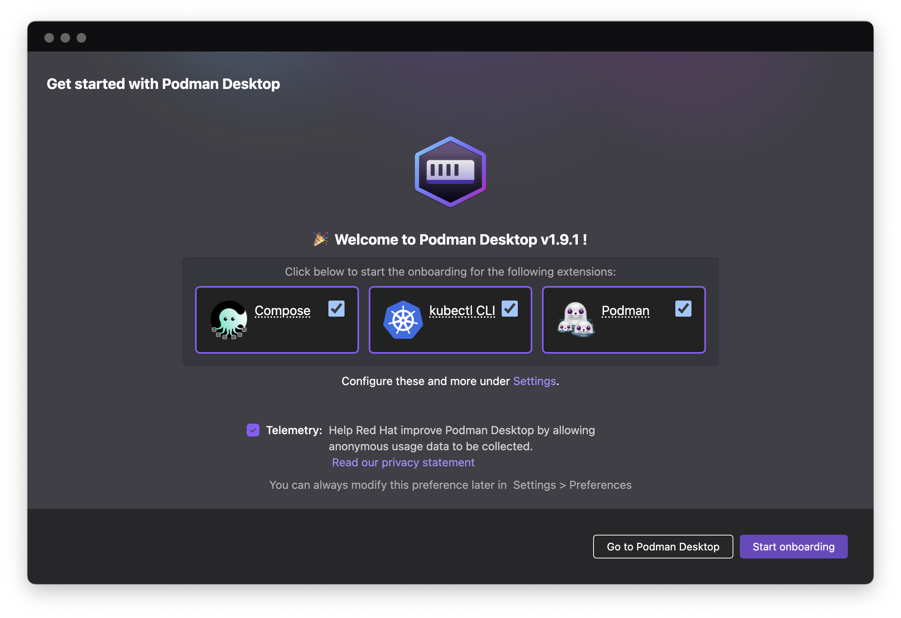
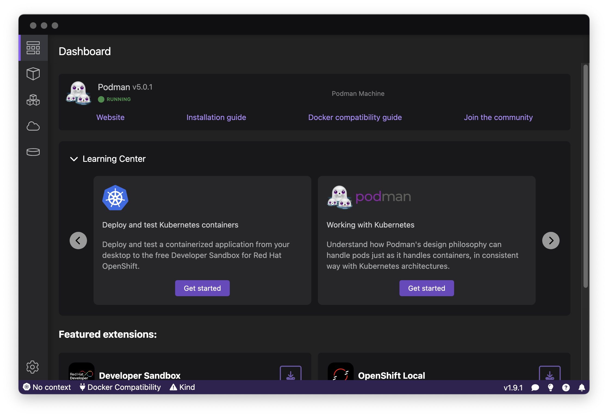
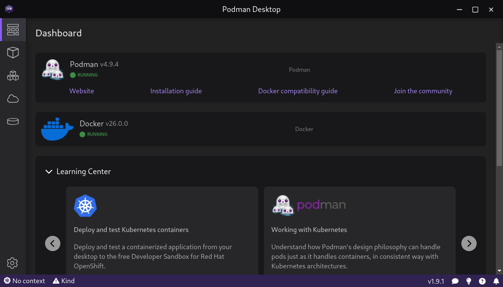
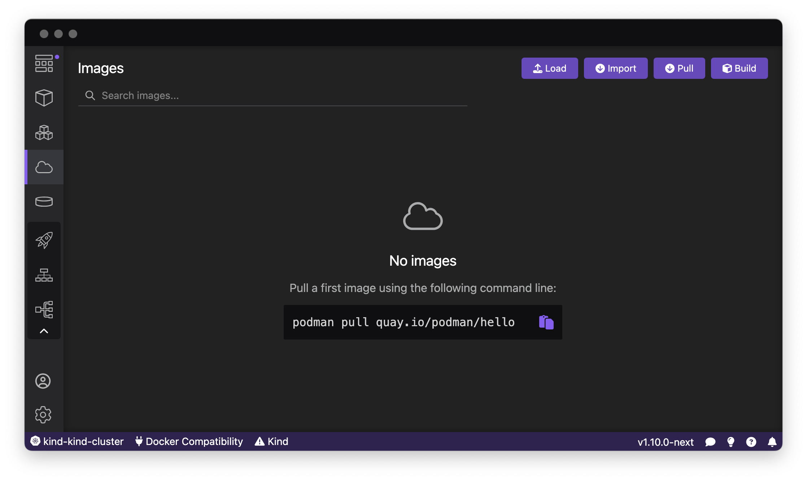
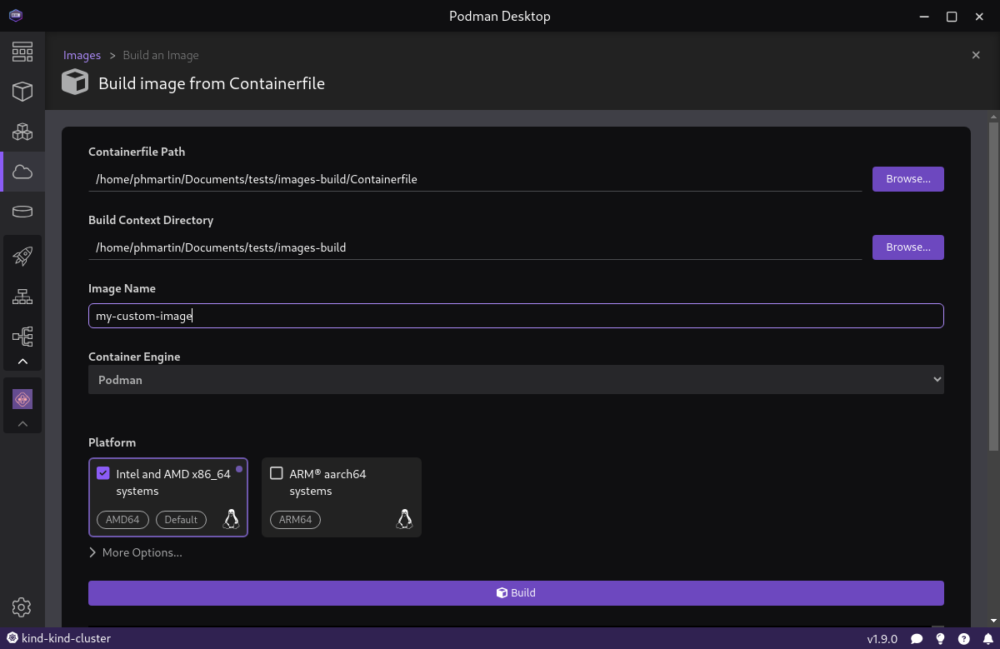
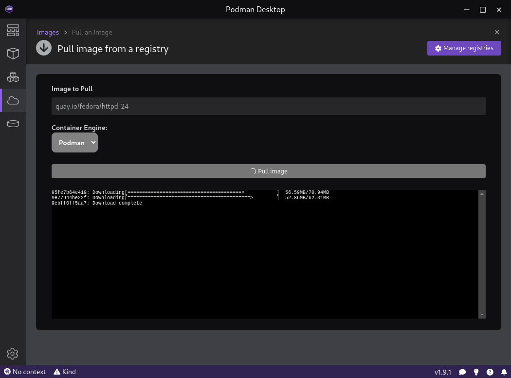
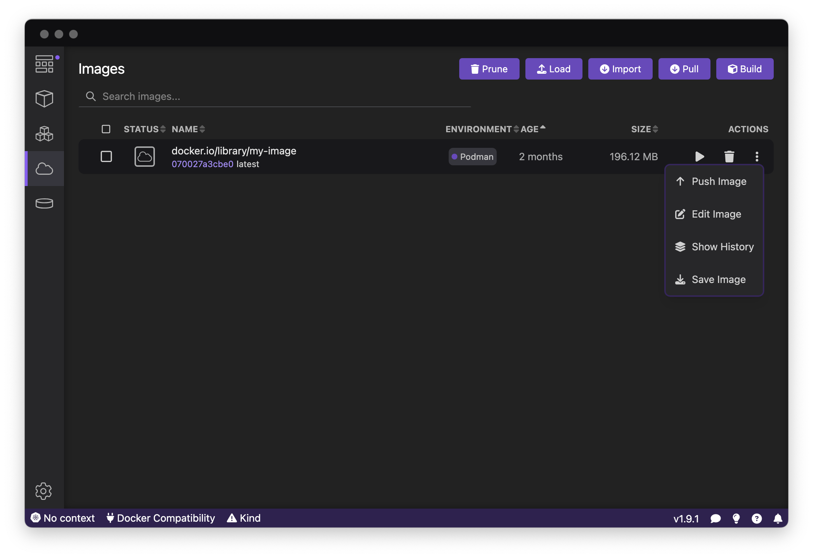

# Discover Podman Desktop in 10 minutes

Podman Desktop is the central place to work with containers as a developer.

The main purpose of Podman Desktop is to use the Docker, Podman and Kubernetes APIs
to communicate with containers engines and Kubernetes clusters to provide you a graphical
and unified interface across all these resources.

It also provides extensions to help you install and configure these resources:
install the Podman engine locally, install Kubernetes clusters locally,
configure access to remote Kubernetes clusters, configure access to images registries,
install various CLIs, and more.

## Architecture

The containers technology is a Linux kernel's technology. On a Linux system, you will be able to run Docker and/or Podman
directly on your system. On other systems like Windows and macOS, you will need to run a Linux instance inside a virtual machine
and run Docker or podman on this Linux instance, then access them from your system.

### Containers on Linux systems

On Linux systems, Docker is running as a daemon and creates a socket so clients (including the docker cli) can access it through its API.
The daemon receives commands from the clients, and executes them to build containers, store images, etc.

Podman, on the other hand, is daemonless. This means that the clients (including the podman cli) access directly
the system resources (containers, filesystem, etc), using a Podman library, to do these operations.

Podman can also run on a Docker-compatibility mode. When doing this, you cannot run Docker and Podman simultaneously anymore.
To run in this mode, a socket is created and a podman service is running, listening on this socket. This way, podman resources
can be accessed in two ways. The first way is by connecting to the Podman socket (for CLIs which have been originally designed to work with Docker only)
the exact same way the Docker socket is accessed. The second way is to use the podman cli (or the podman library), which accesses the resources directly.

Podman desktop accesses the Docker daemon through the socket to work with Docker resources,
and uses the podman cli to work with Podman resources.

### Containers on non-Linux systems

On Windows and macOS systems, a Linux system instance needs to be started inside a virtual machine and, on this Linux system, Podman
needs to be started as a service, so it can be accessed from outside the virtual machine (you local system), through ssh.

On these systems, Podman desktop uses the _remote_ version of the podman cli, which communicates with the serice inside the virtual machine through
a ssh connection.

## Installation

Podman Desktop can be installed on macOS, Windows and Linux systems, with x64 or arm64 architectures. New versions are released regularly and binaries
for these releases can be found in [the GitHub repository of the project](https://github.com/containers/podman-desktop). More detailed [instructions for the installation](https://podman-desktop.io/docs/installation) are available.

The installation procedure consists of installing a binary and its dependent files in your system. Once done, you are ready to start Podman Desktop.

## Onboarding

When started for the first time, Podman Desktop starts an _Onboarding_ session. This session
will guide you through installing resources and tools helpful when working with Podman Desktop.

Podman Desktop checks for the following CLIs to be accessible on your system: `docker-compose`, `kubectl` and `podman`.
If any of these CLIs are not accessible, you are proposed to choose which ones you want to install, and to start the Onboarding.

The onboarding consists of a series of steps for each tool to install. For the `docker-compose` and `kubectl` CLIs,
the binaries are downloaded and placed in a system-wide directory (`/usr/local/bin` on Linux and macOS).

For `podman`, on Linux, a step will help you install podman using the package manager of your system.
On macOS and Windows, the steps will first install the latest available version of podman, then help you create a Podman Machine.

At any time, you will be able to manage these resources installed during initial onboarding. You can check if new versions
are released for the CLIs and download them (`Settings > CLI Tools`), and you can manage Podman Machines (`Settings > Resources > Podman`).

<figure>

<figcaption>Onboarding session</figcaption>
</figure>

<figure>

<figcaption>Onboarding done on macOS/Windows</figcaption>
</figure>

<figure>

<figcaption>Onboarding done on Linux Fedora 39</figcaption>
</figure>

## Images

To run containers, you first need Images stored locally in your container engine. To have such local images, you can either build them
from a `Containerfile`, or pull them, either from a public or a private container registry. You may also want to push images built locally into a distant registry.

All these operations are available from the _Images List page_, visible in the screenshot below.

<figure>

<figcaption>Images List page, accessible from the Images menu</figcaption>
</figure>

### Building an Image

In the screenshot below, you can see how to build an Image, based on Containerfile, and store the resulting image on a Container Engine
(here, Podman container engine is selected - the choice may be not visible if only one container engine is detected by Podman Desktop).
You also have the choice to build a single-platform or a multi-platform Image, by choosing for which platform(s) you want to build the image.

<figure>

<figcaption>Builing an image</figcaption>
</figure>

### Pulling an Image from a registry

You can pull an image from a public registry by giving the URI of the image to pull, and the container engine on which to store it locally.

If the image you want to pull happens to be private and you need to use credentials to access it, you can register these credentials
from the `Settings > Registries` page, or by client the `Manage registries` from the _Pull image_ page. The credentials will be saved for any future use from Podman Desktop.

<figure>

<figcaption>Pulling an image</figcaption>
</figure>

<figure>

<figcaption>Registering Registries Credentials</figcaption>
</figure>

### Pushing an Image to a registry

Once you have an image locally, stored in any container engine, you can push it to a registry. You first need to be sure
that the image name is the URI of the distant repository. If it has not been done during the image build, you can edit
the image and change its Image Name. Then, you can push the image to the registry by using the dedicated command.

Both `Edit Image` and `Push Image` commands are available from the Actions menu of the image, in the _Images List_ page, or
from the _Image Details_ page, accessible by clicking the image name in the Images List.

If the repository is private, you will have to check that the credentials have been registered, as described in the previous section.

<figure>

<figcaption>Puhsing an Image</figcaption>
</figure>

## Containers

## Pods

## Compose

## Kubernetes

## Extensions
