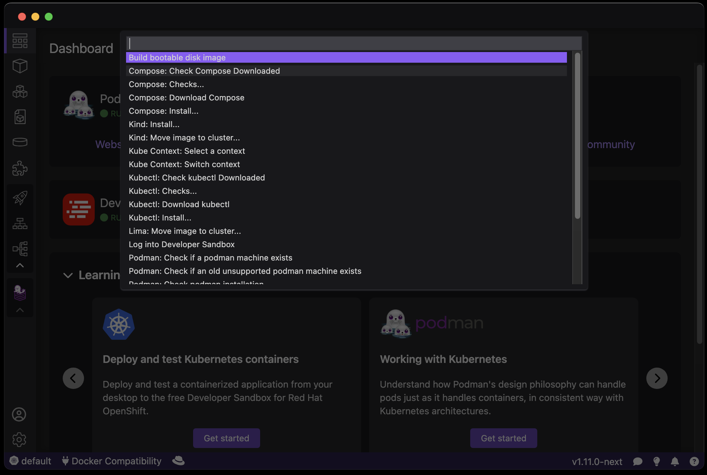

# Command Palette

Podman Desktop provides a shortcut to list all available commands using the **F1** key.

All commands displayed are defined in the "commands" section of `package.json`. For additional information, visit the [documentation page](/docs/extensions/developing/commands).

### Procedure

1. Press **F1**.
2. Select the command you would like to execute from the list.

### Additional Resources

- [Command Extension Documentation](/docs/extensions/developing/commands)
