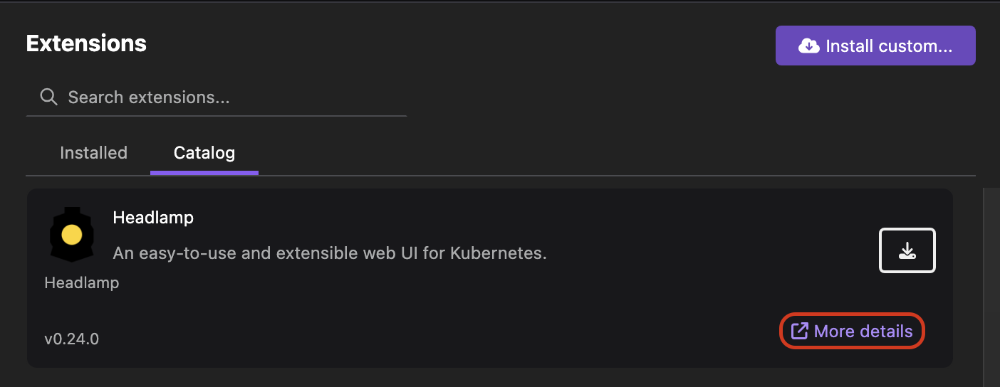

# Using extensions for development tasks

Podman Desktop provides a wide range of extensions that can be used to integrate your local tools with the UI. Installing extensions is a way to cutomize your development capabilities based on your needs. For example, if you have to run a Minikube cluster, you can install the Minikube extension. List of extensions available:

**_Engine extensions_**

- Podman: Handles creation and monitoring of Podman machines. It connects to the Podman socket so that you can see containers, images, volumes, and other resources in the Podman Desktop UI. See [Podman](/docs/podman).

- Docker: Auto-registers the socket to Podman Desktop if any Docker engine is running on your machine. After registeration, you can monitor containers, images, volumes, and other resources from the UI. See [Migrationg from Docker](/docs/migrating-from-docker).

**_Kubernetes extensions_**

- Kind: Enables creating a Kubernetes cluster that you can run on a Podman engine. As a prerequisite, you must install the `kind` binary before using the extension. See [Kind](/docs/kind) and [Tutorial- Deploying a Kubernetes application](/tutorial/deploying-a-kubernetes-application).

- Minikube: Enables creating a Kubernetes cluster that you can run on a Podman engine. As a prerequisite, you must install the `minikube` binary before using the extension. See [Minikube](/docs/minikube) and [Tutorial- Running a Kubernetes cluster](/tutorial/running-a-kubernetes-cluster).

- Lima: Enables creating a Lima virtual machine that you can run on a Podman engine. As a prerequisite, you must install the `lima` binary before using the extension. See [Lima](/docs/lima).

- Kube Context: Enables viewing and changing the current kubernetes context. See [Viewing and selecting Kubernetes context](/docs/kubernetes/viewing-and-selecting-current-kubernetes-context).

- Headlamp: Enables creating an extensible Kubernetes web UI. For more details, click the **More details** link in the **Catalog** tab of the Extensions page.

    

**_CLI extensions_**

- Compose: Enables setting up `compose` binary so that you can run `podman compose` commands. See [Compose](/docs/compose) and [Getting started with Compose](/blog/getting-started-with-compose).

- Kubectl CLI: Enables setting up `kubectl` binary so that you can run `kubectl` commands. See [Managing your CLI tools](/tutorial/managing-your-application-resources#managing-other-resources).

**_Red Hat extensions_**

Red Hat extension pack is a set of the following extensions that a developer can use for authentication and development purposes:
- Podman AI Lab: Enables working and experimenting with Large Language Models (LLMs) in your local development environment. See [Running LLMs locally](/docs/ai-lab) and [Tutorial- Running an AI application](/tutorial/running-an-ai-application).  

- Bootable containers: Enables building a bootable disk image from your container image. For more details, click the **More details** link in the **Catalog** tab of the Extensions page.

- Red Hat Account Extension: Enables you to sign in with Red Hat Single Sign-On (SSO). You can consume Red Hat content, such as RHEL container images and RPM packages without any cost. For more details, click the **More details** link in the **Catalog** tab of the Extensions page.

- OpenShift Local: Enables running a Red Hat OpenShift Local cluster. You can manage the cluster configuration and run an application on the cluster from the UI. See [Creating an OpenShift Local instance](/docs/openshift/openshift-local). 

- Developer Sandbox: Enables deploying your application to a shared-OpenShift Container Platform (OCP) cluster for 30 days without any cost. After configuring a sandbox environment, you can switch to the developer sandbox context and perform tasks, such as deploying a pod or container from the UI. See [Configuring access to a developer sandbox](/docs/openshift/developer-sandbox).

- OpenShift Checker: Analyzes a Containerfile and highlights the directives and commands that could cause an unexpected behavior when you run it on an OCP cluster. After identifying issues, you can update your Containerfile to make it OpenShift-compliant. For more details, click the **More details** link in the **Catalog** tab of the Extensions page.

    :::note

    You can also install the above extensions individually from the catalog rather than installing the entire pack.

    :::

**_Other extensions_**

- Registries: Provides some default registries so that you can connect to them with your credentials. See [Managing registries](/docs/containers/registries). 

- Image Layers Explorer: Use this extension to explore and analyze different layers of the container image. For more details, click the **More details** link in the **Catalog** tab of the Extensions page.
