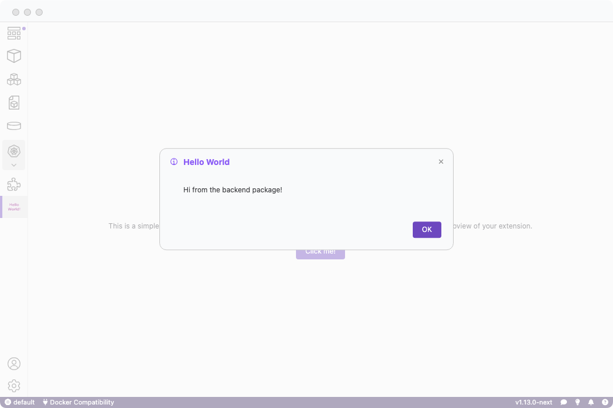
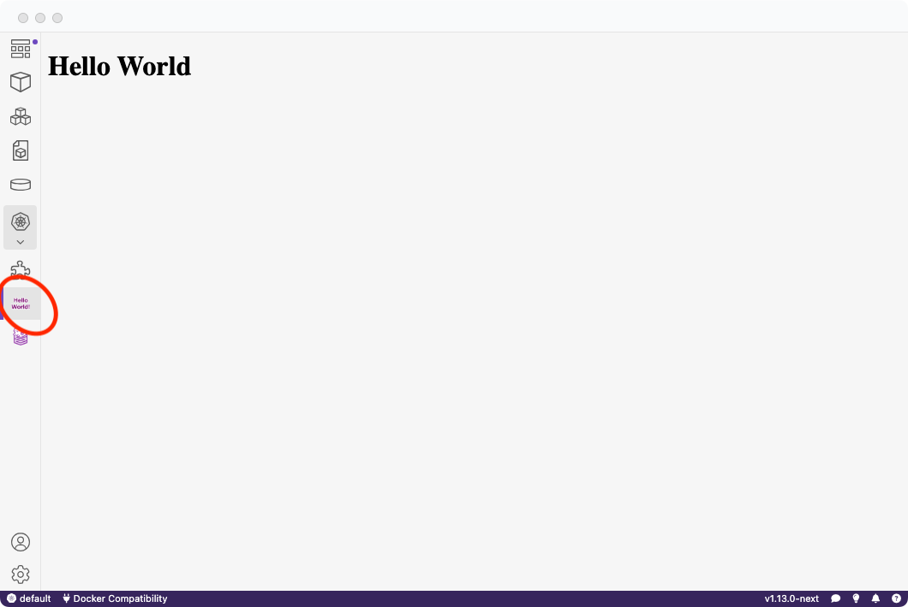

# Templates for creating an extension

Below are a list of officially maintained templates to be used for Podman Desktop extension development.

### Minimal template

**Link:** https://github.com/containers/podman-desktop-extension-minimal-template

This template provides a minimal template on how to build a Podman Desktop extension. More information can be found on our official extension documentation on how to further expand your extension.

With this template, on activating a "Hello World!" dialog will appear.

### Webview template

**Link:** https://github.com/containers/podman-desktop-extension-webview-template

This template provides a webview template on how to build a Podman Desktop extension showcasing a frontend.

More information can be found on our [official extension documentation](https://podman-desktop.io/docs/extensions) on how to further expand your extension.

With this template, you will see a new button on the navbar that says "Hello World!" and provides a frontend.A

### Full template

**Link:** https://github.com/containers/podman-desktop-extension-full-template

This template provides a "full" example of creating an extension with a webview that utilizes multiple packages. Within this template, we use three separate packages to distinguish between the frontend, backend, and shared code that connects the frontend and backend.

The "full" template is meant to showcase a full production example which includes multiple frontend and backend technologies such as TypeScript, Svelte and TailwindCSS.

All backend-related code can be separated into its own package, which improves both security and code organization.

The template offers flexibility in creating a Podman Desktop extension that can use the underlying Podman Desktop API and pre-built UI components via @podman-desktop/ui-svelte.
