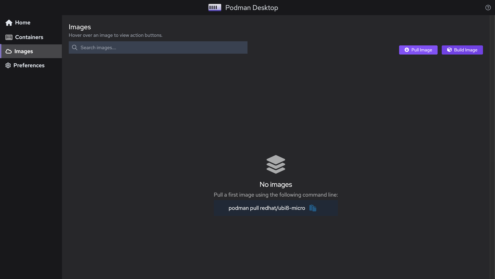
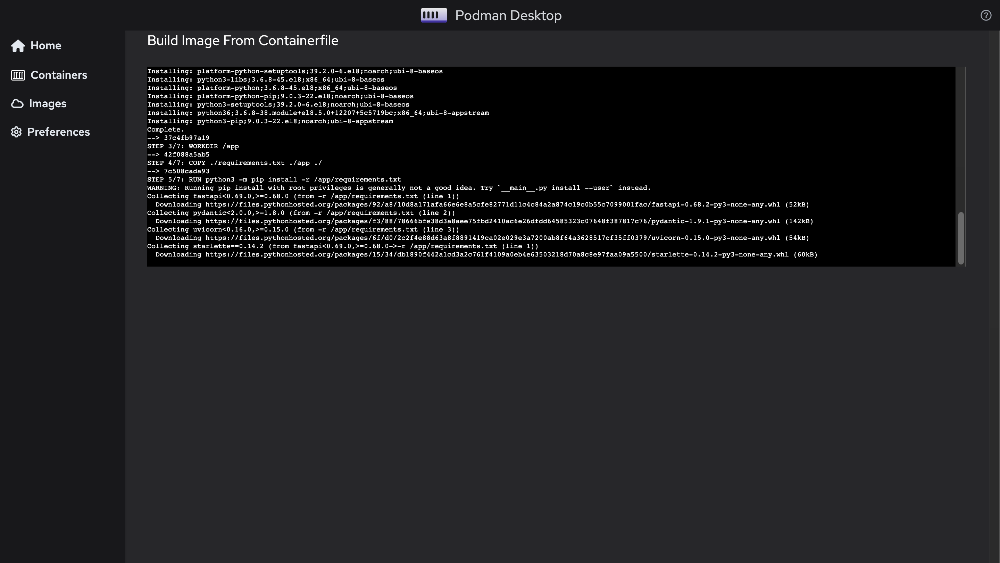
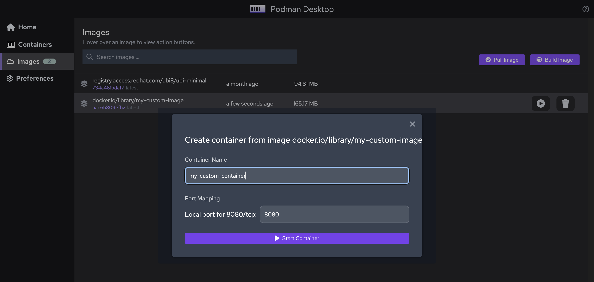

<!--truncate-->

## Introduction

Podman Desktop leverages [Podman Engine](https://podman.io/) to provide a lightweight and daemon-less container management tool. It enables you to easily work with containers from your local environment without running container management commands.

Podman Desktop brings all the capabilities of Podman with the added advantage of a GUI which is becoming increasingly powerful and user-friendly. It is super easy to adapt to. With this tutorial, you will be ready to roll and work with your containerized applications in no time.

In this tutorial, I am working with Podman Desktop v0.0.5.

## Requirements

To work with Podman Desktop, you firstly require the latest version of Podman Desktop. Depending on your operating system, you can download it from [this](https://podman-desktop.io/downloads) page.

Next, you need the latest version of Podman Engine installed on your computer. When started, Podman Desktop looks for the Podman Engine in the system and will prompt you to install the same if it is not present. You can read more about how to set up the Podman Desktop and Podman Engine in the Installation guide [here](/docs/installation/macos-install).

Once everything is set up, you are ready to go!

## Get Started

When you open the Podman Desktop application, you will be greeted with the home screen. It will show you a toggle button that says ‘Initialize Podman’. And as mentioned, it initializes the Podman Engine and creates a Podman Machine for you. Click on it to create a Podman Machine. Within no time, your Podman Machine will be created. This is equivalent to running the command `podman machine init`. You can read more about it [here](https://docs.podman.io/en/latest/markdown/podman-machine-init.1.html).

Next, you need to start the Podman Machine by toggling the button that says ‘Run Podman’. This is equivalent to running `podman machine start`. You can read more about it [here](https://docs.podman.io/en/latest/markdown/podman-machine-start.1.html).

Once it says “Podman is running”, you are ready to build images and run containers!

Our first step will be to build an image for our application followed by running the image to create the container.

### 1. Build Image

For this section of the tutorial, I have created my Containerfile using the Red Hat Universal Base Image. You can also write your own Containerfiles and build images from it using the Red Hat Universal Base Image (UBI). Read more about it in [this blog](https://developers.redhat.com/articles/2021/11/30/build-lightweight-and-secure-container-images-using-rhel-ubi). Once you have your Containerfile ready, follow the steps below to build your own image.

1. To load the Containerfile to Podman Desktop and build the Image, we browse to the “Images” section and click on the “Build Image” button. This opens a tab within which you can select the path where your Containerfile is present.

   

2. Click on the placeholder “Select Containerfile to build”, browse to the folder where the Containerfile is present and select the file.

   

3. Go ahead and type in any name for your image below but Podman Desktop will have something generated by default in case you want to skip it.

   

4. Click on ‘Build’ and that’s it. You will see each instruction from your Containerfile being executed to build the image.

   

5. Once completed, Click on “Done” above to continue. You will see that your image has been added to the Images section of Podman Desktop.

   

### 2. Create and Run the Container

Following are the steps to create and start a container from the image.

1. Once the image is built, you can see its name (in our case, ‘my-custom-image’) and other details in the Images section.

   

2. Simply hover over the name of the image and you will see a list of buttons to the right. In case you are confused about the action of each button, just take the cursor over each button and wait for it to tell the action it does.

   

3. Upon clicking the ‘Run Image’ button, a window will appear and it will ask you to Create the container by giving it a name and mapping the desired port number.

   

4. Once you click on “Start Container”, you will see some changes in the Containers section. Upon hovering your cursor over the newly created container, you will see a set of buttons allowing you to work with it.

   

5. To check if it is running our application as desired, open the URL in the browser (in this case, localhost:8080 because that’s where we mapped our port). This can be done by clicking on the ‘Open Browser’ button.

   

6. As we can see, it returns {“Hello”:”World”} as intended.

   

## Conclusion

So that’s it! It is that simple to get started with Podman Desktop for building and running your first container image!
