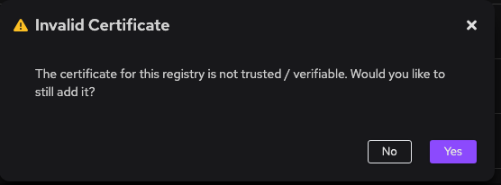

import Tabs from '@theme/Tabs';
import TabItem from '@theme/TabItem';

# Adding an Insecure Registry to Podman Desktop

In this guide, you will learn how to add an insecure registry to Podman Desktop. An insecure registry allows you to pull and push container images either over an unencrypted HTTP connection, or a HTTPS connection with a self-signed unverified certificate. Please note that using an insecure registry can expose your data to security risks, so it's recommended to use secure connections with a verifiable certificate whenever possible.

#### Prerequisites

- Podman installed and running (VM if on macOS or Windows).

#### Procedure

<Tabs groupId="operating-systems">
<TabItem value="macwin" label="macOS & Windows">

1. Add your insecure registry within **<icon icon="fa-solid fa-cog" size="lg" /> Settings > Registries**.

2. Click "Yes" to the insecure registry warning.



3. SSH into the Podman Machine to edit `registries.conf`.

```sh
$ podman machine ssh [optional-machine-name]
```

4. Open `registries.conf`.

```sh
$ sudo vi /etc/containers/registries.conf
```

5. Add the insecure registry: Under the [registries.insecure] section, add the URL of the insecure registry you want to use. For example, if your insecure registry is located at http://example-registry.com, add the following line:

```sh
[registries.insecure]
registries = ['example-registry.com']
```

If you have multiple registries, you can add them using the same format:

```sh
[registries.insecure]
registries = ['example-registry1.com', 'example-registry2.com']
```

6. Save and exit the file.

7. Restart Podman by the CLI or through Podman Desktop.

```sh
$ podman machine stop
$ podman machine start
```

8. Pull or push container images: You can now use Podman Desktop to pull or push container images from/to the insecure registry you added.

</TabItem>
<TabItem value="linux" label="Linux">

1. Add your insecure registry within **<icon icon="fa-solid fa-cog" size="lg" /> Settings > Registries**.

1. Click "Yes" to the insecure registry warning.


3. Open `registries.conf`.

```sh
$ sudo vi /etc/containers/registries.conf
```

4. Add the insecure registry: Under the [registries.insecure] section, add the URL of the insecure registry you want to use. For example, if your insecure registry is located at http://example-registry.com, add the following line:

```sh
[registries.insecure]
registries = ['example-registry.com']
```

If you have multiple registries, you can add them using the same format:

```sh
[registries.insecure]
registries = ['example-registry1.com', 'example-registry2.com']
```

5. Save and exit the file.

6. Restart Podman.

```sh
$ sudo systemctl restart podman
```

7. Pull or push container images: You can now use Podman Desktop to pull or push container images from/to the insecure registry you added.

</TabItem>
</Tabs>
