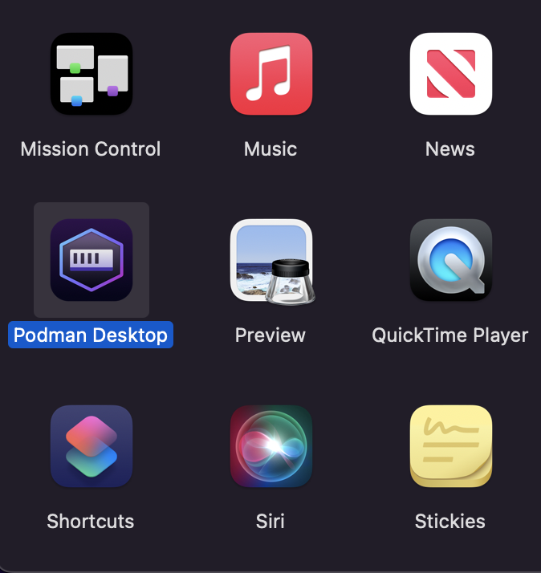
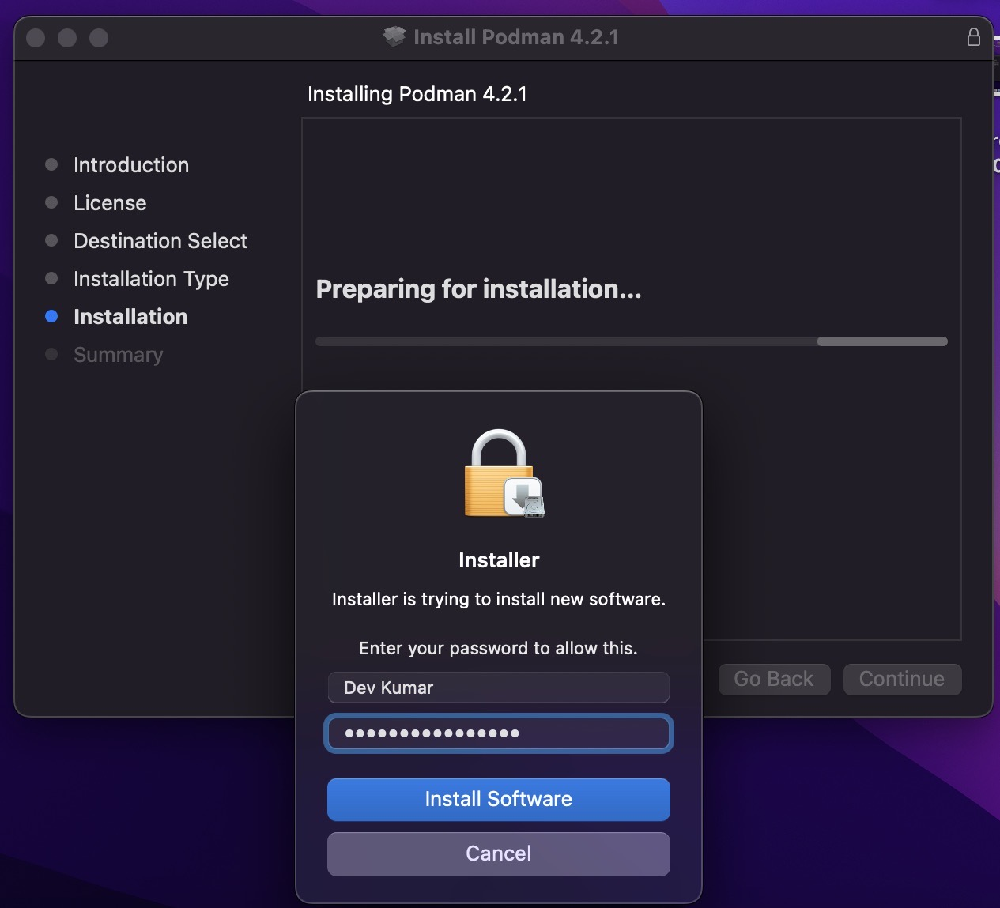

# MacOS

This page contains information regarding installation of Podman Desktop on MacOS.

You can install Podman Desktop on Mac:

1. Using the .dmg file
2. Using Brew

:::info[Prerequisite]
Podman Desktop requires [Podman Engine](https://docs.podman.io/en/latest/index.html). If you don't have Podman Engine installed, Podman Desktop will prompt you to do so at a later stage.
:::

## Installing Podman Desktop on MacOS using .dmg file

1. Download the `.dmg` file from the [Downloads](/downloads/macos) section of this website.

   While we recommend getting the "universal" binary file which will work irrespective of the chip architecture your Mac possesses, you also have the option to get the applicable .dmg file depending on your Mac Hardware Architecture (that is Intel or Apple M1).

1. Locate the downloaded file, and double-click on it. (Usually, you will find the downloaded file in the Downloads folder)

   

1. Drag Podman Desktop icon to the Applications folder.

   

1. Start Podman Desktop from the 'Launchpad' or Mac's `Applications` directory.

   

1. Install Podman from Podman Desktop, if not yet installed.

   When you open Podman Desktop for the first time, click on the "View detection checks" button to scan if all the prerequisites to use Podman Desktop are met. If it says `❌ podman cli was not found in the PATH`, then you need to install the Podman CLI/Engine which can be done within the application.

   

1. Click on the "Install" button next to the "View detection checks" button, and follow the instructions on screen.
1. You will be redirected to the Podman Installer. Follow the instructions on screen and enter your system password when asked.

   

1. After the installation is complete, close the installation program. Podman Engine has been installed and you are now ready to use Podman Desktop.

## Installing Podman Desktop on MacOS using [brew](https://brew.sh/)

:::info[Prerequisite]

- [Homebrew](https://brew.sh/)

  :::

### Installation steps

1. Open a terminal on your Mac.
2. Run the command mentioned below.

   ```sh
   brew install podman-desktop
   ```

   Brew will also install the Podman Engine along with the Podman Desktop application, in case you don't have it installed yet.

   After the command is executed, you can find the Podman Desktop Application within the `Applications` directory of the MacOS.

## Using `libkrun` as machine provider

By default, Podman uses the `Apple HyperVisor` provider type. If you are already running an `Apple HyperVisor` Podman machine and want to create a `GPU enabled (LibKrun)` machine, reset the Podman machine to avoid any port conflicts:
- Using the UI: Click the **Troubleshooting** icon in the status bar and then **Cleanup / Purge data**.
- Using the CLI: Run the `podman machine reset` command.

To use `podman machine` CLI commands with the `libkrun` provider type, configure the machine provider manually using one of the following ways:

**_Configuring an environment variable_**

1. Set the following variable:

   ```shell-session
   export CONTAINERS_MACHINE_PROVIDER=libkrun
   ```

1. [Create and start a Podman machine](/docs/podman/creating-a-podman-machine) using the UI.

**_Configuring the `containers.conf` file_**

1. Open the `containers.conf` file, which is placed in the `$HOME/.config/containers` directory. 
1. Add the `provider` attribute and set its value to `libkrun` in the file.

   ```vim
   ...
   [machine]
     provider = "libkrun"
   ...
   ```

1. [Create and start a Podman machine](/docs/podman/creating-a-podman-machine) using the UI.

## Getting Started

Learn more on how to get started with Podman Desktop by clicking [here](/docs/containers).
